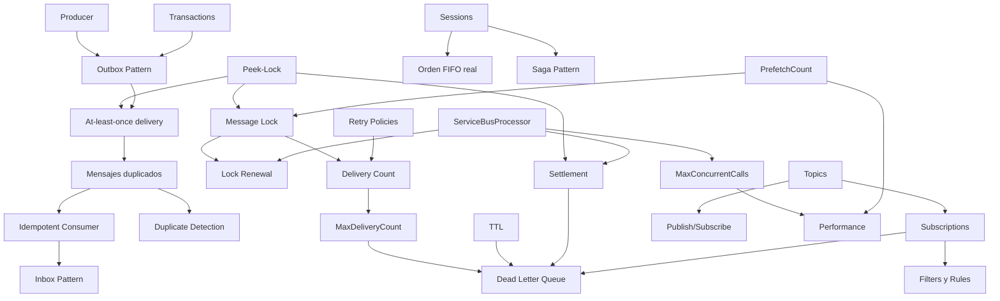

# 00 - Indice y ruta de estudio

> Mapa, ruta de estudio, backlog y estado del producto

## Contenido
- [[#Mapa de aprendizaje]]
- [[#Estado del producto y cambios recientes]]
- [[#Ruta de 30 dias]]
- [[#Mapa de relaciones]]
- [[#Conceptos Senior NET]]
- [[#Conceptos Software Architect]]
- [[#Backlog y fases]]

## Mapa de aprendizaje
> [!warning] Antes de empezar
> Lee [[00 - Indice y ruta de estudio#Estado del producto y cambios recientes|Estado del producto y cambios recientes]]. El **30 de septiembre de 2026** se retira el protocolo SBMP y con él los SDKs legacy (`WindowsAzure.ServiceBus`, `Microsoft.Azure.ServiceBus`). Todo tutorial que use `QueueClient`, `IMessageSender` o `MessageHandlerOptions` está **obsoleto**. Este curso usa exclusivamente `Azure.Messaging.ServiceBus`.

### Cómo usar este vault
- Leyenda de estado: ✅ nota completa · 🚧 pendiente (fase 2/3). Los wikilinks a notas pendientes aparecen en gris en Obsidian: es intencional, son el backlog.
- Grafo: abre el Graph View filtrando por `tag:#azure-service-bus`.
- Relaciones conceptuales: [[00 - Indice y ruta de estudio#Mapa de relaciones|00 - Mapa de relaciones]]
- Plan diario: [[00 - Indice y ruta de estudio#Ruta de 30 dias|00 - Ruta de 30 dias]]
- Listas de nivel: [[00 - Indice y ruta de estudio#Conceptos Senior NET|00 - Conceptos Senior NET]] · [[00 - Indice y ruta de estudio#Conceptos Software Architect|00 - Conceptos Software Architect]]

### Nivel 1 — Principiante: por qué existe la mensajería
1. ✅ [[01 - Fundamentos y arquitectura#Que es Azure Service Bus|Que es Azure Service Bus]]
2. ✅ [[01 - Fundamentos y arquitectura#Comunicacion sincrona vs asincrona|Comunicacion sincrona vs asincrona]]
3. ✅ [[01 - Fundamentos y arquitectura#Message Broker|Message Broker]]
4. ✅ [[01 - Fundamentos y arquitectura#Service Bus vs Storage Queue vs Event Grid vs Event Hubs|Service Bus vs Storage Queue vs Event Grid vs Event Hubs]]
5. 🚧 [[Event-Driven Architecture]]

### Nivel 2 — Fundamentos del broker
1. ✅ [[01 - Fundamentos y arquitectura#Namespace y entidades|Namespace y entidades]]
2. ✅ [[01 - Fundamentos y arquitectura#Ciclo de vida de un mensaje|Ciclo de vida de un mensaje]]
3. ✅ [[01 - Fundamentos y arquitectura#Anatomia de un mensaje|Anatomia de un mensaje]]
4. ✅ [[02 - Queues y Topics#Peek-Lock vs Receive-and-Delete|Peek-Lock vs Receive-and-Delete]]
5. ✅ [[02 - Queues y Topics#Message Lock y Lock Renewal|Message Lock y Lock Renewal]]
6. ✅ [[02 - Queues y Topics#Message Settlement|Message Settlement]]
7. ✅ [[02 - Queues y Topics#TTL y expiracion|TTL y expiracion]] · ✅ [[02 - Queues y Topics#Scheduled Messages|Scheduled Messages]]
8. ✅ [[02 - Queues y Topics#Topics y Subscriptions|Topics y Subscriptions]] · ✅ [[02 - Queues y Topics#Filters y Rules|Filters y Rules]] · ✅ [[02 - Queues y Topics#Auto-forwarding|Auto-forwarding]]

### Nivel 3 — Desarrollador .NET
1. ✅ [[04 - NET y entorno local#SDK moderno de NET|SDK moderno de NET]]
2. ✅ [[04 - NET y entorno local#Enviar mensajes en NET|Enviar mensajes en NET]]
3. ✅ [[04 - NET y entorno local#ServiceBusProcessor|ServiceBusProcessor]]
4. ✅ [[04 - NET y entorno local#Integracion con ASP.NET Core|Integracion con ASP.NET Core]]
5. ✅ [[04 - NET y entorno local#ServiceBusReceiver manual|ServiceBusReceiver manual]] · ✅ [[03 - Confiabilidad y manejo de errores#ServiceBusSessionProcessor|ServiceBusSessionProcessor]]
6. ✅ [[04 - NET y entorno local#Emulador local|Emulador local]]

### Nivel 4 — Fiabilidad (aquí se separan juniors de seniors)
1. ✅ [[03 - Confiabilidad y manejo de errores#At-least-once delivery|At-least-once delivery]]
2. ✅ [[03 - Confiabilidad y manejo de errores#Idempotent Consumer|Idempotent Consumer]]
3. ✅ [[03 - Confiabilidad y manejo de errores#Dead Letter Queue|Dead Letter Queue]]
4. ✅ [[03 - Confiabilidad y manejo de errores#Duplicate Detection|Duplicate Detection]]
5. ✅ [[03 - Confiabilidad y manejo de errores#Retry Policies|Retry Policies]] · ✅ [[03 - Confiabilidad y manejo de errores#Poison Messages|Poison Messages]]
6. ✅ [[03 - Confiabilidad y manejo de errores#Sessions|Sessions]] · ✅ [[03 - Confiabilidad y manejo de errores#Transactions|Transactions]]

### Nivel 5 — Microservicios y arquitectura distribuida
🚧 [[Commands vs Events]] · [[Outbox Pattern]] · [[Inbox Pattern]] · [[Saga Pattern]] · [[Competing Consumers]] · [[Eventual Consistency]]

### Nivel 6 — Producción
✅ [[05 - Seguridad y performance#Seguridad con Entra ID y RBAC|Seguridad con Entra ID y RBAC]] · ✅ [[05 - Seguridad y performance#Private Endpoints|Private Endpoints]] · ✅ [[05 - Seguridad y performance#Performance tuning|Performance tuning]] · 🚧 [[Metricas clave]] · [[Tiers y facturacion]] · [[Geo-Replication]]

### Nivel 7 — Senior / Arquitecto
🚧 [[Troubleshooting - Messages stuck]] · [[Casos reales]] · ✅ [[07 - Entrevistas y cheat sheet#Entrevistas - Basicas|Entrevistas - Basicas]] · 🚧 Intermedias/Avanzadas/Architect

### Práctica
- ✅ [[06 - Laboratorios#Proyecto final|Proyecto final]] (enunciado y arquitectura)
- ✅ [[06 - Laboratorios#Lab 01 - Namespace y Queue|Lab 01 - Namespace y Queue]]
- ✅ [[06 - Laboratorios#Lab 02 - Enviar mensajes desde NET|Lab 02 - Enviar mensajes desde NET]]
- ✅ [[06 - Laboratorios#Lab 03 - Consumir mensajes desde NET|Lab 03 - Consumir mensajes desde NET]]
- ✅ [[06 - Laboratorios#Lab 04 - BackgroundService|Lab 04 - BackgroundService]]
- ✅ [[06 - Laboratorios#Lab 05 - Topics y Subscriptions|Lab 05 - Topics y Subscriptions]]
- ✅ [[06 - Laboratorios#Lab 06 - Filters|Lab 06 - Filters]]
- ✅ [[06 - Laboratorios#Lab 07 - Dead Letter Queue|Lab 07 - Dead Letter Queue]]
- ✅ [[06 - Laboratorios#Lab 08 - Retry|Lab 08 - Retry]]
- ✅ [[06 - Laboratorios#Lab 09 - Sessions|Lab 09 - Sessions]]
- ✅ [[06 - Laboratorios#Lab 10 - Managed Identity|Lab 10 - Managed Identity]]
- 🚧 Labs 11–15 (Observabilidad, Microservicios, Outbox, Saga, Proyecto final guiado)

### Referencia rápida
- ✅ [[07 - Entrevistas y cheat sheet#Service Bus Cheat Sheet|Service Bus Cheat Sheet]]

---

## Estado del producto y cambios recientes
> Nota viva. Revisa cada trimestre contra la documentación oficial. Fecha de la última verificación: 24-sep-2026.

### Retiros y deprecaciones (lo más importante)
| Qué | Estado | Qué hacer |
|---|---|---|
| Protocolo **SBMP** | Se retira el **30-sep-2026** | Usar AMQP (SDK moderno) |
| `WindowsAzure.ServiceBus` (SDK .NET Framework) | Retirado junto con SBMP | Migrar a `Azure.Messaging.ServiceBus` |
| `Microsoft.Azure.ServiceBus` (SDK "Track 1") | Fuera de soporte (aviso de retiro 30-sep-2026) | Migrar a `Azure.Messaging.ServiceBus` |
| Express entities | No soportadas en Premium | Desactivarlas antes de migrar a Premium |

Fuente: [Aviso de retiro](https://azure.microsoft.com/updates/retirement-notice-update-your-azure-service-bus-sdk-libraries-by-30-september-2026/) · [Premium messaging](https://learn.microsoft.com/azure/service-bus-messaging/service-bus-premium-messaging)

#### Tabla de equivalencias legacy → moderno
| Legacy (`Microsoft.Azure.ServiceBus`) | Moderno (`Azure.Messaging.ServiceBus`) |
|---|---|
| `QueueClient` / `TopicClient` | `ServiceBusClient` + `ServiceBusSender` |
| `MessageReceiver` | `ServiceBusReceiver` |
| `RegisterMessageHandler` + `MessageHandlerOptions` | `ServiceBusProcessor` |
| `Message` | `ServiceBusMessage` / `ServiceBusReceivedMessage` |
| `UserProperties` | `ApplicationProperties` |
| `Label` | `Subject` |
| `ManagementClient` | `ServiceBusAdministrationClient` |

### Tiers vigentes
- **Basic**: solo queues. Sin topics, sessions, transacciones ni duplicate detection.
- **Standard**: añade topics/subscriptions, sessions, transacciones, duplicate detection. Capacidad compartida, pago por operación. Mensaje máx. 256 KB.
- **Premium**: messaging units dedicadas (1, 2, 4, 8, 16), mensajes grandes (por defecto 1 MB, configurable hasta 100 MB solo con AMQP y sin batching), VNet/Private Link, Geo-Replication, CMK, JMS 2.0.

Detalle: [[Tiers y facturacion]]

### Novedades relevantes para desarrollo
- **Service Bus Emulator** (contenedor Docker, MCR). Solo dev/test, sin SLA, sin Entra ID ni VNet. Soporta ya el Administration Client (puerto 5300). Ver [[04 - NET y entorno local#Emulador local|Emulador local]].
- **Geo-Replication** (Premium): replica metadatos **y datos** a regiones secundarias. No confundir con **Geo-Disaster Recovery** clásico, que solo replica metadatos. Ver [[Geo-Replication]].
- **Particionado en Premium**: se decide al crear el namespace (todas las entidades quedan particionadas). En Basic/Standard se decide por entidad (16 particiones).

### Propiedades inmutables tras crear la entidad
Decide bien **antes** de crear la queue/subscription:
- `RequiresSession`
- `RequiresDuplicateDetection`
- `EnablePartitioning`

Cambiarlas implica **crear una entidad nueva y migrar**. Es una pregunta clásica de entrevista senior.

---

## Ruta de 30 dias
*00 - Ruta de estudio de 30 días*

Regla: **cada día termina con algo ejecutado**, no solo leído. Si un día solo lees, no cuenta. Usa el [[04 - NET y entorno local#Emulador local|Emulador local]] para no pagar mientras aprendes; usa Azure real a partir del día 18 (Entra ID no funciona en el emulador).

| Día | Tema | Entregable verificable |
|---|---|---|
| 1 | [[01 - Fundamentos y arquitectura#Que es Azure Service Bus|Que es Azure Service Bus]], [[01 - Fundamentos y arquitectura#Comunicacion sincrona vs asincrona|Comunicacion sincrona vs asincrona]] | Explicar en voz alta por qué una API síncrona encadenada falla en cascada |
| 2 | [[01 - Fundamentos y arquitectura#Message Broker|Message Broker]], [[01 - Fundamentos y arquitectura#Service Bus vs Storage Queue vs Event Grid vs Event Hubs|Service Bus vs Storage Queue vs Event Grid vs Event Hubs]] | Tabla propia de decisión con 3 escenarios reales |
| 3 | [[01 - Fundamentos y arquitectura#Namespace y entidades|Namespace y entidades]] | [[06 - Laboratorios#Lab 01 - Namespace y Queue|Lab 01 - Namespace y Queue]] |
| 4 | [[04 - NET y entorno local#SDK moderno de NET|SDK moderno de NET]], [[04 - NET y entorno local#Enviar mensajes en NET|Enviar mensajes en NET]] | [[06 - Laboratorios#Lab 02 - Enviar mensajes desde NET|Lab 02 - Enviar mensajes desde NET]] |
| 5 | [[01 - Fundamentos y arquitectura#Anatomia de un mensaje|Anatomia de un mensaje]] | Enviar con `MessageId`, `CorrelationId`, `ApplicationProperties` y verlos en Service Bus Explorer del portal |
| 6 | [[02 - Queues y Topics#Peek-Lock vs Receive-and-Delete|Peek-Lock vs Receive-and-Delete]] | [[06 - Laboratorios#Lab 03 - Consumir mensajes desde NET|Lab 03 - Consumir mensajes desde NET]] |
| 7 | [[02 - Queues y Topics#Message Lock y Lock Renewal|Message Lock y Lock Renewal]], [[02 - Queues y Topics#Message Settlement|Message Settlement]] | Provocar `MessageLockLost` a propósito |
| 8 | Repaso + [[07 - Entrevistas y cheat sheet#Entrevistas - Basicas|Entrevistas - Basicas]] | Responder 20 preguntas sin mirar |
| 9 | [[04 - NET y entorno local#ServiceBusProcessor|ServiceBusProcessor]] | Processor con `MaxConcurrentCalls` 1 vs 10, medir |
| 10 | [[04 - NET y entorno local#Integracion con ASP.NET Core|Integracion con ASP.NET Core]] | [[06 - Laboratorios#Lab 04 - BackgroundService|Lab 04 - BackgroundService]] |
| 11 | [[02 - Queues y Topics#Topics y Subscriptions|Topics y Subscriptions]] | [[06 - Laboratorios#Lab 05 - Topics y Subscriptions|Lab 05 - Topics y Subscriptions]] |
| 12 | [[02 - Queues y Topics#Filters y Rules|Filters y Rules]] | [[06 - Laboratorios#Lab 06 - Filters|Lab 06 - Filters]] |
| 13 | [[03 - Confiabilidad y manejo de errores#At-least-once delivery|At-least-once delivery]] | Demostrar un duplicado real (lock expirado) |
| 14 | [[03 - Confiabilidad y manejo de errores#Idempotent Consumer|Idempotent Consumer]] | Consumidor idempotente con tabla de mensajes procesados |
| 15 | [[03 - Confiabilidad y manejo de errores#Dead Letter Queue|Dead Letter Queue]] | [[06 - Laboratorios#Lab 07 - Dead Letter Queue|Lab 07 - Dead Letter Queue]] |
| 16 | [[03 - Confiabilidad y manejo de errores#Retry Policies|Retry Policies]], [[03 - Confiabilidad y manejo de errores#Poison Messages|Poison Messages]] | [[06 - Laboratorios#Lab 08 - Retry|Lab 08 - Retry]] |
| 17 | [[03 - Confiabilidad y manejo de errores#Duplicate Detection|Duplicate Detection]] | Enviar el mismo `MessageId` dos veces dentro y fuera de la ventana |
| 18 | [[05 - Seguridad y performance#Seguridad con Entra ID y RBAC|Seguridad con Entra ID y RBAC]] | [[06 - Laboratorios#Lab 10 - Managed Identity|Lab 10 - Managed Identity]] |
| 19 | [[03 - Confiabilidad y manejo de errores#Sessions|Sessions]] | [[06 - Laboratorios#Lab 09 - Sessions|Lab 09 - Sessions]] |
| 20 | [[03 - Confiabilidad y manejo de errores#Transactions|Transactions]] | Receive + Send atómico |
| 21 | Repaso + Entrevistas intermedias | — |
| 22 | [[Commands vs Events]], [[Competing Consumers]] | Diagrama de un sistema propio |
| 23 | [[Outbox Pattern]] | Lab 13 con EF Core |
| 24 | [[Inbox Pattern]], [[Eventual Consistency]] | Integrar Inbox en el Lab 13 |
| 25 | [[Saga Pattern]] | Lab 14: coreografía de Order/Payment/Inventory con compensación |
| 26 | [[05 - Seguridad y performance#Performance tuning|Performance tuning]] | Benchmark prefetch/concurrencia |
| 27 | [[Metricas clave]] | Lab 11: alertas de DLQ y active messages |
| 28 | [[Tiers y facturacion]], [[Geo-Replication]] | Estimar coste de un sistema de 5M msgs/día (con la calculadora oficial) |
| 29 | Troubleshooting completo | Resolver 5 escenarios de [[21 - Troubleshooting]] |
| 30 | [[06 - Laboratorios#Proyecto final|Proyecto final]] | Demo + explicación de diseño de 10 minutos |

---

## Mapa de relaciones
*00 - Mapa de relaciones entre conceptos*

La idea central que conecta todo: **Service Bus garantiza at-least-once, nunca exactly-once**. Casi cada característica existe para gestionar las consecuencias de esa decisión.

### Cadenas de razonamiento que debes poder recitar
1. [[02 - Queues y Topics#Peek-Lock vs Receive-and-Delete|Peek-Lock]] → el mensaje puede entregarse otra vez si el lock expira → [[03 - Confiabilidad y manejo de errores#At-least-once delivery|At-least-once delivery]] → el consumidor debe ser [[03 - Confiabilidad y manejo de errores#Idempotent Consumer|idempotente]].
2. Excepción en el handler → abandon implícito → `DeliveryCount++` → al superar `MaxDeliveryCount` → [[03 - Confiabilidad y manejo de errores#Dead Letter Queue|Dead Letter Queue]].
3. Guardar en BD y publicar evento no es atómico → [[Outbox Pattern]] → el relay puede publicar dos veces → consumidor idempotente otra vez.
4. `PrefetchCount` alto + procesamiento lento → locks expiran en el buffer local → `MessageLockLost` → reentregas → [[02 - Queues y Topics#Message Lock y Lock Renewal|Message Lock y Lock Renewal]].
5. Orden garantizado solo con [[03 - Confiabilidad y manejo de errores#Sessions|Sessions]]; una queue normal con varios consumidores **no** preserva orden de procesamiento.

### Pares que se confunden (y dónde se aclaran)
| Par | Nota |
|---|---|
| Duplicate Detection vs idempotencia | [[03 - Confiabilidad y manejo de errores#Idempotent Consumer|Idempotent Consumer]] |
| Abandon vs Defer vs Dead-letter | [[02 - Queues y Topics#Message Settlement|Message Settlement]] |
| Queue vs Topic | [[01 - Fundamentos y arquitectura#Namespace y entidades|Namespace y entidades]] |
| Service Bus vs Event Grid vs Event Hubs | [[01 - Fundamentos y arquitectura#Service Bus vs Storage Queue vs Event Grid vs Event Hubs|Service Bus vs Storage Queue vs Event Grid vs Event Hubs]] |
| Geo-DR vs Geo-Replication | [[00 - Indice y ruta de estudio#Estado del producto y cambios recientes|Estado del producto y cambios recientes]] |
| SDK retry vs retry de aplicación vs MaxDeliveryCount | [[03 - Confiabilidad y manejo de errores#Retry Policies|Retry Policies]] |

---

## Conceptos Senior NET
*00 - Conceptos imprescindibles para un Senior .NET*

Un senior no se distingue por saber las APIs, sino por saber **qué falla y por qué**. Si no puedes explicar cada punto con un escenario de fallo concreto, no lo dominas.

1. Por qué at-least-once implica consumidores idempotentes → [[03 - Confiabilidad y manejo de errores#At-least-once delivery|At-least-once delivery]], [[03 - Confiabilidad y manejo de errores#Idempotent Consumer|Idempotent Consumer]]
2. Diferencia real entre Duplicate Detection (lado broker, por `MessageId`, en ventana) e idempotencia (lado consumidor, por efecto de negocio) → [[03 - Confiabilidad y manejo de errores#Duplicate Detection|Duplicate Detection]]
3. Peek-lock, lock duration (máx. 5 min), renovación automática del processor y sus límites → [[02 - Queues y Topics#Message Lock y Lock Renewal|Message Lock y Lock Renewal]]
4. Complete / Abandon / Defer / DeadLetter y cuándo usar cada uno → [[02 - Queues y Topics#Message Settlement|Message Settlement]]
5. `MaxDeliveryCount` y la interacción con retries del SDK y de la aplicación → [[03 - Confiabilidad y manejo de errores#Retry Policies|Retry Policies]]
6. Estrategia de DLQ: monitorizar, clasificar, reprocesar → [[03 - Confiabilidad y manejo de errores#Dead Letter Queue|Dead Letter Queue]]
7. `ServiceBusClient` singleton, senders cacheados, `DisposeAsync` al apagar → [[04 - NET y entorno local#SDK moderno de NET|SDK moderno de NET]]
8. `ServiceBusProcessor` en `BackgroundService`, graceful shutdown y `CancellationToken` → [[04 - NET y entorno local#Integracion con ASP.NET Core|Integracion con ASP.NET Core]]
9. `MaxConcurrentCalls` vs `PrefetchCount` y cómo prefetch puede causar pérdida de locks → [[05 - Seguridad y performance#Performance tuning|Performance tuning]]
10. Managed Identity + roles `Azure Service Bus Data Sender/Receiver` en lugar de SAS → [[05 - Seguridad y performance#Seguridad con Entra ID y RBAC|Seguridad con Entra ID y RBAC]]
11. Sessions para orden por clave; por qué no hay orden global con consumidores concurrentes → [[03 - Confiabilidad y manejo de errores#Sessions|Sessions]]
12. Outbox para publicar de forma consistente con la BD → [[Outbox Pattern]]
13. Queue vs Topic, filtros SQL vs Correlation (coste de evaluación) → [[02 - Queues y Topics#Filters y Rules|Filters y Rules]]
14. Versionado de contratos de mensaje sin romper consumidores → [[01 - Fundamentos y arquitectura#Anatomia de un mensaje|Anatomia de un mensaje]]
15. Métricas que importan: Active, DeadLettered, Throttled, ServerErrors → [[Metricas clave]]
16. Propiedades inmutables tras crear la entidad → [[00 - Indice y ruta de estudio#Estado del producto y cambios recientes|Estado del producto y cambios recientes]]

---

## Conceptos Software Architect
*00 - Conceptos avanzados para un Software Architect*

El arquitecto responde a "¿deberíamos usar Service Bus aquí?" — y a veces la respuesta correcta es **no**.

1. **Selección de tecnología**: mensajes de negocio (Service Bus) vs eventos de estado/reactivos (Event Grid) vs streams de telemetría (Event Hubs/Kafka) → [[01 - Fundamentos y arquitectura#Service Bus vs Storage Queue vs Event Grid vs Event Hubs|Service Bus vs Storage Queue vs Event Grid vs Event Hubs]]
2. **Commands vs Events vs Request/Response**: acoplamiento temporal, de conocimiento y de orden → [[Commands vs Events]]
3. **Coreografía vs orquestación** en sagas; dónde vive el estado; compensaciones → [[Saga Pattern]]
4. **Consistencia**: outbox + inbox como sustituto de transacciones distribuidas (Service Bus no participa en 2PC/MSDTC) → [[03 - Confiabilidad y manejo de errores#Transactions|Transactions]], [[Eventual Consistency]]
5. **Topología**: un topic por bounded context vs por tipo de evento; límites de subscriptions por topic y coste de filtros → [[02 - Queues y Topics#Topics y Subscriptions|Topics y Subscriptions]]
6. **Particionado del orden**: sessions como unidad de paralelismo; hot sessions → [[03 - Confiabilidad y manejo de errores#Sessions|Sessions]]
7. **Capacidad**: Standard (compartido, throttling) vs Premium (MUs dedicadas, autoscale por CPU/memoria) → [[Tiers y facturacion]]
8. **Resiliencia regional**: availability zones, Geo-DR (solo metadatos) vs Geo-Replication (datos) → [[Geo-Replication]]
9. **Seguridad de red**: Private Endpoints, desactivar acceso público y SAS local (`disableLocalAuth`) → [[05 - Seguridad y performance#Private Endpoints|Private Endpoints]]
10. **Mensajes grandes**: claim-check pattern vs Premium 100 MB → [[Claim Check Pattern]]
11. **Evolución de contratos**: versionado, tolerant reader, esquemas compartidos vs duplicados → [[Versionado de mensajes]]
12. **Operabilidad**: estrategia de DLQ organizativa (quién la mira, SLA de reprocesado) → [[03 - Confiabilidad y manejo de errores#Dead Letter Queue|Dead Letter Queue]]
13. **Portabilidad**: coste de acoplarse a features propietarias (sessions, SQL filters) vs abstracciones (MassTransit, NServiceBus, Wolverine) → [[Frameworks de mensajeria NET]]

---

## Backlog y fases
*00 - Backlog y fases de construcción*

### Fase 1 ✅ (esta entrega) — núcleo conceptual y .NET
Mapas, ruta de 30 días, listas Senior/Architect, estado del producto, fundamentos, arquitectura, peek-lock, locks, settlement, anatomía del mensaje, SDK, envío, processor, ASP.NET Core, at-least-once, idempotencia, DLQ, 20 preguntas básicas, cheat sheet general, proyecto final.

### Fase 2 ✅ — features del broker y fiabilidad
TTL y expiracion · Scheduled Messages · Topics y Subscriptions · Filters y Rules · Auto-forwarding · Sessions · ServiceBusSessionProcessor · ServiceBusReceiver manual · Transactions · Duplicate Detection · Retry Policies · Poison Messages · Seguridad con Entra ID y RBAC · Private Endpoints · Performance tuning · Emulador local · Labs 01–10

### Fase 3 🚧 — arquitectura, producción y entrevistas avanzadas
Commands vs Events · Event-Driven Architecture · Competing Consumers · Publisher Subscriber · Outbox · Inbox · Saga · CQRS · Circuit Breaker · Eventual Consistency · Claim Check · Versionado de mensajes · Frameworks de mensajeria NET · Metricas clave · Observabilidad con Application Insights · Tiers y facturacion · Geo-Replication · Service Bus vs otras tecnologias (Kafka, RabbitMQ, SQS, SNS) · 13 notas de troubleshooting · Casos reales · Entrevistas intermedias/avanzadas/architect (60) · Cheat sheets restantes (8) · Labs 11–15
