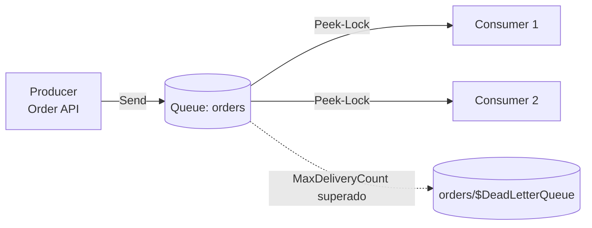
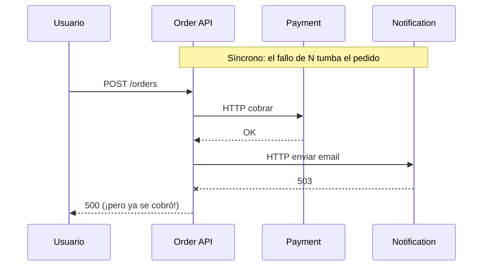
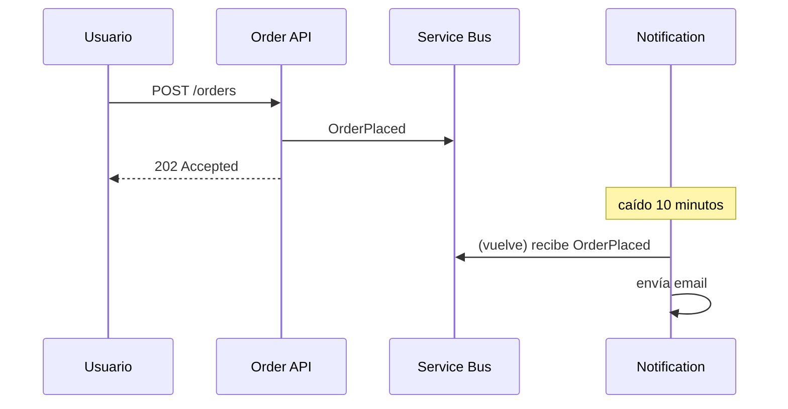
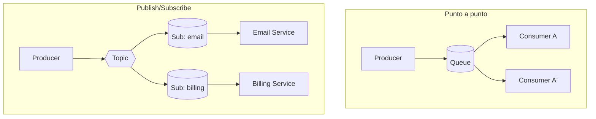
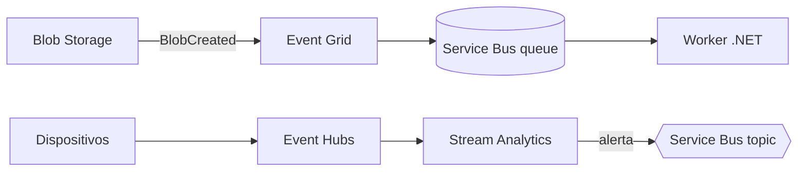
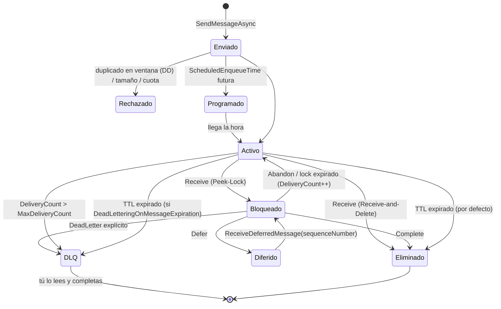
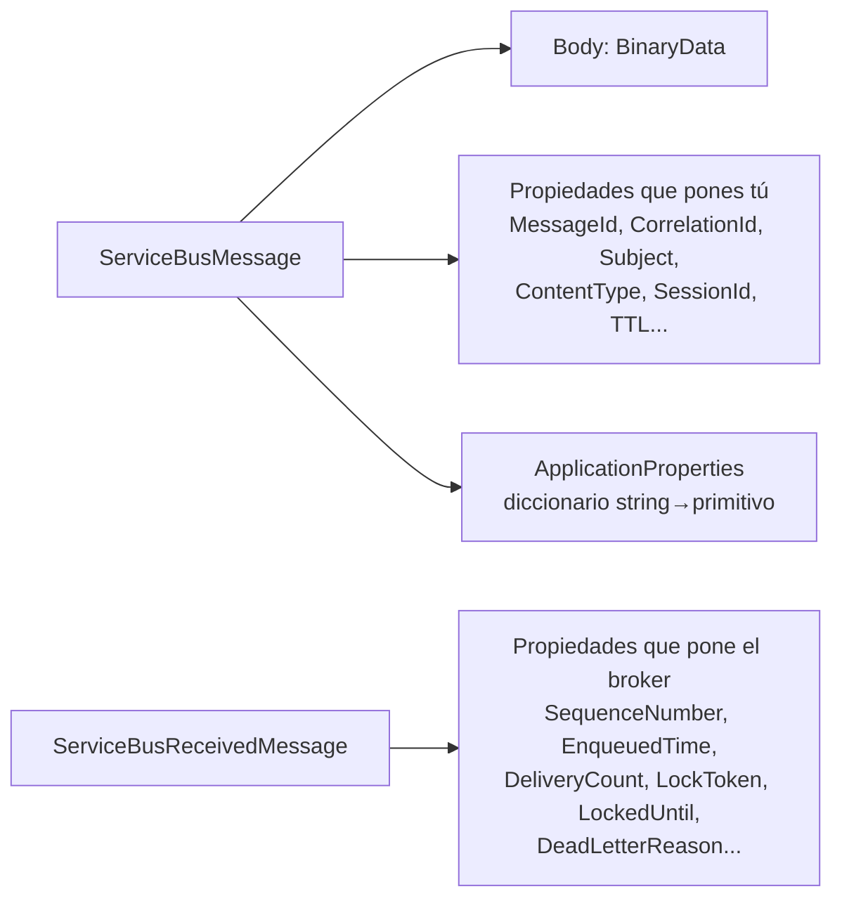

# 01 - Fundamentos y arquitectura

> Por qué existe la mensajería y cómo está construido el broker

## Contenido
- [[#Que es Azure Service Bus]]
- [[#Comunicacion sincrona vs asincrona]]
- [[#Message Broker]]
- [[#Service Bus vs Storage Queue vs Event Grid vs Event Hubs]]
- [[#Namespace y entidades]]
- [[#Ciclo de vida de un mensaje]]
- [[#Anatomia de un mensaje]]

## Que es Azure Service Bus
*¿Qué es Azure Service Bus?*

### ¿Qué es?
Un **message broker empresarial totalmente gestionado** (PaaS) de Azure. Ofrece dos modelos:
- **Queues**: punto a punto; cada mensaje lo procesa **un** consumidor.
- **Topics + Subscriptions**: publish/subscribe; cada subscription recibe **su propia copia**.

Protocolo principal: **AMQP 1.0** (el SDK moderno usa AMQP sobre TCP 5671, o AMQP sobre WebSockets en 443).

### ¿Por qué existe?
Porque en un sistema distribuido los servicios no están siempre disponibles, no procesan a la misma velocidad y fallan de forma independiente. Un broker **desacopla en el tiempo** (el consumidor no tiene que estar vivo cuando el productor envía) y **en carga** (el broker absorbe picos: *load leveling*).

### ¿Qué problema resuelve realmente?
| Problema | Cómo lo aborda Service Bus |
|---|---|
| El consumidor está caído | El mensaje persiste hasta que alguien lo procese o expire |
| Picos de tráfico | La queue actúa de amortiguador |
| Un mensaje que siempre falla | [[03 - Confiabilidad y manejo de errores#Dead Letter Queue|Dead Letter Queue]] tras `MaxDeliveryCount` |
| Varios servicios necesitan el mismo evento | [[02 - Queues y Topics#Topics y Subscriptions|Topics y Subscriptions]] |
| Orden por entidad de negocio | [[03 - Confiabilidad y manejo de errores#Sessions|Sessions]] |
| Atomicidad "recibo A y envío B" | [[03 - Confiabilidad y manejo de errores#Transactions|Transactions]] |
| Reenvíos del productor | [[03 - Confiabilidad y manejo de errores#Duplicate Detection|Duplicate Detection]] |

### Lo que NO resuelve (la parte incómoda)
- **No garantiza exactly-once.** Garantiza at-least-once: tu código recibirá duplicados. Ver [[03 - Confiabilidad y manejo de errores#At-least-once delivery|At-least-once delivery]].
- **No es un event store ni un log reproducible.** Un mensaje completado desaparece. Para *replay* necesitas Event Hubs/Kafka.
- **No es para telemetría masiva** (millones de eventos/segundo). Ver [[01 - Fundamentos y arquitectura#Service Bus vs Storage Queue vs Event Grid vs Event Hubs|Service Bus vs Storage Queue vs Event Grid vs Event Hubs]].
- **No sustituye a una transacción distribuida con tu BD.** Ver [[Outbox Pattern]].

### Arquitectura mínima


### Ejemplo en .NET (vistazo; el detalle está en [[04 - NET y entorno local#Enviar mensajes en NET|Enviar mensajes en NET]])
```csharp
await using var client = new ServiceBusClient(
    "mi-namespace.servicebus.windows.net", new DefaultAzureCredential());
ServiceBusSender sender = client.CreateSender("orders");
await sender.SendMessageAsync(new ServiceBusMessage(BinaryData.FromObjectAsJson(order))
{
    MessageId = order.Id.ToString(),
    ContentType = "application/json",
    Subject = "OrderPlaced"
});
```

### Cuándo utilizarlo
- Mensajes de negocio con valor individual (un pedido, un pago) donde perder uno es inaceptable.
- Necesitas DLQ, sesiones, transacciones, entrega programada o filtros.
- Integración entre microservicios en Azure.

### Cuándo NO utilizarlo
- Telemetría/IoT a gran escala → Event Hubs.
- Reaccionar a eventos de recursos Azure (blob creado) → Event Grid.
- Cola simple, barata, > 80 GB de backlog y sin features avanzadas → Storage Queue.
- Llamada que necesita respuesta inmediata al usuario → HTTP/gRPC.

### Relación con otros conceptos
- [[01 - Fundamentos y arquitectura#Message Broker|Message Broker]] · [[01 - Fundamentos y arquitectura#Namespace y entidades|Namespace y entidades]] · [[01 - Fundamentos y arquitectura#Comunicacion sincrona vs asincrona|Comunicacion sincrona vs asincrona]] · [[00 - Indice y ruta de estudio#Estado del producto y cambios recientes|Estado del producto y cambios recientes]]

### Preguntas de entrevista
- *¿Por qué usarías Service Bus en lugar de llamar al otro servicio por HTTP?* → Desacoplamiento temporal y de disponibilidad, load leveling, reintentos y DLQ gestionados. El coste: consistencia eventual y complejidad operativa.

### Puntos clave para recordar
- Broker gestionado, AMQP, queues + topics.
- At-least-once, **no** exactly-once.
- Basic / Standard / Premium: Basic no tiene topics.
- Docs: [What is Azure Service Bus?](https://learn.microsoft.com/azure/service-bus-messaging/service-bus-messaging-overview)

---

## Comunicacion sincrona vs asincrona
*Comunicación síncrona vs asíncrona*

### ¿Qué es?
- **Síncrona (HTTP/gRPC)**: el llamador espera la respuesta. Ambos deben estar vivos **a la vez**.
- **Asíncrona (mensajería)**: el emisor deja el mensaje en un intermediario y sigue. El receptor lo procesa cuando puede.

### El error de concepto habitual
"Asíncrono" aquí **no** significa `async/await`. Una llamada `await httpClient.PostAsync()` es asíncrona para el hilo, pero **síncrona para la arquitectura**: tu request sigue bloqueada hasta que el otro servicio responde.

### Por qué importa: disponibilidad compuesta
Si Order API llama síncronamente a Payment (99,9 %), Inventory (99,9 %) y Notification (99,9 %), la disponibilidad de la operación completa es ≈ 0,999³ ≈ **99,7 %**. Cada dependencia síncrona multiplica tu probabilidad de fallo. Con mensajería, Order API solo depende de Service Bus.





### HTTP vs mensajería
| Criterio | HTTP/gRPC | Service Bus |
|---|---|---|
| Acoplamiento temporal | Alto | Bajo |
| Respuesta inmediata | Sí | No (o request/reply con `ReplyTo`) |
| Reintentos | Los programas tú | Broker + SDK + DLQ |
| Absorción de picos | No | Sí |
| Consistencia | Inmediata (aparente) | Eventual |
| Depuración | Sencilla (un trace) | Más difícil (necesitas correlación) |
| Latencia | ms | ms a segundos, más colas de espera |

### Cuándo usar cada uno
- **Síncrono**: consultas (GET), validaciones que el usuario espera, operaciones donde la respuesta cambia lo que el usuario ve **ahora**.
- **Asíncrono**: efectos secundarios (emails, facturación, analítica), trabajo largo, integración entre bounded contexts, cualquier cosa que pueda terminar "luego".

### Errores comunes
- Convertir todo en mensajes, incluidas las consultas. Resultado: request/reply sobre colas, latencia alta y complejidad sin beneficio.
- Devolver `200 OK` al usuario cuando el trabajo aún no está hecho. Usa `202 Accepted` + un endpoint de estado.

### Relación con otros conceptos
- [[01 - Fundamentos y arquitectura#Message Broker|Message Broker]] · [[Eventual Consistency]] · [[Commands vs Events]] · [[Event-Driven Architecture]]

### Puntos clave
- Asíncrono arquitectónico ≠ `async/await`.
- La mensajería cambia disponibilidad por consistencia eventual.

---

## Message Broker
### ¿Qué es?
Un intermediario que **recibe, almacena y entrega** mensajes entre productores y consumidores, que no se conocen entre sí.

### Conceptos clave
- **Producer / Sender**: publica mensajes.
- **Consumer / Receiver**: los procesa.
- **Message queue**: almacenamiento ordenado donde esperan los mensajes; cada mensaje lo procesa un consumidor (*competing consumers*).
- **Pub/Sub**: un mensaje publicado se entrega a **todos** los suscriptores interesados.


En la queue, A y A' son **instancias del mismo servicio compitiendo**. En pub/sub, Email y Billing son **servicios distintos** que reciben copia cada uno.

### Broker "inteligente" vs log "tonto"
| | Broker (Service Bus, RabbitMQ) | Log (Event Hubs, Kafka) |
|---|---|---|
| Estado por mensaje | El broker sabe si cada mensaje se completó | El consumidor guarda un offset |
| Tras consumir | El mensaje desaparece | Permanece hasta retención |
| Replay | No | Sí |
| Features | DLQ, locks, sessions, filtros | Throughput masivo, particiones |

Esta distinción explica casi todas las comparativas: [[01 - Fundamentos y arquitectura#Service Bus vs Storage Queue vs Event Grid vs Event Hubs|Service Bus vs Storage Queue vs Event Grid vs Event Hubs]].

### Relación con otros conceptos
- [[01 - Fundamentos y arquitectura#Que es Azure Service Bus|Que es Azure Service Bus]] · [[Competing Consumers]] · [[Publisher Subscriber]]

---

## Service Bus vs Storage Queue vs Event Grid vs Event Hubs
### La distinción que Microsoft usa (y que debes memorizar)
- **Mensaje**: el productor **espera** que alguien haga algo con él; tiene valor individual. → Service Bus / Storage Queue
- **Evento discreto**: notifica que algo ocurrió; el emisor no espera nada. → Event Grid
- **Serie de eventos (stream)**: el valor está en el conjunto, no en cada uno. → Event Hubs

Docs: [Choose between Azure messaging services](https://learn.microsoft.com/azure/service-bus-messaging/compare-messaging-services)

### Tabla comparativa
| Criterio | Service Bus | Storage Queue | Event Grid | Event Hubs |
|---|---|---|---|---|
| Modelo | Broker: queues + topics | Cola simple | Enrutado de eventos push | Log particionado (stream) |
| Entrega | Pull (AMQP), peek-lock | Pull (HTTP), visibility timeout | Push (webhook, handlers) | Pull por offset |
| Orden | FIFO con [[03 - Confiabilidad y manejo de errores#Sessions|Sessions]] | Sin garantía | Sin garantía | Por partición |
| DLQ | Nativa | No (lo implementas tú) | Dead-letter a Blob Storage | No (el log permanece) |
| Tamaño mensaje | 256 KB Std / hasta 100 MB Premium | 64 KB | Hasta 1 MB por evento | Depende del tier |
| Backlog | Hasta 80 GB por entidad (Premium) | Hasta la capacidad de la storage account | No es almacenamiento | Retención por tiempo |
| Transacciones | Sí | No | No | No |
| Duplicate detection | Sí | No | No | No |
| Replay | No | No | No | Sí |
| Protocolo | AMQP 1.0 | HTTPS | HTTPS | AMQP, Kafka |

> [!note] Confianza
> Los límites de tamaño y almacenamiento cambian; confírmalos en [Service Bus quotas](https://learn.microsoft.com/azure/service-bus-messaging/service-bus-quotas) antes de citarlos en un diseño.

### Cuándo utilizar cada uno
- **Service Bus**: "Procesa este pedido y no lo pierdas". Pedidos, pagos, comandos entre microservicios, workflows con orden por entidad.
- **Storage Queue**: tareas en segundo plano simples y baratas; backlogs enormes; no necesitas DLQ, orden ni pub/sub. También si necesitas un log de auditoría de la cola vía Storage.
- **Event Grid**: "Se creó un blob / cambió un recurso". Reacciones serverless a eventos de Azure o propios, fan-out push. Soporta el esquema CloudEvents.
- **Event Hubs**: telemetría, clickstream, logs, IoT; millones de eventos/s; múltiples lectores independientes con replay.

### Combinaciones reales (no son excluyentes)

Event Grid puede entregar a una queue de Service Bus: así obtienes fiabilidad (DLQ, peek-lock) para eventos de Azure.

### Errores comunes
- Usar Event Hubs para comandos de negocio: no hay DLQ ni settlement por mensaje; un mensaje venenoso bloquea el avance del offset si no lo gestionas.
- Usar Service Bus para telemetría de alto volumen: coste por operación y throttling en Standard.
- Elegir Storage Queue "porque es más barata" y luego reimplementar DLQ, deduplicación y orden a mano.

### Preguntas de entrevista
- *Un blob se sube y hay que procesarlo de forma fiable con reintentos y DLQ. ¿Qué usas?* → Event Grid (detecta el evento) → Service Bus queue (fiabilidad) → worker. Justifica cada salto.

### Relación con otros conceptos
- [[01 - Fundamentos y arquitectura#Message Broker|Message Broker]] · [[Service Bus vs otras tecnologias]] (Kafka, RabbitMQ, SQS/SNS — 🚧)

---

## Namespace y entidades
### Jerarquía
```
Suscripción Azure
 └── Resource Group
      └── Service Bus Namespace   (mi-ns.servicebus.windows.net)  ← tier, red, identidad, MUs
           ├── Queue: orders
           │    ├── mensajes activos
           │    ├── mensajes programados
           │    └── $DeadLetterQueue (subqueue)
           └── Topic: order-events
                ├── Subscription: email
                │    ├── Rule(s) → Filter + Action
                │    ├── mensajes
                │    └── $DeadLetterQueue
                └── Subscription: billing
```

### Namespace
Contenedor y **unidad de configuración**: tier (Basic/Standard/Premium), messaging units, red (Private Endpoints, firewall), autenticación local (SAS on/off), zona, geo-replicación. El FQDN (`<nombre>.servicebus.windows.net`) es lo que usa el cliente.
- Decisión de diseño: **un namespace por entorno** (dev/test/prod) como mínimo. En Premium, las MUs se comparten entre todas las entidades del namespace: un vecino ruidoso afecta al resto.

### Entidades
| Entidad | Qué es | Quién lee |
|---|---|---|
| **Queue** | Buzón punto a punto | Un consumidor por mensaje (competing consumers) |
| **Topic** | Punto de publicación; **no se lee directamente** | Nadie; distribuye a subscriptions |
| **Subscription** | "Queue virtual" colgada de un topic, con sus propias reglas y DLQ | Un consumidor por mensaje dentro de esa subscription |
| **Rule** | Filtro (+ acción opcional) de una subscription | — |
| **DLQ** | Subqueue de cada queue/subscription | Tú, manualmente |

> [!important] Error clásico
> Una subscription **se comporta como una queue**. Si escalas el servicio Billing a 5 instancias, las 5 compiten por la misma subscription `billing`: cada mensaje lo procesa **una** instancia. Si creases una subscription por instancia, cobrarías 5 veces.

### Queue vs Topic
| Pregunta | Queue | Topic |
|---|---|---|
| ¿Cuántos servicios distintos reciben el mensaje? | Uno | Varios (uno por subscription) |
| ¿El emisor conoce al receptor? | Normalmente sí (es un *command*) | No (es un *event*) |
| ¿Añadir un consumidor nuevo requiere cambiar el productor? | Sí | No, basta crear una subscription |
| Tier mínimo | Basic | Standard |

Relación con el tipo de mensaje: [[Commands vs Events]].

### Propiedades de entidad que importan (y cuáles son inmutables)
| Propiedad | Default [Probable] | ¿Se puede cambiar luego? |
|---|---|---|
| `LockDuration` | 1 min (máx. 5 min) | Sí |
| `MaxDeliveryCount` | 10 | Sí |
| `DefaultMessageTimeToLive` | Máximo (en Basic, 14 días) | Sí |
| `DeadLetteringOnMessageExpiration` | false | Sí |
| `RequiresDuplicateDetection` | false | **No** |
| `RequiresSession` | false | **No** |
| `EnablePartitioning` | false | **No** |
| `MaxSizeInMegabytes` | 1024 | Sí |
| `ForwardTo` / `ForwardDeadLetteredMessagesTo` | — | Sí |

### Crear con Azure CLI
```bash
az servicebus namespace create -g rg-sb -n sb-demo-ns --sku Standard -l westeurope
az servicebus queue create -g rg-sb --namespace-name sb-demo-ns -n orders \
  --lock-duration PT1M --max-delivery-count 5 --enable-dead-lettering-on-message-expiration true
az servicebus topic create -g rg-sb --namespace-name sb-demo-ns -n order-events
az servicebus topic subscription create -g rg-sb --namespace-name sb-demo-ns \
  --topic-name order-events -n billing
```

### Crear con .NET (Administration Client)
```csharp
var admin = new ServiceBusAdministrationClient(
    "sb-demo-ns.servicebus.windows.net", new DefaultAzureCredential());

if (!await admin.QueueExistsAsync("orders"))
{
    await admin.CreateQueueAsync(new CreateQueueOptions("orders")
    {
        LockDuration = TimeSpan.FromMinutes(1),
        MaxDeliveryCount = 5,
        DeadLetteringOnMessageExpiration = true,
        RequiresDuplicateDetection = true,
        DuplicateDetectionHistoryTimeWindow = TimeSpan.FromMinutes(10)
    });
}
```
> [!tip] Producción
> Crea entidades con **IaC** (Bicep/Terraform), no desde el código de la aplicación. La identidad de la app no debería tener permisos de gestión (`Manage`/Data Owner).

### Relación con otros conceptos
- [[01 - Fundamentos y arquitectura#Ciclo de vida de un mensaje|Ciclo de vida de un mensaje]] · [[02 - Queues y Topics#Topics y Subscriptions|Topics y Subscriptions]] · [[02 - Queues y Topics#Filters y Rules|Filters y Rules]] · [[03 - Confiabilidad y manejo de errores#Dead Letter Queue|Dead Letter Queue]] · [[Tiers y facturacion]]

### Puntos clave
- Namespace = configuración y capacidad. Queue/Topic = entidad. Subscription = queue virtual.
- Sessions, duplicate detection y particionado: se deciden al crear.

---

## Ciclo de vida de un mensaje
### Qué ocurre internamente (versión útil, no marketing)


### Paso a paso
1. **Envío**: el SDK abre un *link* AMQP de envío sobre una conexión TCP. El broker **persiste** el mensaje (replicado) antes de confirmar. Solo tras el ack, `SendMessageAsync` completa. Si el ack se pierde por red, el SDK reintenta → posible **duplicado en origen** (de ahí [[03 - Confiabilidad y manejo de errores#Duplicate Detection|Duplicate Detection]]).
2. **Asignación**: el broker asigna `SequenceNumber` (único y creciente dentro de la entidad/partición) y `EnqueuedTime`.
3. **Topic → Subscriptions**: si es un topic, el broker evalúa las reglas de cada subscription y **copia** el mensaje a las que coinciden. Si ninguna coincide, el mensaje se descarta (salvo configuración de filter evaluation exceptions).
4. **Recepción (Peek-Lock)**: el broker marca el mensaje como bloqueado para ese receptor durante `LockDuration` y devuelve un `LockToken`. Nadie más lo ve.
5. **Procesamiento**: tu código trabaja. Si tarda más que el lock, el processor puede renovarlo ([[02 - Queues y Topics#Message Lock y Lock Renewal|Message Lock y Lock Renewal]]).
6. **Settlement**: `Complete` lo borra; `Abandon` lo devuelve; `Defer` lo aparta; `DeadLetter` lo mueve a la DLQ ([[02 - Queues y Topics#Message Settlement|Message Settlement]]).
7. **Fallos**: si el proceso muere, el lock expira, `DeliveryCount` sube y otro consumidor lo recibe → [[03 - Confiabilidad y manejo de errores#At-least-once delivery|At-least-once delivery]].

### Qué propiedades cambian durante la vida
| Propiedad | La pone | Cambia |
|---|---|---|
| `MessageId`, `CorrelationId`, `Subject`, body | Productor | Nunca |
| `SequenceNumber`, `EnqueuedTime` | Broker | Nunca |
| `DeliveryCount` | Broker | +1 en cada entrega con lock |
| `LockedUntil`, `LockToken` | Broker | En cada entrega/renovación |
| `DeadLetterReason` | Broker o tú | Al ir a DLQ |

### Relación con otros conceptos
- [[01 - Fundamentos y arquitectura#Namespace y entidades|Namespace y entidades]] · [[02 - Queues y Topics#Peek-Lock vs Receive-and-Delete|Peek-Lock vs Receive-and-Delete]] · [[02 - Queues y Topics#Message Settlement|Message Settlement]] · [[02 - Queues y Topics#TTL y expiracion|TTL y expiracion]] · [[02 - Queues y Topics#Scheduled Messages|Scheduled Messages]]

### Pregunta de entrevista
*¿Qué pasa si el consumidor procesa el mensaje, escribe en la BD y el proceso muere antes de `Complete`?* → El lock expira, el mensaje vuelve con `DeliveryCount+1`, otro consumidor lo procesa y **la escritura se repite** salvo que el consumidor sea [[03 - Confiabilidad y manejo de errores#Idempotent Consumer|idempotente]]. No existe forma de evitarlo solo con el broker.

---

## Anatomia de un mensaje
*Anatomía de un mensaje*

### Estructura
Un mensaje = **body** (bytes opacos para el broker) + **propiedades del broker** (system) + **propiedades de aplicación** (clave/valor tuyas).



### Propiedades que controlas
| Propiedad | Para qué sirve de verdad |
|---|---|
| `MessageId` | Identidad del mensaje. Clave de [[03 - Confiabilidad y manejo de errores#Duplicate Detection|Duplicate Detection]]. Si no la pones, el SDK genera un GUID aleatorio → la deduplicación no sirve ante reenvíos. **Ponla derivada del negocio** (p. ej. `order-123-placed`) |
| `CorrelationId` | Agrupa mensajes de un mismo flujo (id de pedido, traceparent de negocio). Filtrable con Correlation filters |
| `Subject` (antes `Label`) | Tipo de mensaje: `OrderPlaced`. Útil para enrutar y filtrar sin deserializar el body |
| `ContentType` | `application/json`, `application/cloudevents+json`… informa al consumidor cómo deserializar |
| `SessionId` | Clave de agrupación/orden en entidades con sesiones → [[03 - Confiabilidad y manejo de errores#Sessions|Sessions]] |
| `PartitionKey` | Afinidad de partición en entidades particionadas (si hay `SessionId`, deben coincidir) |
| `ReplyTo` | Nombre de la queue donde el emisor espera respuesta (request/reply) |
| `ReplyToSessionId` | Sesión donde responder → request/reply con sesiones |
| `To` | Reservado para escenarios de enrutado; el broker no lo usa hoy [Probable] |
| `TimeToLive` | Vida del mensaje; se aplica el **menor** entre este y el `DefaultMessageTimeToLive` de la entidad → [[02 - Queues y Topics#TTL y expiracion|TTL y expiracion]] |
| `ScheduledEnqueueTime` | Visible a partir de esa hora → [[02 - Queues y Topics#Scheduled Messages|Scheduled Messages]] |
| `ApplicationProperties` | Metadatos para filtros SQL, versión de esquema, tenant, traceparent |

### Propiedades del broker (solo lectura, en `ServiceBusReceivedMessage`)
`SequenceNumber`, `EnqueuedTime`, `EnqueuedSequenceNumber`, `DeliveryCount`, `LockToken`, `LockedUntil`, `ExpiresAt`, `DeadLetterSource`, `DeadLetterReason`, `DeadLetterErrorDescription`, `State` (Active/Deferred/Scheduled).

### Tamaño máximo
- **Standard**: 256 KB (body + todas las propiedades).
- **Premium**: 1 MB por defecto por entidad; configurable hasta **100 MB** solo con AMQP y **sin batching**. Los mensajes grandes reducen throughput y aumentan latencia.
- Cabeceras/propiedades tienen un límite propio (≈64 KB) [Probable].
- Más allá del límite: [[Claim Check Pattern]] (body en Blob Storage, referencia en el mensaje).

Fuente: [Service Bus quotas](https://learn.microsoft.com/azure/service-bus-messaging/service-bus-quotas) · [Premium messaging](https://learn.microsoft.com/azure/service-bus-messaging/service-bus-premium-messaging)

### Serialización
El broker ve bytes. Tú decides el formato; **JSON en UTF-8** es el estándar de facto.
```csharp
public sealed record OrderPlaced(Guid OrderId, Guid CustomerId, decimal Total, DateTimeOffset PlacedAt);

var evt = new OrderPlaced(order.Id, order.CustomerId, order.Total, DateTimeOffset.UtcNow);

var message = new ServiceBusMessage(BinaryData.FromObjectAsJson(evt, JsonOptions.Default))
{
    MessageId = $"order-{evt.OrderId}-placed",
    CorrelationId = evt.OrderId.ToString(),
    Subject = nameof(OrderPlaced),
    ContentType = "application/json",
    ApplicationProperties =
    {
        ["schema-version"] = 1,
        ["tenant"] = tenantId
    }
};

// Consumidor
OrderPlaced? received = args.Message.Body.ToObjectFromJson<OrderPlaced>(JsonOptions.Default);
```
`BinaryData.FromObjectAsJson` usa `System.Text.Json` y produce UTF-8. Para binario (Protobuf, Avro) usa `new BinaryData(bytes)` y un `ContentType` coherente.

### CloudEvents
Service Bus **no impone** CloudEvents, pero puedes usarlo (útil si también integras con Event Grid). Con `Azure.Messaging.CloudEvent`:
```csharp
var ce = new CloudEvent("/orders", "Contoso.Orders.OrderPlaced", evt);
var msg = new ServiceBusMessage(new BinaryData(ce)) { ContentType = "application/cloudevents+json" };
```

### Versionado de mensajes (resumen; detalle en [[Versionado de mensajes]])
1. **Cambios aditivos** (nuevo campo opcional) no rompen: el consumidor ignora lo que no conoce (*tolerant reader*).
2. **Cambios incompatibles** → nuevo tipo (`OrderPlacedV2`) o `schema-version` en `ApplicationProperties`, y los consumidores soportan N y N-1 durante la migración.
3. Nunca renombres ni cambies el tipo de un campo existente.
4. El consumidor con una versión desconocida → **DeadLetter** con razón `SchemaUnsupported`, no Abandon (reintentar no la hará conocida).

### Errores comunes
- No poner `MessageId` → deduplicación inútil.
- Meter el pedido entero con 500 líneas → coste por operación (bloques de 64 KB en Standard) y riesgo de superar 256 KB.
- Usar `ApplicationProperties` para datos de negocio grandes: son para metadatos y filtros.
- Serializar con `Newtonsoft` en el productor y `System.Text.Json` en el consumidor con opciones distintas (casing, enums).

### Relación
- [[01 - Fundamentos y arquitectura#Ciclo de vida de un mensaje|Ciclo de vida de un mensaje]] · [[02 - Queues y Topics#Filters y Rules|Filters y Rules]] · [[03 - Confiabilidad y manejo de errores#Duplicate Detection|Duplicate Detection]] · [[04 - NET y entorno local#Enviar mensajes en NET|Enviar mensajes en NET]]
