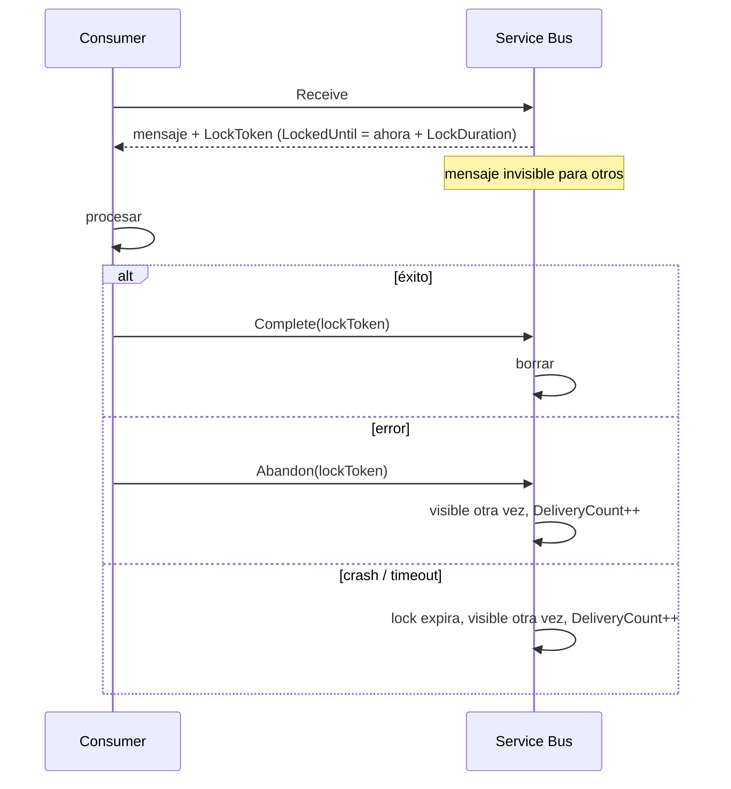
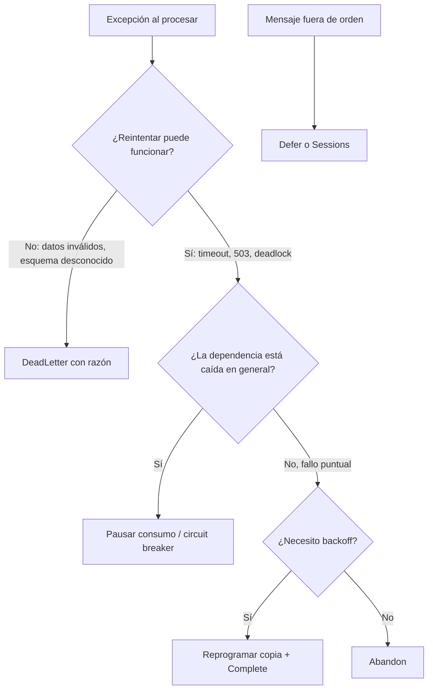
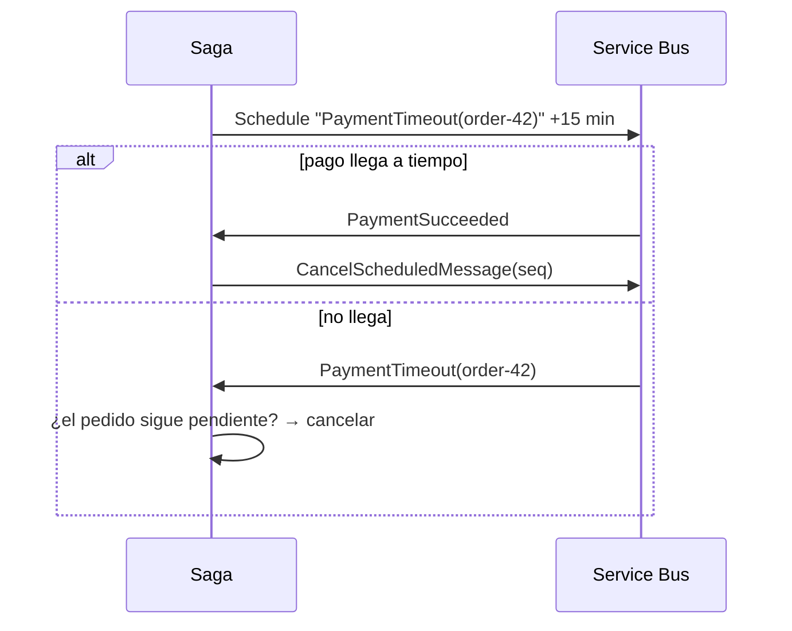
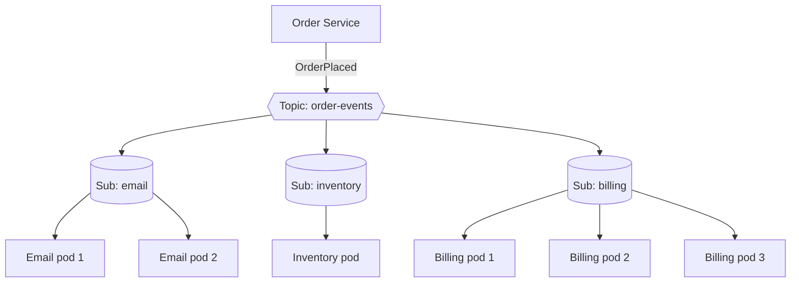
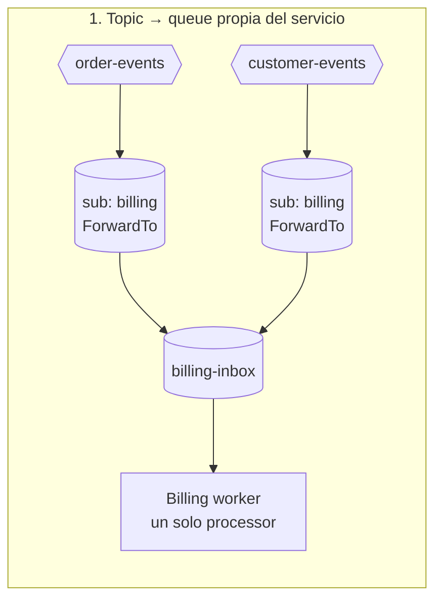

# 02 - Queues y Topics

> Recepción, locks, settlement, TTL, scheduling, topics, filtros y forwarding

## Contenido
- [[#Peek-Lock vs Receive-and-Delete]]
- [[#Message Lock y Lock Renewal]]
- [[#Message Settlement]]
- [[#TTL y expiracion]]
- [[#Scheduled Messages]]
- [[#Topics y Subscriptions]]
- [[#Filters y Rules]]
- [[#Auto-forwarding]]

## Peek-Lock vs Receive-and-Delete
### ¿Qué es?
Los dos **modos de recepción** (`ServiceBusReceiveMode`).

| | PeekLock (default) | ReceiveAndDelete |
|---|---|---|
| Qué hace el broker al entregar | Bloquea el mensaje | Lo borra en el acto |
| Requiere settlement | Sí (Complete/Abandon/…) | No |
| Si el consumidor muere | El mensaje vuelve (lock expira) | **Mensaje perdido** |
| Garantía | At-least-once | At-most-once |
| Operaciones | 2 (receive + complete) | 1 |
| DLQ por MaxDeliveryCount | Sí | No aplica |

### ¿Por qué existen los dos?
PeekLock existe para no perder mensajes ante fallos del consumidor. ReceiveAndDelete existe para cargas donde **perder algo es aceptable** y la latencia/coste importan más (p. ej. métricas no críticas, cachés que se refrescan).

### Cómo funciona Peek-Lock


### Ejemplo en .NET
```csharp
// PeekLock (por defecto)
ServiceBusReceiver receiver = client.CreateReceiver("orders");
ServiceBusReceivedMessage msg = await receiver.ReceiveMessageAsync(TimeSpan.FromSeconds(5), ct);
if (msg is not null)
{
    await ProcessAsync(msg, ct);
    await receiver.CompleteMessageAsync(msg, ct);
}

// ReceiveAndDelete: úsalo solo si puedes perder mensajes
var rdReceiver = client.CreateReceiver("metrics",
    new ServiceBusReceiverOptions { ReceiveMode = ServiceBusReceiveMode.ReceiveAndDelete });
```

### "Peek" ≠ Peek-Lock
`PeekMessageAsync` **solo mira** sin bloquear ni cambiar `DeliveryCount`. Sirve para herramientas de inspección, no para procesar. Puede devolver mensajes bloqueados por otros o incluso expirados aún no purgados.

### Errores comunes
- Usar ReceiveAndDelete "por rendimiento" en pagos → pérdida silenciosa en el primer despliegue que mate pods.
- Combinar ReceiveAndDelete con un `PrefetchCount` alto: si el proceso muere, se pierde **todo** el buffer.
- Pensar que PeekLock garantiza exactly-once. No: garantiza que **no se pierde**, lo que implica que **puede repetirse**.

### Relación
- [[02 - Queues y Topics#Message Lock y Lock Renewal|Message Lock y Lock Renewal]] · [[02 - Queues y Topics#Message Settlement|Message Settlement]] · [[03 - Confiabilidad y manejo de errores#At-least-once delivery|At-least-once delivery]] · [[05 - Seguridad y performance#Performance tuning|Performance tuning]]

### Puntos clave
- PeekLock = at-least-once. ReceiveAndDelete = at-most-once.
- El default del SDK es PeekLock y así debe quedarse salvo razón explícita.

---

## Message Lock y Lock Renewal
### ¿Qué es?
El **lock** es la reserva temporal de un mensaje para un receptor en modo Peek-Lock. Dura `LockDuration` (entidad; por defecto 1 min, **máximo 5 min**). La hora exacta está en `ServiceBusReceivedMessage.LockedUntil`.

### ¿Por qué tiene un máximo?
Porque el broker no sabe si sigues vivo. Un lock largo retrasa la recuperación tras un crash: el mensaje queda "secuestrado" hasta que expire. El diseño empuja a **locks cortos + renovación activa** mientras el proceso está sano.

### Renovación
- **Manual**: `await receiver.RenewMessageLockAsync(message)` — cada renovación es una operación facturable.
- **Automática**: `ServiceBusProcessor` renueva por ti mientras el handler se ejecuta, hasta `MaxAutoLockRenewalDuration` (default [Probable] 5 min). Pon `TimeSpan.Zero` para desactivarla, o un valor mayor que tu peor caso de procesamiento.

```csharp
var processor = client.CreateProcessor("orders", new ServiceBusProcessorOptions
{
    MaxAutoLockRenewalDuration = TimeSpan.FromMinutes(15), // > peor caso real
});
```

> [!warning] La renovación es del cliente, no del servidor
> Si tu proceso se congela (GC largo, CPU saturada, thread pool agotado), la renovación no ocurre y el lock expira aunque el handler siga "vivo". Resultado: dos consumidores procesando el mismo mensaje en paralelo.

### Qué pasa cuando el lock expira
1. El mensaje vuelve a estar disponible y `DeliveryCount` aumenta.
2. Otro consumidor (o el mismo) lo recibe.
3. El consumidor original, al llamar a `Complete`, recibe `ServiceBusException` con `Reason == ServiceBusFailureReason.MessageLockLost`.
4. El trabajo ya hecho **no se deshace** → necesitas [[03 - Confiabilidad y manejo de errores#Idempotent Consumer|idempotencia]].

### Causas típicas de lock perdido
| Causa | Diagnóstico | Solución |
|---|---|---|
| Procesamiento > lock y sin renovación | Duración del handler vs `LockDuration` | Subir `MaxAutoLockRenewalDuration` |
| `PrefetchCount` alto: los mensajes esperan en buffer local con el lock corriendo | Locks perdidos en mensajes que "nunca empezaron" | Bajar prefetch ([[05 - Seguridad y performance#Performance tuning|Performance tuning]]) |
| Thread pool starvation | Contadores `dotnet-counters` | Eliminar `.Result`/`.Wait()` sincronos |
| Red inestable (la renovación falla) | Logs del SDK | Retry del SDK, revisar conectividad |

### Trabajo muy largo (minutos/horas)
No mantengas un lock una hora. Patrón recomendado: recibir → registrar el trabajo en tu BD (estado "en curso") → **completar el mensaje** → procesar fuera del lock → publicar un evento al terminar. El estado vive en tu BD, no en el lock.

### Relación
- [[02 - Queues y Topics#Peek-Lock vs Receive-and-Delete|Peek-Lock vs Receive-and-Delete]] · [[04 - NET y entorno local#ServiceBusProcessor|ServiceBusProcessor]] · [[Troubleshooting - Lock expired]] · [[03 - Confiabilidad y manejo de errores#Sessions|Sessions]] (las sesiones tienen su propio *session lock*)

### Pregunta de entrevista
*Tu consumidor tarda 7 minutos y el máximo de lock es 5. ¿Qué haces?* → Renovación automática del processor con `MaxAutoLockRenewalDuration` > 7 min, idempotencia por si falla la renovación, y cuestionar si ese trabajo debería hacerse bajo lock (patrón de la sección anterior).

---

## Message Settlement
*Message Settlement: Complete, Abandon, Defer, DeadLetter*

### ¿Qué es?
*Settlement* es decirle al broker qué hacer con un mensaje recibido en Peek-Lock.

| Operación | Efecto | `DeliveryCount` | Cuándo usar |
|---|---|---|---|
| `CompleteMessageAsync` | Borra el mensaje | — | Procesado con éxito (o ya procesado antes: idempotencia) |
| `AbandonMessageAsync` | Libera el lock; vuelve **inmediatamente** a la cola | +1 | Error transitorio. Ojo: sin espera |
| `DeferMessageAsync` | Lo aparta; solo recuperable por `SequenceNumber` | — | Llegó antes de tiempo (orden de workflow) |
| `DeadLetterMessageAsync` | Lo mueve a la DLQ con razón/descripción | — | Error permanente: no tiene sentido reintentar |

### El problema de Abandon: reintento sin backoff
`Abandon` devuelve el mensaje al instante. Si el error es "la BD está caída", quemarás los `MaxDeliveryCount` intentos en segundos y el mensaje acabará en DLQ antes de que la BD vuelva. Alternativas con backoff:
1. **Reprogramar**: enviar una copia con `ScheduledEnqueueTime = ahora + backoff` (e.g. una propiedad `retry-count`) y completar el original — idealmente en una [[03 - Confiabilidad y manejo de errores#Transactions|transacción]].
2. **Retry en memoria** breve dentro del handler (Polly) antes de abandonar.
3. Pausar el processor (circuit breaker) si la dependencia está caída.
Detalle: [[03 - Confiabilidad y manejo de errores#Retry Policies|Retry Policies]].

### Defer en detalle
```csharp
// Mensaje "PaymentConfirmed" llega antes que "OrderCreated"
long seq = message.SequenceNumber;
await args.DeferMessageAsync(message);
await stateStore.SaveDeferredAsync(orderId, seq);   // ¡debes guardar el SequenceNumber!

// Más tarde, cuando llega OrderCreated:
ServiceBusReceivedMessage deferred = await receiver.ReceiveDeferredMessageAsync(seq);
await ProcessAsync(deferred);
await receiver.CompleteMessageAsync(deferred);
```
> [!warning] Si pierdes el `SequenceNumber`, el mensaje diferido queda huérfano hasta que expire su TTL. En la mayoría de casos, [[03 - Confiabilidad y manejo de errores#Sessions|Sessions]] con *session state* es una solución más limpia.

### Dead-letter con contexto
```csharp
catch (ValidationException ex)
{
    await args.DeadLetterMessageAsync(args.Message,
        deadLetterReason: "ValidationFailed",
        deadLetterErrorDescription: ex.Message[..Math.Min(ex.Message.Length, 1000)],
        cancellationToken: args.CancellationToken);
}
```
Usa razones **categorizadas y estables** (`ValidationFailed`, `SchemaUnsupported`, `CustomerNotFound`): son las que filtrarás al reprocesar. Ver [[03 - Confiabilidad y manejo de errores#Dead Letter Queue|Dead Letter Queue]].

### Settlement en el ServiceBusProcessor
- `AutoCompleteMessages = true` (default): si el handler termina sin excepción → Complete; si lanza → Abandon.
- Si haces settlement manual dentro del handler, el processor **no** intentará completar de nuevo.
- Recomendación: pon `AutoCompleteMessages = false` y haz settlement explícito cuando distingas errores permanentes vs transitorios; el comportamiento queda visible en el código.

### Árbol de decisión


### Relación
- [[02 - Queues y Topics#Peek-Lock vs Receive-and-Delete|Peek-Lock vs Receive-and-Delete]] · [[03 - Confiabilidad y manejo de errores#Dead Letter Queue|Dead Letter Queue]] · [[03 - Confiabilidad y manejo de errores#Retry Policies|Retry Policies]] · [[03 - Confiabilidad y manejo de errores#Poison Messages|Poison Messages]] · [[04 - NET y entorno local#ServiceBusProcessor|ServiceBusProcessor]]

---

## TTL y expiracion
*TTL y expiración*

### ¿Qué es?
`TimeToLive` define cuánto tiempo puede permanecer un mensaje sin ser consumido. Pasado ese tiempo, el mensaje **expira**.

### Cómo se calcula el TTL efectivo
```
TTL efectivo = min(message.TimeToLive, entity.DefaultMessageTimeToLive)
ExpiresAt    = EnqueuedTime + TTL efectivo
```
- Si el mensaje no define TTL, se usa el `DefaultMessageTimeToLive` de la entidad.
- Un TTL de mensaje **mayor** que el de la entidad se recorta silenciosamente al de la entidad. [Probable]
- En topics, el TTL efectivo también se ve limitado por el `DefaultMessageTimeToLive` de cada subscription.
- El reloj arranca en `EnqueuedTime`. En mensajes programados, arranca cuando el mensaje pasa a estar activo. [Probable]

### Qué ocurre al expirar
| Configuración de la entidad | Resultado |
|---|---|
| `DeadLetteringOnMessageExpiration = false` (**default**) | El mensaje se **elimina**, sin rastro |
| `DeadLetteringOnMessageExpiration = true` | Va a la [[03 - Confiabilidad y manejo de errores#Dead Letter Queue|Dead Letter Queue]] con razón `TTLExpiredException` |

> [!warning] La expiración es perezosa
> Un mensaje expirado no se purga en el instante exacto. Se detecta cuando el broker lo toca (al intentar entregarlo) o en barridos periódicos. Por eso `PeekMessagesAsync` puede devolver mensajes ya expirados, y las métricas de mensajes activos pueden tardar en bajar.

> [!important] Un mensaje **bloqueado** no expira mientras dura el lock
> Si un consumidor lo tiene en Peek-Lock, el broker no lo expira hasta que el lock se libere. [Probable]

### Ejemplo en .NET
```csharp
// Oferta flash: si no se procesa en 5 minutos ya no vale nada
var msg = new ServiceBusMessage(BinaryData.FromObjectAsJson(offer))
{
    MessageId = $"flash-offer-{offer.Id}",
    TimeToLive = TimeSpan.FromMinutes(5)
};
await sender.SendMessageAsync(msg, ct);

// Consumidor: nunca confíes en que el broker filtró lo expirado a tiempo
if (args.Message.ExpiresAt < DateTimeOffset.UtcNow)
{
    await args.CompleteMessageAsync(args.Message); // descartar explícitamente
    return;
}
```

### ¿Cuándo usar TTL?
| Escenario | TTL recomendado | DLQ al expirar |
|---|---|---|
| Notificaciones push, ofertas temporales | Minutos | No: si caducó, no tiene valor |
| Comandos de negocio (pedido, pago) | Largo o default | **Sí**: un pedido caducado es un incidente |
| Request/reply con timeout del cliente | Igual al timeout del cliente | No |
| Telemetría no crítica | Corto | No |

### Errores comunes
- Dejar `DeadLetteringOnMessageExpiration = false` en entidades de negocio → pedidos que "desaparecen" durante un outage largo del consumidor.
- Poner TTL corto a comandos "para no acumular" → el backlog tras un incidente se evapora y nadie lo sabe.
- Pensar que TTL es un timeout de procesamiento. No lo es: una vez recibido, lo que importa es el lock.

### Relación
- [[01 - Fundamentos y arquitectura#Ciclo de vida de un mensaje|Ciclo de vida de un mensaje]] · [[03 - Confiabilidad y manejo de errores#Dead Letter Queue|Dead Letter Queue]] · [[02 - Queues y Topics#Scheduled Messages|Scheduled Messages]] · [[01 - Fundamentos y arquitectura#Anatomia de un mensaje|Anatomia de un mensaje]]

### Pregunta de entrevista
*El consumidor estuvo caído 3 días y faltan pedidos. ¿Qué pudo pasar?* → TTL por debajo de 3 días y expiración sin dead-lettering: se borraron. Solución: TTL acorde al peor outage tolerable + `DeadLetteringOnMessageExpiration = true` + alerta sobre la antigüedad del mensaje más viejo.

---

## Scheduled Messages
### ¿Qué es?
Un mensaje que se envía ahora pero que **no es visible para los consumidores** hasta `ScheduledEnqueueTime`. Mientras tanto, su estado es `Scheduled`.

### ¿Por qué existe?
Para modelar "haz esto más tarde" sin un scheduler externo (Hangfire, Quartz, cron):
- Recordatorio de carrito abandonado a las 24 h.
- Timeout de saga: "si en 15 minutos no llegó el pago, cancela".
- Reintento con backoff real (ver [[03 - Confiabilidad y manejo de errores#Retry Policies|Retry Policies]]).

### Dos formas de programar
```csharp
// 1) ScheduleMessageAsync → devuelve el SequenceNumber (permite cancelar)
long seq = await sender.ScheduleMessageAsync(message, DateTimeOffset.UtcNow.AddHours(24), ct);
await repository.SaveReminderSequenceAsync(cartId, seq, ct);

// Si el usuario compra antes:
long saved = await repository.GetReminderSequenceAsync(cartId, ct);
await sender.CancelScheduledMessageAsync(saved, ct);

// 2) Propiedad ScheduledEnqueueTime → no devuelve SequenceNumber (no cancelable fácilmente)
message.ScheduledEnqueueTime = DateTimeOffset.UtcNow.AddMinutes(15);
await sender.SendMessageAsync(message, ct);
```

### Detalles que se preguntan en entrevistas
- **Precisión**: el mensaje se hace visible *alrededor* de la hora indicada, no con precisión de milisegundos. No lo uses como reloj exacto. [Probable]
- **Duplicate detection**: los mensajes programados **cuentan** para la deduplicación. Si programas un mensaje y luego envías otro no programado con el mismo `MessageId` dentro de la ventana, el segundo se descarta.
- **Cancelación idempotente**: cancelar un mensaje que ya se entregó falla o no tiene efecto. Tu consumidor debe tolerar recibir un recordatorio "ya no válido" (comprobar estado antes de actuar).
- **Transacciones**: la programación puede formar parte de una [[03 - Confiabilidad y manejo de errores#Transactions|transacción]], lo que permite "completar el mensaje actual + programar un reintento" de forma atómica.
- **Coste**: programar y cancelar son operaciones facturables.

### Patrón: timeout de saga

La comprobación "¿sigue pendiente?" es obligatoria: la cancelación puede perder la carrera contra la entrega.

### Errores comunes
- Usar scheduled messages para programar trabajos recurrentes (cron). Encadenar "cada mensaje programa el siguiente" es frágil: si uno falla, la cadena se rompe. Usa un scheduler real.
- No guardar el `SequenceNumber` y luego no poder cancelar.
- Programar a meses vista sin revisar el TTL de la entidad.

### Relación
- [[04 - NET y entorno local#Enviar mensajes en NET|Enviar mensajes en NET]] · [[02 - Queues y Topics#TTL y expiracion|TTL y expiracion]] · [[Saga Pattern]] · [[03 - Confiabilidad y manejo de errores#Retry Policies|Retry Policies]] · [[03 - Confiabilidad y manejo de errores#Duplicate Detection|Duplicate Detection]]

---

## Topics y Subscriptions
### ¿Qué es?
Implementación de **publish/subscribe** en Service Bus. El productor envía a un **topic**. Cada **subscription** recibe una **copia** de los mensajes que cumplen sus reglas. Los consumidores leen de la subscription, nunca del topic.

Requiere tier **Standard o Premium** (Basic no tiene topics).

### ¿Por qué existe?
Para que el productor no tenga que conocer a sus consumidores. Añadir un nuevo servicio interesado en `OrderPlaced` consiste en **crear una subscription**, sin tocar ni redeplegar el productor.

### Arquitectura: un evento, varios servicios

- **Entre subscriptions**: pub/sub → cada servicio recibe su copia.
- **Dentro de una subscription**: competing consumers → cada mensaje lo procesa **un** pod.

### Cómo funciona internamente
1. Llega un mensaje al topic.
2. El broker evalúa las reglas de **cada** subscription ([[02 - Queues y Topics#Filters y Rules|Filters y Rules]]).
3. Para cada subscription con al menos una regla que coincide, añade el mensaje a esa subscription (si varias reglas de una misma subscription coinciden, pueden generarse **varias copias** en ella [Probable]).
4. Si ninguna subscription coincide, el mensaje se descarta. El envío **no falla**.

> [!warning] Mensajes descartados sin aviso
> Un topic sin subscriptions, o con filtros que no coinciden, "traga" los mensajes: `SendMessageAsync` termina bien y nadie los recibe. Es una causa frecuente de "el evento se publicó pero nadie lo procesó".

### Cada subscription es independiente
Cada subscription tiene su propio `LockDuration`, `MaxDeliveryCount`, `DefaultMessageTimeToLive`, `RequiresSession`, DLQ y backlog. Consecuencia: si Billing está caído, **solo** crece la subscription `billing`. Email e Inventory siguen funcionando. Este aislamiento de fallos es la razón principal para usar topics frente a HTTP fan-out.

### Ejemplo .NET
```csharp
// Productor: no sabe cuántas subscriptions hay
ServiceBusSender sender = client.CreateSender("order-events");
await sender.SendMessageAsync(new ServiceBusMessage(BinaryData.FromObjectAsJson(evt))
{
    MessageId = $"order-{evt.OrderId}-placed",
    Subject = "OrderPlaced",
    ApplicationProperties = { ["region"] = "EU", ["total"] = (double)evt.Total }
}, ct);

// Consumidor de Billing
ServiceBusProcessor processor = client.CreateProcessor(
    topicName: "order-events",
    subscriptionName: "billing",
    new ServiceBusProcessorOptions { MaxConcurrentCalls = 8, AutoCompleteMessages = false });
```

### Límites relevantes
- Hasta **2 000 subscriptions** por topic. Si necesitas más, se escala con topics de segundo nivel y [[02 - Queues y Topics#Auto-forwarding|Auto-forwarding]].
- Filtros SQL por topic: 2 000. Correlation filters por topic: 100 000.
- El tamaño del topic incluye los mensajes pendientes de todas sus subscriptions.

Fuentes: [Quotas](https://learn.microsoft.com/azure/service-bus-messaging/service-bus-quotas) · [Autoforwarding](https://learn.microsoft.com/azure/service-bus-messaging/service-bus-auto-forwarding)

### Decisiones de diseño (nivel arquitecto)
| Opción | Ventaja | Riesgo |
|---|---|---|
| Un topic por bounded context (`order-events`) con `Subject` por tipo | Pocos recursos, un sitio para descubrir eventos | Cada subscription necesita filtros; consumidores reciben tipos que no les interesan si no filtras |
| Un topic por tipo de evento (`order-placed`) | Sin filtros, subscriptions simples | Proliferación de entidades, más IaC |
| Un topic global para todo | Simple al principio | Acoplamiento, filtros complejos, límites de filtros |

La primera opción suele ser el punto de partida razonable.

### Cuándo NO usar topics
- Solo hay un consumidor posible y es un **comando** dirigido → queue ([[Commands vs Events]]).
- Necesitas replay para suscriptores nuevos → un suscriptor nuevo **no recibe** los mensajes publicados antes de crearse. Eso es Event Hubs/Kafka.

### Errores comunes
- Crear una subscription por instancia/pod → procesamiento duplicado.
- Crear la subscription después de empezar a publicar → se pierden los eventos anteriores.
- Olvidar monitorizar la DLQ **de cada subscription**.

### Relación
- [[02 - Queues y Topics#Filters y Rules|Filters y Rules]] · [[02 - Queues y Topics#Auto-forwarding|Auto-forwarding]] · [[Publisher Subscriber]] · [[01 - Fundamentos y arquitectura#Namespace y entidades|Namespace y entidades]] · [[06 - Laboratorios#Lab 05 - Topics y Subscriptions|Lab 05 - Topics y Subscriptions]]

### Pregunta de entrevista
*¿Cómo escalas el servicio de Billing sin cobrar dos veces?* → Más instancias leyendo la **misma** subscription (competing consumers) + consumidor idempotente. Nunca una subscription por instancia.

---

## Filters y Rules
### ¿Qué es?
Cada subscription tiene una o más **rules**. Una rule = **filter** (condición) + **action** opcional (modifica propiedades del mensaje copiado). Un mensaje entra en la subscription si **alguna** rule coincide.

Al crear una subscription sin reglas explícitas, se crea la regla **`$Default`** con un `TrueFilter`: la subscription recibe **todo**.

### Tipos de filtro
| Filtro | Qué evalúa | Coste para el broker | Uso |
|---|---|---|---|
| `TrueRuleFilter` / `FalseRuleFilter` | Todo / nada | Mínimo | Wiretap, auditoría / pausar una subscription |
| **Correlation filter** | Igualdad exacta sobre propiedades de sistema (`Subject`, `CorrelationId`, `To`, `ReplyTo`, `ContentType`, `MessageId`, `SessionId`…) y de aplicación | **Bajo**: se evalúa por hash | 90 % de los casos |
| **SQL filter** | Expresión tipo SQL-92: `AND`, `OR`, `LIKE`, `IN`, comparaciones, `EXISTS` | **Alto**: se evalúa por mensaje y subscription | Rangos, `LIKE`, lógica compleja |

> [!tip] Regla práctica
> Empieza siempre con correlation filters. Solo usa SQL cuando necesites algo que no sea igualdad. Microsoft recomienda correlation filters por rendimiento, y los límites lo reflejan: 100 000 correlation filters por topic frente a 2 000 SQL filters.

### Los filtros nunca ven el body
Los filtros solo evalúan **propiedades**. Si quieres filtrar por región o importe, el productor debe ponerlos en `ApplicationProperties` (o en `Subject`). Diseña las propiedades pensando en los consumidores.

### Sintaxis SQL
- `sys.` para propiedades del sistema: `sys.Label` (= `Subject`), `sys.CorrelationId`, `sys.MessageId`, `sys.To`…
- `user.` o sin prefijo para `ApplicationProperties`.
```sql
user.region = 'EU' AND user.total > 1000
sys.Label IN ('OrderPlaced', 'OrderCancelled')
EXISTS(user.priority) AND user.priority = 'high'
```

### Actions
Una `SqlRuleAction` puede modificar la **copia** del mensaje que llega a esa subscription:
```sql
SET user.routed = 'vip'; REMOVE user.internalNote
```
Úsalo con moderación: la lógica de enrutado en el broker es difícil de depurar y versionar.

### Ejemplo .NET (gestión)
```csharp
var admin = new ServiceBusAdministrationClient(ns, new DefaultAzureCredential());

// Subscription que solo recibe pedidos grandes de EU
await admin.CreateSubscriptionAsync(
    new CreateSubscriptionOptions("order-events", "high-value-eu") { MaxDeliveryCount = 5 },
    new CreateRuleOptions("HighValueEU", new SqlRuleFilter("user.region = 'EU' AND user.total > 1000")));

// Subscription de notificaciones con correlation filter por Subject
await admin.CreateSubscriptionAsync(
    new CreateSubscriptionOptions("order-events", "notifications"),
    new CreateRuleOptions("OnlyConfirmed", new CorrelationRuleFilter { Subject = "OrderConfirmed" }));

// Para aceptar varios Subjects con correlation filters: una regla por valor (se evalúan con OR)
await admin.CreateRuleAsync("order-events", "notifications",
    new CreateRuleOptions("OnlyCancelled", new CorrelationRuleFilter { Subject = "OrderCancelled" }));

// Correlation filter sobre ApplicationProperties
var f = new CorrelationRuleFilter();
f.ApplicationProperties["region"] = "EU";
```
> [!warning] Cuidado con `$Default`
> Si creas la subscription sin regla y luego añades una regla filtrada, la subscription sigue teniendo `$Default` (TrueFilter) y **recibe todo**. Pasa la regla en `CreateSubscriptionAsync` (reemplaza a `$Default`) o borra `$Default` explícitamente.

En producción, define reglas en **IaC** (Bicep/Terraform), no en el código de la aplicación.

### Errores comunes
- La subscription recibe todo porque `$Default` sigue ahí.
- Tipos que no coinciden: el productor envía `total` como `string` y el filtro compara con número → no coincide nada.
- Filtros SQL complejos en topics de alto volumen → más latencia y más CPU en Premium.
- Cambiar filtros en caliente sin pensar en los mensajes en vuelo: el filtro se aplica al **envío**, no retroactivamente.

### Relación
- [[02 - Queues y Topics#Topics y Subscriptions|Topics y Subscriptions]] · [[01 - Fundamentos y arquitectura#Anatomia de un mensaje|Anatomia de un mensaje]] · [[02 - Queues y Topics#Auto-forwarding|Auto-forwarding]] · [[06 - Laboratorios#Lab 06 - Filters|Lab 06 - Filters]]
- Docs: [Topic filters and actions](https://learn.microsoft.com/azure/service-bus-messaging/topic-filters)

### Pregunta de entrevista
*¿SQL filter o correlation filter?* → Correlation por defecto: igualdad evaluada eficientemente y límites mucho más altos. SQL solo para rangos/LIKE/lógica compleja. Y en ambos casos, los datos tienen que estar en propiedades, no en el body.

---

## Auto-forwarding
### ¿Qué es?
Configurar una queue o subscription (**origen**) con `ForwardTo` para que el broker mueva automáticamente sus mensajes a otra queue o topic (**destino**) del **mismo namespace**. No requiere código. Existe también `ForwardDeadLetteredMessagesTo` para reenviar la DLQ.

No disponible en Basic.

### Reglas y límites (fuente: [docs oficiales](https://learn.microsoft.com/azure/service-bus-messaging/service-bus-auto-forwarding))
- Origen y destino en el **mismo namespace**.
- El destino debe existir **antes** de crear el origen.
- Máximo **4 saltos** en la cadena. Si un mensaje supera ese límite, va a la DLQ. Los saltos de *send-via* en [[03 - Confiabilidad y manejo de errores#Transactions|Transactions]] también cuentan.
- Una entidad **con sesiones no puede ser origen** de auto-forwarding. Sí puede ser **destino**: el mensaje conserva su `SessionId`, y si no tiene, va a la DLQ del origen.
- Si origen o destino están particionados, **no hay garantía de orden**.
- Se factura **una operación por cada mensaje reenviado**.
- En métricas, el reenvío cuenta como *Incoming* en el destino, pero **no** como *Outgoing* en el origen.
- Si el destino está lleno, deshabilitado o borrado, el mensaje va a la DLQ del origen.
- Crear un origen con forwarding requiere permisos **Manage** en origen y destino.

### Casos de uso

1. **Inbox por servicio**: varias subscriptions de distintos topics reenvían a una sola queue del servicio. El servicio tiene un único processor y una única DLQ que vigilar.
2. **Escalar un topic más allá de 2 000 subscriptions** con topics de segundo nivel.
3. **Desacoplar al emisor del receptor**: el receptor controla su queue destino.
4. **DLQ central**: `ForwardDeadLetteredMessagesTo` hacia una queue de tratamiento de errores.

### Qué NO hace
- No transforma el mensaje.
- No cruza namespaces ni regiones (para eso: un consumidor que reenvíe, o [[Geo-Replication]]).
- No reemplaza la lógica de reintentos.

### Errores comunes
- Cadenas largas + transacciones → superar 4 saltos → mensajes a DLQ de forma inesperada.
- Mirar solo la métrica del origen y creer que no sale nada.
- Olvidar que el destino con sesiones exige `SessionId` en todos los mensajes.

### Relación
- [[02 - Queues y Topics#Topics y Subscriptions|Topics y Subscriptions]] · [[03 - Confiabilidad y manejo de errores#Dead Letter Queue|Dead Letter Queue]] · [[03 - Confiabilidad y manejo de errores#Sessions|Sessions]] · [[03 - Confiabilidad y manejo de errores#Transactions|Transactions]] · [[Inbox Pattern]]
