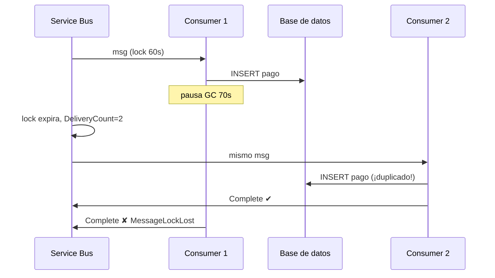
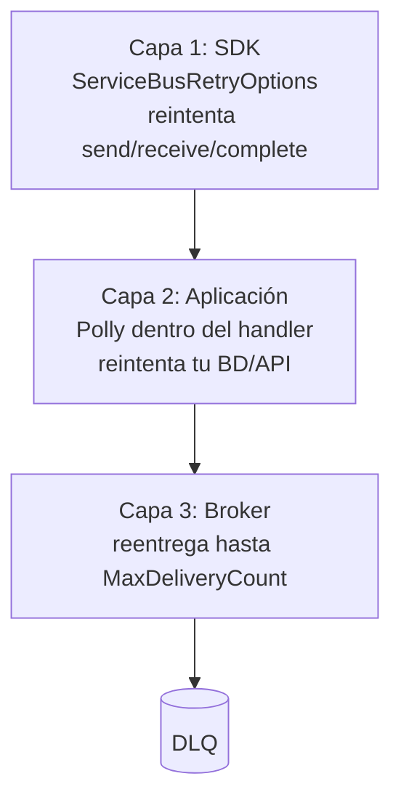
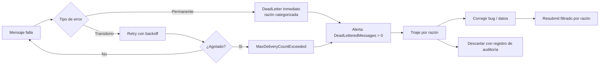
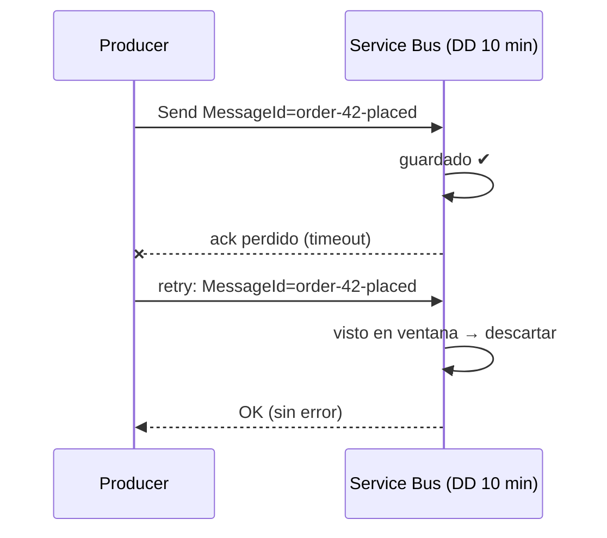
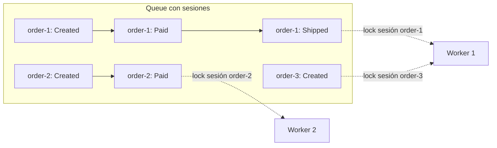

# 03 - Confiabilidad y manejo de errores

> Entrega, idempotencia, reintentos, DLQ, duplicados, transacciones y sesiones

## Contenido
- [[#At-least-once delivery]]
- [[#Idempotent Consumer]]
- [[#Retry Policies]]
- [[#Poison Messages]]
- [[#Dead Letter Queue]]
- [[#Duplicate Detection]]
- [[#Transactions]]
- [[#Sessions]]
- [[#ServiceBusSessionProcessor]]

## At-least-once delivery
### ¿Qué es?
La garantía de Service Bus en modo Peek-Lock: **cada mensaje se entregará una o más veces** hasta que alguien lo complete (o expire/vaya a DLQ). Nunca cero veces por fallo del consumidor. Posiblemente más de una.

### ¿Por qué no exactly-once?
Porque el "procesamiento" incluye efectos fuera del broker (tu BD, un email, una API de pagos). El broker no puede hacer atómico "completar el mensaje" con "tu `INSERT` en SQL". Entre ambos siempre hay una ventana en la que un fallo deja uno hecho y el otro no. Ningún broker lo resuelve para efectos externos; los que anuncian *exactly-once* lo limitan a su propio sistema.

### Todos los caminos al duplicado
| # | Escenario | Dónde se duplica |
|---|---|---|
| 1 | El productor envía, el ack se pierde, el SDK reintenta | En la entidad (2 mensajes) |
| 2 | El consumidor procesa, muere antes de `Complete` | Reentrega |
| 3 | El lock expira durante el procesamiento (lento, GC, prefetch) | Dos consumidores a la vez |
| 4 | `Complete` falla por red tras procesar | Reentrega |
| 5 | Relay del outbox publica y muere antes de marcar como enviado | En la entidad |
| 6 | Operador reprocesa la DLQ sin comprobar | Reenvío manual |



### Consecuencia de diseño (no negociable)
Todo consumidor debe ser **idempotente**: procesar el mismo mensaje N veces produce el mismo efecto que 1. → [[03 - Confiabilidad y manejo de errores#Idempotent Consumer|Idempotent Consumer]].

[[03 - Confiabilidad y manejo de errores#Duplicate Detection|Duplicate Detection]] solo ayuda con el caso 1 (y 5, si el `MessageId` es determinista y cae dentro de la ventana). Los casos 2, 3, 4 y 6 **no** los cubre.

### Diseño para recuperarse de fallos
| Fallo | Qué garantiza Service Bus | Qué debes hacer tú |
|---|---|---|
| Consumer crash | Reentrega tras lock | Idempotencia |
| Producer crash tras guardar en BD | Nada | [[Outbox Pattern]] |
| Network failure en send | Retry del SDK | `MessageId` determinista + DD |
| Dependencia caída | Reentrega hasta MaxDeliveryCount | Backoff / circuit breaker ([[03 - Confiabilidad y manejo de errores#Retry Policies|Retry Policies]]) |
| Mensaje inválido | DLQ tras N intentos | DeadLetter inmediato ([[02 - Queues y Topics#Message Settlement|Message Settlement]]) |

### Relación
- [[02 - Queues y Topics#Peek-Lock vs Receive-and-Delete|Peek-Lock vs Receive-and-Delete]] · [[03 - Confiabilidad y manejo de errores#Idempotent Consumer|Idempotent Consumer]] · [[03 - Confiabilidad y manejo de errores#Duplicate Detection|Duplicate Detection]] · [[Outbox Pattern]] · [[Inbox Pattern]]

### Pregunta de entrevista
*"Hemos activado duplicate detection, así que ya no necesitamos idempotencia." ¿Estás de acuerdo?* → No. DD deduplica **envíos** con el mismo `MessageId` dentro de la ventana. No impide la **reentrega** de un mismo mensaje por lock expirado o crash del consumidor, que es la causa más frecuente.

---

## Idempotent Consumer
### Problema
Con [[03 - Confiabilidad y manejo de errores#At-least-once delivery|At-least-once delivery]] el mismo mensaje puede llegar varias veces, incluso **en paralelo**. Si el efecto no es idempotente (cobrar, restar stock, enviar email), el duplicado es un bug de negocio.

### Solución: tres técnicas, de mejor a peor
#### 1. Idempotencia natural (la mejor si es posible)
Diseña la operación para que repetirla no cambie nada:
- `UPDATE Orders SET Status='Paid' WHERE Id=@id` (asignación absoluta) en lugar de `Balance = Balance - @x` (relativo).
- `UPSERT` por clave de negocio.
- Llamar a APIs externas con **idempotency key** (Stripe, Adyen y la mayoría de pasarelas lo soportan) = `MessageId`.

#### 2. Registro de mensajes procesados en la **misma transacción** que el efecto
```sql
CREATE TABLE ProcessedMessages (
    Consumer   nvarchar(100) NOT NULL,
    MessageId  nvarchar(128) NOT NULL,
    ProcessedAt datetime2    NOT NULL,
    CONSTRAINT PK_ProcessedMessages PRIMARY KEY (Consumer, MessageId)
);
```
```csharp
public async Task HandleAsync(ReserveStock cmd, string messageId, CancellationToken ct)
{
    await using var tx = await _db.Database.BeginTransactionAsync(ct);

    _db.ProcessedMessages.Add(new ProcessedMessage("inventory", messageId, DateTime.UtcNow));
    try
    {
        await _db.SaveChangesAsync(ct);          // la PK hace de cerrojo
    }
    catch (DbUpdateException ex) when (ex.IsUniqueViolation()) // extensión propia: SqlException.Number 2627/2601
    {
        _logger.LogInformation("Mensaje {Id} ya procesado; se ignora", messageId);
        return;                                  // el llamador hará Complete
    }

    var product = await _db.Products.SingleAsync(p => p.Id == cmd.ProductId, ct);
    product.Reserve(cmd.Quantity, cmd.OrderId);
    await _db.SaveChangesAsync(ct);

    await tx.CommitAsync(ct);
}
```
Por qué funciona incluso con dos consumidores en paralelo: el segundo `INSERT` en la PK se bloquea hasta que el primero hace commit y entonces falla por clave duplicada. Si el primero hace rollback, el segundo procede. **La deduplicación y el efecto son atómicos**.

> [!important] La clave debe ser la identidad **lógica** del mensaje (`MessageId` determinista del productor), no `SequenceNumber` ni `LockToken`: un reenvío del productor tiene otro `SequenceNumber`.

#### 3. Comprobación previa sin transacción (frágil)
"`if (await AlreadyProcessed(id)) return;` … procesar … `MarkProcessed(id)`". Tiene carrera: dos consumidores pasan el `if` a la vez. Solo aceptable si la operación ya es casi idempotente.

### Efectos no transaccionales (email, API sin idempotency key)
No hay atomicidad posible. Opciones:
- Aceptar *at-least-once* en ese efecto (un email duplicado ocasional suele ser tolerable) y documentarlo.
- Registrar "intento" antes y "hecho" después, y en reintento consultar al sistema externo si ya ocurrió.

### Ventajas / Desventajas
| + | − |
|---|---|
| Correcto frente a todos los escenarios de duplicado | Tabla que crece → purga periódica (> TTL máximo + ventana de reprocesado de DLQ) |
| Independiente del broker | Requiere que el productor genere `MessageId` estable |
| Base del [[Inbox Pattern]] | Una escritura extra por mensaje |

### Cuándo evitarlo
Nunca "evitar": como mucho, reducirlo a idempotencia natural cuando el efecto lo permite.

### Relación
- [[03 - Confiabilidad y manejo de errores#At-least-once delivery|At-least-once delivery]] · [[03 - Confiabilidad y manejo de errores#Duplicate Detection|Duplicate Detection]] · [[Inbox Pattern]] · [[Outbox Pattern]] · [[01 - Fundamentos y arquitectura#Anatomia de un mensaje|Anatomia de un mensaje]]

### Pregunta de entrevista
*¿Cómo garantizas que un pago no se cobra dos veces si el mensaje se entrega dos veces?* → Idempotency key = `MessageId` en la pasarela + registro de procesados en la misma transacción que el cambio de estado del pedido + `MessageId` determinista desde el productor. Explica por qué DD no basta.

---

## Retry Policies
### Las tres capas de reintento (y por qué se multiplican)

| Capa | Qué reintenta | Configuración |
|---|---|---|
| **SDK** | Operaciones contra Service Bus (conexión, send, receive, settlement) | `ServiceBusClientOptions.RetryOptions` |
| **Aplicación** | Tus dependencias (SQL, HTTP) dentro del handler | Polly / `Microsoft.Extensions.Http.Resilience` |
| **Broker** | El mensaje completo, tras Abandon o lock expirado | `MaxDeliveryCount` de la entidad |

#### El error común: multiplicación sin control
Handler con Polly de 5 reintentos contra una API que a su vez reintenta 3 veces, y `MaxDeliveryCount = 10`:
```
10 entregas × 5 reintentos Polly × 3 reintentos HTTP = 150 llamadas por mensaje
× 1 000 mensajes en cola = 150 000 llamadas contra una API que YA está caída
```
Eso es una **retry storm**: conviertes un incidente de la dependencia en un ataque de denegación de servicio contra ella. Además, el tiempo de los reintentos internos consume el lock.

**Regla**: decide **una** capa principal para cada tipo de fallo y calcula el peor caso: `MaxDeliveryCount × reintentos_app × reintentos_internos`.

### Capa 1: retry del SDK
```csharp
var options = new ServiceBusClientOptions
{
    RetryOptions = new ServiceBusRetryOptions
    {
        Mode = ServiceBusRetryMode.Exponential,   // default
        MaxRetries = 3,                           // default [Probable]
        Delay = TimeSpan.FromSeconds(0.8),        // base del backoff [Probable]
        MaxDelay = TimeSpan.FromSeconds(60),      // [Probable]
        TryTimeout = TimeSpan.FromSeconds(60)     // timeout de CADA intento [Probable]
    }
};
```
- Solo reintenta errores que el SDK considera transitorios (`ServiceBusException.IsTransient`).
- **No** reintenta operaciones dentro de una [[03 - Confiabilidad y manejo de errores#Transactions|transacción]].
- Ante `ServiceBusy` (throttling), el SDK introduce una espera adicional antes de reintentar. [Probable]
- Peor latencia de un envío ≈ `(MaxRetries + 1) × TryTimeout` + backoffs. Con los defaults, varios minutos: tenlo en cuenta en APIs síncronas.

### Transitorio vs permanente
| Transitorio (reintentar) | Permanente (no reintentar → DeadLetter) |
|---|---|
| Timeouts, `ServiceCommunicationProblem` | JSON inválido, esquema desconocido |
| `ServiceBusy` (throttling) | Validación de negocio fallida |
| SQL deadlock, 503, 429 | Entidad referenciada inexistente (según negocio) |
| Conexión reseteada | `MessageSizeExceeded` al reenviar |
| — | `UnauthorizedAccessException` (config, no se arregla sola) |

```csharp
static bool IsTransient(Exception ex) => ex switch
{
    ServiceBusException sbe => sbe.IsTransient,
    TimeoutException => true,
    HttpRequestException { StatusCode: HttpStatusCode.ServiceUnavailable or HttpStatusCode.TooManyRequests } => true,
    SqlException sql when sql.Number is 1205 or -2 => true,  // deadlock, timeout
    _ => false
};
```

### Capa 2: retry de aplicación (breve)
Reintentos en memoria **cortos** (segundos) para fallos puntuales. Mantenlos muy por debajo del lock.
```csharp
ResiliencePipeline pipeline = new ResiliencePipelineBuilder()
    .AddRetry(new RetryStrategyOptions
    {
        MaxRetryAttempts = 2,
        Delay = TimeSpan.FromMilliseconds(200),
        BackoffType = DelayBackoffType.Exponential,
        UseJitter = true,
        ShouldHandle = new PredicateBuilder().Handle<Exception>(IsTransient)
    })
    .Build();
```

### Capa 3: reintento por el broker con backoff real
`Abandon` reentrega **al instante**. Para esperas largas (la BD tardará 5 minutos en volver):
1. **Reprogramar** una copia con `retry-count` y completar el original, en transacción ([[03 - Confiabilidad y manejo de errores#Transactions|Transactions]]):
```csharp
int attempt = msg.ApplicationProperties.TryGetValue("retry-count", out var v) ? (int)v : 0;
if (attempt >= 5)
{
    await args.DeadLetterMessageAsync(msg, "RetriesExhausted", ex.Message);
    return;
}
var delay = TimeSpan.FromSeconds(Math.Pow(2, attempt) * 10); // 10s, 20s, 40s, 80s, 160s
var retry = new ServiceBusMessage(msg) { MessageId = $"{msg.MessageId}:retry-{attempt + 1}" };
retry.ApplicationProperties["retry-count"] = attempt + 1;
// (en TransactionScope con EnableCrossEntityTransactions si procede)
await sender.ScheduleMessageAsync(retry, DateTimeOffset.UtcNow + delay);
await args.CompleteMessageAsync(msg);
```
> Nota: el `MessageId` nuevo evita que [[03 - Confiabilidad y manejo de errores#Duplicate Detection|Duplicate Detection]] descarte la copia; la idempotencia del consumidor debe basarse en la **clave de negocio**, no en ese `MessageId`.

2. **Circuit breaker a nivel de consumidor**: si la dependencia está caída en general, detén el processor (`StopProcessingAsync`) durante un tiempo en lugar de quemar entregas. Los mensajes esperan en la cola, que es exactamente para lo que existe.

### Tabla de decisión
| Situación | Estrategia |
|---|---|
| Glitch de milisegundos | Polly 1-2 reintentos |
| Dependencia caída minutos | Circuit breaker + pausar consumo |
| Un mensaje concreto falla de forma intermitente | Reprogramar con backoff |
| Error permanente | DeadLetter inmediato |
| Desconocido | Abandon; `MaxDeliveryCount` limitado (5-10) acaba en DLQ |

### Relación
- [[02 - Queues y Topics#Message Settlement|Message Settlement]] · [[03 - Confiabilidad y manejo de errores#Poison Messages|Poison Messages]] · [[03 - Confiabilidad y manejo de errores#Dead Letter Queue|Dead Letter Queue]] · [[Circuit Breaker]] · [[02 - Queues y Topics#Scheduled Messages|Scheduled Messages]] · [[06 - Laboratorios#Lab 08 - Retry|Lab 08 - Retry]]

---

## Poison Messages
### ¿Qué es?
Un mensaje que **siempre** hará fallar al consumidor, por mucho que se reintente: datos corruptos, esquema incompatible, un bug que solo se dispara con ciertos valores, una referencia a algo que no existe.

### Por qué es peligroso
- Consume capacidad: cada entrega ocupa un slot de concurrencia y una operación facturable.
- Con [[03 - Confiabilidad y manejo de errores#Sessions|Sessions]], bloquea **todos** los mensajes posteriores de esa sesión.
- Con `MaxDeliveryCount` alto y Abandon inmediato, genera ruido en logs y alertas.
- Si el consumidor se **cae** al procesarlo (StackOverflow, OOM), el mensaje vuelve y tumba otra instancia: fallo en cascada.

### Cómo lo gestiona Service Bus
Cada entrega incrementa `DeliveryCount`. Al superar `MaxDeliveryCount`, el broker lo mueve a la [[03 - Confiabilidad y manejo de errores#Dead Letter Queue|Dead Letter Queue]] con razón `MaxDeliveryCountExceeded`. Es la red de seguridad, no la estrategia.

### Estrategia
1. **Detectar pronto**: si el error es claramente permanente (deserialización, validación), DeadLetter **en el primer intento** con una razón explícita. No esperes 10 entregas.
2. **Proteger el proceso**: un mensaje nunca debe poder tumbar el proceso. Valida tamaño, profundidad de JSON y campos antes de procesar.
3. **Usar `DeliveryCount` como señal**:
```csharp
if (args.Message.DeliveryCount > 3)
    logger.LogWarning("Mensaje {Id} en su entrega {Count}; posible poison message",
        args.Message.MessageId, args.Message.DeliveryCount);
```
4. **`MaxDeliveryCount` razonable**: 5-10 es habitual. 1 manda a DLQ cualquier fallo transitorio. 100 deja un poison message dando vueltas durante mucho tiempo.
5. **Alertar sobre la DLQ** y analizar por razón.

### Relación
- [[03 - Confiabilidad y manejo de errores#Dead Letter Queue|Dead Letter Queue]] · [[03 - Confiabilidad y manejo de errores#Retry Policies|Retry Policies]] · [[02 - Queues y Topics#Message Settlement|Message Settlement]] · [[Troubleshooting - Dead-letter increasing]]

---

## Dead Letter Queue
*Dead Letter Queue (DLQ)*

### ¿Qué es?
Una **subqueue** que existe automáticamente en cada queue y cada subscription (`orders/$DeadLetterQueue`, `order-events/subscriptions/billing/$DeadLetterQueue`). Guarda mensajes que no pueden o no deben procesarse. No se crea, no se borra y **no se vacía sola**.

### ¿Por qué existe?
Para que un mensaje que siempre falla (poison message) no bloquee ni consuma recursos indefinidamente, y para que **no se pierda**: queda aparcado para análisis humano.

### Cuándo llega un mensaje a la DLQ
| Causa | `DeadLetterReason` [Probable, verifica en docs] | ¿Automático? |
|---|---|---|
| `DeliveryCount` supera `MaxDeliveryCount` (default 10) | `MaxDeliveryCountExceeded` | Sí |
| TTL expirado **y** `DeadLetteringOnMessageExpiration = true` | `TTLExpiredException` | Sí (si está activado) |
| Error evaluando filtros de subscription (si `EnableDeadLetteringOnFilterEvaluationExceptions`) | Excepción de filtro | Sí (si está activado) |
| Sesión requerida y mensaje sin `SessionId` | Relacionada con session id | Sí |
| Cabeceras demasiado grandes | `HeaderSizeExceeded` | Sí |
| Cadena de auto-forwarding demasiado larga / destino deshabilitado | Varias | Sí |
| Tu código llama a `DeadLetterMessageAsync` | La que tú pongas | No |

Lista oficial: [Dead-letter queues overview](https://learn.microsoft.com/azure/service-bus-messaging/service-bus-dead-letter-queues)

> [!important] Por defecto, un mensaje que **expira** se **borra**, no va a la DLQ. Si el mensaje tiene valor de negocio, activa `DeadLetteringOnMessageExpiration`.

### Propiedades de un mensaje en DLQ
`DeadLetterReason`, `DeadLetterErrorDescription`, `DeadLetterSource` (entidad original si llegó por auto-forward), `DeliveryCount`, `EnqueuedTime` original y todas las propiedades del mensaje. Los mensajes en DLQ **no expiran por TTL** [Probable] y cuentan para la cuota de tamaño de la entidad: una DLQ que crece puede acabar llenando la entidad y bloqueando **nuevos envíos**.

### Leer la DLQ en .NET
```csharp
ServiceBusReceiver dlq = client.CreateReceiver("orders",
    new ServiceBusReceiverOptions { SubQueue = SubQueue.DeadLetter });

// Inspeccionar sin tocar
IReadOnlyList<ServiceBusReceivedMessage> peeked = await dlq.PeekMessagesAsync(maxMessages: 50);
foreach (var m in peeked)
    Console.WriteLine($"{m.MessageId} | {m.DeadLetterReason} | {m.DeadLetterErrorDescription} | intentos={m.DeliveryCount}");
```

### Reprocesar (resubmit) de forma segura
```csharp
public async Task<int> ResubmitAsync(string queue, string reasonFilter, int max, CancellationToken ct)
{
    await using ServiceBusReceiver dlq = _client.CreateReceiver(queue,
        new ServiceBusReceiverOptions { SubQueue = SubQueue.DeadLetter });
    ServiceBusSender sender = _senders.CreateClient(queue);
    int count = 0;

    while (count < max)
    {
        var batch = await dlq.ReceiveMessagesAsync(20, TimeSpan.FromSeconds(5), ct);
        if (batch.Count == 0) break;

        foreach (var dead in batch)
        {
            if (dead.DeadLetterReason != reasonFilter)
            {
                await dlq.AbandonMessageAsync(dead, cancellationToken: ct); // no es de este lote
                continue;
            }

            var copy = new ServiceBusMessage(dead);          // copia body + propiedades
            copy.ApplicationProperties["resubmitted-from-dlq"] = DateTimeOffset.UtcNow.ToString("O");
            copy.ApplicationProperties["original-dlq-reason"] = dead.DeadLetterReason;

            await sender.SendMessageAsync(copy, ct);
            await dlq.CompleteMessageAsync(dead, ct);        // no es atómico con el send
            count++;
        }
    }
    return count;
}
```
- `new ServiceBusMessage(receivedMessage)` copia el mensaje; **mantiene el `MessageId`** → si la entidad tiene [[03 - Confiabilidad y manejo de errores#Duplicate Detection|Duplicate Detection]] y aún estás dentro de la ventana, el reenvío se **descartará silenciosamente**. Ten esto en cuenta al reprocesar pronto.
- Send + Complete no es atómico aquí → posible duplicado → tu consumidor ya es [[03 - Confiabilidad y manejo de errores#Idempotent Consumer|idempotente]], ¿verdad? (Puedes hacerlo atómico con [[03 - Confiabilidad y manejo de errores#Transactions|Transactions]] si ambas entidades están en el mismo namespace.)
- **Arregla la causa antes de reprocesar.** Reenviar 10 000 mensajes que volverán a fallar solo mueve el problema.

### Estrategia profesional de mensajes fallidos

1. **Clasifica en el consumidor**: permanente → DeadLetter inmediato con razón estable; transitorio → reintentos ([[03 - Confiabilidad y manejo de errores#Retry Policies|Retry Policies]]).
2. **Alerta** sobre la métrica `DeadletteredMessages` por entidad (umbral > 0 o tendencia creciente) → [[Metricas clave]].
3. **Dueño claro**: cada DLQ tiene un equipo responsable y un SLA de revisión. Una DLQ sin dueño es un vertedero.
4. **Herramienta de reprocesado** (script/endpoint admin/Service Bus Explorer del portal) filtrando por razón, con auditoría.
5. **Retención**: archiva (p. ej. a Blob) y completa lo que no se reprocesará; no dejes que la DLQ llene la entidad.

### Opcional: forward de DLQ
`ForwardDeadLetteredMessagesTo` reenvía automáticamente la DLQ de una entidad a otra queue (p. ej. una "DLQ central" por servicio). Útil para centralizar el tratamiento; pierdes la separación por entidad salvo por `DeadLetterSource`.

### Errores comunes
- No monitorizar la DLQ. Es el error nº 1 en producción: miles de pedidos muertos durante semanas.
- `MaxDeliveryCount = 1`: cualquier fallo transitorio va directo a DLQ.
- `MaxDeliveryCount` altísimo con Abandon inmediato: un poison message bloquea capacidad de consumo.
- Reprocesar sin corregir la causa.

### Relación
- [[02 - Queues y Topics#Message Settlement|Message Settlement]] · [[03 - Confiabilidad y manejo de errores#Poison Messages|Poison Messages]] · [[03 - Confiabilidad y manejo de errores#Retry Policies|Retry Policies]] · [[Metricas clave]] · [[Troubleshooting - Dead-letter increasing]] · [[06 - Laboratorios#Lab 07 - Dead Letter Queue|Lab 07 - Dead Letter Queue]]

### Preguntas de entrevista
- *¿Cuándo un mensaje va a DLQ?* → Enumera las causas automáticas + la explícita, y menciona que la expiración **no** va a DLQ por defecto.
- *¿Cómo reprocesas?* → Receive de `SubQueue.DeadLetter`, copia, reenvío, complete; idempotencia; cuidado con la ventana de DD.

---

## Duplicate Detection
### ¿Qué es?
Una función del broker que registra los `MessageId` recibidos por una queue o topic durante una **ventana de tiempo**. Si llega otro mensaje con un `MessageId` ya visto dentro de esa ventana, el broker **acepta el envío (no hay error) pero descarta el mensaje en silencio**. Solo se compara el `MessageId`. Ni el body ni otras propiedades importan.

Disponible en Standard y Premium, no en Basic. Fuente: [Duplicate detection](https://learn.microsoft.com/azure/service-bus-messaging/duplicate-detection)

### Configuración
| Propiedad | Valor |
|---|---|
| `RequiresDuplicateDetection` | Se activa **al crear** la entidad; no se puede activar después |
| `DuplicateDetectionHistoryTimeWindow` | Default **10 min**, mínimo **20 s**, máximo **7 días**. Modificable después |

A mayor ventana, más `MessageId` que comparar y **menos throughput**. En entidades de alto volumen, mantén la ventana lo más pequeña posible.

### ¿Qué problema resuelve exactamente?
La **incertidumbre del emisor**. El mensaje se persistió, pero el ack se perdió por red. El emisor no sabe si llegó y reenvía. Con DD, puede reenviar el mismo mensaje sin miedo.



### Lo que NO resuelve
| Escenario | ¿DD lo evita? |
|---|---|
| Reintento del productor con el mismo `MessageId` dentro de la ventana | ✅ |
| Reenvío fuera de la ventana | ❌ |
| `MessageId` aleatorio (GUID por defecto del SDK) | ❌ Cada reintento de la aplicación genera un id nuevo |
| Reentrega al consumidor por lock expirado o crash | ❌ No es un nuevo envío |
| Dos productores distintos generando el mismo evento de negocio con ids distintos | ❌ |

Por eso **DD no sustituye a la idempotencia**: [[03 - Confiabilidad y manejo de errores#Idempotent Consumer|Idempotent Consumer]].

### `MessageId` determinista: la mitad del trabajo
El SDK solo reutiliza el mismo objeto en sus reintentos internos. Si tu aplicación reconstruye el mensaje (por ejemplo, el relay del outbox tras reiniciarse), el `MessageId` debe poder **reconstruirse igual**:
```csharp
// ❌ Nuevo GUID en cada intento de la aplicación
MessageId = Guid.NewGuid().ToString()

// ✅ Derivado de la intención de negocio
MessageId = $"order-{orderId}-placed"
MessageId = outboxRow.Id.ToString()            // id persistido en el outbox
MessageId = $"{sourceMessageId}:reserve-stock" // derivado del mensaje que lo causó
```
El `MessageId` admite como máximo 128 caracteres.

### Interacciones sutiles (preguntas senior)
- **Scheduled messages** cuentan para DD: programar un recordatorio y después enviar uno inmediato con el mismo `MessageId` → el segundo se descarta.
- **Reprocesar la DLQ** con `new ServiceBusMessage(deadLettered)` conserva el `MessageId`. Si lo haces dentro de la ventana, se descarta en silencio. Si necesitas forzarlo, asigna un id nuevo **conscientemente** (y confía en la idempotencia del consumidor).
- **Particionado**: con partitioning, la unicidad se evalúa junto con la clave de partición (`SessionId`/`PartitionKey`). No se recomienda combinar DD, batching y partitioning.
- **Topics**: DD se configura en el **topic**, no en las subscriptions.

### Cuándo activarlo
- Productores que reintentan tras errores ambiguos (casi todos).
- Relays de outbox.
- Integraciones con sistemas externos que reenvían (webhooks entrantes → queue).

### Cuándo no merece la pena
- Throughput muy alto donde el coste en rendimiento importa y la idempotencia del consumidor ya cubre los duplicados.
- Productores que no pueden generar `MessageId` estables: DD no aportaría nada.

### Relación
- [[03 - Confiabilidad y manejo de errores#At-least-once delivery|At-least-once delivery]] · [[03 - Confiabilidad y manejo de errores#Idempotent Consumer|Idempotent Consumer]] · [[Outbox Pattern]] · [[01 - Fundamentos y arquitectura#Anatomia de un mensaje|Anatomia de un mensaje]] · [[03 - Confiabilidad y manejo de errores#Dead Letter Queue|Dead Letter Queue]]

### Pregunta de entrevista
*Activamos duplicate detection y seguimos viendo pedidos cobrados dos veces. ¿Por qué?* → DD solo actúa sobre envíos repetidos con el mismo `MessageId` dentro de la ventana. El duplicado probablemente viene de una reentrega al consumidor (lock expirado o crash) o de un `MessageId` aleatorio. Solución: consumidor idempotente con clave de negocio.

---

## Transactions
### ¿Qué es?
Agrupar varias operaciones **de Service Bus** para que se confirmen todas o ninguna. Se usan con `System.Transactions.TransactionScope`. No existen en Basic.

### Qué operaciones pueden participar
- Envíos: `SendMessageAsync`, `SendMessagesAsync`, `ScheduleMessageAsync`, `CancelScheduledMessageAsync`.
- Settlement: `Complete`, `Abandon`, `DeadLetter`, `Defer`.
- Estado de sesión: `SetSessionStateAsync`.
- **No** participa la **recepción**. El mensaje se recibe fuera de la transacción; su *settlement* es lo que entra en ella.

### Los dos patrones principales
#### 1. Receive → procesar → Send + Complete atómico
```csharp
var options = new ServiceBusClientOptions { EnableCrossEntityTransactions = true };
await using var client = new ServiceBusClient(ns, new DefaultAzureCredential(), options);

ServiceBusReceiver receiver = client.CreateReceiver("orders");     // la PRIMERA operación define la entidad send-via
ServiceBusSender sender   = client.CreateSender("payments");

ServiceBusReceivedMessage msg = await receiver.ReceiveMessageAsync(cancellationToken: ct);
var cmd = BuildChargeCommand(msg);                                 // trabajo FUERA de la transacción

using (var ts = new TransactionScope(TransactionScopeAsyncFlowOption.Enabled))
{
    await sender.SendMessageAsync(cmd, ct);
    await receiver.CompleteMessageAsync(msg, ct);
    ts.Complete();
}
```
Si algo falla antes de `ts.Complete()`, ni se envía `cmd` ni se completa `msg`: el mensaje vuelve a la cola y no hay envío huérfano.

#### 2. Complete + reprogramar reintento con backoff
```csharp
using (var ts = new TransactionScope(TransactionScopeAsyncFlowOption.Enabled))
{
    var retry = new ServiceBusMessage(msg);
    retry.ApplicationProperties["retry-count"] = attempt + 1;
    await sender.ScheduleMessageAsync(retry, DateTimeOffset.UtcNow.Add(Backoff(attempt)), ct);
    await receiver.CompleteMessageAsync(msg, ct);
    ts.Complete();
}
```

### Cross-entity: cómo funciona realmente
Cuando la transacción abarca varias entidades, hay que activar `EnableCrossEntityTransactions`. El broker usa **send-via**: los envíos pasan por la entidad sobre la que se hizo la **primera operación** con ese cliente y luego se transfieren a su destino. Implicaciones:
- El **orden** de creación y uso importa. Si la primera operación fue un envío a B y luego intentas recibir de A dentro de la transacción, obtienes `InvalidOperationException`: una recepción no puede enrutarse por otra entidad. Recibe primero.
- Ese cliente queda optimizado para transacciones. Usa **un cliente dedicado** para este flujo y otro para el resto.
- Cada transferencia cuenta como un salto para el límite de 4 de [[02 - Queues y Topics#Auto-forwarding|Auto-forwarding]].

Fuente: [Sample06_Transactions](https://github.com/Azure/azure-sdk-for-net/blob/main/sdk/servicebus/Azure.Messaging.ServiceBus/samples/Sample06_Transactions.md)

### Limitaciones
| Limitación | Consecuencia |
|---|---|
| Todas las entidades en el **mismo namespace** | No sirve entre namespaces |
| **No** participa en transacciones distribuidas (MSDTC/2PC) con SQL u otros recursos | No puedes hacer atómico "INSERT en SQL + Send" → [[Outbox Pattern]] |
| Timeout de **2 minutos** desde la primera operación | Haz el trabajo pesado antes de abrir la transacción |
| El SDK **no reintenta** operaciones dentro de una transacción | Un error transitorio aborta la transacción; reintenta la transacción completa |
| Límite de mensajes por transacción | [Suposición] fuentes no oficiales citan 100; verifícalo en quotas antes de diseñar lotes grandes |

### Comparativa
| | Transacción Service Bus | Transacción de BD | Transacción distribuida (2PC) |
|---|---|---|---|
| Alcance | Operaciones de un namespace | Una BD | Varios recursos (BD + colas…) |
| Protocolo | AMQP transactions | Motor de BD | MSDTC / XA |
| ¿Service Bus participa? | Sí | No | **No** |
| Uso moderno | Receive+Send, Complete+Schedule | Estado de negocio + outbox/inbox | Evitada en cloud: lenta, frágil |
| Sustituto en microservicios | — | — | Outbox + Inbox + idempotencia + sagas |

### Error clásico
```csharp
using var ts = new TransactionScope(TransactionScopeAsyncFlowOption.Enabled);
await db.SaveChangesAsync();          // SQL
await sender.SendMessageAsync(msg);   // Service Bus
ts.Complete();
```
Esto **no** es atómico entre SQL y Service Bus. Según la versión y la configuración puede lanzar una excepción, intentar escalar a una transacción distribuida no soportada o dar una falsa sensación de atomicidad. Solución: [[Outbox Pattern]].

### Cuándo utilizarlas
- Workers "recibo → publico siguiente paso" (pipelines, sagas coreografiadas dentro del broker).
- Reintentos con backoff mediante reprogramación.
- Sesiones: actualizar session state + completar.

### Cuándo evitarlas
- Alto throughput donde la latencia extra importa y la idempotencia ya cubre el caso.
- Cuando el efecto importante está en tu BD: ahí la transacción que necesitas es la de la BD (outbox/inbox).

### Relación
- [[Outbox Pattern]] · [[Inbox Pattern]] · [[02 - Queues y Topics#Message Settlement|Message Settlement]] · [[03 - Confiabilidad y manejo de errores#Sessions|Sessions]] · [[03 - Confiabilidad y manejo de errores#Retry Policies|Retry Policies]]

### Pregunta de entrevista
*¿Puedo guardar el pedido en SQL y publicar el evento en una transacción?* → No, Service Bus no participa en 2PC. Guarda el pedido y el mensaje en una tabla outbox dentro de la misma transacción SQL, y un relay publica después. Asume duplicados y haz idempotente al consumidor.

---

## Sessions
### ¿Qué problema resuelven?
En una queue normal con varios consumidores concurrentes **no hay orden de procesamiento**. Aunque el broker entregue en orden FIFO, el consumidor A puede tardar más que el B. Así, `OrderShipped` puede procesarse antes que `OrderPaid`.

Las sessions garantizan **FIFO por clave** (`SessionId`) y **procesamiento exclusivo**: todos los mensajes con el mismo `SessionId` los procesa un solo receptor a la vez, en orden. Los mensajes de sesiones distintas se procesan en paralelo.



### Conceptos clave
| Concepto | Qué es |
|---|---|
| `RequiresSession` | Propiedad de la queue/subscription. **Inmutable**: se define al crearla |
| `SessionId` | Lo pone el productor. Máx. 128 caracteres. En una entidad con sesiones, un mensaje sin `SessionId` se rechaza al enviar o va a DLQ si llega por forwarding |
| **Session lock** | El receptor bloquea la **sesión entera**, no solo un mensaje. Nadie más puede recibir mensajes de esa sesión mientras dure |
| **Session state** | Blob binario asociado a la sesión que guarda el broker (`GetSessionStateAsync` / `SetSessionStateAsync`). Hasta 1 000 000 de estados por entidad |
| `SessionIdleTimeout` | Cuánto espera el processor sin mensajes nuevos antes de soltar la sesión y aceptar otra |

### Garantía exacta (y sus límites)
- Orden **dentro** de una sesión: sí.
- Orden **global**: no.
- Exactly-once: no. Si el session lock expira, otra instancia puede tomar la sesión y reprocesar → la idempotencia sigue siendo obligatoria.
- Con `MaxConcurrentCallsPerSession > 1` **pierdes el orden** dentro de la sesión.

### Session state: máquina de estados sin BD
```csharp
processor.ProcessMessageAsync += async args =>
{
    BinaryData? raw = await args.GetSessionStateAsync(args.CancellationToken);
    var state = raw is null ? new OrderSagaState() : raw.ToObjectFromJson<OrderSagaState>()!;

    state.Apply(args.Message.Subject, args.Message.Body);

    await args.SetSessionStateAsync(BinaryData.FromObjectAsJson(state), args.CancellationToken);
    await args.CompleteMessageAsync(args.Message, args.CancellationToken);
};
```
> [!warning] Set state + Complete no es atómico por defecto
> Si el proceso muere entre ambas llamadas, el mensaje se reentrega con el estado ya actualizado. Tu `Apply` debe ser idempotente o debes envolver ambas operaciones en una [[03 - Confiabilidad y manejo de errores#Transactions|transacción]].

### Cuándo usarlas
- Eventos de una misma entidad de negocio que deben aplicarse en orden (pedido, cuenta, dispositivo).
- Agrupar mensajes relacionados (partes de un lote grande, chunks de un archivo).
- Request/reply con respuestas dirigidas: `ReplyToSessionId` = id del solicitante.
- Sagas/orquestación por entidad con estado en la sesión.

### Cuándo NO usarlas
- No necesitas orden: añaden complejidad y reducen el paralelismo efectivo.
- Pocas claves muy activas (**hot sessions**): una sesión con el 80 % del tráfico se procesa en serie por un solo worker → cuello de botella imposible de escalar.
- Claves con millones de valores y un mensaje cada uno: el coste de aceptar y soltar sesiones domina.
- Necesitas auto-forwarding **desde** esta entidad (no compatible).

### Diseño del `SessionId`
- Que represente la unidad de consistencia: `order-{id}`, `account-{id}`.
- Cardinalidad suficiente para repartir carga entre workers.
- Estable: todos los productores deben calcularlo igual.

### Relación
- [[03 - Confiabilidad y manejo de errores#ServiceBusSessionProcessor|ServiceBusSessionProcessor]] · [[Saga Pattern]] · [[02 - Queues y Topics#Message Settlement|Message Settlement]] (Defer como alternativa peor) · [[Troubleshooting - Session lock problems]] · [[06 - Laboratorios#Lab 09 - Sessions|Lab 09 - Sessions]]

### Preguntas de entrevista
- *¿Service Bus garantiza orden FIFO?* → Solo dentro de una sesión. Una queue sin sesiones con consumidores concurrentes no garantiza orden de procesamiento.
- *¿Por qué no poner `MaxConcurrentCalls = 1` y listo?* → Funciona con una sola instancia, pero no escala: dos pods rompen el orden. Las sesiones permiten orden por clave **y** paralelismo entre claves.

---

## ServiceBusSessionProcessor
### ¿Qué es?
El equivalente de [[04 - NET y entorno local#ServiceBusProcessor|ServiceBusProcessor]] para entidades con sesiones. Acepta sesiones disponibles, procesa sus mensajes en orden y las libera cuando quedan inactivas.

### Opciones clave
| Opción | Default [Probable] | Efecto |
|---|---|---|
| `MaxConcurrentSessions` | 8 | Sesiones procesadas en paralelo por esta instancia |
| `MaxConcurrentCallsPerSession` | 1 | Mensajes en paralelo **dentro** de una sesión. >1 rompe el orden |
| `SessionIdleTimeout` | Depende del retry TryTimeout | Tiempo sin mensajes antes de soltar la sesión |
| `SessionIds` | vacío | Restringe a sesiones concretas |
| `MaxAutoLockRenewalDuration` | 5 min | Renovación automática del **session lock** |
| `AutoCompleteMessages` | true | Igual que en el processor normal |

Concurrencia total por instancia = `MaxConcurrentSessions × MaxConcurrentCallsPerSession`.

### Ejemplo completo
```csharp
ServiceBusSessionProcessor processor = client.CreateSessionProcessor("order-lifecycle",
    new ServiceBusSessionProcessorOptions
    {
        MaxConcurrentSessions = 16,
        MaxConcurrentCallsPerSession = 1,
        SessionIdleTimeout = TimeSpan.FromSeconds(10),
        AutoCompleteMessages = false,
        MaxAutoLockRenewalDuration = TimeSpan.FromMinutes(10)
    });

processor.SessionInitializingAsync += args =>
{
    logger.LogDebug("Sesión {SessionId} aceptada", args.SessionId);
    return Task.CompletedTask;
};

processor.SessionClosingAsync += args =>
{
    logger.LogDebug("Sesión {SessionId} liberada", args.SessionId);
    return Task.CompletedTask;
};

processor.ProcessMessageAsync += async args =>
{
    // args.SessionId, args.GetSessionStateAsync(), args.SetSessionStateAsync(), args.ReleaseSession()
    await handler.HandleAsync(args.SessionId, args.Message, args.CancellationToken);
    await args.CompleteMessageAsync(args.Message, args.CancellationToken);
};

processor.ProcessErrorAsync += args =>
{
    logger.LogError(args.Exception, "Error {Source} en {Entity}", args.ErrorSource, args.EntityPath);
    return Task.CompletedTask;
};

await processor.StartProcessingAsync(ct);
```

### Enviar a una entidad con sesiones
```csharp
await sender.SendMessageAsync(new ServiceBusMessage(BinaryData.FromObjectAsJson(evt))
{
    SessionId = $"order-{evt.OrderId}",
    MessageId = $"order-{evt.OrderId}-{evt.Type}-{evt.Version}",
    Subject = evt.Type
}, ct);
```

### Alternativa manual: `ServiceBusSessionReceiver`
```csharp
// Aceptar una sesión concreta (p. ej. respuestas de request/reply)
ServiceBusSessionReceiver r = await client.AcceptSessionAsync("replies", sessionId: requestId, cancellationToken: ct);

// O la siguiente sesión disponible
ServiceBusSessionReceiver next = await client.AcceptNextSessionAsync("order-lifecycle", cancellationToken: ct);
```
`AcceptNextSessionAsync` espera hasta que haya una sesión libre o se agote el tiempo (lanza `ServiceBusException` con `Reason == ServiceTimeout`).

### Diagnóstico
- `SessionLockLost`: la sesión se perdió (procesamiento largo, renovación fallida, pausa del proceso).
- Throughput bajo con muchas sesiones de pocos mensajes: el processor pasa más tiempo aceptando y esperando (`SessionIdleTimeout`) que procesando. Baja `SessionIdleTimeout`.
- Una sesión "atascada": un mensaje venenoso en la cabeza de la sesión bloquea todos los siguientes hasta que vaya a la DLQ. Por eso un `MaxDeliveryCount` razonable es más crítico aquí.

### Relación
- [[03 - Confiabilidad y manejo de errores#Sessions|Sessions]] · [[04 - NET y entorno local#ServiceBusProcessor|ServiceBusProcessor]] · [[05 - Seguridad y performance#Performance tuning|Performance tuning]] · [[Troubleshooting - Session lock problems]]
