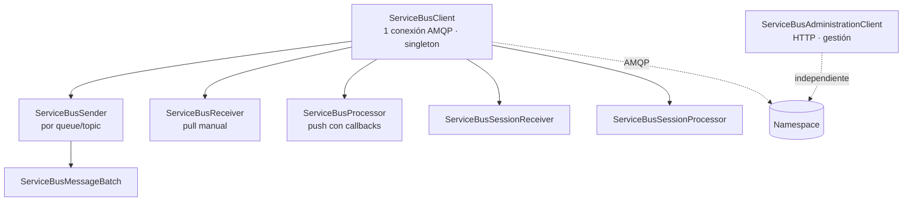
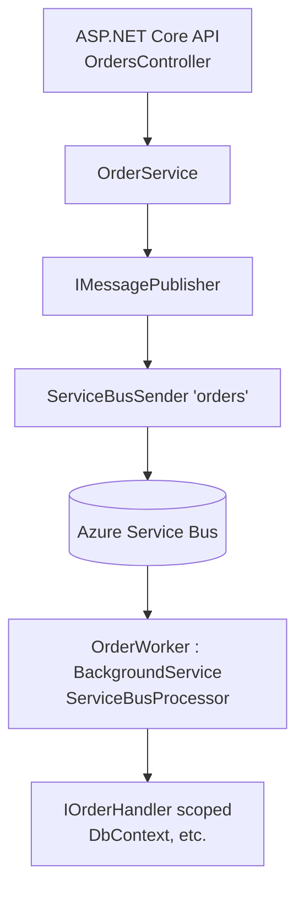

# 04 - NET y entorno local

> SDK Azure.Messaging.ServiceBus, envío, recepción, ASP.NET Core y emulador

## Contenido
- [[#SDK moderno de NET]]
- [[#Enviar mensajes en NET]]
- [[#ServiceBusProcessor]]
- [[#ServiceBusReceiver manual]]
- [[#Integracion con ASP.NET Core]]
- [[#Emulador local]]

## SDK moderno de NET
*SDK moderno de .NET*

### Paquetes NuGet
| Paquete | Para qué |
|---|---|
| `Azure.Messaging.ServiceBus` | **El SDK**. Enviar, recibir, processor, sesiones, administración (`ServiceBusAdministrationClient`) |
| `Azure.Identity` | `DefaultAzureCredential`, `ManagedIdentityCredential`… |
| `Microsoft.Extensions.Azure` | Registro en DI (`AddAzureClients`), configuración desde `IConfiguration` |
| `Aspire.Azure.Messaging.ServiceBus` | Integración .NET Aspire (health checks, telemetría) — opcional |

> [!danger] No uses
> `Microsoft.Azure.ServiceBus` ni `WindowsAzure.ServiceBus`: retirados (ver [[00 - Indice y ruta de estudio#Estado del producto y cambios recientes|Estado del producto y cambios recientes]]). Si un tutorial usa `QueueClient`, cierra la pestaña.

### Modelo de objetos


| Tipo | Rol | Vida recomendada |
|---|---|---|
| `ServiceBusClient` | Posee la conexión TCP/AMQP | **Singleton** por namespace |
| `ServiceBusSender` | Link de envío a una entidad | Singleton/cacheado por entidad |
| `ServiceBusReceiver` | Pull manual (`ReceiveMessagesAsync`) | Larga; úsalo para control fino, DLQ, deferred |
| `ServiceBusProcessor` | Bucle de recepción gestionado con concurrencia, renovación y settlement | Uno por entidad/worker |
| `ServiceBusSessionProcessor` | Igual, por sesiones | Ídem |
| `ServiceBusMessage` | Mensaje a enviar | Por envío |
| `ServiceBusReceivedMessage` | Mensaje recibido (inmutable) | Por recepción |
| `ServiceBusMessageBatch` | Lote que respeta el tamaño máximo | Por lote; **disposable** |

### Reglas de oro
1. **Todos los clientes son thread-safe** y están pensados para reutilizarse. Crear un `ServiceBusClient` por request abre una conexión TCP + handshake TLS + autenticación cada vez: latencia alta y agotamiento de conexiones.
2. **Dispose al apagar**, no después de cada uso: `await client.DisposeAsync()` cierra senders/receivers hijos.
3. Autenticación con **`TokenCredential`** (Entra ID) antes que connection strings → [[05 - Seguridad y performance#Seguridad con Entra ID y RBAC|Seguridad con Entra ID y RBAC]].
4. Configura el retry del SDK conscientemente (defaults abajo) → [[03 - Confiabilidad y manejo de errores#Retry Policies|Retry Policies]].

### Crear el cliente
```csharp
var client = new ServiceBusClient(
    fullyQualifiedNamespace: "sb-orders-prod.servicebus.windows.net",
    credential: new DefaultAzureCredential(),
    options: new ServiceBusClientOptions
    {
        TransportType = ServiceBusTransportType.AmqpTcp, // AmqpWebSockets si solo sale el 443
        Identifier = $"order-api-{Environment.MachineName}", // aparece en logs de diagnóstico
        RetryOptions = new ServiceBusRetryOptions
        {
            Mode = ServiceBusRetryMode.Exponential,
            MaxRetries = 3,
            Delay = TimeSpan.FromSeconds(0.8),
            MaxDelay = TimeSpan.FromSeconds(30),
            TryTimeout = TimeSpan.FromSeconds(60)
        }
    });
```
[Probable] Los valores anteriores coinciden con los defaults del SDK salvo `MaxDelay` (default 60 s). El retry del SDK cubre **operaciones del cliente** (send, receive, complete), no tu lógica de negocio.

### Receiver manual vs Processor
| | `ServiceBusReceiver` | `ServiceBusProcessor` |
|---|---|---|
| Control | Total: tú haces el bucle | Callbacks |
| Concurrencia | La implementas tú | `MaxConcurrentCalls` |
| Renovación de lock | Manual | Automática |
| Uso típico | Scripts, leer DLQ, deferred, batch processing | Workers de producción |

### Emulador local
Para desarrollo sin coste: connection string del emulador (`Endpoint=sb://localhost;...;UseDevelopmentEmulator=true;`). No soporta Entra ID: en local tendrás que usar connection string. Ver [[04 - NET y entorno local#Emulador local|Emulador local]].

### Relación
- [[04 - NET y entorno local#Enviar mensajes en NET|Enviar mensajes en NET]] · [[04 - NET y entorno local#ServiceBusProcessor|ServiceBusProcessor]] · [[04 - NET y entorno local#Integracion con ASP.NET Core|Integracion con ASP.NET Core]] · [[04 - NET y entorno local#ServiceBusReceiver manual|ServiceBusReceiver manual]]
- Docs: [Azure.Messaging.ServiceBus README](https://learn.microsoft.com/dotnet/api/overview/azure/messaging.servicebus-readme)

---

## Enviar mensajes en NET
*Enviar mensajes en .NET*

### Un mensaje
```csharp
ServiceBusSender sender = client.CreateSender("orders"); // cachéalo

var message = new ServiceBusMessage(BinaryData.FromObjectAsJson(command))
{
    MessageId = $"reserve-stock-{command.OrderId}",
    Subject = nameof(ReserveStock),
    ContentType = "application/json",
    CorrelationId = command.OrderId.ToString()
};

await sender.SendMessageAsync(message, cancellationToken);
```
`SendMessageAsync` completa cuando el broker **confirmó persistencia**. Si lanza excepción tras agotar reintentos, **no sabes** si el mensaje llegó (el ack pudo perderse): otra razón para `MessageId` determinista + [[03 - Confiabilidad y manejo de errores#Duplicate Detection|Duplicate Detection]].

### Varios mensajes: batch seguro
`SendMessagesAsync(IEnumerable<>)` falla si el conjunto excede el tamaño máximo. `ServiceBusMessageBatch` calcula el tamaño por ti:
```csharp
public async Task SendAllAsync(IReadOnlyList<ServiceBusMessage> messages, CancellationToken ct)
{
    var pending = new Queue<ServiceBusMessage>(messages);
    while (pending.Count > 0)
    {
        using ServiceBusMessageBatch batch = await _sender.CreateMessageBatchAsync(ct);

        while (pending.Count > 0 && batch.TryAddMessage(pending.Peek()))
            pending.Dequeue();

        if (batch.Count == 0)
            throw new InvalidOperationException(
                $"El mensaje {pending.Peek().MessageId} excede el tamaño máximo por sí solo.");

        await _sender.SendMessagesAsync(batch, ct);
    }
}
```
- Un batch es **atómico**: o se aceptan todos o ninguno.
- Todos los mensajes de un batch en entidad particionada deben ir a la misma partición (mismo `SessionId`/`PartitionKey`, o sin ellos) [Probable].
- En Premium con mensajes > 1 MB **no** hay batching.

### Mensajes programados
```csharp
DateTimeOffset when = DateTimeOffset.UtcNow.AddMinutes(30);

// Opción A: devuelve el SequenceNumber → permite cancelar
long seq = await sender.ScheduleMessageAsync(reminderMessage, when, ct);
await sender.CancelScheduledMessageAsync(seq, ct);

// Opción B: propiedad (no devuelve SequenceNumber)
reminderMessage.ScheduledEnqueueTime = when;
await sender.SendMessageAsync(reminderMessage, ct);
```
Guarda el `SequenceNumber` si necesitas cancelar (p. ej. "recordatorio de carrito abandonado" que se cancela si el usuario paga). Detalle: [[02 - Queues y Topics#Scheduled Messages|Scheduled Messages]].

### Enviar a un topic
Idéntico: `client.CreateSender("order-events")`. El productor **no sabe** qué subscriptions existen. Pon en `Subject`/`ApplicationProperties` lo que los filtros necesiten ([[02 - Queues y Topics#Filters y Rules|Filters y Rules]]).

### Buenas prácticas
- Sender por entidad, cacheado ([[04 - NET y entorno local#Integracion con ASP.NET Core|Integracion con ASP.NET Core]] muestra cómo con DI).
- `MessageId` determinista por intención de negocio.
- Propaga `CancellationToken` siempre.
- No envíes desde dentro de una transacción de BD esperando atomicidad: no la hay → [[Outbox Pattern]].
- Para alto volumen, agrupa en batches; para baja latencia, envía uno a uno.

### Errores comunes
| Error | Consecuencia |
|---|---|
| `new ServiceBusClient` por request | Latencia, conexiones agotadas |
| `await using var sender` en cada envío | Abre/cierra link AMQP cada vez |
| Guardar en BD y luego enviar sin outbox | Pedido guardado sin evento (o evento sin pedido) |
| `SendMessagesAsync(lista)` con listas grandes | `MessageSizeExceeded` en producción con datos reales |

### Relación
- [[04 - NET y entorno local#SDK moderno de NET|SDK moderno de NET]] · [[01 - Fundamentos y arquitectura#Anatomia de un mensaje|Anatomia de un mensaje]] · [[Outbox Pattern]] · [[03 - Confiabilidad y manejo de errores#Duplicate Detection|Duplicate Detection]]

---

## ServiceBusProcessor
### ¿Qué es?
El receptor "push" del SDK: gestiona el bucle de recepción, la concurrencia, la renovación de locks y el settlement por defecto. Tú aportas dos callbacks: `ProcessMessageAsync` y `ProcessErrorAsync` (ambos **obligatorios** antes de `StartProcessingAsync`).

### Opciones que debes entender
| Opción | Default [Probable] | Qué controla | Riesgo si te equivocas |
|---|---|---|---|
| `MaxConcurrentCalls` | 1 | Mensajes procesados en paralelo por esta instancia | 1 = throughput bajísimo; muy alto = satura la BD downstream |
| `PrefetchCount` | 0 | Mensajes traídos por adelantado al buffer local | Locks expirando en buffer → duplicados |
| `AutoCompleteMessages` | true | Complete si no hay excepción, Abandon si la hay | Abandon inmediato sin backoff |
| `MaxAutoLockRenewalDuration` | 5 min | Hasta cuándo renueva el lock | Menor que el procesamiento → `MessageLockLost` |
| `ReceiveMode` | PeekLock | Modo de recepción | ReceiveAndDelete = pérdida en crash |
| `SubQueue` | None | Leer DLQ (`SubQueue.DeadLetter`) | — |

### Ejemplo completo
```csharp
var processor = client.CreateProcessor("orders", new ServiceBusProcessorOptions
{
    MaxConcurrentCalls = 8,
    PrefetchCount = 0,
    AutoCompleteMessages = false,
    MaxAutoLockRenewalDuration = TimeSpan.FromMinutes(10)
});

processor.ProcessMessageAsync += async args =>
{
    ServiceBusReceivedMessage msg = args.Message;
    using var scope = logger.BeginScope(new Dictionary<string, object>
    {
        ["MessageId"] = msg.MessageId,
        ["CorrelationId"] = msg.CorrelationId,
        ["DeliveryCount"] = msg.DeliveryCount
    });

    try
    {
        var cmd = msg.Body.ToObjectFromJson<ReserveStock>()
                  ?? throw new InvalidMessageException("Body vacío");

        await handler.HandleAsync(cmd, args.CancellationToken);   // idempotente
        await args.CompleteMessageAsync(msg, args.CancellationToken);
    }
    catch (InvalidMessageException ex)
    {
        await args.DeadLetterMessageAsync(msg, "InvalidMessage", ex.Message, args.CancellationToken);
    }
    catch (Exception ex) when (IsTransient(ex))
    {
        logger.LogWarning(ex, "Error transitorio, se reintentará");
        await args.AbandonMessageAsync(msg, cancellationToken: args.CancellationToken);
    }
    // Cualquier otra excepción: el processor la reporta a ProcessErrorAsync
    // y el lock acabará expirando → reentrega.
};

processor.ProcessErrorAsync += args =>
{
    logger.LogError(args.Exception,
        "Error en {Source} sobre {Entity} ({Namespace})",
        args.ErrorSource, args.EntityPath, args.FullyQualifiedNamespace);
    return Task.CompletedTask;
};

await processor.StartProcessingAsync(ct);
```

### Qué significa `ProcessErrorAsync`
No es "mi handler falló" solamente. Recibe errores de **toda la infraestructura**: recepción, renovación de lock, settlement, conexión. `args.ErrorSource` te dice cuál (`Receive`, `RenewLock`, `Complete`, `Abandon`, `ProcessMessageCallback`…). El processor **se recupera solo** de errores transitorios; no llames a `StopProcessingAsync` desde aquí salvo que quieras detenerlo.

### `args.CancellationToken`
Se cancela cuando el processor se está deteniendo. Propágalo a tu código para que el apagado no espere a trabajo largo. Si cancelas a mitad, **no completes**: deja que el mensaje vuelva.

### Concurrencia vs escalado horizontal
Throughput total ≈ `instancias × MaxConcurrentCalls × (1 / duración media del handler)`. Con 4 pods × 8 = 32 mensajes simultáneos. El límite real suele ser **la dependencia downstream** (BD, API), no Service Bus.

### Graceful shutdown
`StopProcessingAsync` deja de pedir mensajes y **espera** a que terminen los handlers en curso. Después, `DisposeAsync`. En Kubernetes, asegúrate de que `terminationGracePeriodSeconds` y `HostOptions.ShutdownTimeout` cubren tu handler más lento. Implementación: [[04 - NET y entorno local#Integracion con ASP.NET Core|Integracion con ASP.NET Core]].

### Errores comunes
- Olvidar registrar `ProcessErrorAsync` → `InvalidOperationException` al arrancar.
- `MaxConcurrentCalls = 1` en producción "porque es el default".
- Tragar excepciones en el handler y completar igualmente → mensajes perdidos lógicamente.
- Hacer `.Result`/`.Wait()` dentro del handler → starvation del thread pool → locks perdidos.
- Llamar a `CompleteMessageAsync` con `AutoCompleteMessages = true` y además dejar que el processor complete: el SDK lo tolera, pero oculta la intención; elige uno.

### Relación
- [[02 - Queues y Topics#Message Settlement|Message Settlement]] · [[02 - Queues y Topics#Message Lock y Lock Renewal|Message Lock y Lock Renewal]] · [[05 - Seguridad y performance#Performance tuning|Performance tuning]] · [[03 - Confiabilidad y manejo de errores#ServiceBusSessionProcessor|ServiceBusSessionProcessor]] · [[03 - Confiabilidad y manejo de errores#Retry Policies|Retry Policies]]

---

## ServiceBusReceiver manual
### ¿Cuándo usarlo en lugar del processor?
| Escenario | Por qué el receiver |
|---|---|
| Leer o reprocesar la DLQ | Control por lotes, filtrado, parada cuando se vacía |
| Recuperar mensajes diferidos | `ReceiveDeferredMessagesAsync(sequenceNumbers)` |
| Procesamiento por lotes (batch jobs) | Recibir 100, procesar juntos, completar juntos |
| Herramientas y scripts | Ejecutar una vez y terminar |
| Inspección sin consumir | `PeekMessagesAsync` |
| Azure Functions / jobs programados que drenan una cola | Ciclo controlado |

Para workers de larga vida, usa [[04 - NET y entorno local#ServiceBusProcessor|ServiceBusProcessor]]: resolver bien concurrencia, renovación y recuperación ante errores tú mismo es más difícil de lo que parece.

### Bucle de recepción por lotes
```csharp
await using ServiceBusReceiver receiver = client.CreateReceiver("invoices",
    new ServiceBusReceiverOptions { PrefetchCount = 100 });

while (!ct.IsCancellationRequested)
{
    IReadOnlyList<ServiceBusReceivedMessage> batch =
        await receiver.ReceiveMessagesAsync(maxMessages: 100, maxWaitTime: TimeSpan.FromSeconds(10), ct);

    if (batch.Count == 0) continue; // cola vacía: long polling

    var invoices = batch.Select(m => m.Body.ToObjectFromJson<Invoice>()!).ToList();
    await invoiceRepository.BulkInsertAsync(invoices, ct);  // idempotente (upsert)

    foreach (var m in batch)
        await receiver.CompleteMessageAsync(m, ct);
}
```
Notas:
- `maxMessages` es un **máximo**: puede devolver menos aunque haya más en la cola.
- `maxWaitTime` implementa long polling: evita un bucle caliente que queme operaciones.
- Completar uno a uno no es atómico con el bulk insert. Si fallas a mitad, habrá reentregas. De nuevo: [[03 - Confiabilidad y manejo de errores#Idempotent Consumer|Idempotent Consumer]].
- Si el lote tarda más que `LockDuration`, renueva con `RenewMessageLockAsync` o reduce el tamaño del lote.

### Peek (inspección)
```csharp
long? from = null;
while (true)
{
    var page = await receiver.PeekMessagesAsync(maxMessages: 50, fromSequenceNumber: from, ct);
    if (page.Count == 0) break;
    foreach (var m in page) Console.WriteLine($"{m.SequenceNumber} {m.Subject} {m.EnqueuedTime:u}");
    from = page[^1].SequenceNumber + 1;
}
```

### Mensajes diferidos
```csharp
IReadOnlyList<ServiceBusReceivedMessage> deferred =
    await receiver.ReceiveDeferredMessagesAsync(new long[] { seq1, seq2 }, ct);
```

### Relación
- [[04 - NET y entorno local#SDK moderno de NET|SDK moderno de NET]] · [[03 - Confiabilidad y manejo de errores#Dead Letter Queue|Dead Letter Queue]] · [[02 - Queues y Topics#Message Settlement|Message Settlement]] · [[05 - Seguridad y performance#Performance tuning|Performance tuning]]

---

## Integracion con ASP.NET Core
*Integración con ASP.NET Core*

### Arquitectura

La API y el worker pueden vivir en el mismo host o en procesos separados. En producción suele convenir **separarlos**: escalan por métricas distintas (CPU/requests vs longitud de cola).

### 1. Configuración (Options pattern)
```json
// appsettings.json
{
  "ServiceBus": {
    "FullyQualifiedNamespace": "sb-orders-prod.servicebus.windows.net",
    "OrdersQueue": "orders",
    "MaxConcurrentCalls": 8
  }
}
```
```csharp
public sealed class ServiceBusSettings
{
    [Required] public string FullyQualifiedNamespace { get; init; } = default!;
    [Required] public string OrdersQueue { get; init; } = default!;
    [Range(1, 256)] public int MaxConcurrentCalls { get; init; } = 8;
}
```

### 2. Registro en DI con `Microsoft.Extensions.Azure`
```csharp
builder.Services.AddOptions<ServiceBusSettings>()
    .BindConfiguration("ServiceBus")
    .ValidateDataAnnotations()
    .ValidateOnStart();

var sb = builder.Configuration.GetSection("ServiceBus").Get<ServiceBusSettings>()!;

builder.Services.AddAzureClients(clients =>
{
    clients.AddServiceBusClientWithNamespace(sb.FullyQualifiedNamespace)
           .ConfigureOptions(o => o.Identifier = $"orders-{Environment.MachineName}");

    // Sender con nombre, resuelto como singleton
    clients.AddClient<ServiceBusSender, ServiceBusClientOptions>((_, _, provider) =>
            provider.GetRequiredService<ServiceBusClient>().CreateSender(sb.OrdersQueue))
           .WithName("orders");

    // Managed Identity en Azure; az login / Visual Studio en local
    clients.UseCredential(new DefaultAzureCredential());
});

builder.Services.AddSingleton<IMessagePublisher, ServiceBusPublisher>();
builder.Services.AddScoped<IOrderHandler, OrderHandler>();
builder.Services.AddHostedService<OrderWorker>();
builder.Services.Configure<HostOptions>(o => o.ShutdownTimeout = TimeSpan.FromSeconds(45));
```
> [!tip] En producción, en lugar de `DefaultAzureCredential` puedes usar `ManagedIdentityCredential` explícita: arranca más rápido y evita probar credenciales que no aplican.

### 3. Publicador
```csharp
public sealed class ServiceBusPublisher(IAzureClientFactory<ServiceBusSender> senders) : IMessagePublisher
{
    private readonly ServiceBusSender _orders = senders.CreateClient("orders");

    public Task PublishAsync<T>(T payload, string messageId, CancellationToken ct) where T : notnull =>
        _orders.SendMessageAsync(new ServiceBusMessage(BinaryData.FromObjectAsJson(payload))
        {
            MessageId = messageId,
            Subject = typeof(T).Name,
            ContentType = "application/json"
        }, ct);
}
```
> [!warning] Publicar desde el controlador justo después de `SaveChangesAsync` **no es atómico**. Esto es aceptable para aprender; en producción usa [[Outbox Pattern]].

### 4. Worker con `BackgroundService`
```csharp
public sealed class OrderWorker(
    ServiceBusClient client,
    IServiceScopeFactory scopes,
    IOptions<ServiceBusSettings> settings,
    ILogger<OrderWorker> logger) : BackgroundService
{
    private ServiceBusProcessor? _processor;

    protected override async Task ExecuteAsync(CancellationToken stoppingToken)
    {
        _processor = client.CreateProcessor(settings.Value.OrdersQueue, new ServiceBusProcessorOptions
        {
            MaxConcurrentCalls = settings.Value.MaxConcurrentCalls,
            AutoCompleteMessages = false,
            MaxAutoLockRenewalDuration = TimeSpan.FromMinutes(10)
        });
        _processor.ProcessMessageAsync += HandleAsync;
        _processor.ProcessErrorAsync += OnErrorAsync;

        await _processor.StartProcessingAsync(stoppingToken);

        // Mantener vivo hasta el apagado
        try { await Task.Delay(Timeout.Infinite, stoppingToken); }
        catch (OperationCanceledException) { /* apagado normal */ }
    }

    private async Task HandleAsync(ProcessMessageEventArgs args)
    {
        // Scope por mensaje: DbContext y demás dependencias scoped
        await using AsyncServiceScope scope = scopes.CreateAsyncScope();
        var handler = scope.ServiceProvider.GetRequiredService<IOrderHandler>();

        try
        {
            var cmd = args.Message.Body.ToObjectFromJson<PlaceOrder>()!;
            await handler.HandleAsync(cmd, args.Message.MessageId, args.CancellationToken);
            await args.CompleteMessageAsync(args.Message, args.CancellationToken);
        }
        catch (OperationCanceledException) when (args.CancellationToken.IsCancellationRequested)
        {
            // Apagándose: no settlement, el lock expirará y otro pod lo procesará
        }
        catch (JsonException ex)
        {
            await args.DeadLetterMessageAsync(args.Message, "DeserializationFailed", ex.Message);
        }
    }

    private Task OnErrorAsync(ProcessErrorEventArgs args)
    {
        logger.LogError(args.Exception, "Service Bus error. Source={Source} Entity={Entity}",
            args.ErrorSource, args.EntityPath);
        return Task.CompletedTask;
    }

    public override async Task StopAsync(CancellationToken cancellationToken)
    {
        if (_processor is not null)
        {
            await _processor.StopProcessingAsync(cancellationToken); // espera handlers en curso
            await _processor.DisposeAsync();
        }
        await base.StopAsync(cancellationToken);
    }
}
```

#### Por qué cada decisión
- **`ServiceBusClient` inyectado (singleton)**: una conexión para todo el proceso. Lo dispone el contenedor de DI al apagar.
- **Scope por mensaje**: `BackgroundService` es singleton; inyectar un `DbContext` directamente sería un bug (captive dependency + no thread-safe con concurrencia > 1).
- **`StopProcessingAsync` en `StopAsync`**: sin esto, al apagar se abortan handlers a mitad.
- **`ShutdownTimeout`**: el default del host (30 s en .NET 8+ [Probable]) puede ser menor que tu handler más lento.

### Logging y trazas
El SDK emite trazas con `ActivitySource` `Azure.Messaging.ServiceBus.*` y propaga contexto W3C (`Diagnostic-Id`/`traceparent`) en las propiedades del mensaje. Con OpenTelemetry/Application Insights obtienes trazas productor→consumidor. Ver [[Metricas clave]] y [[Observabilidad con Application Insights]].

### Health checks
Un health check que envíe un mensaje en cada sondeo genera coste y ruido. Mejor: comprobar que el processor `IsProcessing` y que la última recepción/error es reciente.

### Relación
- [[04 - NET y entorno local#ServiceBusProcessor|ServiceBusProcessor]] · [[04 - NET y entorno local#SDK moderno de NET|SDK moderno de NET]] · [[05 - Seguridad y performance#Seguridad con Entra ID y RBAC|Seguridad con Entra ID y RBAC]] · [[Outbox Pattern]] · [[06 - Laboratorios#Lab 04 - BackgroundService|Lab 04 - BackgroundService]]

---

## Emulador local
*Emulador local de Service Bus*

### ¿Qué es?
Un contenedor Docker oficial (Microsoft Container Registry) que emula Service Bus en tu máquina. Sirve para **desarrollo y pruebas**: sin coste, sin red y aislado del resto del equipo.

### Limitaciones importantes
- Solo dev/test. **Sin SLA ni soporte oficial**; los problemas se reportan en GitHub.
- **Sin Microsoft Entra ID**: se usa connection string, lo que cambia la configuración respecto a producción.
- Sin integración de VNet, sin activity logs y sin portal/UI.
- No es compatible con el Service Bus Explorer open source de la comunidad.
- Requiere una base de datos SQL como dependencia (se levanta con el mismo compose).
- Cuotas más bajas que el servicio real. [Suposición: consulta la tabla de cuotas del emulador en la doc]

Fuentes: [Overview](https://learn.microsoft.com/azure/service-bus-messaging/overview-emulator) · [Test locally](https://learn.microsoft.com/azure/service-bus-messaging/test-locally-with-service-bus-emulator) · [Installer repo](https://github.com/Azure/azure-service-bus-emulator-installer)

### Arranque
1. Clona el repositorio `azure-service-bus-emulator-installer`.
2. Define tus entidades en `Config.json` (queues, topics, subscriptions, reglas).
3. Ejecuta el script `LaunchEmulator` o el `docker compose` del repositorio (requiere aceptar la licencia).

Ahora también puedes crear, modificar y borrar entidades en caliente con `ServiceBusAdministrationClient` (puerto de gestión **5300**), sin reiniciar el emulador.

### Configuración .NET para alternar emulador / Azure
```csharp
builder.Services.AddAzureClients(clients =>
{
    var cs = builder.Configuration.GetConnectionString("ServiceBusEmulator");
    if (builder.Environment.IsDevelopment() && !string.IsNullOrEmpty(cs))
    {
        // "Endpoint=sb://localhost;SharedAccessKeyName=RootManageSharedAccessKey;SharedAccessKey=SAS_KEY_VALUE;UseDevelopmentEmulator=true;"
        clients.AddServiceBusClient(cs);
    }
    else
    {
        clients.AddServiceBusClientWithNamespace(builder.Configuration["ServiceBus:FullyQualifiedNamespace"]!);
        clients.UseCredential(new DefaultAzureCredential());
    }
});
```

### Tests de integración
- **Testcontainers** tiene un módulo para el emulador de Service Bus (Java, .NET, Go): levanta un emulador nuevo por suite de tests.
- **.NET Aspire** puede orquestar el emulador como recurso de desarrollo. [Probable]

### Qué probar en local y qué no
| Local (emulador) | Azure real |
|---|---|
| Envío/recepción, settlement, DLQ, sessions, filtros, scheduled | Managed Identity y RBAC |
| Idempotencia y manejo de errores | Private Endpoints y DNS |
| Graceful shutdown | Métricas, alertas, throttling real |
| — | Rendimiento y dimensionado de MUs |

### Relación
- [[04 - NET y entorno local#SDK moderno de NET|SDK moderno de NET]] · [[06 - Laboratorios#Lab 01 - Namespace y Queue|Lab 01 - Namespace y Queue]] · [[00 - Indice y ruta de estudio#Estado del producto y cambios recientes|Estado del producto y cambios recientes]]
