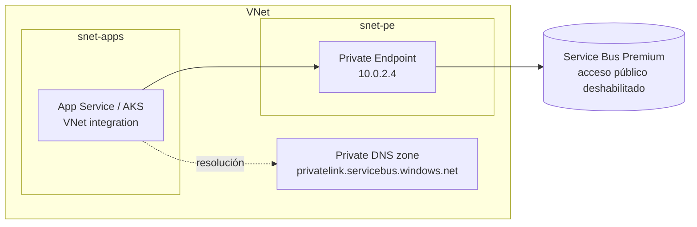

# 05 - Seguridad y performance

> Entra ID, RBAC, red privada y tuning

## Contenido
- [[#Seguridad con Entra ID y RBAC]]
- [[#Private Endpoints]]
- [[#Performance tuning]]

## Seguridad con Entra ID y RBAC
### Dos modelos de autenticación
| | Microsoft Entra ID + RBAC | SAS (Shared Access Signature) |
|---|---|---|
| Credencial | Token OAuth de una identidad (usuario, app, managed identity) | Clave compartida (connection string) |
| Secreto que gestionar | Ninguno con Managed Identity | Sí: rotación, almacenamiento, fugas |
| Granularidad | Rol por identidad y ámbito (namespace, queue, topic, subscription) | Política por namespace o entidad: `Manage`, `Send`, `Listen` |
| Revocación | Quitar el rol a una identidad | Regenerar la clave → rompe a **todos** los que la usan |
| Auditoría | Qué identidad hizo qué | "Alguien con la clave" |
| Recomendación | **Preferente** | Solo cuando Entra ID no es viable |

### Roles integrados
| Rol | Permite | Quién lo necesita |
|---|---|---|
| `Azure Service Bus Data Sender` | Enviar | APIs/productores |
| `Azure Service Bus Data Receiver` | Recibir, settlement, peek | Workers/consumidores |
| `Azure Service Bus Data Owner` | Todo el plano de datos, incluida la gestión de entidades | Pipelines de IaC, herramientas de administración. **Nunca** apps normales |
| `Contributor`/`Owner` (plano de control ARM) | Crear namespaces, cambiar red, SKU | Infraestructura |

**Least privilege**: asigna el rol en el **ámbito más pequeño** posible (la queue o la subscription, no todo el namespace). El worker de Billing solo necesita `Data Receiver` sobre `order-events/subscriptions/billing`.

### Por qué preferir Managed Identity en .NET
1. **No hay secreto** en `appsettings`, variables de entorno, Key Vault ni pipelines: nada que filtrar ni que rotar.
2. Azure emite y renueva los tokens automáticamente; el SDK los refresca solo.
3. Permisos auditables por identidad y revocables sin afectar a otros servicios.
4. El mismo código funciona en local con `DefaultAzureCredential` usando tu `az login` o Visual Studio, y en Azure usando la managed identity.

```csharp
// Mismo código en local y en Azure
var client = new ServiceBusClient("sb-orders-prod.servicebus.windows.net", new DefaultAzureCredential());

// En producción, más explícito y rápido (user-assigned):
var credential = new ManagedIdentityCredential(
    ManagedIdentityId.FromUserAssignedClientId(builder.Configuration["AZURE_CLIENT_ID"]!));
```
> [!tip] System-assigned vs user-assigned
> Una **user-assigned** identity sobrevive a la recreación del recurso y puede compartirse entre réplicas o slots; su asignación de roles se puede definir en IaC antes de desplegar la app. En plataformas con muchos recursos suele ser la opción más práctica.

#### Asignar el rol (CLI)
```bash
PRINCIPAL_ID=$(az identity show -g rg-app -n id-billing-worker --query principalId -o tsv)
SUB_SCOPE=$(az servicebus topic subscription show -g rg-sb --namespace-name sb-orders-prod \
  --topic-name order-events -n billing --query id -o tsv)

az role assignment create --assignee-object-id $PRINCIPAL_ID --assignee-principal-type ServicePrincipal \
  --role "Azure Service Bus Data Receiver" --scope $SUB_SCOPE
```
Las asignaciones de rol pueden tardar unos minutos en propagarse. Un `UnauthorizedAccessException` justo después de asignar suele ser propagación, no configuración.

### Desactivar SAS por completo
Cuando todos los clientes usan Entra ID, desactiva la autenticación local del namespace (`disableLocalAuth: true` en Bicep/ARM). Así, una connection string filtrada deja de servir.

### Si tienes que usar SAS
- Una política por aplicación con el **mínimo** derecho (`Send` o `Listen`, nunca `Manage` en apps).
- Nunca uses `RootManageSharedAccessKey` en aplicaciones.
- Guárdala en **Azure Key Vault** y léela con managed identity (`builder.Configuration.AddAzureKeyVault(...)`).
- Rota con la clave primaria/secundaria: los clientes pasan a la secundaria, regeneras la primaria.
- Para terceros, emite **tokens SAS con caducidad** en lugar de dar la clave.

### Producción: checklist
- [ ] Managed Identity en todas las apps, roles `Data Sender`/`Data Receiver` con ámbito de entidad.
- [ ] `disableLocalAuth = true`.
- [ ] Red restringida: [[05 - Seguridad y performance#Private Endpoints|Private Endpoints]] o firewall IP.
- [ ] TLS mínimo 1.2.
- [ ] Entidades creadas por IaC; la app no tiene `Manage`.
- [ ] Diagnostic settings enviando logs a Log Analytics para auditoría.
- [ ] Datos sensibles fuera del mensaje o cifrados en el body: cualquiera con `Listen` los lee.

### Errores comunes
- `Data Owner` para "que funcione".
- La connection string del emulador o de dev copiada a producción.
- Olvidar que el Administration Client (`QueueExistsAsync` al arrancar) requiere permisos de gestión: la app falla con `Data Sender`. Mueve la creación de entidades a IaC.

### Relación
- [[05 - Seguridad y performance#Private Endpoints|Private Endpoints]] · [[04 - NET y entorno local#Integracion con ASP.NET Core|Integracion con ASP.NET Core]] · [[Troubleshooting - Authorization failures]] · [[06 - Laboratorios#Lab 10 - Managed Identity|Lab 10 - Managed Identity]]
- Docs: [Authenticate with Microsoft Entra ID](https://learn.microsoft.com/azure/service-bus-messaging/service-bus-authentication-and-authorization)

---

## Private Endpoints
*Seguridad de red: Private Endpoints, firewall y servicios de confianza*

### Opciones y tier requerido
| Mecanismo | Qué hace | Tier |
|---|---|---|
| **Private Endpoint (Private Link)** | Da al namespace una IP privada dentro de tu VNet; el tráfico no sale a Internet | **Premium** |
| **VNet service endpoints** | Permite el acceso solo desde subredes concretas | **Premium** |
| **IP firewall** | Lista de IPs/rangos públicos permitidos | Portal: solo Premium. Otros tiers: vía ARM/CLI/PowerShell/REST |
| **Deshabilitar acceso público** | Solo se entra por private endpoint | Premium |
| **Trusted Microsoft services** | Excepción para que ciertos servicios de Azure (p. ej. Event Grid) entren aunque haya restricciones de red | Con reglas de red |

Fuente: [Premium messaging - network security](https://learn.microsoft.com/azure/service-bus-messaging/service-bus-premium-messaging)

### Arquitectura típica en producción

El cliente sigue usando `sb-orders-prod.servicebus.windows.net`. La **zona DNS privada** hace que ese nombre resuelva a la IP privada. Si el DNS está mal, el cliente resuelve la IP pública, el firewall lo rechaza y ves errores de conexión o de autorización difíciles de interpretar.

### Puertos
- AMQP: **5671** (TLS). Algunos entornos necesitan también 5672. [Probable]
- AMQP sobre WebSockets: **443**. Úsalo (`ServiceBusTransportType.AmqpWebSockets`) si un proxy o firewall corporativo solo permite HTTPS.

### Diagnóstico rápido
```bash
nslookup sb-orders-prod.servicebus.windows.net   # desde dentro de la VNet: debe devolver 10.x.x.x
```

### Relación
- [[05 - Seguridad y performance#Seguridad con Entra ID y RBAC|Seguridad con Entra ID y RBAC]] · [[Tiers y facturacion]] · [[Troubleshooting - Connection failures]]

---

## Performance tuning
### Primero: ¿dónde está el cuello de botella?
En la mayoría de sistemas **no es Service Bus**, sino el handler: la BD, la API externa, la serialización. Mide la duración del handler antes de tocar ningún parámetro.

Throughput de consumo ≈ `instancias × concurrencia por instancia / duración media del handler`

Ejemplo: 4 pods × `MaxConcurrentCalls` 16 / 200 ms = **320 msg/s**. Para duplicarlo puedes duplicar pods, duplicar concurrencia o reducir la duración a la mitad, **siempre que la BD aguante** 2× de carga.

### Palancas
| Palanca | Mejora | Coste / riesgo |
|---|---|---|
| **Reutilizar clientes** (singleton) | Latencia, conexiones | Ninguno. Obligatorio |
| **Batching al enviar** (`ServiceBusMessageBatch`) | Throughput de envío, menos round-trips | Latencia del primer mensaje; batch atómico |
| **`MaxConcurrentCalls`** | Throughput de consumo | Presión sobre dependencias; menos orden |
| **`PrefetchCount`** | Menos round-trips al recibir | Locks que corren en el buffer local; memoria; mensajes perdidos con ReceiveAndDelete |
| **Escalar instancias** (competing consumers) | Throughput lineal hasta la dependencia | Coste de cómputo |
| **Mensajes pequeños** | Throughput y coste (bloques de 64 KB en Standard) | Diseño de contratos / claim-check |
| **Premium + más messaging units** | Throughput predecible, sin vecinos ruidosos | Coste fijo por hora |
| **Partitioning** | Paraleliza el broker | Sin orden global; ciertas limitaciones en DD y transacciones |

### Prefetch: la trampa clásica
Con prefetch, el broker **bloquea** mensajes y los envía al buffer local antes de que tu código los pida. El reloj del lock corre mientras esperan.
```
PrefetchCount = 500, MaxConcurrentCalls = 10, handler = 1 s, LockDuration = 60 s
→ el mensaje 500 espera ~50 s en buffer antes de empezar
→ si el handler tarda >10 s, el lock expira antes de terminar → MessageLockLost → reentrega
```
Guía de Microsoft: el tamaño de prefetch debe ser menor que el número de mensajes que el cliente puede consumir dentro del lock. Con el lock por defecto de 60 s, una referencia es **unas 20 veces la tasa de procesamiento** por segundo de los receptores. [Probable: la guía original se escribió para el SDK antiguo; los principios siguen valiendo]

```csharp
// Handler rápido (~50 ms), alto volumen
new ServiceBusProcessorOptions { MaxConcurrentCalls = 32, PrefetchCount = 200 };

// Handler lento (~5 s), llamadas a API externa
new ServiceBusProcessorOptions { MaxConcurrentCalls = 8, PrefetchCount = 0,
                                 MaxAutoLockRenewalDuration = TimeSpan.FromMinutes(5) };
```
Con [[03 - Confiabilidad y manejo de errores#Sessions|Sessions]], prefetch tiene todavía menos sentido: aumenta el riesgo sin mucho beneficio.

### Trade-offs
| Si subes... | Ganas | Pierdes |
|---|---|---|
| Concurrencia | Throughput | Orden, presión sobre la BD, más memoria |
| Prefetch | Throughput, menor latencia por mensaje | Riesgo de lock perdido, memoria, pérdida en crash (R&D) |
| Tamaño de batch al enviar | Throughput | Latencia; si el batch falla, fallan todos |
| Ventana de [[03 - Confiabilidad y manejo de errores#Duplicate Detection|Duplicate Detection]] | Protección ante reintentos tardíos | Throughput del broker |
| Número de sesiones activas | Paralelismo | Complejidad; hot sessions siguen en serie |
| `LockDuration` | Margen para handlers lentos | Recuperación más lenta tras un crash |

### Standard vs Premium en rendimiento
- **Standard**: capacidad compartida, throughput variable. Bajo carga, verás **throttling** (`ServiceBusy`); el SDK lo reintenta, pero la latencia sube.
- **Premium**: messaging units dedicadas (1, 2, 4, 8, 16). Microsoft recomienda escalar **por encima del 75 % de CPU** o **del 60 % de memoria**, y reducir **por debajo del 25 % de CPU**. Existe autoscale de MUs.
- Mensajes grandes (> 1 MB en Premium) reducen throughput y no admiten batching.

### Escalar consumidores automáticamente
- **KEDA** (AKS / Azure Container Apps) con el scaler `azure-servicebus`: escala réplicas según la longitud de la cola o subscription. Es el patrón habitual para workers .NET en contenedores.
- **Azure Functions** con el trigger de Service Bus escala por sí sola.
- Métrica: `ActiveMessages` y, sobre todo, **la antigüedad del mensaje más viejo**. Una cola larga que se vacía rápido no es un problema; una cola corta con mensajes viejos, sí.

### Relación
- [[04 - NET y entorno local#ServiceBusProcessor|ServiceBusProcessor]] · [[02 - Queues y Topics#Message Lock y Lock Renewal|Message Lock y Lock Renewal]] · [[Tiers y facturacion]] · [[Metricas clave]] · [[Troubleshooting - Consumer slow]]
- Docs: [Best practices for performance](https://learn.microsoft.com/azure/service-bus-messaging/service-bus-performance-improvements)
