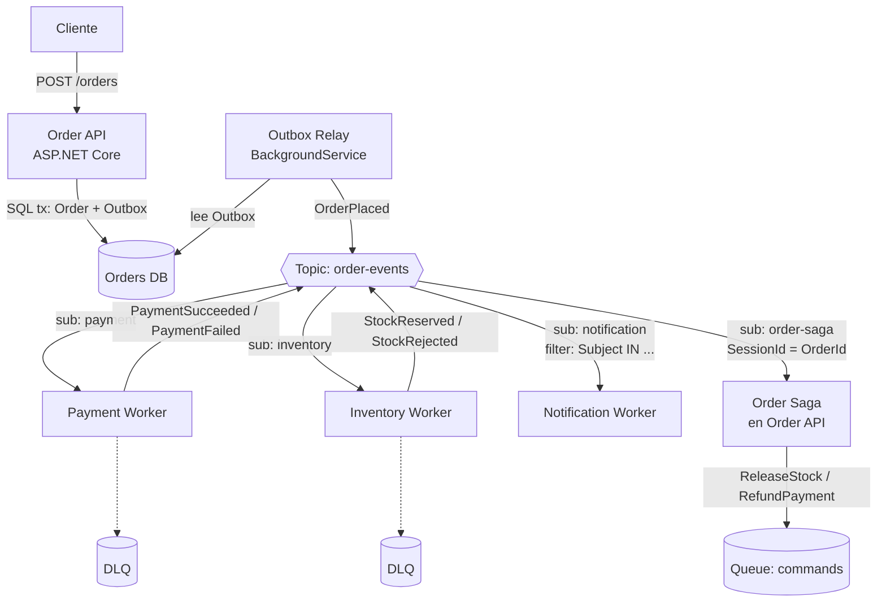

# 06 - Laboratorios

> Labs 01-10 y proyecto final

## Contenido
- [[#Lab 01 - Namespace y Queue]]
- [[#Lab 02 - Enviar mensajes desde NET]]
- [[#Lab 03 - Consumir mensajes desde NET]]
- [[#Lab 04 - BackgroundService]]
- [[#Lab 05 - Topics y Subscriptions]]
- [[#Lab 06 - Filters]]
- [[#Lab 07 - Dead Letter Queue]]
- [[#Lab 08 - Retry]]
- [[#Lab 09 - Sessions]]
- [[#Lab 10 - Managed Identity]]
- [[#Proyecto final]]

## Lab 01 - Namespace y Queue
*Lab 01 — Crear Namespace y Queue (CLI + Bicep)*

### Objetivo
Crear la infraestructura de forma **reproducible**. Clicar en el portal no cuenta: en producción nadie lo hace así.

### Prerrequisitos
Azure CLI, una suscripción y `az login`. Alternativa sin coste: [[04 - NET y entorno local#Emulador local|Emulador local]] (salta al paso 4).

### Paso 1 — CLI
```bash
RG=rg-sb-labs; NS=sb-labs-$RANDOM; LOC=westeurope
az group create -n $RG -l $LOC
az servicebus namespace create -g $RG -n $NS --sku Standard -l $LOC
az servicebus queue create -g $RG --namespace-name $NS -n orders \
  --lock-duration PT1M --max-delivery-count 5 \
  --enable-dead-lettering-on-message-expiration true \
  --enable-duplicate-detection true --duplicate-detection-history-time-window PT10M
echo "$NS.servicebus.windows.net"
```

### Paso 2 — El mismo recurso en Bicep (`main.bicep`)
```bicep
param location string = resourceGroup().location
param namespaceName string

resource ns 'Microsoft.ServiceBus/namespaces@2022-10-01-preview' = {
  name: namespaceName
  location: location
  sku: { name: 'Standard', tier: 'Standard' }
  properties: {
    minimumTlsVersion: '1.2'
    disableLocalAuth: false   // Lab 10 lo pondrá a true
  }
}

resource orders 'Microsoft.ServiceBus/namespaces/queues@2022-10-01-preview' = {
  parent: ns
  name: 'orders'
  properties: {
    lockDuration: 'PT1M'
    maxDeliveryCount: 5
    deadLetteringOnMessageExpiration: true
    requiresDuplicateDetection: true
    duplicateDetectionHistoryTimeWindow: 'PT10M'
  }
}
```
> Usa la API version más reciente disponible (revisa la [referencia de plantillas](https://learn.microsoft.com/azure/templates/microsoft.servicebus/namespaces/queues)); la del ejemplo puede haberse quedado atrás.

```bash
az deployment group create -g $RG -f main.bicep -p namespaceName=$NS
```

### Paso 3 — Comprobar inmutabilidad
Cambia en Bicep `requiresDuplicateDetection: false` y vuelve a desplegar. Anota qué ocurre y relaciónalo con [[01 - Fundamentos y arquitectura#Namespace y entidades|Namespace y entidades]].

### Paso 4 — Explorar
Portal → namespace → *Service Bus Explorer*. Envía un mensaje manual, haz *peek* y observa `SequenceNumber`, `EnqueuedTime` y `DeliveryCount`.

### Verificación
- [ ] Puedes recrear todo desde cero con un comando.
- [ ] Sabes qué propiedades no se pueden cambiar después.

### Limpieza
`az group delete -n $RG --yes --no-wait`

---

## Lab 02 - Enviar mensajes desde NET
*Lab 02 — Enviar mensajes desde .NET*

### Setup
```bash
dotnet new console -n Lab02.Sender && cd Lab02.Sender
dotnet add package Azure.Messaging.ServiceBus
dotnet add package Azure.Identity
# Tu usuario necesita el rol "Azure Service Bus Data Sender" sobre la queue (ver Lab 10)
```

### Código
```csharp
using Azure.Identity;
using Azure.Messaging.ServiceBus;

var ns = args[0]; // sb-labs-xxxx.servicebus.windows.net
await using var client = new ServiceBusClient(ns, new DefaultAzureCredential());
ServiceBusSender sender = client.CreateSender("orders");

// 1. Un mensaje con metadatos completos
var orderId = Guid.NewGuid();
await sender.SendMessageAsync(new ServiceBusMessage(BinaryData.FromObjectAsJson(new { orderId, total = 99.5m }))
{
    MessageId = $"order-{orderId}-placed",
    CorrelationId = orderId.ToString(),
    Subject = "OrderPlaced",
    ContentType = "application/json",
    ApplicationProperties = { ["schema-version"] = 1 }
});

// 2. Lote de 1 000 con ServiceBusMessageBatch
var pending = new Queue<ServiceBusMessage>(Enumerable.Range(1, 1000).Select(i =>
    new ServiceBusMessage(BinaryData.FromObjectAsJson(new { i })) { MessageId = $"bulk-{i}" }));
int batches = 0;
while (pending.Count > 0)
{
    using ServiceBusMessageBatch batch = await sender.CreateMessageBatchAsync();
    while (pending.Count > 0 && batch.TryAddMessage(pending.Peek())) pending.Dequeue();
    await sender.SendMessagesAsync(batch);
    batches++;
}
Console.WriteLine($"1000 mensajes en {batches} lotes");

// 3. Programado y cancelado
long seq = await sender.ScheduleMessageAsync(
    new ServiceBusMessage("reminder") { MessageId = "reminder-1" }, DateTimeOffset.UtcNow.AddMinutes(10));
await sender.CancelScheduledMessageAsync(seq);

// 4. Experimento de duplicate detection
for (int i = 0; i < 3; i++)
    await sender.SendMessageAsync(new ServiceBusMessage("dup") { MessageId = "same-id" });
```

### Experimentos
1. Tras el paso 4, ¿cuántos mensajes `same-id` hay en la queue? ¿Alguno de los envíos lanzó excepción? → [[03 - Confiabilidad y manejo de errores#Duplicate Detection|Duplicate Detection]]
2. Intenta enviar un mensaje de 300 KB en Standard. Anota la excepción y su `Reason`.
3. Mide el tiempo de enviar 1 000 mensajes uno a uno frente a hacerlo por lotes.
4. Crea un `ServiceBusClient` dentro del bucle y mide otra vez. Explica la diferencia.

### Verificación
- [ ] Sabes explicar por qué `MessageId` debe ser determinista.
- [ ] Sabes por qué `ServiceBusMessageBatch` es mejor que `SendMessagesAsync(List<>)`.

---

## Lab 03 - Consumir mensajes desde NET
*Lab 03 — Consumir mensajes desde .NET*

### Parte A — Receiver manual y Peek-Lock
```csharp
await using var client = new ServiceBusClient(ns, new DefaultAzureCredential());
ServiceBusReceiver receiver = client.CreateReceiver("orders");

var msg = await receiver.ReceiveMessageAsync(TimeSpan.FromSeconds(5));
Console.WriteLine($"{msg.MessageId} delivery={msg.DeliveryCount} lockedUntil={msg.LockedUntil:T}");
Console.WriteLine("Pulsa C para completar, A para abandonar, K para matar el proceso");
switch (Console.ReadKey().Key)
{
    case ConsoleKey.C: await receiver.CompleteMessageAsync(msg); break;
    case ConsoleKey.A: await receiver.AbandonMessageAsync(msg); break;
    case ConsoleKey.K: Environment.FailFast("crash simulado"); break;
}
```

### Experimentos
1. **Abandon** 5 veces seguidas el mismo mensaje. Con `MaxDeliveryCount = 5`, ¿dónde está ahora? → [[03 - Confiabilidad y manejo de errores#Dead Letter Queue|Dead Letter Queue]]
2. **Crash** (K): vuelve a ejecutar inmediatamente. ¿Recibes el mensaje? ¿Y pasado 1 minuto? ¿Qué `DeliveryCount` tiene?
3. **Lock perdido**: recibe, espera 70 s (`LockDuration` = 60 s) y llama a `Complete`. Captura la `ServiceBusException` e imprime `Reason`.
4. **ReceiveAndDelete**: crea un receiver con `ReceiveMode = ReceiveAndDelete`, recibe y mata el proceso. ¿Dónde está el mensaje?

### Parte B — Processor
```csharp
var processor = client.CreateProcessor("orders", new ServiceBusProcessorOptions
{ MaxConcurrentCalls = 1, AutoCompleteMessages = false });
var sw = System.Diagnostics.Stopwatch.StartNew(); int count = 0;

processor.ProcessMessageAsync += async a =>
{
    await Task.Delay(100);              // simula trabajo
    await a.CompleteMessageAsync(a.Message);
    if (Interlocked.Increment(ref count) % 100 == 0)
        Console.WriteLine($"{count} msgs, {count / sw.Elapsed.TotalSeconds:F1} msg/s");
};
processor.ProcessErrorAsync += a => { Console.WriteLine(a.Exception.Message); return Task.CompletedTask; };
await processor.StartProcessingAsync();
Console.ReadKey();
await processor.StopProcessingAsync();
```
5. Envía 1 000 mensajes (Lab 02) y mide con `MaxConcurrentCalls` = 1, 10 y 50. ¿La mejora es lineal? ¿Por qué deja de serlo?

### Verificación
- [ ] Has visto un duplicado real (experimentos 2-3) y puedes explicarlo con [[03 - Confiabilidad y manejo de errores#At-least-once delivery|At-least-once delivery]].

---

## Lab 04 - BackgroundService
*Lab 04 — Worker con BackgroundService*

### Objetivo
Llevar el processor a un host .NET real con DI, options, scopes por mensaje, logging estructurado y **graceful shutdown**.

### Setup
```bash
dotnet new worker -n Lab04.Worker && cd Lab04.Worker
dotnet add package Azure.Messaging.ServiceBus
dotnet add package Azure.Identity
dotnet add package Microsoft.Extensions.Azure
```
Implementa el `OrderWorker` de [[04 - NET y entorno local#Integracion con ASP.NET Core|Integracion con ASP.NET Core]] tal cual y añade un `IOrderHandler` scoped que haga `await Task.Delay(TimeSpan.FromSeconds(20), ct)`.

### Experimentos de apagado
1. Envía 20 mensajes, arranca el worker y pulsa **Ctrl+C** a los 5 s.
   - ¿Los handlers en curso terminan? ¿Cuánto tarda el proceso en salir?
   - ¿Qué pasa con los mensajes que estaban en curso? Consulta `DeliveryCount` al reiniciar.
2. Pon `HostOptions.ShutdownTimeout = 5 s`. Repite. ¿Qué cambia?
3. Quita la sobrescritura de `StopAsync`. Repite. ¿Qué cambia?
4. Haz que el handler **ignore** el `CancellationToken`. Repite con el timeout de 5 s.

### Experimento de dependencias
5. Inyecta un `DbContext` (o cualquier servicio scoped) directamente en el constructor del `BackgroundService`. ¿Qué error obtienes al arrancar? ¿Por qué es la validación de scopes la que te protege?

### Entregable
Una tabla con los 4 escenarios de apagado: tiempo de salida, mensajes reentregados y conclusión.

### Verificación
- [ ] Puedes explicar la relación entre `ShutdownTimeout`, `StopProcessingAsync` y `terminationGracePeriodSeconds` en Kubernetes.

---

## Lab 05 - Topics y Subscriptions
*Lab 05 — Topics y Subscriptions*

### Infraestructura
```bash
az servicebus topic create -g $RG --namespace-name $NS -n order-events
for s in email inventory billing; do
  az servicebus topic subscription create -g $RG --namespace-name $NS --topic-name order-events -n $s --max-delivery-count 5
done
```

### Programa
- Un productor que publique 10 `OrderPlaced` en `order-events`.
- Tres procesadores (`email`, `inventory`, `billing`) en el mismo programa, cada uno imprimiendo `[{sub}] {MessageId}`.

### Experimentos
1. ¿Cuántas veces se procesa cada pedido en total? ¿Y por subscription?
2. Arranca **dos** procesadores sobre `billing`. ¿Se reparten los mensajes o los duplican?
3. Para el procesador de `inventory`, publica 10 más y mira el *Active message count* de cada subscription en el portal. ¿Se ven afectadas las demás?
4. Crea una subscription nueva `analytics` **después** de publicar. ¿Recibe los mensajes antiguos?
5. Borra todas las subscriptions y publica. ¿`SendMessageAsync` falla? ¿Dónde está el mensaje?

### Verificación
- [ ] Puedes dibujar la diferencia entre pub/sub (entre subscriptions) y competing consumers (dentro de una) → [[02 - Queues y Topics#Topics y Subscriptions|Topics y Subscriptions]].

---

## Lab 06 - Filters
*Lab 06 — Filters y Rules*

### Objetivo
Enrutar por propiedades y caer (a propósito) en las trampas de `$Default` y de tipos.

### Pasos
1. Crea con `ServiceBusAdministrationClient`:
   - `high-value-eu`: SQL filter `user.region = 'EU' AND user.total > 1000`.
   - `notifications`: dos correlation filters, `Subject = OrderConfirmed` y `Subject = OrderCancelled`.
   - `audit`: sin regla explícita.
2. Publica una matriz de mensajes: regiones EU/US × totales 500/5000 × Subjects Placed/Confirmed/Cancelled.
3. Antes de ejecutar, **predice** cuántos mensajes llegará a cada subscription. Luego comprueba.

### Trampas intencionadas
4. Crea `wrong` **sin** regla y después añade una regla SQL con `CreateRuleAsync`. ¿Cuántos mensajes recibe? Lista sus reglas con `GetRulesAsync`. → `$Default`
5. Publica `total` como **string** (`"5000"`). ¿Coincide con `user.total > 1000`?
6. Pon la región en el **body** en lugar de en `ApplicationProperties`. ¿Funciona el filtro?

### Extra
7. Añade una `SqlRuleAction` que haga `SET user.routedBy = 'filter-lab'` y comprueba que solo aparece en esa subscription.

### Verificación
- [ ] Tu predicción coincidió con el resultado (o sabes explicar por qué no) → [[02 - Queues y Topics#Filters y Rules|Filters y Rules]].

---

## Lab 07 - Dead Letter Queue
*Lab 07 — Dead Letter Queue*

### Objetivo
Producir mensajes en la DLQ por **cada** vía, construir una herramienta de reprocesado y comprobar la interacción con duplicate detection.

### Parte A — Llenar la DLQ por todas las causas
| Causa | Cómo provocarla |
|---|---|
| `MaxDeliveryCountExceeded` | Handler que siempre lanza excepción |
| Expiración | `TimeToLive = 10 s`, sin consumidor, con `DeadLetteringOnMessageExpiration = true`; espera y haz peek de la DLQ |
| Expiración sin DLQ | Igual pero con la opción desactivada en otra queue: ¿dónde está el mensaje? |
| Explícita | Handler que llama a `DeadLetterMessageAsync(msg, "ValidationFailed", "total negativo")` |

### Parte B — Inspector
Programa que haga peek de la DLQ y agrupe por `DeadLetterReason` con recuento (código en [[03 - Confiabilidad y manejo de errores#Dead Letter Queue|Dead Letter Queue]]).

### Parte C — Reprocesado filtrado
Implementa `ResubmitAsync(queue, reason, max)`:
1. Reprocesa solo `ValidationFailed` **inmediatamente**. ¿Llegan a la queue? (DD con ventana de 10 min)
2. Espera a que pase la ventana y repite. ¿Y ahora?
3. Cambia la herramienta para que haga Send + Complete dentro de una transacción (`EnableCrossEntityTransactions`). ¿Qué problema resuelve?

### Parte D — Alerta
Crea una alerta de Azure Monitor sobre `DeadletteredMessages > 0` en la queue (portal o CLI) y compruébala.

### Verificación
- [ ] Sabes explicar por qué un mensaje expirado no fue a la DLQ en una de las queues.
- [ ] Sabes qué ocurre al reprocesar dentro de la ventana de DD.

---

## Lab 08 - Retry
*Lab 08 — Retry y backoff*

### Objetivo
Ver la retry storm con tus propios ojos y sustituirla por un diseño controlado.

### Setup
Una API falsa (`dotnet new web`) con un endpoint que devuelve 503 cuando existe el fichero `down.flag` y lleva la cuenta de las llamadas recibidas.

### Parte A — La tormenta
Consumidor con:
- Polly: 5 reintentos, sin jitter.
- `HttpClient` con el resilience handler estándar (3 reintentos).
- Abandon en caso de error. Queue con `MaxDeliveryCount = 10`.

Crea `down.flag`, envía 100 mensajes y cuenta las llamadas que recibe la API. Compara con la fórmula de [[03 - Confiabilidad y manejo de errores#Retry Policies|Retry Policies]].

### Parte B — Diseño controlado
1. Quita los reintentos de Polly salvo 1 corto.
2. Clasifica errores: 4xx permanentes → DeadLetter; 5xx → reprogramar con backoff exponencial (10 s, 20 s, 40 s…) y `retry-count`.
3. Circuit breaker: tras N fallos seguidos, `StopProcessingAsync` durante 60 s y luego `StartProcessingAsync`.
4. Repite el experimento: borra `down.flag` a los 2 minutos. ¿Cuántos mensajes acabaron en DLQ? ¿Cuántas llamadas recibió la API?

### Entregable
Tabla: llamadas a la API, mensajes en DLQ y tiempo total hasta vaciar la cola, en las partes A y B.

---

## Lab 09 - Sessions
*Lab 09 — Sessions*

### Infraestructura
```bash
az servicebus queue create -g $RG --namespace-name $NS -n order-lifecycle --enable-session true
```

### Parte A — Demostrar el desorden sin sesiones
Queue normal `order-lifecycle-nosession`. Por cada uno de 50 pedidos envía `Created`, `Paid`, `Shipped` en orden. El consumidor usa `MaxConcurrentCalls = 10` y un `Task.Delay` aleatorio de 0-500 ms, y registra el orden en que procesa cada pedido. ¿Cuántos pedidos se procesaron desordenados?

### Parte B — Con sesiones
Mismo experimento con `SessionId = order-{id}` y `ServiceBusSessionProcessor` con `MaxConcurrentSessions = 10`, `MaxConcurrentCallsPerSession = 1`. ¿Cuántos desordenados ahora?

### Parte C — Session state
Guarda en el session state el último estado aplicado. Si llega un evento que no toca (p. ej. `Shipped` sin `Paid`), llévalo a la DLQ con razón `InvalidTransition`.

### Parte D — Casos límite
1. Envía un mensaje **sin** `SessionId` a la queue con sesiones. ¿Qué ocurre?
2. `MaxConcurrentCallsPerSession = 3`. ¿Se mantiene el orden?
3. Hot session: 1 000 mensajes para `order-1` y 10 para otros 100 pedidos. Mide cuánto tarda cada grupo.
4. Pon un mensaje venenoso al principio de una sesión. ¿Qué pasa con los demás mensajes de esa sesión?

### Verificación
- [ ] Puedes explicar cuándo las sesiones ayudan y cuándo son un cuello de botella → [[03 - Confiabilidad y manejo de errores#Sessions|Sessions]].

---

## Lab 10 - Managed Identity
*Lab 10 — Managed Identity y cero secretos*

### Objetivo
Desplegar el worker del Lab 04 en Azure sin **ninguna** connection string, con el mínimo privilegio, y desactivar SAS en el namespace.

### Pasos
1. Crea una user-assigned identity:
```bash
az identity create -g $RG -n id-orders-worker
```
2. Asigna `Azure Service Bus Data Receiver` **solo** sobre la queue `orders` (script en [[05 - Seguridad y performance#Seguridad con Entra ID y RBAC|Seguridad con Entra ID y RBAC]]).
3. Despliega el worker en **Azure Container Apps** (o App Service) con esa identidad y la variable `AZURE_CLIENT_ID`.
4. En el código, usa `ManagedIdentityCredential` con el client id en producción y `DefaultAzureCredential` en desarrollo.
5. En Bicep, pon `disableLocalAuth: true` y redespliega el namespace.

### Pruebas negativas (las importantes)
| Prueba | Resultado esperado |
|---|---|
| El worker intenta **enviar** a `orders` | Error de autorización: solo tiene Receiver |
| El worker intenta leer otra queue | Error de autorización: el ámbito es la queue |
| Una connection string SAS antigua tras `disableLocalAuth` | Rechazada |
| El worker llama a `QueueExistsAsync` al arrancar | Error: sin permisos de gestión. Muévelo a IaC |
| Quitas el rol y esperas | Deja de recibir (tras propagación y caducidad del token) |

### Verificación
- [ ] `grep -ri "SharedAccessKey" .` en el repo no devuelve nada de producción.
- [ ] Puedes explicar por qué Managed Identity es preferible a una connection string guardada en Key Vault.

---

## Proyecto final
*Proyecto final — Sistema de pedidos con Service Bus*

### Objetivo
Demostrar que puedes **diseñar, implementar, depurar y defender** un sistema basado en Service Bus. El proyecto no se aprueba por funcionar en el camino feliz; se aprueba por sobrevivir a los fallos inyectados del final.

### Arquitectura


### Requisitos funcionales
1. `POST /orders` devuelve `202 Accepted` + `Location: /orders/{id}`.
2. Payment e Inventory reaccionan a `OrderPlaced` en paralelo.
3. La saga (coreografía o un orquestador ligero, justifica la elección) confirma el pedido si ambos tienen éxito y compensa si uno falla.
4. Notification envía (simula) emails en `OrderConfirmed` y `OrderCancelled` usando un **SQL o Correlation filter**.

### Requisitos no funcionales (lo que se evalúa)
| # | Requisito | Nota de referencia |
|---|---|---|
| 1 | Managed Identity / `DefaultAzureCredential`, cero secretos en config | [[05 - Seguridad y performance#Seguridad con Entra ID y RBAC|Seguridad con Entra ID y RBAC]] |
| 2 | Outbox transaccional en Order API | [[Outbox Pattern]] |
| 3 | Todos los consumidores idempotentes (tabla de procesados) | [[03 - Confiabilidad y manejo de errores#Idempotent Consumer|Idempotent Consumer]] |
| 4 | Errores permanentes → DeadLetter con razón; transitorios → backoff | [[02 - Queues y Topics#Message Settlement|Message Settlement]], [[03 - Confiabilidad y manejo de errores#Retry Policies|Retry Policies]] |
| 5 | Orden por pedido en la saga mediante sessions | [[03 - Confiabilidad y manejo de errores#Sessions|Sessions]] |
| 6 | Graceful shutdown probado | [[04 - NET y entorno local#Integracion con ASP.NET Core|Integracion con ASP.NET Core]] |
| 7 | Trazas distribuidas API → workers en Application Insights | [[Observabilidad con Application Insights]] |
| 8 | Alertas en DLQ > 0 y ActiveMessages creciendo | [[Metricas clave]] |
| 9 | Infraestructura en Bicep o Terraform | [[06 - Laboratorios#Lab 01 - Namespace y Queue|Lab 01 - Namespace y Queue]] |
| 10 | Herramienta de reprocesado de DLQ filtrando por razón | [[03 - Confiabilidad y manejo de errores#Dead Letter Queue|Dead Letter Queue]] |

### Pruebas de caos obligatorias (documenta el resultado de cada una)
1. Mata el Payment Worker (`kill -9`) a mitad de un mensaje → ¿se cobra dos veces?
2. Pon `LockDuration = 30s` y un `Task.Delay(45s)` en Inventory sin renovación → ¿qué ves en logs y métricas?
3. Apaga la BD de Orders 2 minutos → ¿se pierde algún evento?
4. Publica un mensaje con JSON inválido → ¿termina en DLQ con razón correcta y alerta?
5. Envía 5 000 pedidos → ¿qué `MaxConcurrentCalls` y cuántas réplicas necesitas? ¿dónde está el cuello de botella?
6. Reprocesa la DLQ dentro de la ventana de duplicate detection → explica lo que ocurre.

### Entregables
- Repositorio con `src/` (API + 3 workers + shared contracts), `infra/`, `tests/`.
- `ARCHITECTURE.md` con decisiones (ADR breves): queue vs topic, coreografía vs orquestación, Standard vs Premium, tamaño de ventana de DD.
- Demo de 10 minutos explicando **un fallo** y cómo el diseño lo absorbe.

### Desarrollo local
[[04 - NET y entorno local#Emulador local|Emulador local]] (Docker) para el ciclo rápido; Azure real para Managed Identity y métricas.
