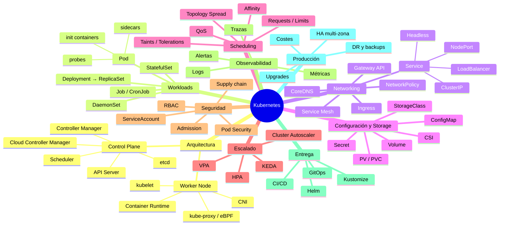
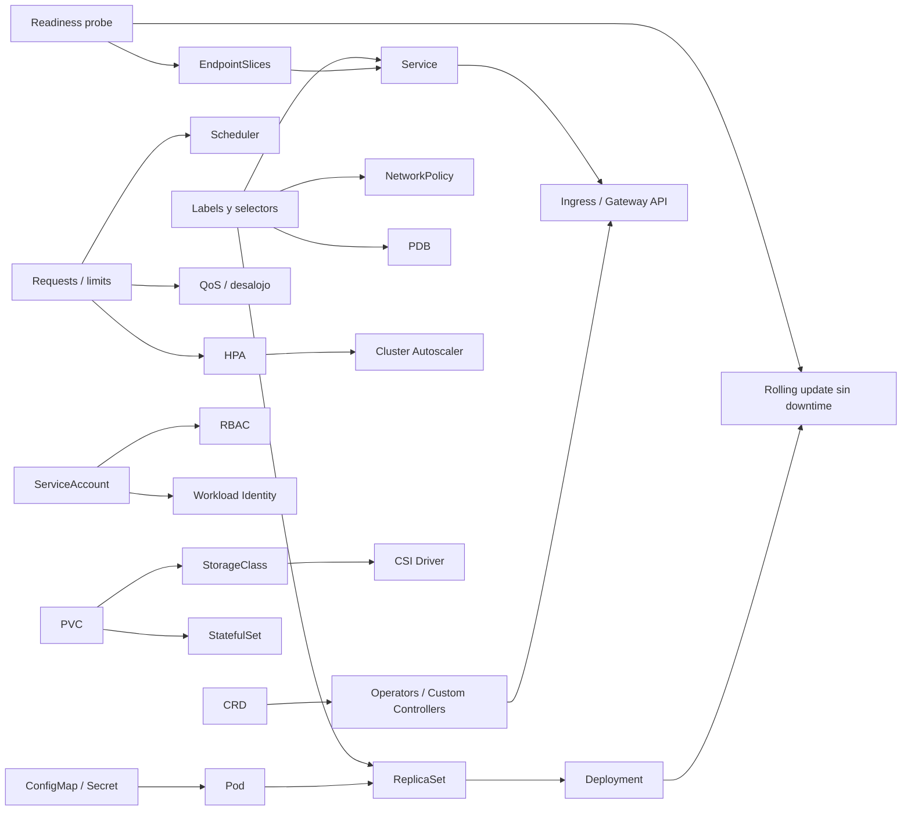

# ☸️ 00 - Kubernetes - Índice

> Sistema de aprendizaje de Kubernetes orientado a un perfil **Senior / Cloud Architect con .NET**: de los fundamentos a producción, con laboratorios, troubleshooting, preguntas de entrevista y trade-offs.

## Contenido
- [[#🧭 Cómo usar estas notas]]
- [[#🧭 Nueva estructura]]
- [[#🗺️ Mapa conceptual]]
- [[#📈 Roadmap]]
- [[#📚 Notas de referencia por concepto]]

---

## 🧭 Cómo usar estas notas

| Tipo de nota | Para qué | Ejemplos |
|---|---|---|
| **Capítulos numerados** (`02`-`21`) | **Aprender en orden**: concepto → por qué → cuándo → YAML → qué pasa dentro → errores → entrevista → práctica | [[02 - Fundamentos y arquitectura]] |
| **Notas por concepto** (sin número) | **Referencia rápida** de un objeto concreto. Son las notas originales, auditadas y corregidas | [[Workloads]], [[Networking]], [[Secret]] |
| **Laboratorios, troubleshooting, entrevista** | Practicar, diagnosticar y prepararse | [[15 - Laboratorios]], [[16 - Troubleshooting]], [[17 - Interview mode]] |

> [!info] Punto de partida
> - ¿Qué cambió respecto a las notas originales? → [[01 - Auditoría de las notas]]
> - ¿Por dónde empiezo? → [[#📈 Roadmap]]
> - Requisito previo: contenedores con Docker → [[Docker - Índice]]

---

## 🧭 Nueva estructura

| # | Capítulo | Bloque | Nivel |
|---|---|---|---|
| 01 | [[01 - Auditoría de las notas]] | Auditoría e información faltante | — |
| 02 | [[02 - Fundamentos y arquitectura]] | Qué es, problemas que resuelve, Docker/Compose vs K8s, arquitectura, API, declarativo | 🟢 Fundamentos |
| 03 | [[03 - Objetos y workloads]] | Namespaces, labels, Pod, init/sidecars, Deployment, StatefulSet, DaemonSet, Job, CronJob | 🟢 Fundamentos |
| 04 | [[04 - Networking y tráfico]] | Modelo de red, Services, DNS/CoreDNS, flujos, Ingress, Gateway API, NetworkPolicy | 🔵 Intermedio |
| 05 | [[05 - Configuración y almacenamiento]] | ConfigMap, Secret, variables, volúmenes, PV/PVC/StorageClass/CSI | 🔵 Intermedio |
| 06 | [[06 - Scheduling y recursos]] | Requests/limits, QoS, quotas, affinity, taints, spread, prioridades | 🔵 Intermedio |
| 07 | [[07 - Salud, fiabilidad y despliegues]] | Probes, self-healing, rolling update, rollback, PDB, estrategias | 🔵 Intermedio |
| 08 | [[08 - Escalado]] | Metrics Server, HPA, KEDA, VPA, Cluster Autoscaler | 🟣 Avanzado |
| 09 | [[09 - Seguridad]] | AuthN, RBAC, ServiceAccounts, admisión, Pod Security, securityContext, supply chain | 🟣 Avanzado |
| 10 | [[10 - Observabilidad]] | Logs, métricas, trazas, eventos, Prometheus, Grafana, OpenTelemetry, alertas | 🟣 Avanzado |
| 11 | [[11 - Helm, Kustomize y CI-CD]] | Helm avanzado, Kustomize, pipelines, GitOps | 🟣 Avanzado |
| 12 | [[12 - Kubernetes en la nube]] | AKS vs EKS vs GKE, node pools, Workload Identity, red, storage | 🟠 Producción |
| 13 | [[13 - Kubernetes para .NET]] | ASP.NET Core en Kubernetes de principio a fin | 🟠 Producción |
| 14 | [[14 - Arquitecturas reales]] | Básica, microservicios, plataforma multi-equipo | 🟠 Producción |
| 15 | [[15 - Laboratorios]] | 11 laboratorios con kind/minikube/Helm | 🧪 Práctica |
| 16 | [[16 - Troubleshooting]] | 17 escenarios: síntoma → causa → comandos → solución | 🛠️ Práctica |
| 17 | [[17 - Interview mode]] | 26 preguntas Junior → Staff | 🎯 Entrevista |
| 18 | [[18 - Trade-offs]] | 11 comparativas con impacto en complejidad, coste y operación | ⚖️ Arquitectura |
| 19 | [[19 - Kubernetes en producción]] | HA, DR, backups, actualizaciones, capacidad, costes | 🏗️ Producción |
| 20 | [[20 - Proyecto final]] | ShopK8s: microservicios .NET en 10 fases | 🚀 Proyecto |
| 21 | [[21 - Roadmap y checklist]] | Roadmap de 10 niveles y checklist final | 📈 Plan |

---

## 🗺️ Mapa conceptual

### Cómo dependen los conceptos entre sí

---

## 📈 Roadmap

| Nivel | Tema | Capítulos | Laboratorio |
|---|---|---|---|
| 1 | Fundamentos | [[02 - Fundamentos y arquitectura]] | Lab 01 |
| 2 | Workloads | [[03 - Objetos y workloads]] · [[06 - Scheduling y recursos]] · [[07 - Salud, fiabilidad y despliegues]] | Lab 02, 05 |
| 3 | Networking | [[04 - Networking y tráfico]] | Lab 03 |
| 4 | Storage | [[05 - Configuración y almacenamiento]] | Lab 04 |
| 5 | Security | [[09 - Seguridad]] | Lab 08 |
| 6 | Scaling | [[08 - Escalado]] | Lab 06, 07 |
| 7 | Observability | [[10 - Observabilidad]] | Lab 09 |
| 8 | Helm + CI/CD | [[11 - Helm, Kustomize y CI-CD]] | Lab 10 |
| 9 | Cloud Kubernetes | [[12 - Kubernetes en la nube]] · [[13 - Kubernetes para .NET]] | Lab 11 |
| 10 | Producción / arquitectura | [[14 - Arquitecturas reales]] · [[18 - Trade-offs]] · [[19 - Kubernetes en producción]] | [[20 - Proyecto final]] |

Detalle de cada nivel (qué aprender, practicar, explicar y responder) y checklist final en [[21 - Roadmap y checklist]].

---

## 📚 Notas de referencia por concepto

| Área | Notas |
|---|---|
| Arquitectura | [[Control Plane]] · [[Worker Node]] · [[kubelet]] · [[Container Runtime]] · [[Kube-controller-manager]] · [[Cloud Controller Manager]] |
| Workloads | [[Workloads]] (Pod, ReplicaSet, Deployment, StatefulSet) |
| Networking | [[Networking]] (Service, ClusterIP, NodePort, LoadBalancer, Headless, Ingress, Ingress Controller, Gateway API, kube-proxy, Service Mesh, CNI) |
| Configuración | [[ConfigMap]] · [[Secret]] |
| Storage | [[Volume]] · [[PersistentVolume]] · [[PersistentVolumeClaim]] · [[StorageClass]] · [[CSI Driver]] |
| Extensibilidad | [[Custom Resource Definition]] · [[Custom Controller]] · [[Helm]] |

### Conexiones con otras áreas del vault
- Contenedores: [[Docker - Índice]] · [[Dockerfile]] · [[Docker Compose]] · [[Docker Swarm]]
- Microservicios: [[🏗️ Diseño de Microservicios]] · [[API Gateway]] · [[Service Discovery]] · [[Circuit Breaker]] · [[Idempotencia]]
- Azure: [[04 - Contenedores - ACI, AKS y Container Apps]] · [[13 - Azure Container Registry]] · [[15 - Azure Container Apps]] · [[Azure Key Vault]] · [[00 - Indice y ruta de estudio|Azure Service Bus]]

---
⬅️ [[🗺️ Índice - Ingeniería de Software|Volver al índice de Ingeniería de Software]]
