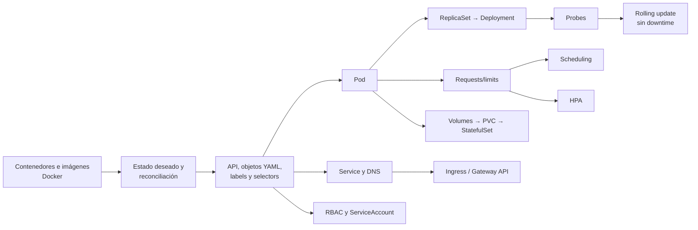

# 01 - Auditoría de las notas

> Revisión técnica de las 18 notas originales de Kubernetes (septiembre de 2026): qué está bien, qué falla, qué falta y cómo se reorganiza. Volver a [[00 - Kubernetes - Índice]].

## Contenido
- [[#🔎 Resumen ejecutivo]]
- [[#✅ Lo que está bien explicado]]
- [[#⚠️ Información incorrecta, desactualizada o confusa]]
- [[#🟡 Conceptos incompletos o superficiales]]
- [[#🔁 Repeticiones y problemas de organización]]
- [[#❌ Información faltante]]
- [[#📐 Orden de dependencias conceptuales]]
- [[#🎯 Relevancia para entrevistas y para el trabajo real]]
- [[#🛠️ Cambios aplicados a las notas originales]]

---

## 🔎 Resumen ejecutivo

| Aspecto | Valoración |
|---|---|
| **Cobertura** | Muy buena en **arquitectura** (Control Plane, kubelet, runtime, controllers, CCM), **almacenamiento** (Volume → PV → PVC → StorageClass → CSI) y **extensibilidad** (CRD, Custom Controller, Helm). Floja o nula en **operación del día a día**: probes, recursos, scheduling, escalado, seguridad, observabilidad, CI/CD, troubleshooting |
| **Calidad técnica** | Alta en general. Hay **8 errores o imprecisiones** relevantes (sobre todo en `Workloads` y `Networking`) y varias prácticas **desactualizadas** |
| **Estructura** | Notas por concepto, bien enlazadas. Falta **orden de aprendizaje**: no hay índice ni ruta, y conceptos que dependen de otros (Deployment → probes, Service → labels) se explican sin su base |
| **Pedagogía** | Mucho "qué es" y comandos; poco **"por qué"**, escenarios, *trade-offs*, errores y ejercicios. Ningún laboratorio ni caso de troubleshooting |
| **Formato** | Correcto para Obsidian, pero `Networking.md` contiene **restos de una conversación con una IA** ("¿Te gustaría continuar…?", "Aquí tienes las notas…") y bloques duplicados |

> [!summary] Diagnóstico en una frase
> Las notas sirven para **reconocer** los componentes de Kubernetes, pero todavía no para **operar, diagnosticar ni diseñar** sobre Kubernetes. El 70 % de lo que preguntan en una entrevista Senior (recursos, probes, despliegues sin downtime, seguridad, troubleshooting, trade-offs) no está.

---

## ✅ Lo que está bien explicado

| Nota | Puntos fuertes |
|---|---|
| [[Control Plane]] | Componentes claros, flujo de `kubectl apply`, alta disponibilidad y backup de etcd |
| [[Worker Node]] | `cordon`/`drain`/`uncordon`, comportamiento en `NotReady`, Pods sueltos que no se recrean |
| [[kubelet]] | Responsabilidades completas, **static Pods**, qué pasa si cae |
| [[Container Runtime]] | CRI, containerd/CRI-O, `runc`, eliminación de dockershim en 1.24, `crictl`, RuntimeClass. **Excelente** |
| [[Kube-controller-manager]] | Patrón de reconciliación, *leader election* |
| [[Cloud Controller Manager]] | Por qué el LoadBalancer queda en `<pending>` en local, separación respecto a CSI |
| [[ConfigMap]] | Tres formas de consumo, **las variables de entorno no se refrescan**, `subPath`, límite de 1 MiB |
| [[Secret]] | **Base64 no es cifrado**, cifrado en reposo, KMS, External Secrets, Sealed Secrets, tipos de Secret |
| [[Volume]], [[PersistentVolume]], [[PersistentVolumeClaim]], [[StorageClass]], [[CSI Driver]] | Cadena completa, `Released` ≠ reutilizable, RWO es por **nodo**, `WaitForFirstConsumer`, `reclaimPolicy` |
| [[Custom Resource Definition]], [[Custom Controller]] | Operator = CRD + controlador, idempotencia, `ownerReferences`, *finalizers* |
| [[Helm]] | Chart/values/release, `upgrade --install`, `rollback`, CRDs que Helm no actualiza |

---

## ⚠️ Información incorrecta, desactualizada o confusa

> [!danger] Corregido directamente en las notas originales
> Cada corrección está marcada en la nota con un callout `[!note] Corrección (auditoría 2026-10)`.

| # | Nota | Lo que decía | Problema | Corrección |
|---|---|---|---|---|
| 1 | [[Workloads#Deployment]] | El Deployment permite estrategias "*Canary* o *Blue-Green*" | **Incorrecto.** `spec.strategy` solo admite `RollingUpdate` y `Recreate`. Canary y Blue/Green se construyen **encima** (dos Deployments + Service/Ingress/Gateway, o Argo Rollouts / Flagger / service mesh) | Ver [[07 - Salud, fiabilidad y despliegues#Estrategias de despliegue]] |
| 2 | [[Workloads#Deployment]] | Si la imagen falla, el Deployment "detendrá la actualización tras fallar la primera réplica nueva" | **Impreciso.** El rollout no se "detiene" por lógica propia: los Pods nuevos nunca pasan a *Ready*, `maxUnavailable` impide borrar más antiguos y, al superar `progressDeadlineSeconds` (600 s), el Deployment se marca `Progressing=False`. **No hay rollback automático** | `kubectl rollout status` falla y hay que hacer `rollout undo` (o automatizarlo en el pipeline) |
| 3 | [[Workloads#ReplicaSet]] | "ReplicaSet (anteriormente conocido como Replication Controller)" | **Confuso.** Son **dos objetos distintos**: `ReplicationController` es el antiguo (selectores solo por igualdad); `ReplicaSet` es su sucesor (selectores por conjuntos). El RC sigue existiendo pero está desaconsejado | Aclarado |
| 4 | [[Workloads#StatefulSet]] | "Kubernetes **no elimina** los PVC" (regla absoluta) / la réplica siguiente se crea cuando la anterior está "*Running*" | **Desactualizado e impreciso.** Desde **1.32 (GA)** existe `persistentVolumeClaimRetentionPolicy` (`whenDeleted`/`whenScaled`: `Retain` o `Delete`); `Retain` sigue siendo el valor por defecto. La siguiente réplica espera a que la anterior esté **Running y Ready**, y solo con `podManagementPolicy: OrderedReady` (por defecto); con `Parallel` se crean a la vez | Aclarado |
| 5 | [[Networking#Kube-proxy]] | "Balanceo de carga básico por defecto (*round-robin*)" y "prioriza Pods del mismo nodo" | **Incorrecto.** En modo `iptables` la selección es **aleatoria/probabilística**; *round-robin* es el algoritmo por defecto de **IPVS**. Solo prioriza Pods locales si se configura `internalTrafficPolicy`/`externalTrafficPolicy: Local` o `trafficDistribution: PreferClose` (GA en 1.33). Además falta el modo **nftables** (GA en 1.33) y que CNIs como **Cilium** pueden **sustituir** kube-proxy con eBPF | Corregido |
| 6 | [[Networking#Ingress Controller]] | NGINX Ingress Controller como opción por defecto | **Desactualizado.** El proyecto comunitario **`ingress-nginx` se retiró** (anuncio de SIG Network en noviembre de 2025; mantenimiento finalizado en marzo de 2026): sin más releases ni parches de seguridad. Para nuevos proyectos: **Gateway API** (Envoy Gateway, Istio, Cilium, NGINX Gateway Fabric, Traefik…) u otro Ingress Controller mantenido. *No confundir* con el NGINX Ingress Controller de F5/NGINX Inc., que es otro proyecto | Corregido |
| 7 | [[Networking#Kubernetes Gateway API]] | *Rate limiting* como capacidad nativa | **Impreciso.** El núcleo de Gateway API incluye *matching* por cabeceras/método, **traffic splitting por peso**, redirecciones, reescrituras y modificación de cabeceras. El *rate limiting* depende de **políticas específicas de cada implementación** (p. ej. `BackendTrafficPolicy` en Envoy Gateway) | Corregido |
| 8 | [[Networking#CNI]] | "Ni Kubernetes ni el motor (Container Runtime **como Docker**)…" y WeaveNet como ejemplo | **Desactualizado.** Docker no es runtime de Kubernetes desde 1.24; **Weave Net está abandonado** (Weaveworks cerró en 2024). Faltan **Cilium** (eBPF, el más extendido hoy), **Azure CNI** y la importancia del CNI para **NetworkPolicies** (Flannel no las aplica) | Corregido |
| — | [[Networking]] | Texto de chat ("¿Te gustaría proceder…?", "Aquí tienes las notas completas…") | Restos de la generación con IA | **Eliminados** |
| — | [[Networking#Ingress Controller]] | `minikube add-ons enable ingress` | Errata | `minikube addons enable ingress` |
| — | [[Networking#LoadBalancer]] | "Genera una dirección IP pública **estática**" | La IP **no es necesariamente estática** (se libera al borrar el Service) ni siempre pública (existen LB internos por anotación) | Aclarado |
| — | Varias | `image: nginx:latest`, `nginx:1.14.2` (2018) | Mala práctica: `latest` no es reproducible y con `imagePullPolicy` por defecto `Always` | Ver [[Imagen#Tags y versiones]]; en las notas nuevas siempre se fija versión |
| — | [[Workloads#Pod]] | Los contenedores de un Pod "comparten… el almacenamiento" | Comparten red e IPC; los **volúmenes solo si se declaran y montan** en cada contenedor. Cada contenedor tiene su propio sistema de archivos | Aclarado |
| — | [[Secret]] | Tipo `service-account-token` | Desde **1.24** ya no se generan automáticamente; se usan **tokens proyectados** de corta duración (TokenRequest API) | Aclarado |

---

## 🟡 Conceptos incompletos o superficiales

| Concepto | Qué le falta |
|---|---|
| **Pod** | Ciclo de vida y fases (`Pending/Running/Succeeded/Failed/Unknown`), *init containers*, **sidecars nativos** (GA 1.33), terminación ordenada (`SIGTERM`, `preStop`, `terminationGracePeriodSeconds`), por qué es la unidad mínima |
| **Deployment** | `strategy` (`maxSurge`, `maxUnavailable`), `rollout status/history/undo/pause`, `revisionHistoryLimit`, `minReadySeconds`, `progressDeadlineSeconds` |
| **Service** | Cómo funciona por dentro (**EndpointSlices**), `port` vs `targetPort` vs `nodePort` vs `containerPort`, `sessionAffinity`, `externalTrafficPolicy`, `ExternalName`, Services sin selector |
| **kubelet / probes** | Las probes aparecen solo como ejemplo: falta **liveness vs readiness vs startup**, parámetros, efectos y anti-patrones |
| **Ingress** | TLS completo con cert-manager, `pathType` (`Exact`/`Prefix`/`ImplementationSpecific`), IngressClass por defecto |
| **ConfigMap/Secret** | `immutable: true`, recarga en caliente, patrón de *checksum annotation* con Helm |
| **Volume** | `projected`, *generic ephemeral volumes*, `downwardAPI`, `subPath` |
| **Control Plane** | Admission controllers (mutating/validating), API aggregation, `kubectl explain`, versionado de la API (`v1`, `apps/v1`, alpha/beta/GA) |
| **Helm** | Hooks, dependencias (`Chart.yaml dependencies`), `helm lint`, `helm diff`, charts OCI, Helm 4 |

---

## 🔁 Repeticiones y problemas de organización

- **Service types** (`ClusterIP`, `NodePort`, `LoadBalancer`) repiten la misma estructura y YAML con mínimos cambios: mejor **una tabla comparativa** y un diagrama de tráfico (hecho en [[04 - Networking y tráfico]]).
- **Flujo PV/PVC/StorageClass** se explica tres veces (una por nota). Se conserva en cada nota y se **unifica** en un diagrama en [[05 - Configuración y almacenamiento]].
- **Ingress vs Gateway API** está repartido entre tres secciones; ahora hay una comparación directa en [[18 - Trade-offs]].
- `Networking.md` agrupa 11 conceptos (580 líneas) mientras `Workloads.md` solo 4: desequilibrio. Se mantiene por compatibilidad de enlaces (las notas de Docker apuntan a `[[Networking#...]]` y `[[Workloads#...]]`), y los conceptos nuevos van a los capítulos numerados.
- **No había índice ni orden de lectura.** Ahora: [[00 - Kubernetes - Índice]].

---

## ❌ Información faltante

> [!info] Leyenda
> 🔴 **Crítico**: sin esto no puedes trabajar con Kubernetes ni pasar una entrevista Mid.
> 🟠 **Importante**: imprescindible para producción y entrevistas Senior.
> 🟡 **Complementario**: mejora la calidad del trabajo diario.
> 🟢 **Avanzado**: Staff/Architect o casos específicos.

### 🔴 Crítico

| Tema | Por qué es importante | Dónde está ahora |
|---|---|---|
| Qué problema resuelve Kubernetes; declarativo vs imperativo | Sin el modelo mental de **estado deseado + reconciliación** todo lo demás parece magia | [[02 - Fundamentos y arquitectura]] |
| Labels, selectors, annotations, namespaces | Son el "pegamento": Services, ReplicaSets, NetworkPolicies y HPA funcionan por **labels**. Un selector mal escrito = Service sin tráfico | [[03 - Objetos y workloads]] |
| DaemonSet, Job, CronJob | Tres de los seis workloads básicos; aparecen en cualquier clúster real (agentes de logs, migraciones, tareas programadas) | [[03 - Objetos y workloads]] |
| Liveness vs Readiness vs Startup probes | Pregunta de entrevista número 1; mal configuradas provocan **caídas en cascada** y despliegues con downtime | [[07 - Salud, fiabilidad y despliegues]] |
| Requests, limits y QoS | Determinan el scheduling, los **OOMKilled**, el *throttling* y el coste. Pregunta casi segura | [[06 - Scheduling y recursos]] |
| Rolling update, rollback, `kubectl rollout` | Desplegar sin downtime es el día a día | [[07 - Salud, fiabilidad y despliegues]] |
| DNS interno / CoreDNS y flujos de tráfico | Sin entender `svc.cluster.local` y el camino del paquete no puedes depurar conectividad | [[04 - Networking y tráfico]] |
| Troubleshooting (`describe`, `events`, `logs --previous`, estados de Pod) | Lo que realmente hace un Senior cuando algo falla | [[16 - Troubleshooting]] |

### 🟠 Importante

| Tema | Por qué es importante | Dónde está ahora |
|---|---|---|
| NetworkPolicies | Por defecto **todo Pod habla con todo Pod**: sin políticas no hay segmentación | [[04 - Networking y tráfico]] · [[09 - Seguridad]] |
| RBAC, ServiceAccount, Pod Security Standards, securityContext | Mínimo privilegio; PodSecurityPolicy desapareció en 1.25 y muchos tutoriales siguen usándola | [[09 - Seguridad]] |
| HPA, VPA, Cluster Autoscaler, Metrics Server (y KEDA) | Escalado y coste; cómo interactúan entre sí es pregunta Senior | [[08 - Escalado]] |
| Affinity, anti-affinity, taints/tolerations, topology spread | Alta disponibilidad real (no todas las réplicas en el mismo nodo/zona) | [[06 - Scheduling y recursos]] |
| PodDisruptionBudget, graceful shutdown | Sin ellos, un `drain` o una actualización del clúster tumba la app | [[07 - Salud, fiabilidad y despliegues]] |
| Observabilidad (logs, métricas, trazas, eventos, Prometheus, OpenTelemetry) | No se puede operar lo que no se ve | [[10 - Observabilidad]] |
| CI/CD y GitOps (Argo CD / Flux), Kustomize | Cómo llega el código al clúster en una empresa | [[11 - Helm, Kustomize y CI-CD]] |
| Managed Kubernetes (AKS/EKS/GKE), identidades de workload | Casi nadie opera Kubernetes "a mano" | [[12 - Kubernetes en la nube]] |
| ResourceQuota y LimitRange | Gobierno de clústeres compartidos por varios equipos | [[06 - Scheduling y recursos]] |
| kubeconfig, contextos, `kubectl` productivo | Evitar el clásico "apliqué en producción en vez de en dev" | [[02 - Fundamentos y arquitectura]] |

### 🟡 Complementario

| Tema | Por qué es importante | Dónde está ahora |
|---|---|---|
| Init containers y sidecars nativos | Migraciones de BD, esperar dependencias, proxies, recolectores | [[03 - Objetos y workloads]] |
| `immutable` ConfigMaps/Secrets, recarga de configuración | Rendimiento del API Server y despliegues predecibles | [[05 - Configuración y almacenamiento]] |
| PriorityClass y preemption | Qué se desaloja primero cuando falta capacidad | [[06 - Scheduling y recursos]] |
| Kubernetes Dashboard / Headlamp, k9s | Herramientas de trabajo diario | [[10 - Observabilidad]] |
| VolumeSnapshots y backup (Velero) | Recuperación ante desastres | [[19 - Kubernetes en producción]] |

### 🟢 Avanzado

| Tema | Por qué es importante | Dónde está ahora |
|---|---|---|
| Admission controllers y políticas (Kyverno, OPA Gatekeeper, ValidatingAdmissionPolicy) | Imponer reglas a escala (sin `latest`, con límites, sin root) | [[09 - Seguridad]] |
| Progressive delivery (Argo Rollouts, Flagger) | Canary/Blue-Green automatizados con análisis de métricas | [[07 - Salud, fiabilidad y despliegues]] |
| Multi-clúster, multi-región, DR | Diseño Staff/Architect | [[19 - Kubernetes en producción]] |
| Karpenter / Node Auto Provisioning | Escalado de nodos moderno y más eficiente en coste | [[08 - Escalado]] |
| In-place Pod resize (beta en 1.33) | Cambiar CPU/memoria sin recrear el Pod | [[08 - Escalado]] |
| eBPF (Cilium), ambient mesh | Red y mesh sin sidecars | [[04 - Networking y tráfico]] |

---

## 📐 Orden de dependencias conceptuales

Algunos conceptos se explicaban antes que su base. Orden correcto:

> [!example] Ejemplos del problema
> - [[Workloads#Deployment]] menciona *readiness probes* y HPA antes de que existan en las notas.
> - [[Networking#Kubernetes Service]] usa `selector` sin haber explicado labels.
> - [[Workloads#StatefulSet]] depende de Headless Service y PVC, que estaban en otras notas sin orden.

---

## 🎯 Relevancia para entrevistas y para el trabajo real

| Concepto | Entrevista | Trabajo real | Necesita ejemplo práctico | Necesita diagrama |
|---|:---:|:---:|:---:|:---:|
| Qué pasa al crear un Deployment | 🔥🔥🔥 | 🔥🔥 | ✔ | ✔ |
| Liveness vs Readiness vs Startup | 🔥🔥🔥 | 🔥🔥🔥 | ✔ | ✔ |
| Requests vs Limits / OOMKilled | 🔥🔥🔥 | 🔥🔥🔥 | ✔ | |
| Service y flujo de tráfico | 🔥🔥🔥 | 🔥🔥🔥 | ✔ | ✔ |
| Deployment vs StatefulSet | 🔥🔥🔥 | 🔥🔥 | ✔ | |
| ConfigMap vs Secret | 🔥🔥 | 🔥🔥🔥 | ✔ | |
| CrashLoopBackOff / Pending | 🔥🔥🔥 | 🔥🔥🔥 | ✔ | ✔ |
| HPA vs VPA vs Cluster Autoscaler | 🔥🔥 | 🔥🔥 | ✔ | ✔ |
| Ingress vs Gateway API | 🔥🔥 | 🔥🔥 | ✔ | ✔ |
| RBAC / mínimo privilegio | 🔥🔥 | 🔥🔥 | ✔ | |
| NetworkPolicies | 🔥🔥 | 🔥🔥 | ✔ | ✔ |
| Zero-downtime / canary | 🔥🔥🔥 | 🔥🔥 | ✔ | ✔ |
| Control Plane interno (etcd, scheduler) | 🔥🔥 | 🔥 | | ✔ |
| CRD / Operators | 🔥 (Senior+) | 🔥 | ✔ | |
| CNI / CSI internos | 🔥 | 🔥 (plataforma) | | ✔ |

---

## 🛠️ Cambios aplicados a las notas originales

- [[Networking]]: eliminados restos de conversación y relacionados duplicados; corregido kube-proxy (iptables/IPVS/nftables, eBPF), LoadBalancer, Gateway API, CNI (Cilium, Weave Net), retirada de `ingress-nginx`, errata `minikube addons`.
- [[Workloads]]: corregidas estrategias de Deployment, comportamiento ante fallos de rollout, ReplicaSet vs ReplicationController, StatefulSet (`podManagementPolicy`, `persistentVolumeClaimRetentionPolicy`), almacenamiento compartido en Pods, versiones de imagen.
- [[Secret]]: tokens de ServiceAccount desde 1.24.
- Todas las notas originales enlazan ahora a su capítulo de estudio correspondiente.

> [!tip] Nada se ha borrado
> Toda la información correcta de las notas originales se conserva. Los capítulos numerados **amplían** y **ordenan**; las notas por concepto siguen siendo la referencia rápida.
