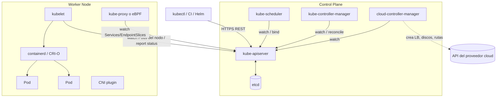

# 02 - Fundamentos y arquitectura

> Nivel 1 del [[00 - Kubernetes - Índice#📈 Roadmap|roadmap]]. Requisito previo: [[Docker]], [[Imagen]] y [[Contenedor]].

## Contenido
- [[#Qué es Kubernetes y qué problema resuelve]]
- [[#Contenedores, Docker, Compose y Kubernetes]]
- [[#Arquitectura del clúster]]
- [[#La API de Kubernetes y los objetos]]
- [[#Declarativo vs imperativo]]
- [[#Qué ocurre cuando creas un Deployment]]
- [[#kubectl productivo y kubeconfig]]
- [[#🧠 Practica]]

---

## Qué es Kubernetes y qué problema resuelve

### Concepto
**Kubernetes (K8s)** es un **orquestador de contenedores**: un sistema que ejecuta contenedores en un **conjunto de máquinas (clúster)** y se encarga continuamente de que lo que tú declaras ("quiero 3 réplicas de mi API v1.4, accesibles en este puerto, con 512 MiB cada una") **sea verdad**, aunque fallen procesos, nodos o despliegues. Nació en Google (heredero de Borg), se donó a la CNCF en 2015 y es el estándar de facto.

### ¿Por qué existe?
Con [[Docker]] puedes ejecutar un contenedor en **una** máquina. En producción aparecen preguntas que Docker no responde:

| Problema real | Sin Kubernetes | Con Kubernetes |
|---|---|---|
| Un contenedor muere a las 3 AM | Alguien recibe una alerta y lo reinicia | El [[kubelet]] lo reinicia; si muere el nodo, el controlador recrea el Pod en otro |
| ¿En qué servidor pongo este contenedor? | Decisión manual, hojas de cálculo | El **scheduler** elige según CPU, memoria, afinidades, zonas |
| ¿Cómo encuentra el frontend al backend si las IPs cambian? | IPs hardcodeadas, ficheros de configuración | **Service** con IP y DNS estables |
| Desplegar v2 sin cortar el servicio | Scripts frágiles | **Rolling update** + *readiness probes* + rollback |
| Pico de tráfico | Comprar/levantar máquinas a mano | **HPA** añade Pods, **Cluster Autoscaler** añade nodos |
| Configuración y secretos por entorno | Variables dispersas | **ConfigMap** y **Secret** versionados |

### ¿Cuándo utilizarlo?
- **Sí**: varios servicios (microservicios), varios equipos, necesidad de alta disponibilidad, despliegues frecuentes, escalado automático, portabilidad entre nubes, plataforma interna común.
- **Probablemente no**: un monolito pequeño, un equipo de 2 personas sin experiencia en K8s, una web con tráfico estable. Alternativas: [[Docker Compose]] en una VM, **Azure Container Apps**, App Service, Cloud Run, ECS/Fargate. Ver [[18 - Trade-offs#Kubernetes vs Serverless vs Azure Container Apps]].

> [!important] El modelo mental que lo explica todo
> Kubernetes es una **base de datos de estado deseado** (etcd, detrás de una API) más un conjunto de **controladores** que, en bucle, comparan *deseado vs real* y actúan. **Observar → comparar → actuar**. Todo (Deployments, Services, HPA, Ingress, operadores) es una variación de esto.

### Errores comunes
- Pensar que Kubernetes "ejecuta YAML": ejecuta **contenedores**; el YAML solo describe el estado deseado.
- Adoptarlo por moda: el coste operativo (aprendizaje, observabilidad, seguridad, actualizaciones cada ~4 meses) es real.
- Creer que hace tu app escalable o resiliente "gratis": si tu app guarda estado en memoria o no aguanta `SIGTERM`, Kubernetes no lo arregla.

### Entrevista
> [!question]- "¿Qué problema resuelve Kubernetes que no resuelve Docker?"
> Docker **empaqueta y ejecuta** contenedores en una máquina. Kubernetes **orquesta** contenedores en muchas máquinas: *scheduling*, auto-recuperación, descubrimiento de servicios, balanceo, despliegues progresivos, escalado y gestión de configuración, todo **declarativo** y reconciliado continuamente. **Evalúan**: si entiendes el paso de "un contenedor" a "un sistema distribuido". **Evita**: decir que "Kubernetes reemplaza a Docker" (usa imágenes OCI construidas con Docker; lo que dejó de usar fue Docker Engine como runtime).

---

## Contenedores, Docker, Compose y Kubernetes

### Concepto
Cuatro capas distintas que se suelen mezclar:

| | Contenedor | Docker | Docker Compose | Kubernetes |
|---|---|---|---|---|
| Qué es | Proceso aislado (namespaces + cgroups) creado desde una imagen OCI | Herramienta para **construir**, distribuir y ejecutar contenedores | Orquestación **en un solo host** con un YAML | Orquestación **en un clúster** |
| Unidad | Contenedor | Contenedor / imagen | Servicio (contenedores) | Pod (uno o más contenedores) |
| Auto-recuperación | No | `restart` policies | `restart` policies | Controladores + probes, entre nodos |
| Escalado | — | — | `--scale` manual en 1 host | HPA/VPA/Cluster Autoscaler |
| Red / descubrimiento | — | Redes bridge | DNS por nombre de servicio | Services + CoreDNS + Ingress/Gateway |
| Despliegues sin corte | — | — | No | Rolling update, rollback |
| Dónde encaja | — | **Build** en CI y desarrollo local | Desarrollo local, apps pequeñas | Producción multi-servicio |

> [!info] Kubernetes vs Docker: la confusión de 2020
> Kubernetes 1.24 eliminó el *dockershim*: ya no usa **Docker Engine** como runtime en los nodos, sino **containerd** o **CRI-O** ([[Container Runtime]]). Pero las **imágenes** que construyes con `docker build` son OCI y funcionan igual. Docker sigue siendo la herramienta habitual para **construir** imágenes y para desarrollo local.

> [!example] Antes vs Después: de Compose a Kubernetes
> | `compose.yaml` | Kubernetes |
> |---|---|
> | `services.api.image` | `Deployment.spec.template.spec.containers[].image` |
> | `deploy.replicas: 3` | `Deployment.spec.replicas: 3` |
> | `ports: ["8080:80"]` | `Service` (+ `Ingress`/`Gateway` para HTTP externo) |
> | DNS por nombre de servicio | DNS del `Service` (`api.mi-ns.svc.cluster.local`) |
> | `environment` / `env_file` | `ConfigMap` + `Secret` |
> | `volumes` con nombre | `PersistentVolumeClaim` |
> | `healthcheck` | `livenessProbe` / `readinessProbe` / `startupProbe` |
> | `depends_on` | **No existe**: la app debe tolerar dependencias no disponibles (reintentos, readiness) |
> | `deploy.resources` | `resources.requests` / `limits` |

---

## Arquitectura del clúster

### Concepto
Un clúster tiene un **Control Plane** (el cerebro) y **Worker Nodes** (el músculo).



| Componente | Responsabilidad | Si falla… | Nota detallada |
|---|---|---|---|
| **kube-apiserver** | Única puerta de entrada: autenticación, autorización, *admission*, validación, persistencia en etcd. **Todo** habla con él; nadie habla con etcd directamente | No se puede cambiar nada; las apps **siguen corriendo** | [[Control Plane]] |
| **etcd** | Almacén clave-valor consistente (Raft) con **todo** el estado | Sin backup = pierdes el clúster | [[Control Plane]] |
| **kube-scheduler** | Asigna Pods sin nodo a un nodo (filtrar → puntuar → *bind*) | Pods nuevos se quedan en `Pending` | [[06 - Scheduling y recursos]] |
| **kube-controller-manager** | Bucles de reconciliación integrados (Deployment, ReplicaSet, Node, Job, EndpointSlice...) | No hay auto-recuperación ni rollouts | [[Kube-controller-manager]] |
| **cloud-controller-manager** | Integración con la nube (LB, nodos, rutas) | Services `LoadBalancer` en `<pending>` | [[Cloud Controller Manager]] |
| **kubelet** | Agente de cada nodo: arranca contenedores vía CRI, monta volúmenes, ejecuta probes, reporta estado | Nodo `NotReady`, Pods desalojados tras ~5 min | [[kubelet]] |
| **kube-proxy** | Programa reglas (iptables/IPVS/nftables) para que las IPs de Service lleguen a Pods | Services dejan de enrutar en ese nodo | [[Networking#Kube-proxy]] |
| **Container runtime** | Descarga imágenes y crea contenedores (containerd, CRI-O + runc) | Pods en `ContainerCreating` | [[Container Runtime]] |
| **CNI** | IP por Pod y conectividad Pod↔Pod entre nodos; NetworkPolicies | Pods sin red, `ContainerCreating` | [[Networking#CNI]] |
| **CoreDNS** | DNS interno (`*.svc.cluster.local`). Es un *addon* (Deployment en `kube-system`) | Nadie resuelve nombres de Services | [[04 - Networking y tráfico#DNS interno y CoreDNS]] |

### ¿Qué ocurre internamente? Las tres ideas clave
1. **Todo pasa por el API Server**, y los componentes no se llaman entre sí: **observan** (*watch*) la API y escriben en ella. El scheduler no "le dice" al kubelet que arranque un Pod: escribe `spec.nodeName` y el kubelet, que vigila los Pods de su nodo, reacciona.
2. **Comunicación por estado**, no por órdenes: por eso el sistema es resiliente. Si un componente se reinicia, relee el estado y continúa.
3. **El plano de datos sobrevive al plano de control**: si cae el API Server, los Pods siguen sirviendo tráfico; lo que se pierde es la capacidad de **cambiar** y de **reparar**.

> [!warning] Managed Kubernetes
> En **AKS, EKS y GKE** el proveedor opera el Control Plane (etcd, API Server, backups, HA). Tú no ves esos Pods en `kube-system`. Tu responsabilidad empieza en los nodos y las cargas. Ver [[12 - Kubernetes en la nube]].

### Errores comunes
- Buscar los Pods del API Server en AKS/EKS/GKE: no están (gestionado).
- Creer que el scheduler **arranca** Pods: solo **asigna** nodo; quien arranca es el kubelet.
- Pensar que kube-proxy "es un proxy" por el que pasa el tráfico: programa reglas del kernel.

### Entrevista
> [!question]- "¿Qué pasa si se cae etcd? ¿Y si se cae un nodo worker?"
> **etcd**: el API Server no puede leer/escribir estado → no hay cambios, ni scheduling, ni reconciliación; las cargas existentes **siguen corriendo**. Con 3 o 5 miembros, cae uno y hay quórum. Sin backup y con pérdida total, se pierde la definición del clúster. **Nodo worker**: el kubelet deja de reportar; tras `node-monitor-grace-period` el nodo pasa a `NotReady` y recibe los *taints* `node.kubernetes.io/unreachable`; los Pods tienen por defecto una tolerancia de **300 s**, después se desalojan y sus controladores (Deployment/StatefulSet) los recrean en otros nodos. Los Pods "sueltos" se pierden. Los StatefulSets son más prudentes: no recrean un Pod con la misma identidad hasta estar seguros de que el anterior ha muerto. **Evalúan**: separación plano de control / plano de datos. **Evita**: decir que "se cae todo".

---

## La API de Kubernetes y los objetos

### Concepto
Todo en Kubernetes es un **objeto** de una API REST versionada. Cada manifiesto tiene cuatro partes:

```yaml
apiVersion: apps/v1        # grupo/versión de la API (core = solo "v1")
kind: Deployment           # tipo de objeto
metadata:                  # identidad: name, namespace, labels, annotations
  name: api
  namespace: shop
  labels: { app: api }
spec:                      # ESTADO DESEADO (lo escribes tú)
  replicas: 3
  # ...
status:                    # ESTADO REAL (lo escriben los controladores; nunca lo edites)
  readyReplicas: 3
```

### ¿Por qué existe?
Una API uniforme permite que `kubectl`, Helm, Argo CD, Terraform, operadores y tu propio código trabajen igual con cualquier recurso, incluidos los **[[Custom Resource Definition|CRDs]]**.

| Concepto | Qué significa | Ejemplo |
|---|---|---|
| **Grupo de API** | Familia de recursos | core (`v1`): Pod, Service, ConfigMap · `apps/v1`: Deployment · `networking.k8s.io/v1`: Ingress · `batch/v1`: Job |
| **Versión** | Madurez | `v1alpha1` (experimental, desactivado por defecto) → `v1beta1` → `v1` (GA, estable) |
| **Namespaced vs cluster-scoped** | Si vive en un namespace | Pod, Service, PVC: namespaced · Node, PV, StorageClass, ClusterRole: de clúster |
| **Feature gates** | Funciones activables por versión | p. ej. sidecars nativos (GA en 1.33) |

> [!tip] Versiones de Kubernetes
> Hay **tres releases menores al año** (1.32, 1.33, 1.34...) y cada una tiene soporte ~14 meses en upstream (los proveedores gestionados tienen sus propios calendarios, con soporte extendido de pago). Comprueba siempre **desde qué versión** existe una función: este curso lo indica cuando importa. `kubectl version` muestra cliente y servidor (máximo ±1 versión de diferencia soportada).

### Ejemplo
```bash
kubectl api-resources                 # todos los tipos, su grupo, si son namespaced y su nombre corto
kubectl api-versions                  # grupos/versiones disponibles
kubectl explain deployment.spec.strategy          # documentación de cualquier campo
kubectl explain pod.spec.containers --recursive | less
kubectl get deploy api -o yaml        # objeto completo con status
```

---

## Declarativo vs imperativo

### Concepto
| | Imperativo | Declarativo |
|---|---|---|
| Qué expresas | **Acciones**: "crea", "escala", "cambia la imagen" | **Resultado**: "así debe estar" |
| Comandos | `kubectl run`, `create`, `scale`, `set image`, `expose`, `edit` | `kubectl apply -f`, Helm, Kustomize, GitOps |
| Reproducible | No (el historial está en tu terminal) | Sí (el YAML está en git) |
| Uso correcto | Aprender, depurar, emergencias, **generar YAML** | **Todo lo que llega a un entorno real** |

### ¿Qué ocurre internamente?
`kubectl apply` usa **Server-Side Apply** (recomendado: `kubectl apply --server-side`) o el *three-way merge* clásico: compara lo que aplicaste la última vez, el estado vivo y el fichero nuevo, y solo cambia los campos que **tú gestionas**. Así conviven tus cambios con los de otros actores (por ejemplo, el HPA cambiando `replicas`).

> [!tip] El mejor truco imperativo: generar YAML
> ```bash
> kubectl create deployment api --image=ghcr.io/acme/api:1.4.2 --replicas=3 \
>   --dry-run=client -o yaml > deployment.yaml
> kubectl create service clusterip api --tcp=80:8080 --dry-run=client -o yaml > service.yaml
> kubectl diff -f deployment.yaml      # qué cambiaría antes de aplicar
> kubectl apply -f deployment.yaml
> ```

### Errores comunes
- Mezclar `kubectl edit`/`scale` con GitOps: el siguiente *sync* **revierte** tu cambio manual (*drift*).
- Fijar `replicas` en el YAML **y** usar HPA: cada `apply` "pisa" al HPA. Quita `replicas` del manifiesto cuando hay HPA (o gestiónalo con Server-Side Apply).
- Usar `kubectl create -f` en pipelines: falla si el objeto ya existe; `apply` es idempotente.

---

## Qué ocurre cuando creas un Deployment

La pregunta de entrevista más clásica. Recorrido completo:

```mermaid
sequenceDiagram
  autonumber
  participant U as kubectl
  participant A as API Server
  participant E as etcd
  participant DC as Deployment controller
  participant RC as ReplicaSet controller
  participant S as Scheduler
  participant K as kubelet (nodo)
  participant R as containerd + CNI + CSI
  U->>A: apply Deployment (HTTPS)
  A->>A: AuthN → AuthZ (RBAC) → Mutating admission → validación → Validating admission
  A->>E: guarda Deployment
  DC-->>A: watch: Deployment nuevo
  DC->>A: crea ReplicaSet (hash de la plantilla)
  RC-->>A: watch: ReplicaSet con 0/3
  RC->>A: crea 3 Pods (sin nodeName)
  S-->>A: watch: Pods Pending sin nodo
  S->>A: binding: Pod → nodo (filtrar + puntuar)
  K-->>A: watch: Pod asignado a mi nodo
  K->>R: pull imagen, crear sandbox, red (CNI), volúmenes (CSI), arrancar contenedores
  K->>A: status: Running; probes OK → Ready
  Note over A: EndpointSlice controller añade la IP del Pod al Service
```

> [!question]- Ahora explícalo en 30 segundos (versión entrevista)
> "`kubectl` envía el manifiesto al API Server, que autentica, autoriza, pasa los *admission controllers*, valida y guarda en etcd. El Deployment controller lo ve y crea un ReplicaSet; el ReplicaSet controller crea los Pods. El scheduler asigna cada Pod a un nodo según recursos y restricciones. El kubelet de ese nodo, que vigila sus Pods, pide al runtime descargar la imagen y arrancar los contenedores, con la red del CNI y los volúmenes del CSI. Cuando la *readiness probe* pasa, el Pod se marca Ready y el EndpointSlice controller lo añade al Service, que empieza a enviarle tráfico. Nadie da órdenes directas: todos observan la API y reconcilian."

---

## kubectl productivo y kubeconfig

### Concepto
`kubectl` lee el fichero **kubeconfig** (`~/.kube/config` o `$KUBECONFIG`), que contiene **clusters** (URL + CA), **users** (credenciales) y **contexts** (cluster + user + namespace por defecto).

### Ejemplo
```bash
kubectl config get-contexts
kubectl config use-context aks-prod
kubectl config set-context --current --namespace=shop

# Salidas útiles
kubectl get pods -o wide                       # nodo e IP
kubectl get pods -l app=api --show-labels
kubectl get pods -A --field-selector=status.phase!=Running
kubectl get pods -o jsonpath='{.items[*].spec.containers[*].image}'
kubectl get events --sort-by=.lastTimestamp
kubectl get all -n shop                        # (no incluye ConfigMaps, Secrets, Ingress...)
kubectl wait --for=condition=available deploy/api --timeout=120s
kubectl port-forward svc/api 8080:80          # probar un Service sin exponerlo
```

> [!warning] El error más caro: el contexto equivocado
> Aplicar en producción creyendo estar en dev. Mitigaciones: mostrar el contexto en el prompt (kube-ps1, Starship), herramientas `kubectx`/`kubens`, kubeconfigs separados por entorno, RBAC de solo lectura para humanos en producción y despliegues solo vía pipeline/GitOps.

> [!tip] Herramientas que te harán más rápido
> `k9s` (TUI), `kubectx`/`kubens`, `stern` (logs de varios Pods), `kubectl krew` (plugins), autocompletado (`source <(kubectl completion bash)`) y el alias `alias k=kubectl`.

---

## 🧠 Practica

> [!question]- Quiz 1: ¿Qué componente decide en qué nodo corre un Pod, y cuál lo arranca?
> Decide el **kube-scheduler** (escribe `spec.nodeName`). Lo arranca el **kubelet** del nodo elegido, a través del container runtime (CRI).

> [!question]- Quiz 2: Se cae el API Server de un clúster autogestionado. ¿Tu web deja de responder?
> **No.** Los Pods y las reglas de red ya programadas siguen funcionando. No podrás desplegar, escalar ni se recrearán Pods que fallen hasta que vuelva.

> [!question]- Quiz 3: ¿Por qué `status` no se escribe en el YAML?
> Porque es el **estado observado**, que escriben los controladores y el kubelet. Tú declaras `spec`; Kubernetes reconcilia y reporta en `status`.

> [!question]- ¿Qué pasaría si…? Borras manualmente un Pod de un Deployment
> El ReplicaSet controller detecta 2/3 y crea un Pod nuevo (otro nombre, otra IP). Por eso "reiniciar borrando Pods" funciona... y por eso **nunca** debes depender de nombres o IPs de Pods. Para reiniciar de forma ordenada: `kubectl rollout restart deploy/api`.

> [!question]- ¿Por qué Kubernetes hace esto? Los componentes no se llaman entre sí
> Porque un sistema basado en **estado observado** tolera fallos: si el scheduler se reinicia en mitad de una decisión, al volver relee los Pods `Pending` y continúa. Con llamadas directas, un fallo intermedio dejaría trabajo a medias sin nadie que lo retome.

> [!example] Reto
> Con un clúster local ([[15 - Laboratorios#Lab 01 - Tu primer clúster con kind]]):
> 1. Genera con `--dry-run=client -o yaml` un Deployment de `nginx:1.27` con 3 réplicas.
> 2. Aplícalo y, en otra terminal, ejecuta `kubectl get events -w`. Identifica en los eventos cada paso del diagrama de secuencia (Scheduled, Pulling, Pulled, Created, Started).
> 3. Borra un Pod y observa cómo se crea otro. ¿Qué evento lo muestra?

### Relacionado
- [[Control Plane]] · [[Worker Node]] · [[kubelet]] · [[Container Runtime]] · [[Kube-controller-manager]]
- Siguiente: [[03 - Objetos y workloads]]
