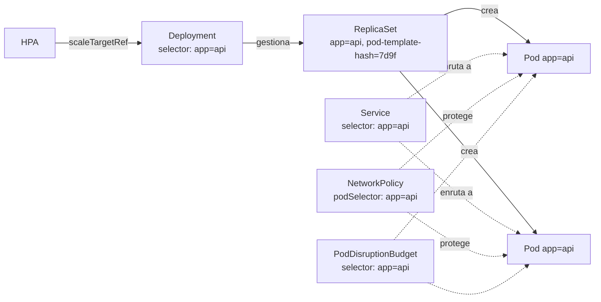
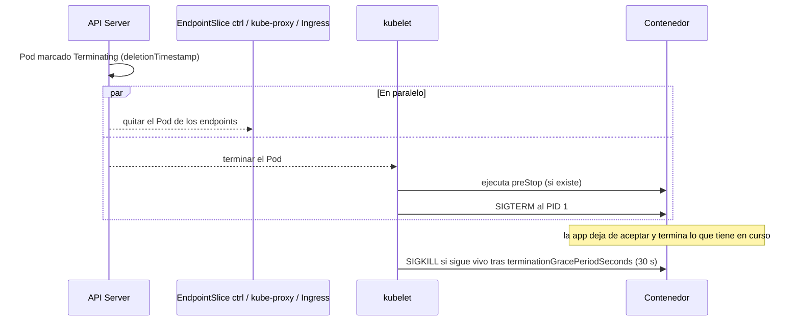
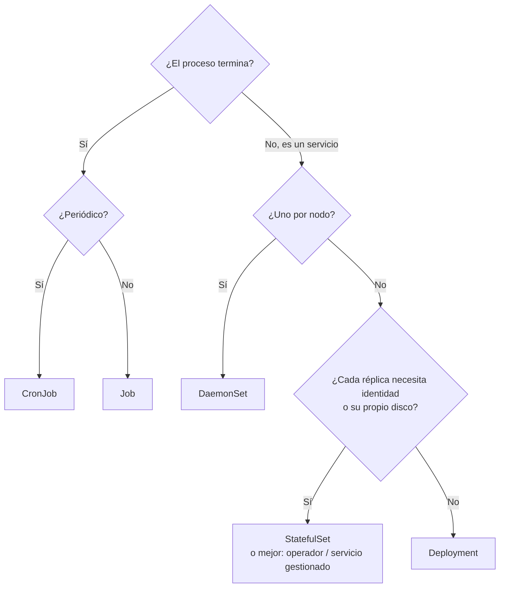

# 03 - Objetos y workloads

> Nivel 2 del [[00 - Kubernetes - Índice#📈 Roadmap|roadmap]]. Amplía [[Workloads]] (Pod, ReplicaSet, Deployment, StatefulSet) con lo que faltaba: namespaces, labels, ciclo de vida del Pod, DaemonSet, Job y CronJob, y cuándo usar cada uno.

## Contenido
- [[#Namespaces]]
- [[#Labels, selectors y annotations]]
- [[#Pod]]
- [[#Init containers y sidecars]]
- [[#ReplicaSet y Deployment]]
- [[#StatefulSet]]
- [[#DaemonSet]]
- [[#Job]]
- [[#CronJob]]
- [[#¿Qué workload elijo?]]
- [[#🧠 Practica]]

---

## Namespaces

### Concepto
Un **Namespace** es una **partición lógica** del clúster: un ámbito para nombres, permisos (RBAC), cuotas y políticas de red.

### ¿Por qué existe?
Para que varios equipos, aplicaciones o entornos compartan un clúster sin pisarse: dos Services pueden llamarse `api` si están en namespaces distintos.

### ¿Cuándo utilizarlo?
- Por **equipo** o **aplicación** (`payments`, `catalog`), y opcionalmente por entorno en clústeres no productivos (`shop-dev`, `shop-qa`).
- Producción y no producción, **mejor en clústeres separados**: un namespace no es una frontera de seguridad fuerte (comparten nodos, kernel, Control Plane).

| Namespace del sistema | Contenido |
|---|---|
| `default` | Donde cae todo si no indicas namespace. **No lo uses para cargas reales** |
| `kube-system` | Componentes del clúster (CoreDNS, kube-proxy, CNI, CSI...) |
| `kube-public` | Información legible sin autenticar (raro) |
| `kube-node-lease` | Objetos `Lease` de latido de los nodos |

### YAML
```yaml
apiVersion: v1
kind: Namespace
metadata:
  name: shop
  labels:
    team: ecommerce
    pod-security.kubernetes.io/enforce: restricted   # ver 09 - Seguridad
```

### ¿Qué ocurre internamente?
El namespace es solo un prefijo en las claves de etcd y un ámbito para la autorización. **No aísla la red**: un Pod de `shop` llega a `payments` salvo que una [[04 - Networking y tráfico#NetworkPolicy|NetworkPolicy]] lo impida. Borrar un namespace **borra todo lo que contiene** (en cascada).

### Errores comunes
- Olvidar `-n` y crear cosas en `default`.
- Creer que el namespace aísla la red o los recursos: hacen falta **NetworkPolicy**, **ResourceQuota** y **LimitRange** ([[06 - Scheduling y recursos#ResourceQuota y LimitRange]]).
- Namespace atascado en `Terminating`: suele ser un *finalizer* de un recurso cuyo controlador ya no existe (p. ej. CRD de un operador desinstalado).

---

## Labels, selectors y annotations

### Concepto
- **Labels**: pares clave-valor **para identificar y agrupar** objetos (`app: api`, `tier: backend`, `version: v2`).
- **Selectors**: consultas sobre labels. Es **como Kubernetes conecta objetos entre sí**.
- **Annotations**: pares clave-valor **para metadatos no identificativos** (no se puede seleccionar por ellas): checksums, descripción, configuración para herramientas.

### ¿Por qué existe?
Kubernetes conecta objetos **por labels, no por nombres**: así un Service encuentra Pods que aún no existen, o que se recrean con otro nombre.



| Tipo de selector | Sintaxis | Dónde se usa |
|---|---|---|
| Igualdad | `app=api`, `env!=prod` | Services, `kubectl -l` |
| Conjuntos | `matchExpressions: [{key: env, operator: In, values: [dev, qa]}]` | Deployments, ReplicaSets, Jobs, NetworkPolicy, affinity |

> [!tip] Labels recomendados (estándar de la comunidad)
> `app.kubernetes.io/name`, `app.kubernetes.io/instance`, `app.kubernetes.io/version`, `app.kubernetes.io/component`, `app.kubernetes.io/part-of`, `app.kubernetes.io/managed-by`. Herramientas como Helm, dashboards y políticas los entienden.

### YAML
```yaml
metadata:
  labels:
    app.kubernetes.io/name: api
    app.kubernetes.io/part-of: shop
    app.kubernetes.io/version: "1.4.2"
  annotations:
    kubernetes.io/change-cause: "Fix cálculo de impuestos (#482)"   # aparece en rollout history
    prometheus.io/scrape: "true"
```

### Errores comunes
> [!bug] Error intencional: encuentra el fallo
> ```yaml
> # Service
> spec:
>   selector:
>     app: orders-api
> ---
> # Deployment
> spec:
>   template:
>     metadata:
>       labels:
>         app: order-api
> ```
> > [!success]- Solución
> > `orders-api` ≠ `order-api`. El Service no selecciona ningún Pod: `kubectl get endpointslices -l kubernetes.io/service-name=<svc>` aparece sin endpoints y las peticiones fallan (`connection refused` / timeout). Es la **causa nº 1 de "Service sin tráfico"** ([[16 - Troubleshooting#Service sin tráfico]]).

- El `spec.selector` de un Deployment es **inmutable**: cambiarlo exige recrear el Deployment.
- Poner `version` en el selector de un Service rompe los rolling updates (el Service deja de ver la versión nueva o la vieja).
- Labels con datos que cambian (timestamps): rompen selectores y cachés.

---

## Pod

> Base en [[Workloads#Pod]]. Aquí: ciclo de vida, terminación y patrones.

### Concepto
La **unidad mínima** de despliegue: uno o varios contenedores que comparten **IP, puertos e IPC**, se programan **juntos en el mismo nodo** y pueden compartir **volúmenes**.

### ¿Por qué existe? ¿Por qué no programar contenedores directamente?
Porque algunos procesos deben vivir **juntos** (una app y su proxy, una app y su recolector de logs): el Pod da una unidad atómica de *scheduling*, red y ciclo de vida. Además separa "qué se ejecuta" (contenedor) de "cómo se aloja" (Pod).

### Ciclo de vida
| Fase (`status.phase`) | Significado |
|---|---|
| `Pending` | Aceptado, pero aún sin nodo, o descargando imágenes / creando contenedores |
| `Running` | En un nodo, al menos un contenedor en marcha |
| `Succeeded` | Todos los contenedores terminaron con código 0 (Jobs) |
| `Failed` | Todos terminaron y al menos uno con error |
| `Unknown` | El nodo no reporta |

Estados **de contenedor** que verás en `kubectl get pods` (columna `STATUS`, que mezcla fase, motivo y estado): `ContainerCreating`, `CrashLoopBackOff`, `ImagePullBackOff`, `OOMKilled`, `Error`, `Completed`, `Terminating`. Diagnóstico en [[16 - Troubleshooting]].

### ¿Qué ocurre internamente al borrar un Pod? (terminación ordenada)


> [!warning] La carrera que causa errores 502 en cada despliegue
> La retirada del Pod de los endpoints y el `SIGTERM` ocurren **en paralelo**. Si la app se cierra al instante, durante unos segundos los balanceadores todavía le envían peticiones → errores. Solución estándar: un `preStop` que **espere unos segundos** antes del `SIGTERM`, y una app que gestione `SIGTERM` terminando las peticiones en curso.
> ```yaml
> lifecycle:
>   preStop:
>     sleep:
>       seconds: 5        # acción nativa "sleep" (beta y activa desde 1.30); en versiones antiguas: exec: ["sleep","5"]
> terminationGracePeriodSeconds: 30
> ```
> Implementación en .NET en [[13 - Kubernetes para .NET#Graceful shutdown]].

### Errores comunes
- Crear Pods sueltos en producción: si el nodo muere, nadie los recrea.
- `restartPolicy: Never/OnFailure` en un Deployment: no está permitido; solo `Always`.
- Contenedor que ignora `SIGTERM` (shell como PID 1 con `CMD` en forma *shell*): cada parada tarda 30 s y corta conexiones. Ver [[Dockerfile#ENTRYPOINT vs CMD]].

---

## Init containers y sidecars

### Concepto
| | Init container | Sidecar nativo | Contenedor normal adicional |
|---|---|---|---|
| Cuándo corre | **Antes** que la app, uno tras otro, hasta completar | Arranca **antes** que la app y vive **mientras** ella | En paralelo con la app |
| Declaración | `initContainers` | `initContainers` con `restartPolicy: Always` | `containers` |
| Termina | Debe terminar con éxito | Se para **después** de la app | Igual que la app |
| Disponibilidad | Siempre | **GA en 1.33** (beta activa desde 1.29) | Siempre |
| Casos | Migraciones de BD, esperar una dependencia, descargar config, ajustar permisos | Proxy de mesh, recolector de logs, agente de secretos, en **Jobs** (antes impedían que el Job terminara) | Casos legacy |

### YAML
```yaml
apiVersion: v1
kind: Pod
metadata:
  name: api
spec:
  initContainers:
    - name: migrate-db
      image: ghcr.io/acme/api-migrations:1.4.2
      command: ["dotnet", "Migrations.dll"]
    - name: log-shipper              # sidecar nativo
      image: fluent/fluent-bit:3.2
      restartPolicy: Always
      volumeMounts: [{ name: logs, mountPath: /var/log/app }]
  containers:
    - name: api
      image: ghcr.io/acme/api:1.4.2
      volumeMounts: [{ name: logs, mountPath: /var/log/app }]
  volumes:
    - name: logs
      emptyDir: {}
```

> [!warning] Migraciones en init containers: cuidado con las réplicas
> Con 3 réplicas, el init container corre **3 veces a la vez**. La migración debe ser idempotente y con bloqueo, o mejor, ir en un **Job** previo al despliegue (o un *hook* de Helm). Ver [[11 - Helm, Kustomize y CI-CD#Helm hooks]].

---

## ReplicaSet y Deployment

> Base en [[Workloads#ReplicaSet]] y [[Workloads#Deployment]].

### Concepto
- **ReplicaSet**: mantiene N Pods idénticos. No sabe actualizar.
- **Deployment**: gestiona **ReplicaSets** para hacer actualizaciones y rollbacks. Cada cambio en `spec.template` crea un ReplicaSet nuevo (con un `pod-template-hash`) y traspasa réplicas del viejo al nuevo.

```text
Deployment api (revision 3)
 ├── ReplicaSet api-6d4c9 (rev 3)  replicas: 3   ← actual
 ├── ReplicaSet api-58f7b (rev 2)  replicas: 0   ← guardado para rollback
 └── ReplicaSet api-7b1aa (rev 1)  replicas: 0   (revisionHistoryLimit: 10)
```

### ¿Cuándo utilizarlo?
Para **cualquier aplicación sin estado**: APIs, frontends, workers de colas. Es el workload por defecto.

### YAML (versión de producción)
```yaml
apiVersion: apps/v1
kind: Deployment
metadata:
  name: api
  namespace: shop
  labels: { app.kubernetes.io/name: api }
spec:
  replicas: 3
  revisionHistoryLimit: 5
  progressDeadlineSeconds: 300
  selector:
    matchLabels: { app.kubernetes.io/name: api }
  strategy:
    type: RollingUpdate
    rollingUpdate:
      maxSurge: 25%          # Pods extra permitidos durante el rollout
      maxUnavailable: 0      # nunca bajar de 3 Pods Ready
  template:
    metadata:
      labels: { app.kubernetes.io/name: api }
    spec:
      containers:
        - name: api
          image: ghcr.io/acme/api:1.4.2
          ports: [{ name: http, containerPort: 8080 }]
          resources:
            requests: { cpu: 100m, memory: 256Mi }
            limits:   { memory: 512Mi }
          readinessProbe:
            httpGet: { path: /health/ready, port: http }
            periodSeconds: 5
          livenessProbe:
            httpGet: { path: /health/live, port: http }
            periodSeconds: 10
            failureThreshold: 3
```

### Comandos de rollout
```bash
kubectl set image deploy/api api=ghcr.io/acme/api:1.5.0 -n shop
kubectl annotate deploy/api kubernetes.io/change-cause="v1.5.0: nuevo checkout" -n shop
kubectl rollout status deploy/api -n shop        # espera y falla si se atasca
kubectl rollout history deploy/api -n shop
kubectl rollout undo deploy/api -n shop          # volver a la anterior
kubectl rollout undo deploy/api --to-revision=2 -n shop
kubectl rollout pause|resume deploy/api -n shop  # agrupar varios cambios en un rollout
kubectl rollout restart deploy/api -n shop       # recrear Pods (p. ej. para releer un ConfigMap)
```

Estrategias, `maxSurge`/`maxUnavailable` y despliegues sin downtime: [[07 - Salud, fiabilidad y despliegues]].

---

## StatefulSet

> Base y correcciones en [[Workloads#StatefulSet]].

### Concepto
Workload para aplicaciones que necesitan **identidad estable**: nombre ordinal fijo (`db-0`, `db-1`), **DNS propio por Pod** (vía [[Networking#Headless Service|Headless Service]]) y **un PVC por réplica** que lo sigue aunque el Pod se reprograme.

### ¿Cuándo utilizarlo?
Bases de datos replicadas, Kafka, ZooKeeper, Elasticsearch, RabbitMQ en clúster, Redis con réplicas: sistemas donde **cada réplica es distinta** (primaria/secundaria, su propio fragmento de datos).

> [!warning] Antes de montar una base de datos en un StatefulSet
> Kubernetes te da identidad y discos, **no** te da replicación, backups, failover ni upgrades de la base de datos. En la nube, una **base de datos gestionada** (Azure SQL, Cosmos DB, RDS, Cloud SQL) suele ser mejor opción. Si la quieres en el clúster, usa un **operador** maduro (CloudNativePG, Percona, Strimzi para Kafka, MongoDB Community Operator). Ver [[18 - Trade-offs#Base de datos dentro o fuera de Kubernetes]].

### Comparativa rápida
| | Deployment | StatefulSet |
|---|---|---|
| Nombres de Pod | Aleatorios (`api-6d4c9-x7k2p`) | Ordinales estables (`db-0`) |
| DNS por Pod | No | Sí: `db-0.db-headless.ns.svc.cluster.local` |
| Almacenamiento | PVC compartido o ninguno | `volumeClaimTemplates`: uno por réplica |
| Orden de arranque/parada | Sin orden | Ordenado (`OrderedReady`) o `Parallel` |
| Rolling update | `maxSurge`/`maxUnavailable` | Uno a uno, de la mayor a la `0`, con `partition` |
| Réplicas intercambiables | Sí | No |

---

## DaemonSet

### Concepto
Garantiza **un Pod en cada nodo** (o en los nodos que cumplan un selector). Al añadir un nodo, se crea su Pod; al quitarlo, se borra.

### ¿Por qué existe? ¿Cuándo utilizarlo?
Para **agentes de nodo**: recolectores de logs (Fluent Bit), métricas de nodo (node-exporter), CNI (Cilium, Calico), drivers CSI de nodo, kube-proxy, agentes de seguridad (Falco). **No** para aplicaciones de negocio.

### YAML
```yaml
apiVersion: apps/v1
kind: DaemonSet
metadata:
  name: node-exporter
  namespace: monitoring
spec:
  selector:
    matchLabels: { app: node-exporter }
  updateStrategy:
    type: RollingUpdate
    rollingUpdate: { maxUnavailable: 1 }
  template:
    metadata:
      labels: { app: node-exporter }
    spec:
      tolerations:                          # para correr también en nodos con taints (p. ej. control plane)
        - operator: Exists
      hostNetwork: true
      containers:
        - name: node-exporter
          image: quay.io/prometheus/node-exporter:v1.8.2
          ports: [{ containerPort: 9100 }]
          resources:
            requests: { cpu: 50m, memory: 64Mi }
            limits: { memory: 128Mi }
```

### ¿Qué ocurre internamente?
El DaemonSet controller crea un Pod por nodo elegible con *node affinity* hacia ese nodo, y el **scheduler** lo coloca (respetando taints: por eso suelen llevar `tolerations`).

### Errores comunes
- Olvidar las `tolerations`: el agente no corre en nodos con taints (GPU, sistema) y te faltan logs/métricas de esos nodos.
- No poner `requests`/`limits`: un agente de logs desbocado afecta a **todos** los nodos.
- `kubectl drain` necesita `--ignore-daemonsets` porque esos Pods no se pueden "mover".

---

## Job

### Concepto
Ejecuta Pods **hasta completar** una tarea con éxito (código 0) un número de veces, con reintentos.

### ¿Cuándo utilizarlo?
Migraciones de base de datos, procesos batch, importaciones, generación de informes, *backfills*, tareas de un solo uso en un pipeline.

### YAML
```yaml
apiVersion: batch/v1
kind: Job
metadata:
  name: db-migrate-1-5-0
  namespace: shop
spec:
  backoffLimit: 3                 # reintentos antes de marcar Failed
  activeDeadlineSeconds: 600      # tiempo máximo total
  ttlSecondsAfterFinished: 3600   # borrar el Job (y sus Pods) 1 h después de terminar
  completions: 1
  parallelism: 1
  template:
    spec:
      restartPolicy: Never        # Never u OnFailure (Always no está permitido)
      containers:
        - name: migrate
          image: ghcr.io/acme/api-migrations:1.5.0
          envFrom: [{ secretRef: { name: db-conn } }]
```

> [!tip] Patrones de paralelismo
> - `completions: 1, parallelism: 1`: tarea única.
> - `completions: 100, parallelism: 10` + `completionMode: Indexed`: 100 trozos de trabajo, cada Pod recibe su índice en `JOB_COMPLETION_INDEX`.
> - Cola de trabajo: `parallelism: N` sin `completions`; los Pods consumen hasta vaciar la cola. Para escalar por longitud de cola, **KEDA** ([[08 - Escalado#KEDA]]).
> - `podFailurePolicy` (GA en 1.31) permite decidir qué códigos de salida reintentan y cuáles fallan el Job de inmediato.

### Errores comunes
- `restartPolicy: OnFailure` + error permanente: reinicia el contenedor en el mismo Pod; con `Never` cada intento es un Pod nuevo (más fácil de depurar, más objetos).
- No poner `ttlSecondsAfterFinished`: miles de Jobs y Pods completados acumulados.
- Job no idempotente: si se reintenta, duplica datos ([[Idempotencia]]).

---

## CronJob

### Concepto
Crea **Jobs según un horario** con sintaxis cron.

### YAML
```yaml
apiVersion: batch/v1
kind: CronJob
metadata:
  name: nightly-report
  namespace: shop
spec:
  schedule: "0 3 * * *"
  timeZone: "Europe/Madrid"          # GA desde 1.27; sin él, la zona es la del kube-controller-manager (normalmente UTC)
  concurrencyPolicy: Forbid          # Allow | Forbid | Replace
  startingDeadlineSeconds: 300       # si no pudo arrancar a su hora, cuánto margen tiene
  successfulJobsHistoryLimit: 3
  failedJobsHistoryLimit: 3
  jobTemplate:
    spec:
      backoffLimit: 2
      template:
        spec:
          restartPolicy: OnFailure
          containers:
            - name: report
              image: ghcr.io/acme/reports:2.1.0
```

> [!warning] Garantías "al menos una vez" (y a veces ninguna)
> Un CronJob puede crear **dos** Jobs para la misma hora en casos raros, o **ninguno** si el controlador estuvo caído más de `startingDeadlineSeconds`. La tarea debe ser **idempotente**. `concurrencyPolicy: Forbid` evita solapes si una ejecución dura más que el intervalo.

```bash
kubectl create job --from=cronjob/nightly-report report-manual -n shop   # ejecutar ya, para probar
kubectl patch cronjob nightly-report -p '{"spec":{"suspend":true}}' -n shop
```

---

## ¿Qué workload elijo?



| Workload | Ejemplo real | No lo uses para… |
|---|---|---|
| **Deployment** | API ASP.NET Core, frontend, worker de cola | Bases de datos replicadas |
| **StatefulSet** | PostgreSQL con CloudNativePG, Kafka, Redis replicado | Apps sin estado (complejidad innecesaria) |
| **DaemonSet** | Fluent Bit, node-exporter, Cilium | Apps de negocio |
| **Job** | Migración de esquema, import CSV | Tareas que deben correr siempre |
| **CronJob** | Informe nocturno, limpieza de datos | Frecuencias de segundos (usa un worker) |
| **Pod suelto** | Depuración puntual (`kubectl run --rm -it`) | Nada en producción |

---

## 🧠 Practica

> [!question]- Quiz: ¿Qué pasa si cambias la etiqueta `app` de un Pod gestionado por un ReplicaSet?
> El ReplicaSet deja de contarlo (ya no coincide su selector) y **crea otro** para volver a N. El Pod "huérfano" sigue vivo y, si el Service usaba esa etiqueta, deja de recibir tráfico. Truco útil para **sacar un Pod de la rotación y depurarlo** sin matarlo.

> [!question]- ¿Qué pasaría si…? Tu migración de BD está en un init container y escalas a 10 réplicas
> Diez migraciones simultáneas: bloqueos, errores de "tabla ya existe" o corrupción si no es idempotente. Muévela a un Job previo al rollout (Helm hook `pre-upgrade` o paso del pipeline).

> [!question]- Arquitectura: Tienes que procesar 1 millón de imágenes una vez. ¿Qué workload?
> Un **Job indexado** (`completionMode: Indexed`, `completions: 1000`, `parallelism: 50`), cada índice procesa un lote; o un Job con cola + **KEDA** si llegan de forma continua. Requests/limits ajustados y quizá un node pool *spot* para abaratar.

> [!question]- ¿Por qué Kubernetes hace esto? El selector de un Deployment es inmutable
> Porque el selector define **qué Pods son suyos**. Si cambiara, el Deployment "abandonaría" sus Pods actuales (que seguirían corriendo sin dueño) y crearía otros: duplicación de carga y huérfanos. Se fuerza a recrearlo para que la transición sea explícita.

> [!example] Ejercicio
> Escribe, sin mirar, los YAML de: un Deployment de 2 réplicas, un Job con `ttlSecondsAfterFinished` y un CronJob cada 5 minutos con `concurrencyPolicy: Forbid`. Valídalos con `kubectl apply --dry-run=server -f`. Laboratorio guiado en [[15 - Laboratorios#Lab 02 - Workloads, rollouts y rollbacks]].

### Relacionado
- [[Workloads]] · [[Kube-controller-manager]] · [[06 - Scheduling y recursos]] · [[07 - Salud, fiabilidad y despliegues]]
- Anterior: [[02 - Fundamentos y arquitectura]] · Siguiente: [[04 - Networking y tráfico]]
