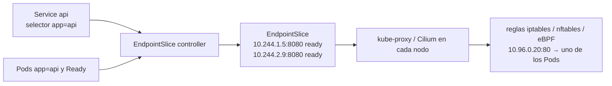
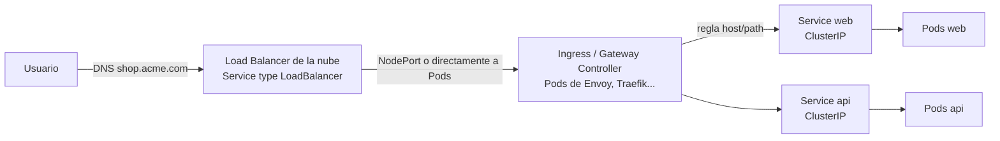

# 04 - Networking y tráfico

> Nivel 3 del [[00 - Kubernetes - Índice#📈 Roadmap|roadmap]]. Referencia de cada objeto en [[Networking]] (Service, tipos, Ingress, Gateway API, kube-proxy, mesh, CNI). Aquí: **cómo viaja un paquete**, DNS, NetworkPolicies y cómo elegir.

## Contenido
- [[#El modelo de red de Kubernetes]]
- [[#Services de un vistazo]]
- [[#DNS interno y CoreDNS]]
- [[#Flujos de tráfico]]
- [[#Ingress en la práctica]]
- [[#Gateway API en la práctica]]
- [[#NetworkPolicy]]
- [[#🧠 Practica]]

---

## El modelo de red de Kubernetes

### Concepto
Kubernetes impone cuatro reglas; el **CNI** las implementa:
1. **Cada Pod tiene su propia IP** (todos sus contenedores la comparten).
2. **Todo Pod puede hablar con cualquier otro Pod**, en cualquier nodo, **sin NAT**.
3. Los agentes de un nodo (kubelet) pueden hablar con todos los Pods de ese nodo.
4. Los **Services** dan una IP virtual estable delante de Pods efímeros.

### ¿Por qué existe?
Para que una app en un Pod se comporte como si estuviera en una VM de una red plana: sin mapeos de puertos por host (como en Docker), sin conflictos de puertos entre Pods.

> [!warning] Consecuencia de seguridad
> La regla 2 significa que, **por defecto, la red es plana y abierta**: un Pod comprometido en `frontend` puede conectar con la base de datos de `payments`. La segmentación se añade con [[#NetworkPolicy]].

| Rango | Ejemplo | Lo asigna |
|---|---|---|
| IPs de nodos | `10.0.0.0/16` | La red de la nube / tu red |
| IPs de Pods (*pod CIDR*) | `10.244.0.0/16` | El CNI (en overlay) o la VNet/VPC (Azure CNI, AWS VPC CNI) |
| IPs de Services (*service CIDR*) | `10.96.0.0/12` | El API Server. Son **virtuales**: no existen en ninguna interfaz |

---

## Services de un vistazo

> Detalle de cada tipo en [[Networking#Kubernetes Service]], [[Networking#ClusterIP]], [[Networking#NodePort]], [[Networking#LoadBalancer]], [[Networking#Headless Service]].

| Tipo | Accesible desde | Crea | Uso típico |
|---|---|---|---|
| `ClusterIP` (defecto) | Dentro del clúster | IP virtual + DNS | Comunicación entre microservicios |
| `NodePort` | `IP-de-cualquier-nodo:30000-32767` | ClusterIP + puerto en **todos** los nodos | Labs, LB externos propios |
| `LoadBalancer` | Internet o red interna | NodePort + ClusterIP + **LB del proveedor** | Exponer un servicio TCP/UDP; el Ingress/Gateway Controller |
| Headless (`clusterIP: None`) | Dentro del clúster | Solo DNS con las IPs de los Pods | StatefulSets, clientes que balancean ellos mismos (gRPC) |
| `ExternalName` | Dentro del clúster | Un CNAME DNS | Alias a un servicio externo (`db.prod.azure.com`) |

### Los cuatro puertos (fuente clásica de confusión)
```text
Cliente externo ──► nodePort 30080 (en cada nodo)
                       │
Cliente interno ──► port 80 (IP del Service)
                       │
                       ▼
                 targetPort 8080 (o nombre: "http")  ──►  containerPort 8080 (documental, en el Pod)
```

> [!tip] Usa `targetPort` por **nombre**
> `targetPort: http` y en el contenedor `ports: [{name: http, containerPort: 8080}]`. Si la app cambia de puerto, solo tocas el Deployment.

### ¿Qué ocurre internamente? EndpointSlices

- Solo los Pods **Ready** (readiness probe OK) entran como endpoints listos. Por eso la readiness probe controla el tráfico.
- `kubectl get endpointslices -l kubernetes.io/service-name=api` es **el** comando para depurar "Service sin tráfico".

---

## DNS interno y CoreDNS

### Concepto
**CoreDNS** (Deployment en `kube-system`, Service `kube-dns`) resuelve nombres internos. El kubelet configura el `/etc/resolv.conf` de cada Pod para usarlo.

| Nombre | Resuelve a |
|---|---|
| `api` | Service `api` **del mismo namespace** |
| `api.shop` | Service `api` del namespace `shop` |
| `api.shop.svc.cluster.local` | FQDN completo |
| `db-0.db-headless.shop.svc.cluster.local` | Un Pod concreto de un StatefulSet |
| `_http._tcp.api.shop.svc.cluster.local` | Registro SRV (puerto con nombre) |

### ¿Qué ocurre internamente?
```bash
kubectl exec -it deploy/api -- cat /etc/resolv.conf
# nameserver 10.96.0.10
# search shop.svc.cluster.local svc.cluster.local cluster.local
# options ndots:5
```
Con `ndots:5`, un nombre con menos de 5 puntos (como `api.github.com`) se prueba **primero con los sufijos de búsqueda** (`api.github.com.shop.svc.cluster.local`, …) antes de consultarse tal cual: varias consultas fallidas por cada resolución externa.

> [!tip] Rendimiento DNS en producción
> - Para dominios externos muy usados, termina el nombre en punto (`api.github.com.`) o baja `ndots` con `dnsConfig.options`.
> - **NodeLocal DNSCache** (DaemonSet) reduce latencia y carga sobre CoreDNS.
> - Escala CoreDNS con el tamaño del clúster (muchos errores intermitentes de "name resolution" son CoreDNS saturado o *conntrack* lleno).

---

## Flujos de tráfico

### Pod → Pod
```text
Pod A (10.244.1.5, nodo 1) ──► IP del Pod B (10.244.2.9) directamente
   │  mismo nodo: bridge/veth local
   │  distinto nodo: el CNI enruta (overlay VXLAN/Geneve, o enrutamiento nativo en la VNet/VPC)
   ▼
Pod B (10.244.2.9, nodo 2)
```
Funciona, pero **no debes usar IPs de Pod**: cambian en cada recreación.

### Pod → Service → Pod
```text
Pod A ─► DNS "api" ─► CoreDNS ─► 10.96.0.20 (ClusterIP)
Pod A ─► 10.96.0.20:80
          │  (en el NODO DE ORIGEN) reglas de kube-proxy/eBPF hacen DNAT
          ▼
       10.244.2.9:8080  (uno de los endpoints Ready, elegido aleatoriamente en iptables)
```
> [!info] El balanceo es por **conexión**, no por petición
> Con HTTP/1.1 *keep-alive* o **gRPC (HTTP/2)**, todas las peticiones de una conexión van al mismo Pod. Con gRPC esto causa **desequilibrio** grave: usa un Headless Service con balanceo en el cliente, o una mesh/Gateway que balancee a nivel L7.

### Tráfico externo → Kubernetes


| Capa | Responsable | Decide |
|---|---|---|
| DNS público | Tu proveedor DNS (Azure DNS, Route 53) / external-dns | A qué IP va `shop.acme.com` |
| L4 (TCP) | LB de la nube, creado por el [[Cloud Controller Manager]] | A qué nodo/Pod del controlador |
| L7 (HTTP) | Ingress/Gateway Controller | Host, ruta, TLS, cabeceras, pesos |
| Interno | Service + kube-proxy/eBPF | Qué Pod concreto |

> [!tip] `externalTrafficPolicy: Local`
> Por defecto (`Cluster`) un nodo sin Pods del servicio reenvía el tráfico a otro nodo (salto extra y **se pierde la IP de origen** por SNAT). Con `Local` solo reciben tráfico los nodos con Pods y se **conserva la IP del cliente** (necesario para *allowlists* o logs de auditoría), a cambio de un reparto potencialmente desigual.

---

## Ingress en la práctica

> Base en [[Networking#Ingress]] y [[Networking#Ingress Controller]] (incluida la **retirada de `ingress-nginx`**).

### YAML: dos apps, un dominio, TLS automático con cert-manager
```yaml
apiVersion: networking.k8s.io/v1
kind: Ingress
metadata:
  name: shop
  namespace: shop
  annotations:
    cert-manager.io/cluster-issuer: letsencrypt-prod   # cert-manager crea y renueva el Secret TLS
spec:
  ingressClassName: traefik          # o el controlador que tengas
  tls:
    - hosts: [shop.acme.com]
      secretName: shop-tls
  rules:
    - host: shop.acme.com
      http:
        paths:
          - path: /api
            pathType: Prefix
            backend:
              service: { name: api, port: { name: http } }
          - path: /
            pathType: Prefix
            backend:
              service: { name: web, port: { number: 80 } }
```

| `pathType` | Comportamiento |
|---|---|
| `Exact` | Solo `/api` exacto |
| `Prefix` | `/api`, `/api/`, `/api/orders` (por segmentos: **no** `/apiv2`) |
| `ImplementationSpecific` | Depende del controlador (evítalo) |

> [!warning] Reescrituras y funciones avanzadas
> Quitar el prefijo `/api` antes de llegar al backend, CORS, *rate limiting*, autenticación... **no forman parte de Ingress**: cada controlador usa sus **anotaciones** (no portables). Es la principal razón de [[#Gateway API en la práctica|Gateway API]].

---

## Gateway API en la práctica

> Base en [[Networking#Kubernetes Gateway API]].

### Concepto
Separa responsabilidades por rol: **GatewayClass** (proveedor de infraestructura) → **Gateway** (equipo de plataforma: puertos, TLS, qué namespaces pueden colgar rutas) → **HTTPRoute/GRPCRoute** (equipos de aplicación).

### YAML: canary 90/10 y reescritura de ruta, sin anotaciones
```yaml
apiVersion: gateway.networking.k8s.io/v1
kind: Gateway
metadata:
  name: public
  namespace: infra
spec:
  gatewayClassName: eg                 # Envoy Gateway, p. ej.
  listeners:
    - name: https
      protocol: HTTPS
      port: 443
      hostname: "*.acme.com"
      tls:
        certificateRefs: [{ name: wildcard-acme-tls }]
      allowedRoutes:
        namespaces: { from: Selector, selector: { matchLabels: { gateway-access: "true" } } }
---
apiVersion: gateway.networking.k8s.io/v1
kind: HTTPRoute
metadata:
  name: api
  namespace: shop                      # namespace con la label gateway-access=true
spec:
  parentRefs: [{ name: public, namespace: infra }]
  hostnames: [shop.acme.com]
  rules:
    - matches: [{ path: { type: PathPrefix, value: /api } }]
      filters:
        - type: URLRewrite
          urlRewrite: { path: { type: ReplacePrefixMatch, replacePrefixMatch: / } }
      backendRefs:
        - { name: api-v1, port: 80, weight: 90 }
        - { name: api-v2, port: 80, weight: 10 }
```

> [!info] Cuándo elegir cada uno
> Comparativa completa en [[18 - Trade-offs#Ingress vs Gateway API]]. Resumen: **proyectos nuevos → Gateway API**; Ingress sigue siendo válido y estable para casos simples, pero ya no evoluciona.

---

## NetworkPolicy

### Concepto
Un **firewall a nivel de Pod** declarado con labels: qué Pods pueden recibir tráfico de quién (*ingress*) y a dónde pueden enviarlo (*egress*).

### ¿Por qué existe?
Porque la red por defecto es plana. Es la base de **Zero Trust** dentro del clúster ([[Confianza cero (Zero Trust)]]) y limita el movimiento lateral de un atacante.

### ¿Qué ocurre internamente?
- **Las aplica el CNI**, no Kubernetes. Si el CNI no las soporta (Flannel puro), se aceptan y **no hacen nada**.
- Un Pod **sin ninguna política que lo seleccione** acepta todo. En cuanto **una** política lo selecciona para `Ingress` (o `Egress`), pasa a **denegar todo lo no permitido** en esa dirección.
- Las políticas son **aditivas** (unión de permisos); no hay reglas de "deny" explícitas en la API estándar (Cilium y Calico tienen sus propias CRDs con *deny*).

### YAML: patrón *default deny* + permisos explícitos
```yaml
# 1) Denegar todo el tráfico entrante y saliente en el namespace
apiVersion: networking.k8s.io/v1
kind: NetworkPolicy
metadata: { name: default-deny-all, namespace: shop }
spec:
  podSelector: {}                 # todos los Pods del namespace
  policyTypes: [Ingress, Egress]
---
# 2) Permitir DNS de salida (si no, nada resuelve nombres)
apiVersion: networking.k8s.io/v1
kind: NetworkPolicy
metadata: { name: allow-dns-egress, namespace: shop }
spec:
  podSelector: {}
  policyTypes: [Egress]
  egress:
    - to:
        - namespaceSelector: { matchLabels: { kubernetes.io/metadata.name: kube-system } }
          podSelector: { matchLabels: { k8s-app: kube-dns } }
      ports: [{ protocol: UDP, port: 53 }, { protocol: TCP, port: 53 }]
---
# 3) api solo acepta tráfico del Ingress/Gateway y de web, en el puerto 8080
apiVersion: networking.k8s.io/v1
kind: NetworkPolicy
metadata: { name: api-ingress, namespace: shop }
spec:
  podSelector: { matchLabels: { app.kubernetes.io/name: api } }
  policyTypes: [Ingress]
  ingress:
    - from:
        - podSelector: { matchLabels: { app.kubernetes.io/name: web } }
        - namespaceSelector: { matchLabels: { kubernetes.io/metadata.name: infra } }
      ports: [{ protocol: TCP, port: 8080 }]
---
# 4) api puede salir hacia redis y la base de datos
apiVersion: networking.k8s.io/v1
kind: NetworkPolicy
metadata: { name: api-egress, namespace: shop }
spec:
  podSelector: { matchLabels: { app.kubernetes.io/name: api } }
  policyTypes: [Egress]
  egress:
    - to: [{ podSelector: { matchLabels: { app.kubernetes.io/name: redis } } }]
      ports: [{ port: 6379 }]
    - to: [{ ipBlock: { cidr: 10.20.0.0/24 } }]     # subred de la BD gestionada
      ports: [{ port: 1433 }]
```

> [!bug] Error intencional: ¿por qué esta regla permite más de lo que parece?
> ```yaml
> ingress:
>   - from:
>       - namespaceSelector: { matchLabels: { team: frontend } }
>       - podSelector: { matchLabels: { app: web } }
> ```
> > [!success]- Solución
> > Son **dos elementos** de la lista `from` (OR): permite **todos los Pods** de los namespaces `team=frontend` **o** los Pods `app=web` **del mismo namespace**. Si querías "Pods `app=web` dentro de namespaces `team=frontend`" (AND), van en **el mismo elemento**:
> > ```yaml
> >       - namespaceSelector: { matchLabels: { team: frontend } }
> >         podSelector: { matchLabels: { app: web } }
> > ```
> > Un guion de diferencia cambia la política por completo.

### Errores comunes
- Aplicar `default-deny` y olvidar el DNS: todo falla con errores de resolución.
- Probar NetworkPolicies en un clúster cuyo CNI no las soporta y creer que "funcionan".
- Olvidar el tráfico de los *health checks* del LB o del Ingress Controller.

---

## 🧠 Practica

> [!question]- Troubleshooting: `curl http://api` desde otro Pod da "Could not resolve host"
> Es un problema de **DNS**, no del Service. Revisa: ¿mismo namespace? (si no, `api.<ns>`); ¿CoreDNS corriendo? (`kubectl get pods -n kube-system -l k8s-app=kube-dns`); ¿hay una NetworkPolicy de egress que bloquee el puerto 53?; prueba `kubectl run dnsutils --rm -it --image=registry.k8s.io/e2e-test-images/agnhost:2.39 -- nslookup api.shop`. Guía completa en [[16 - Troubleshooting#DNS no funciona]].

> [!question]- Troubleshooting: el nombre resuelve pero `curl http://api` hace timeout
> El Service existe pero no tiene endpoints o algo bloquea: `kubectl get endpointslices -l kubernetes.io/service-name=api` (¿vacío? → selector o readiness), ¿`targetPort` correcto?, ¿la app escucha en `0.0.0.0` y no en `127.0.0.1`?, ¿NetworkPolicy?

> [!question]- ¿Qué pasaría si…? Creas 30 Services `LoadBalancer` para 30 microservicios
> 30 balanceadores e IPs públicas: coste alto, 30 superficies expuestas, 30 certificados. Mejor **un** LoadBalancer para el Ingress/Gateway Controller y Services `ClusterIP` detrás.

> [!question]- Entrevista: ¿Ingress vs Service?
> El **Service** da una IP/DNS estable y balanceo **L4** hacia Pods (y puede exponer con NodePort/LoadBalancer). El **Ingress** es una regla **L7 HTTP(S)** (host, ruta, TLS) que un controlador aplica para enrutar a **Services**. No compiten: el Ingress apunta a Services. **Evita**: decir que el Ingress "sustituye" al Service.

> [!example] Reto
> En [[15 - Laboratorios#Lab 03 - Services, DNS e Ingress]] despliega dos versiones de una app y enruta por ruta. Después, en [[15 - Laboratorios#Lab 08 - Seguridad RBAC y NetworkPolicies]], aplica *default deny* y abre solo lo necesario.

### Relacionado
- [[Networking]] · [[Cloud Controller Manager]] · [[Service Discovery]] · [[API Gateway]] · [[Redes en Docker]]
- Anterior: [[03 - Objetos y workloads]] · Siguiente: [[05 - Configuración y almacenamiento]]
