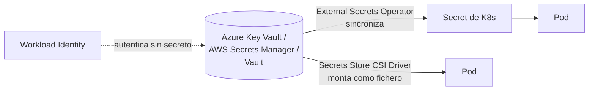
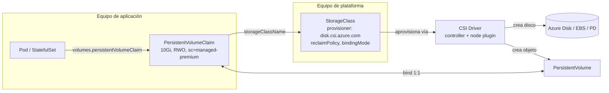

# 05 - Configuración y almacenamiento

> Nivel 4 del [[00 - Kubernetes - Índice#📈 Roadmap|roadmap]]. Referencia de cada objeto: [[ConfigMap]], [[Secret]], [[Volume]], [[PersistentVolume]], [[PersistentVolumeClaim]], [[StorageClass]], [[CSI Driver]]. Aquí: cómo elegir, cómo se conectan y qué falla.

## Contenido
- [[#Configuración - qué usar para cada cosa]]
- [[#Variables de entorno, ConfigMaps y Secrets en detalle]]
- [[#Recargar configuración sin downtime]]
- [[#Secretos en producción]]
- [[#Almacenamiento - el mapa completo]]
- [[#Elegir el tipo de volumen]]
- [[#Aprovisionamiento dinámico paso a paso]]
- [[#🧠 Practica]]

---

## Configuración - qué usar para cada cosa

| Necesidad | Opción | Por qué |
|---|---|---|
| Valor no sensible y pequeño (`LOG_LEVEL`, URL de otro servicio) | **ConfigMap** → variable de entorno | Simple; la app lo lee al arrancar |
| Fichero de configuración (`appsettings.Production.json`, `nginx.conf`) | **ConfigMap** → volumen | Se actualiza en caliente (sin `subPath`) |
| Contraseña, *connection string*, API key | **Secret** → volumen o variable | Separado por RBAC; cifrable en reposo |
| Certificado TLS de un Ingress/Gateway | **Secret `kubernetes.io/tls`** (mejor con cert-manager) | Formato estándar |
| Credenciales de registro privado | **Secret `dockerconfigjson`** + `imagePullSecrets` (o identidad del nodo en la nube) | Pull de imágenes privadas |
| Secretos gestionados centralmente (rotación, auditoría) | **Key Vault / Secrets Manager** + External Secrets Operator o Secrets Store CSI Driver | Fuente única de verdad fuera del clúster |
| Acceso a servicios cloud (Blob, SQL, Service Bus) | **Workload Identity** (sin secreto) | Sin credenciales que robar ni rotar. Ver [[12 - Kubernetes en la nube#Identidades de workload]] |
| Metadatos del propio Pod (nombre, namespace, IP, límites) | **Downward API** | La app sabe quién es sin llamar a la API |
| Configuración que cambia en tiempo real (feature flags) | Servicio de configuración (Azure App Configuration, LaunchDarkly...) | Kubernetes no es un sistema de feature flags |

> [!warning] ConfigMap vs Secret no es "texto plano vs cifrado"
> Ambos se guardan igual en etcd salvo que actives **cifrado en reposo**. La diferencia real: los Secrets se pueden **restringir con RBAC** por separado, el kubelet los monta en **tmpfs** (memoria, no disco del nodo), no se muestran en `describe` y las herramientas los tratan como sensibles. Comparativa en [[18 - Trade-offs#ConfigMap vs Secret]].

---

## Variables de entorno, ConfigMaps y Secrets en detalle

### YAML: todas las formas de inyectar configuración
```yaml
apiVersion: apps/v1
kind: Deployment
metadata: { name: api, namespace: shop }
spec:
  selector: { matchLabels: { app: api } }
  template:
    metadata: { labels: { app: api } }
    spec:
      containers:
        - name: api
          image: ghcr.io/acme/api:1.4.2
          env:
            - name: ASPNETCORE_ENVIRONMENT          # literal
              value: Production
            - name: Logging__LogLevel__Default      # una clave de un ConfigMap
              valueFrom: { configMapKeyRef: { name: api-config, key: LOG_LEVEL } }
            - name: ConnectionStrings__Orders       # una clave de un Secret
              valueFrom: { secretKeyRef: { name: api-secrets, key: orders-db } }
            - name: POD_NAME                        # Downward API
              valueFrom: { fieldRef: { fieldPath: metadata.name } }
            - name: MEMORY_LIMIT
              valueFrom: { resourceFieldRef: { containerName: api, resource: limits.memory } }
          envFrom:                                  # todas las claves como variables
            - configMapRef: { name: api-config }
            - secretRef: { name: api-secrets, optional: false }
          volumeMounts:
            - name: appsettings
              mountPath: /app/config                # directorio: se actualiza en caliente
              readOnly: true
      volumes:
        - name: appsettings
          projected:                                # varias fuentes en un mismo directorio
            sources:
              - configMap: { name: api-appsettings }
              - secret: { name: api-secrets, items: [{ key: orders-db, path: orders-db.txt }] }
```

> [!tip] `immutable: true`
> Marca ConfigMaps y Secrets que no van a cambiar como inmutables: el kubelet deja de vigilarlos (menos carga en el API Server en clústeres grandes) y evitas cambios accidentales. Para cambiar, se crea uno **nuevo** con otro nombre (patrón de Kustomize `configMapGenerator`, que añade un hash al nombre).

---

## Recargar configuración sin downtime

| Cómo se consume | ¿Se actualiza al cambiar el ConfigMap/Secret? | Cómo aplicarlo |
|---|---|---|
| Variable de entorno | **No** | `kubectl rollout restart deploy/api` |
| Volumen (directorio) | Sí, en ~1 minuto (caché del kubelet) | La app debe **releer** el fichero (en .NET, `reloadOnChange: true`) |
| Volumen con `subPath` | **No** | Reinicio |

> [!tip] Patrón "checksum annotation" con Helm
> Añade al *template* del Pod una anotación con el hash del ConfigMap. Si cambia la configuración, cambia la plantilla y el Deployment hace un **rolling update automático**:
> ```yaml
> template:
>   metadata:
>     annotations:
>       checksum/config: {{ include (print $.Template.BasePath "/configmap.yaml") . | sha256sum }}
> ```
> Alternativa genérica: el controlador **Reloader** (Stakater) reinicia Deployments cuando cambian sus ConfigMaps/Secrets.

---

## Secretos en producción

> Riesgos y medidas básicas en [[Secret]] (Base64 no es cifrado, cifrado en reposo, RBAC).



| Opción | Cómo funciona | Pros | Contras |
|---|---|---|---|
| Secret de K8s creado a mano | `kubectl create secret` | Simple | Sin rotación ni auditoría; ¿dónde está la fuente? |
| **Sealed Secrets** / **SOPS** | Secret cifrado en git, descifrado en el clúster | GitOps puro | Gestión de claves; rotación manual |
| **External Secrets Operator** | CRD `ExternalSecret` → copia desde el gestor a un Secret | Rotación, fuente única, compatible con apps que leen variables | El valor acaba en etcd |
| **Secrets Store CSI Driver** | Monta el secreto como fichero directamente del gestor | No pasa por etcd (salvo sync opcional) | La app debe leer ficheros; depende del Pod |
| **Workload Identity** + SDK | La app pide el secreto o usa el servicio directamente con su identidad | Sin secretos para servicios cloud | Requiere código/SDK compatible |

> [!warning] Nunca
> Secretos en la imagen, en `ConfigMap`, en `values.yaml` en git sin cifrar, en `ARG` de Dockerfile, ni impresos en logs. Y recuerda que quien puede crear Pods en un namespace puede **montar cualquier Secret** de ese namespace: el RBAC de `create pods` también protege los Secrets.

---

## Almacenamiento - el mapa completo



| Objeto | Ámbito | Quién lo crea | Analogía |
|---|---|---|---|
| [[Volume]] | Pod | Desarrollador | "Monta algo aquí" |
| [[PersistentVolumeClaim]] | Namespace | Desarrollador | Un **pedido**: "quiero 10 GiB rápidos" |
| [[PersistentVolume]] | Clúster | Admin o aprovisionamiento dinámico | El **disco** concreto que satisface el pedido |
| [[StorageClass]] | Clúster | Plataforma | El **catálogo**: tipos de disco disponibles |
| [[CSI Driver]] | Clúster | Proveedor | El **instalador** que habla con el almacenamiento |

---

## Elegir el tipo de volumen

| Necesidad | Volumen | Sobrevive a... |
|---|---|---|
| Caché o ficheros temporales, compartir entre contenedores del Pod | `emptyDir` (o `emptyDir: {medium: Memory}` para tmpfs) | Reinicio del contenedor. **No** al Pod |
| Scratch grande con disco dedicado | *Generic ephemeral volume* (`ephemeral.volumeClaimTemplate`) | Igual que `emptyDir`, pero con StorageClass |
| Configuración / secretos | `configMap`, `secret`, `projected`, `downwardAPI` | Se regeneran |
| Datos que deben persistir (BD, uploads) | `persistentVolumeClaim` | Al Pod y al nodo |
| Ficheros compartidos entre muchos Pods en distintos nodos | PVC **RWX** (Azure Files, EFS, Filestore, NFS) | Igual |
| Acceso al nodo (agentes) | `hostPath` | Solo en ese nodo; **evitar en apps** |

### Modos de acceso y qué soporta cada backend
| Modo | Significado | Discos de bloque (Azure Disk, EBS, PD) | Ficheros (Azure Files, EFS, NFS) |
|---|---|---|---|
| `ReadWriteOnce` (RWO) | Lectura/escritura desde **un nodo** | ✔ | ✔ |
| `ReadWriteOncePod` (RWOP, GA 1.29) | Un **solo Pod** | ✔ (CSI) | ✔ (CSI) |
| `ReadOnlyMany` (ROX) | Solo lectura desde muchos nodos | Limitado | ✔ |
| `ReadWriteMany` (RWX) | Lectura/escritura desde muchos nodos | ✘ | ✔ |

> [!warning] Discos de bloque y zonas
> Un disco de Azure/EBS vive en **una zona**. Si el Pod se reprograma en otra zona, no puede montarlo → `Pending`. Usa `volumeBindingMode: WaitForFirstConsumer` (el disco se crea en la zona donde el scheduler coloca el Pod) y, para HA real, réplicas de la aplicación en varias zonas cada una con su disco (StatefulSet), o discos ZRS.

---

## Aprovisionamiento dinámico paso a paso

1. Aplicas un PVC con `storageClassName: managed-csi` → estado `Pending`.
2. Con `WaitForFirstConsumer`, espera a que un Pod lo use; el scheduler elige nodo/zona.
3. El *external-provisioner* (sidecar del CSI controller) ve el PVC y llama al driver → se crea el disco en la nube.
4. Se crea el PV y se liga al PVC → `Bound`.
5. El *attacher* conecta el disco a la VM del nodo; el **node plugin** lo formatea (la primera vez) y lo monta; el [[kubelet]] lo monta en el contenedor.
6. Al borrar el PVC: con `reclaimPolicy: Delete` se borra PV **y disco**; con `Retain`, el PV queda `Released` con los datos.

```bash
kubectl get sc                                 # ¿cuál es (default)?
kubectl get pvc,pv -n shop
kubectl describe pvc data-db-0 -n shop         # eventos: ProvisioningSucceeded / FailedBinding
kubectl get volumeattachments                   # discos conectados a nodos
```

### Errores comunes
- PVC en `Pending` sin StorageClass por defecto, o pidiendo RWX a un disco de bloque. Ver [[16 - Troubleshooting#PVC Pending]].
- Borrar el namespace o el PVC de una base de datos con `reclaimPolicy: Delete` → **disco destruido**.
- Pod atascado en `ContainerCreating` con `Multi-Attach error`: el disco RWO sigue conectado al nodo antiguo (típico tras la caída de un nodo); se libera solo tras unos minutos o forzando el desacople.
- Base de datos en `emptyDir`: todo se pierde al reprogramar.
- Snapshots ≠ backups: un `VolumeSnapshot` suele vivir en la misma región/cuenta. Para DR, **Velero** o el backup del proveedor ([[19 - Kubernetes en producción#Backup y disaster recovery]]).

---

## 🧠 Practica

> [!question]- Quiz: cambias un ConfigMap consumido con `envFrom`. ¿Cuándo lo ve la app?
> **Nunca**, hasta que se recree el Pod (`kubectl rollout restart`). Las variables de entorno se fijan al arrancar el proceso.

> [!question]- ¿Qué pasaría si…? 3 réplicas de un Deployment montan el mismo PVC RWO de Azure Disk
> Si las 3 caen en el mismo nodo, funciona (RWO es por nodo). Si el scheduler las reparte, las que estén en otros nodos se quedan en `ContainerCreating` con `Multi-Attach error`. O usas RWX (Azure Files) si de verdad deben compartir ficheros, o —mejor— un StatefulSet con un disco por réplica, o almacenamiento de objetos (Blob/S3) desde la app.

> [!question]- Arquitectura: ¿dónde guardarías los ficheros que suben los usuarios de tu web?
> Normalmente **fuera del clúster**, en almacenamiento de objetos (Azure Blob, S3) accedido con Workload Identity: escala sin límites, no ata Pods a discos/zonas y simplifica backups. Un PVC RWX es la opción si una app legacy necesita un sistema de ficheros compartido.

> [!question]- Entrevista: "¿Cómo gestionarías los secretos de una aplicación en Kubernetes?"
> Fuente de verdad en un gestor (Key Vault), sincronización con External Secrets Operator o montaje con Secrets Store CSI, autenticación del operador/app con Workload Identity, cifrado en reposo de etcd con KMS, RBAC estricto sobre `secrets` y `pods/exec`, nada en git sin cifrar y rotación automatizada. Para servicios cloud, preferir identidad en lugar de secretos. **Evalúan**: que sepas que Base64 no protege y que pienses en rotación y auditoría.

> [!example] Laboratorio
> [[15 - Laboratorios#Lab 04 - Configuración y persistencia con PostgreSQL]]: ConfigMap + Secret + StatefulSet con PVC; borra el Pod y comprueba que los datos siguen.

### Relacionado
- [[ConfigMap]] · [[Secret]] · [[Volume]] · [[PersistentVolume]] · [[PersistentVolumeClaim]] · [[StorageClass]] · [[CSI Driver]] · [[Volúmenes]] (Docker)
- Anterior: [[04 - Networking y tráfico]] · Siguiente: [[06 - Scheduling y recursos]]
