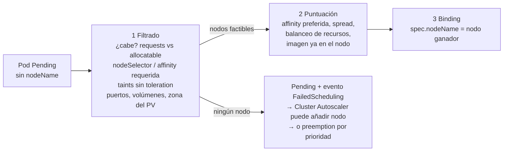

# 06 - Scheduling y recursos

> Requests, limits, QoS y cómo decide el scheduler dónde va cada Pod. Ver también [[Worker Node]], [[Límites de recursos]] (equivalente en Docker).

## Contenido
- [[#Requests y limits]]
- [[#QoS classes y desalojos]]
- [[#ResourceQuota y LimitRange]]
- [[#Cómo decide el scheduler]]
- [[#nodeSelector y node affinity]]
- [[#Pod affinity y anti-affinity]]
- [[#Taints y tolerations]]
- [[#Topology spread constraints]]
- [[#PriorityClass y preemption]]
- [[#Escenarios reales]]
- [[#🧠 Practica]]

---

## Requests y limits

### Concepto
| | `requests` | `limits` |
|---|---|---|
| Qué es | Lo que el contenedor **tiene garantizado** | El **máximo** que puede usar |
| Lo usa | El **scheduler** (para elegir nodo) y el kernel (reparto de CPU bajo contención) | El **kernel** (cgroups) en tiempo de ejecución |
| CPU al superarlo | — | ***Throttling***: se ralentiza, **no muere** |
| Memoria al superarlo | Puede ser desalojado si el nodo se queda sin memoria | **OOMKilled** (código 137) y reinicio |

Unidades: CPU en núcleos (`1`, `500m` = medio núcleo); memoria en bytes binarios (`256Mi`, `1Gi`; ojo, `256M` son megabytes decimales).

### ¿Por qué existe?
El scheduler solo puede colocar bien los Pods si sabe cuánto necesitan. Sin `requests`, para él cada Pod "pesa cero": amontona Pods en un nodo hasta que se queda sin memoria y empiezan los OOM y desalojos.

### YAML
```yaml
resources:
  requests:
    cpu: 250m          # basado en el uso real medido (p. ej. percentil 95)
    memory: 384Mi
  limits:
    memory: 512Mi      # SIEMPRE limita memoria
    # cpu: sin límite (ver debate abajo)
```

> [!question]- Debate Senior: ¿poner o no `limits.cpu`?
> **Argumento en contra (cada vez más extendido):** el límite de CPU provoca *throttling* incluso cuando el nodo tiene CPU libre, aumentando la latencia (especialmente en runtimes con muchos hilos como .NET o la JVM, que consumen su cuota de CFS en ráfagas). Con buenos `requests`, el reparto bajo contención ya es justo.
> **Argumento a favor:** aislamiento estricto en clústeres multi-tenant, costes predecibles, QoS `Guaranteed` (requiere `limits = requests` en CPU y memoria).
> **Respuesta madura:** "Siempre `requests` de CPU y memoria y siempre límite de **memoria**. El límite de CPU depende: sin él para servicios sensibles a latencia en clústeres propios; con él en entornos compartidos o donde la predictibilidad pesa más. Lo decido midiendo *throttling* (`container_cpu_cfs_throttled_periods_total`)".

### ¿Qué ocurre internamente?
- La **capacidad asignable** de un nodo (`kubectl describe node` → `Allocatable`) es menor que la física: se reserva para el sistema y el kubelet.
- El scheduler suma los **requests** (no el uso real) de los Pods del nodo. Un nodo puede estar al 10 % de uso real y "lleno" para el scheduler si los requests están inflados → **dinero tirado**.
- El runtime convierte `requests.cpu` en *CPU shares/weight* y `limits.cpu` en una cuota CFS; `limits.memory` en el límite del cgroup.

### Errores comunes
- Sin requests: Pods `BestEffort`, los primeros en morir.
- Requests copiados de un ejemplo (`cpu: 1`, `memory: 2Gi` para todo): clúster sobredimensionado. Mide y ajusta (VPA en modo recomendación: [[08 - Escalado#Vertical Pod Autoscaler]]).
- Límite de memoria sin tener en cuenta el runtime: .NET y Java ajustan su heap al **límite del contenedor**; pero cachés nativas, hilos y buffers suman. Deja margen.
- Confundir `OOMKilled` (superó **su** límite) con desalojo por presión de memoria del **nodo** (`Evicted`).

---

## QoS classes y desalojos

| QoS | Condición | Cuándo muere primero |
|---|---|---|
| **Guaranteed** | Todos los contenedores con `requests = limits` en CPU **y** memoria | Último |
| **Burstable** | Tiene algún request/limit pero no cumple Guaranteed | Intermedio (según cuánto supera su request) |
| **BestEffort** | Ningún request ni limit | **Primero** |

Cuando el **nodo** se queda sin memoria/disco, el kubelet **desaloja** (*node-pressure eviction*) empezando por BestEffort y Burstable que superan sus requests. Si el kernel actúa antes, el **OOM killer** mata procesos según una puntuación derivada de la QoS.

```bash
kubectl get pod api-7d9f -o jsonpath='{.status.qosClass}'
kubectl describe node <nodo> | grep -A8 "Allocated resources"
kubectl top pods -n shop --sort-by=memory      # requiere metrics-server
```

---

## ResourceQuota y LimitRange

### Concepto
- **ResourceQuota**: tope **total** por namespace (CPU, memoria, nº de Pods, PVCs, Services LoadBalancer...).
- **LimitRange**: valores **por defecto y mínimos/máximos por contenedor** en un namespace.

### ¿Por qué existe?
En un clúster compartido, un equipo no debe poder consumirlo todo, y nadie debería desplegar sin requests (LimitRange los pone por defecto).

### YAML
```yaml
apiVersion: v1
kind: ResourceQuota
metadata: { name: shop-quota, namespace: shop }
spec:
  hard:
    requests.cpu: "8"
    requests.memory: 16Gi
    limits.memory: 32Gi
    pods: "60"
    persistentvolumeclaims: "10"
    services.loadbalancers: "0"       # nadie crea LBs por su cuenta
---
apiVersion: v1
kind: LimitRange
metadata: { name: defaults, namespace: shop }
spec:
  limits:
    - type: Container
      defaultRequest: { cpu: 100m, memory: 128Mi }
      default: { memory: 256Mi }       # limit por defecto
      max: { memory: 4Gi }
```

> [!warning] Con una ResourceQuota de CPU/memoria, todo Pod **debe** declarar requests/limits (o tenerlos por LimitRange); si no, el API Server **rechaza** su creación. El error aparece en los eventos del **ReplicaSet**, no del Deployment: `kubectl describe rs`.

---

## Cómo decide el scheduler



El evento `FailedScheduling` lo explica todo: `0/5 nodes are available: 2 Insufficient memory, 3 node(s) had untolerated taint {dedicated: gpu}`.

| Mecanismo | Lo define | Efecto | Pregunta que responde |
|---|---|---|---|
| `nodeSelector` | Pod | Atracción **obligatoria** simple | "Este Pod **solo** en nodos con X" |
| Node affinity | Pod | Atracción obligatoria o **preferida**, con operadores | "Preferiblemente en X, si no en Y" |
| Pod affinity | Pod | Cerca de **otros Pods** | "Junto a mi caché" |
| Pod anti-affinity | Pod | Lejos de otros Pods | "No dos réplicas en el mismo nodo/zona" |
| Taints / tolerations | **Nodo** / Pod | **Repulsión**: el nodo rechaza Pods que no lo toleren | "Este nodo es **solo** para X" |
| Topology spread | Pod | Reparto **equilibrado** entre dominios | "Réplicas repartidas por zonas con diferencia máx. 1" |

> [!important] La distinción que más se pregunta
> **Affinity atrae, taints repelen.** Para **dedicar** nodos (p. ej. GPU) necesitas **ambos**: un taint para que nadie más entre, y affinity/nodeSelector para que tus Pods vayan **ahí** (la toleration solo les **permite** entrar, no les obliga). Ver [[18 - Trade-offs#Node affinity vs taints y tolerations]].

---

## nodeSelector y node affinity

### YAML
```yaml
spec:
  nodeSelector:
    kubernetes.io/os: linux
  affinity:
    nodeAffinity:
      requiredDuringSchedulingIgnoredDuringExecution:      # obligatorio
        nodeSelectorTerms:
          - matchExpressions:
              - { key: node.kubernetes.io/instance-type, operator: In, values: [Standard_D4s_v5, Standard_D8s_v5] }
      preferredDuringSchedulingIgnoredDuringExecution:     # preferencia con peso
        - weight: 80
          preference:
            matchExpressions:
              - { key: kubernetes.azure.com/scalesetpriority, operator: In, values: [spot] }
```
> [!info] `IgnoredDuringExecution`
> Si las labels del nodo cambian después, el Pod **no se mueve**. Las reglas solo se evalúan al programar. Para reequilibrar existe el proyecto **Descheduler**.

Labels de topología estándar: `kubernetes.io/hostname`, `topology.kubernetes.io/zone`, `topology.kubernetes.io/region`, `node.kubernetes.io/instance-type`.

---

## Pod affinity y anti-affinity

### YAML: réplicas en nodos distintos, y la API cerca de Redis
```yaml
affinity:
  podAntiAffinity:
    preferredDuringSchedulingIgnoredDuringExecution:
      - weight: 100
        podAffinityTerm:
          topologyKey: kubernetes.io/hostname
          labelSelector:
            matchLabels: { app.kubernetes.io/name: api }
  podAffinity:
    preferredDuringSchedulingIgnoredDuringExecution:
      - weight: 50
        podAffinityTerm:
          topologyKey: topology.kubernetes.io/zone
          labelSelector:
            matchLabels: { app.kubernetes.io/name: redis }
```

> [!warning] `required` anti-affinity por hostname
> Con `requiredDuringScheduling...` y 5 réplicas en 3 nodos, **2 réplicas se quedan en `Pending` para siempre**. Usa `preferred` o, mejor, **topology spread constraints**. Además, la (anti)affinity entre Pods es costosa en clústeres muy grandes.

---

## Taints y tolerations

### Concepto
Un **taint** en un nodo (`clave=valor:efecto`) repele a los Pods que no tengan la **toleration** correspondiente.

| Efecto | Qué hace |
|---|---|
| `NoSchedule` | No programa Pods nuevos sin toleration |
| `PreferNoSchedule` | Intenta evitarlo |
| `NoExecute` | Además **expulsa** los Pods ya presentes sin toleration (con `tolerationSeconds` opcional) |

### Ejemplo
```bash
kubectl taint nodes gpu-node-1 dedicated=gpu:NoSchedule
kubectl taint nodes gpu-node-1 dedicated=gpu:NoSchedule-     # quitarlo
```
```yaml
spec:
  tolerations:
    - { key: dedicated, operator: Equal, value: gpu, effect: NoSchedule }
  nodeSelector:
    dedicated: gpu                # + label en el nodo para que VAYA allí
```

> [!info] Taints automáticos
> Kubernetes pone taints a los nodos con problemas: `node.kubernetes.io/not-ready`, `unreachable`, `memory-pressure`, `disk-pressure`, `unschedulable` (tras `cordon`). Los Pods reciben automáticamente tolerations de 300 s para `not-ready`/`unreachable`: por eso tardan ~5 minutos en recrearse tras caer un nodo. En AKS/EKS/GKE, los nodos del sistema pueden tener `CriticalAddonsOnly=true:NoSchedule`.

---

## Topology spread constraints

### Concepto
Reparte Pods de forma **equilibrada** entre dominios (zonas, nodos) con una diferencia máxima (`maxSkew`).

### YAML: alta disponibilidad multi-zona
```yaml
spec:
  topologySpreadConstraints:
    - maxSkew: 1
      topologyKey: topology.kubernetes.io/zone
      whenUnsatisfiable: DoNotSchedule      # estricto entre zonas
      labelSelector:
        matchLabels: { app.kubernetes.io/name: api }
      minDomains: 3                          # exige 3 zonas
    - maxSkew: 1
      topologyKey: kubernetes.io/hostname
      whenUnsatisfiable: ScheduleAnyway      # preferencia entre nodos
      labelSelector:
        matchLabels: { app.kubernetes.io/name: api }
```

> [!tip] Por qué es mejor que anti-affinity para HA
> Anti-affinity dice "no juntos"; spread dice "**repartidos**": con 6 réplicas y 3 zonas obtienes 2-2-2, no 4-1-1. Es la forma recomendada de garantizar que la caída de una zona no se lleve la mayoría de réplicas.

---

## PriorityClass y preemption

```yaml
apiVersion: scheduling.k8s.io/v1
kind: PriorityClass
metadata: { name: business-critical }
value: 100000
preemptionPolicy: PreemptLowerPriority
description: "APIs de cara al cliente"
---
# En el Pod:
spec:
  priorityClassName: business-critical
```
Si un Pod de alta prioridad no cabe, el scheduler **desaloja** Pods de menor prioridad para hacerle sitio. Úsalo para que los *batch* y entornos de prueba cedan ante lo crítico. `system-cluster-critical` y `system-node-critical` están reservadas al sistema.

---

## Escenarios reales

| Escenario | Solución |
|---|---|
| Nodos con GPU solo para entrenamiento de modelos | Taint `nvidia.com/gpu=present:NoSchedule` + toleration + nodeSelector en los Jobs de entrenamiento; requests `nvidia.com/gpu: 1` |
| API crítica que no debe caer si cae una zona | Topology spread por zona (`DoNotSchedule`) + PDB + ≥ 3 réplicas |
| Workers batch baratos | Node pool **spot** con taint (`kubernetes.azure.com/scalesetpriority=spot:NoSchedule` en AKS) + toleration + Jobs idempotentes que soportan interrupción |
| Equipo A y equipo B comparten clúster | Namespaces + ResourceQuota + LimitRange + NetworkPolicy + RBAC; node pools dedicados si hay requisitos de aislamiento |
| Base de datos en nodos con discos rápidos | Node pool con label `storage=nvme` + node affinity + StorageClass local |
| Nodo del sistema saturado por apps | Taint `CriticalAddonsOnly` en el pool del sistema; apps en pools de usuario |

---

## 🧠 Practica

> [!question]- Troubleshooting: Pod en `Pending` con "0/3 nodes are available: 3 Insufficient cpu", pero `kubectl top nodes` muestra los nodos al 15 %
> El scheduler mira **requests**, no uso real. Los requests asignados están al límite (`kubectl describe node` → `Allocated resources`). Soluciones: reducir requests sobredimensionados (VPA en recomendación), añadir nodos (Cluster Autoscaler), o revisar ResourceQuota/LimitRange que inflan valores por defecto.

> [!question]- Quiz: Pod con `requests.memory: 256Mi` y `limits.memory: 512Mi` usa 600Mi. ¿Qué pasa?
> El kernel lo mata: **OOMKilled** (exit code 137), y el kubelet lo reinicia según la `restartPolicy`. Si se repite → `CrashLoopBackOff`.

> [!question]- ¿Qué pasaría si…? Pones taint `NoExecute` a un nodo con 20 Pods
> Los Pods sin la toleration son **expulsados** inmediatamente (o tras su `tolerationSeconds`) y recreados por sus controladores en otros nodos; los DaemonSets suelen tolerarlo. Sin PDB, puedes provocar una caída si varias réplicas estaban ahí.

> [!question]- Entrevista: "¿Requests vs limits?"
> Requests: reserva garantizada usada por el scheduler y el reparto de CPU. Limits: techo aplicado por el kernel; CPU → throttling, memoria → OOMKill. Determinan la QoS (Guaranteed/Burstable/BestEffort) y el orden de desalojo. **Evalúan**: que conozcas las consecuencias distintas en CPU y memoria. **Evita**: "el límite es lo que el Pod usa".

> [!example] Laboratorio
> [[15 - Laboratorios#Lab 06 - Scheduling con taints, affinity y spread]] en un clúster kind de 3 nodos; provoca un OOMKilled en [[15 - Laboratorios#Lab 05 - Probes, fallos y troubleshooting]].

### Relacionado
- [[Worker Node]] · [[kubelet]] · [[08 - Escalado]] · [[Bulkhead]]
- Anterior: [[05 - Configuración y almacenamiento]] · Siguiente: [[07 - Salud, fiabilidad y despliegues]]
