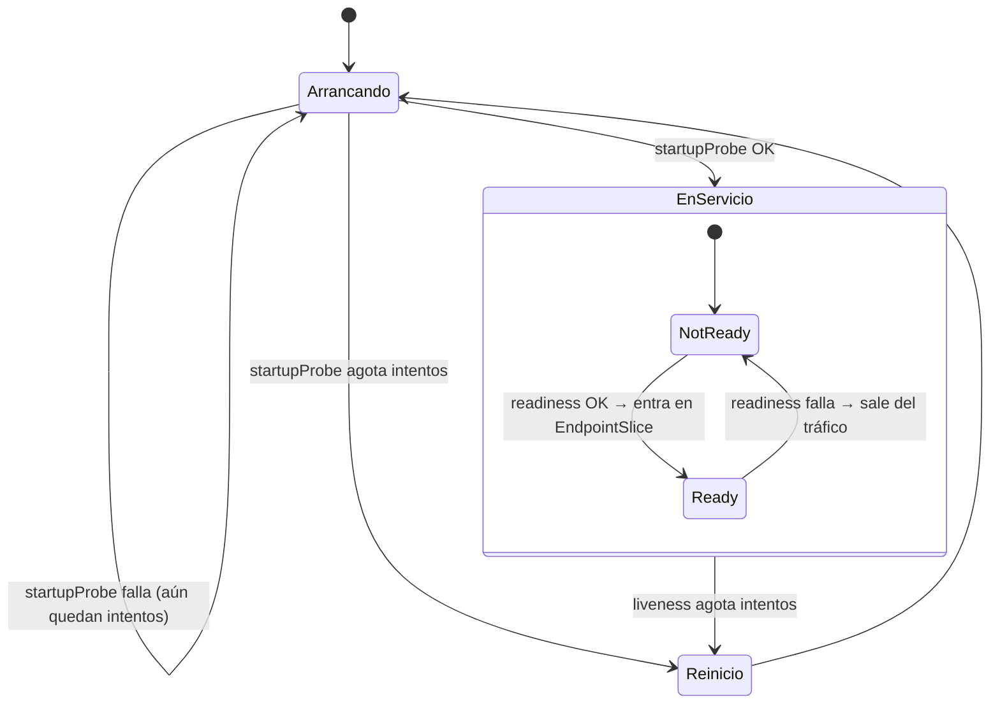

# 07 - Salud, fiabilidad y despliegues

> Probes, auto-recuperación, rolling updates, rollbacks y estrategias de despliegue. Es el bloque **más preguntado** en entrevistas y el que más incidentes evita.

## Contenido
- [[#Liveness vs Readiness vs Startup]]
- [[#Configurar probes correctamente]]
- [[#Self-healing y restart policies]]
- [[#Rolling update por dentro]]
- [[#Rollbacks]]
- [[#PodDisruptionBudget]]
- [[#Estrategias de despliegue]]
- [[#Checklist de despliegue sin downtime]]
- [[#🧠 Practica]]

---

## Liveness vs Readiness vs Startup

| | **Startup** | **Readiness** | **Liveness** |
|---|---|---|---|
| Pregunta | "¿Ya **terminó de arrancar**?" | "¿Puedo **recibir tráfico** ahora?" | "¿Sigo **vivo** o estoy colgado?" |
| Si falla | Al agotar intentos → reinicia el contenedor | **Se quita del Service** (sin reiniciar) | **Reinicia** el contenedor |
| Cuándo corre | Solo al arrancar; mientras no pasa, las otras dos **no se ejecutan** | Durante toda la vida del contenedor | Tras pasar la startup, toda la vida |
| Para qué | Apps de arranque lento (migraciones, *warm-up*, JIT) | Arranque, sobrecarga temporal, dependencia crítica caída, *draining* | Deadlocks, bucles infinitos, estados irrecuperables |
| Riesgo si se configura mal | Bajo | Si depende de la BD: **todas** las réplicas salen de rotación a la vez | **Reinicios en cascada** que tumban un servicio que solo iba lento |



> [!important] Regla de oro
> - **Readiness** puede comprobar dependencias **imprescindibles y locales** con cuidado; **liveness nunca** debe comprobar dependencias externas (BD, Redis, otra API). Si la BD cae, reiniciar todos tus Pods no la arregla: solo añade una tormenta de reinicios.
> - **Liveness debe ser barata y "tonta"**: ¿el proceso responde? Nada más.

---

## Configurar probes correctamente

### Parámetros
| Campo | Defecto | Significado |
|---|---|---|
| `initialDelaySeconds` | 0 | Espera antes de la primera prueba (con startupProbe casi nunca hace falta) |
| `periodSeconds` | 10 | Cada cuánto |
| `timeoutSeconds` | 1 | Tiempo máximo por prueba (**1 s es poco** para apps con GC o bajo carga) |
| `failureThreshold` | 3 | Fallos seguidos para considerarla fallida |
| `successThreshold` | 1 | Éxitos seguidos para volver a OK (solo readiness puede ser > 1) |

Tipos: `httpGet` (2xx/3xx = OK), `tcpSocket`, `exec` (código 0), `grpc` (GA en 1.27).

### YAML: API con arranque lento
```yaml
containers:
  - name: api
    image: ghcr.io/acme/api:1.4.2
    ports: [{ name: http, containerPort: 8080 }]
    startupProbe:
      httpGet: { path: /health/live, port: http }
      periodSeconds: 5
      failureThreshold: 24          # hasta 2 minutos para arrancar
    readinessProbe:
      httpGet: { path: /health/ready, port: http }
      periodSeconds: 5
      timeoutSeconds: 2
      failureThreshold: 2           # sale rápido de rotación
    livenessProbe:
      httpGet: { path: /health/live, port: http }
      periodSeconds: 10
      timeoutSeconds: 3
      failureThreshold: 3           # ~30 s antes de reiniciar: tolerante
```

> [!tip] Tiempo hasta acción
> Tiempo de reacción ≈ `periodSeconds × failureThreshold`. Readiness: rápido (10 s). Liveness: tolerante (30-60 s). Startup: el peor caso de arranque con margen.

### Errores comunes
| Error | Consecuencia |
|---|---|
| Misma ruta y parámetros para liveness y readiness | O no sales de rotación a tiempo, o te reinician por sobrecarga temporal |
| Liveness que consulta la BD | Caída de la BD → reinicio de todos los Pods → la BD recibe una avalancha de conexiones al volver |
| Liveness sin startupProbe en app lenta | Se reinicia antes de terminar de arrancar → `CrashLoopBackOff` eterno |
| `timeoutSeconds: 1` con GC largos | Falsos negativos bajo carga |
| Sin readiness | El Pod recibe tráfico antes de estar listo → errores en cada despliegue y escalado |
| Probe al puerto de un sidecar | Comprueba el proxy, no tu app |

Implementación de los endpoints en ASP.NET Core: [[13 - Kubernetes para .NET#Health checks y probes]].

---

## Self-healing y restart policies

| Fallo | Quién lo repara | Cómo |
|---|---|---|
| El proceso termina con error | **kubelet** | Reinicia el contenedor según `restartPolicy` con *backoff* exponencial (10 s, 20 s, 40 s… hasta 5 min) → estado `CrashLoopBackOff` entre intentos |
| La liveness falla | **kubelet** | Reinicia el contenedor |
| El Pod se borra o es desalojado | **Controlador** (ReplicaSet, StatefulSet, DaemonSet, Job) | Crea un Pod nuevo |
| Cae el nodo | Node controller + controlador del workload | Tras ~5 min, desaloja y recrea en otro nodo |
| Falla un rollout | **Nadie automáticamente** | El rollout se queda atascado; rollback manual o automatizado |

> [!info] `CrashLoopBackOff` no es un error en sí
> Es el **estado de espera entre reinicios**. La causa está en `kubectl logs <pod> --previous` (logs del contenedor que murió) y en `kubectl describe pod` (`Last State: Terminated, Reason: OOMKilled / Error, Exit Code`). Guía en [[16 - Troubleshooting#CrashLoopBackOff]].

---

## Rolling update por dentro

### Concepto
Al cambiar `spec.template`, el Deployment crea un ReplicaSet nuevo y va **subiendo el nuevo y bajando el viejo** respetando dos límites:

- `maxSurge`: cuántos Pods **por encima** de `replicas` se permiten (más capacidad temporal).
- `maxUnavailable`: cuántos Pods **por debajo** de `replicas` pueden estar no disponibles.

### Ejemplo: `replicas: 4`, `maxSurge: 1`, `maxUnavailable: 0`
```text
Paso   RS viejo (v1)   RS nuevo (v2)   Ready totales
0      4 Ready         0               4
1      4 Ready         1 (arrancando)  4    ← surge: 5 Pods en total
2      4 → 3           1 Ready         4    ← v2 pasa readiness: se baja un v1
3      3 Ready         2 (arrancando)  4
...    ...             ...             4    ← nunca baja de 4
n      0               4 Ready         4
```
| Configuración | Efecto |
|---|---|
| `maxSurge: 25%`, `maxUnavailable: 25%` (defecto) | Equilibrio; puede perder 25 % de capacidad durante el rollout |
| `maxSurge: 1`, `maxUnavailable: 0` | **Sin pérdida de capacidad**, más lento, necesita hueco para 1 Pod extra |
| `maxSurge: 0`, `maxUnavailable: 1` | Sin recursos extra (clúster justo), pierde capacidad |
| `type: Recreate` | Borra todo y luego crea: **downtime**, pero nunca conviven dos versiones (migraciones incompatibles, apps que no soportan dos instancias) |

> [!tip] `minReadySeconds`
> Un Pod nuevo cuenta como disponible solo tras estar Ready durante N segundos: atrapa versiones que arrancan bien pero fallan al poco tiempo.

> [!warning] Dos versiones conviven
> Durante el rolling update v1 y v2 sirven **a la vez**. Las APIs, mensajes y esquemas de BD deben ser **compatibles hacia atrás**: migraciones *expand → migrate → contract* en varios despliegues.

---

## Rollbacks

```bash
kubectl rollout history deploy/api -n shop
kubectl rollout history deploy/api --revision=3 -n shop     # qué cambió
kubectl rollout undo deploy/api -n shop                     # a la anterior
kubectl rollout undo deploy/api --to-revision=2 -n shop
```
- Un rollback es **otro rollout** hacia la plantilla de un ReplicaSet anterior (se convierte en una revisión nueva).
- Solo revierte el **Deployment**: no revierte ConfigMaps, Secrets ni migraciones de BD.
- Con GitOps, el rollback correcto es **revertir el commit** (si haces `rollout undo`, Argo CD/Flux lo volverán a cambiar). Con Helm: `helm rollback` revierte todos los objetos del release ([[Helm]]).

---

## PodDisruptionBudget

### Concepto
Un **PDB** limita cuántos Pods de una aplicación pueden estar caídos **por interrupciones voluntarias**: `kubectl drain`, actualizaciones de nodos del proveedor, Cluster Autoscaler reduciendo nodos.

### ¿Por qué existe?
Sin PDB, actualizar el clúster puede drenar a la vez los nodos donde están todas tus réplicas.

### YAML
```yaml
apiVersion: policy/v1
kind: PodDisruptionBudget
metadata: { name: api, namespace: shop }
spec:
  minAvailable: 2                  # o maxUnavailable: 1
  selector:
    matchLabels: { app.kubernetes.io/name: api }
```

> [!warning] PDB mal dimensionado bloquea el mantenimiento
> `minAvailable: 3` con `replicas: 3` → `drain` se queda esperando para siempre y la actualización del node pool falla. Usa `maxUnavailable: 1` o `minAvailable` < réplicas. Un PDB **no** protege de fallos involuntarios (caída de nodo, OOM).

---

## Estrategias de despliegue

| Estrategia | Cómo | Downtime | Riesgo | Coste | Nativa en K8s |
|---|---|---|---|---|---|
| **Recreate** | Para v1, arranca v2 | Sí | Alto | Bajo | ✔ `strategy: Recreate` |
| **Rolling update** | Sustitución gradual | No | Medio (todo el tráfico migra) | Bajo | ✔ por defecto |
| **Blue/Green** | v2 completa en paralelo; se cambia el tráfico de golpe | No | Bajo: rollback instantáneo | **2× recursos** durante el cambio | ✘ (dos Deployments + cambiar el selector del Service, o Argo Rollouts) |
| **Canary** | Un % del tráfico a v2, se sube si las métricas van bien | No | **Muy bajo** | Medio | ✘ (Gateway API con pesos, mesh, Argo Rollouts, Flagger) |
| **A/B testing** | Tráfico a v2 según cabecera, cookie, usuario | No | Bajo | Medio | ✘ (Gateway API / mesh) |
| **Shadow / mirroring** | Copia del tráfico a v2, respuestas descartadas | No | Nulo para el usuario | Medio-alto | ✘ (Gateway API `RequestMirror`, mesh) |

### Blue/Green manual con un Service
```yaml
apiVersion: v1
kind: Service
metadata: { name: api, namespace: shop }
spec:
  selector:
    app.kubernetes.io/name: api
    track: blue            # cambiar a "green" cuando v2 esté verificada → corte instantáneo
  ports: [{ port: 80, targetPort: http }]
```
```bash
kubectl patch svc api -n shop -p '{"spec":{"selector":{"app.kubernetes.io/name":"api","track":"green"}}}'
```

### Canary automatizado con Argo Rollouts (resumen)
```yaml
apiVersion: argoproj.io/v1alpha1
kind: Rollout
metadata: { name: api }
spec:
  replicas: 5
  strategy:
    canary:
      steps:
        - setWeight: 10
        - pause: { duration: 5m }
        - analysis: { templates: [{ templateName: error-rate }] }   # consulta Prometheus; aborta si falla
        - setWeight: 50
        - pause: { duration: 10m }
  # selector y template como en un Deployment
```
**Progressive delivery** = canary + análisis automático de métricas + rollback automático. Es la respuesta Senior a "¿cómo despliegas con seguridad?".

---

## Checklist de despliegue sin downtime

- [ ] ≥ 2 réplicas (idealmente ≥ 3 repartidas por zonas con topology spread)
- [ ] `readinessProbe` correcta (y `startupProbe` si el arranque es lento)
- [ ] `strategy.rollingUpdate.maxUnavailable: 0` (o asumido conscientemente)
- [ ] Gestión de `SIGTERM`: dejar de aceptar, terminar lo pendiente; `preStop` con espera de 5-10 s
- [ ] `terminationGracePeriodSeconds` > tiempo de la petición más larga + preStop
- [ ] PodDisruptionBudget
- [ ] Cambios de BD y de contrato compatibles hacia atrás
- [ ] `kubectl rollout status` (o equivalente) como *gate* del pipeline, con rollback automático si falla
- [ ] Métricas y alertas de error/latencia observadas durante el rollout
- [ ] Recursos de reserva para el `maxSurge` (o Cluster Autoscaler)

---

## 🧠 Practica

> [!question]- Escenario: cada despliegue produce unos segundos de errores 502 en el Ingress
> Causa típica: los Pods viejos reciben tráfico mientras se están cerrando (carrera entre la retirada del endpoint y el `SIGTERM`) o los nuevos reciben tráfico antes de estar listos. Solución: readiness probe real, `preStop` con `sleep 5-10`, cierre ordenado de la app, `maxUnavailable: 0` y, en el controlador de Ingress/Gateway, que use los endpoints actualizados (la mayoría lo hace).

> [!question]- ¿Qué pasaría si…? La readiness de tu API comprueba la base de datos, y la BD tiene 20 s de corte
> Todas las réplicas pasan a NotReady a la vez → el Service se queda **sin endpoints** → errores 503 inmediatos en lugar de reintentos o respuestas degradadas. A veces es lo deseado (que el LB externo falle sobre otra región), pero normalmente es mejor que la app gestione el fallo (circuit breaker, caché, error controlado) y la readiness solo refleje si **esta instancia** puede servir. Ver [[Circuit Breaker]].

> [!question]- Entrevista Senior: "¿Cómo harías un despliegue sin downtime de un cambio que renombra una columna?"
> En **tres despliegues** (*expand/contract*): 1) añadir la columna nueva y escribir en ambas; 2) migrar datos y leer de la nueva; 3) eliminar la vieja cuando ninguna versión la use. Cada paso con rolling update y readiness. **Evalúan**: que sepas que v1 y v2 conviven. **Evita**: "uso Recreate" o "lo hago de madrugada".

> [!question]- Quiz: tu Pod está `Running` pero `READY 0/1` desde hace 10 minutos. ¿Recibe tráfico? ¿Se reinicia?
> **No** recibe tráfico (readiness falla → fuera de endpoints). **No** se reinicia (eso solo lo hace la liveness). Revisa `kubectl describe pod` (eventos `Readiness probe failed`) y prueba el endpoint con `kubectl port-forward`.

> [!example] Laboratorio
> [[15 - Laboratorios#Lab 02 - Workloads, rollouts y rollbacks]] y [[15 - Laboratorios#Lab 05 - Probes, fallos y troubleshooting]].

### Relacionado
- [[Workloads#Deployment]] · [[kubelet]] · [[Circuit Breaker]] · [[Retry con Backoff Exponencial]] · [[Docker en producción#Reinicios y healthchecks]]
- Anterior: [[06 - Scheduling y recursos]] · Siguiente: [[08 - Escalado]]
