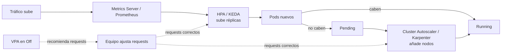

# 08 - Escalado

> Nivel 6 del [[00 - Kubernetes - Índice#📈 Roadmap|roadmap]]. Requisito: [[06 - Scheduling y recursos#Requests y limits|requests y limits]] (sin requests no hay autoescalado fiable).

## Contenido
- [[#Las tres dimensiones del escalado]]
- [[#Escalado manual]]
- [[#Metrics Server]]
- [[#Horizontal Pod Autoscaler]]
- [[#KEDA]]
- [[#Vertical Pod Autoscaler]]
- [[#Cluster Autoscaler y Karpenter]]
- [[#Cómo interactúan]]
- [[#🧠 Practica]]

---

## Las tres dimensiones del escalado

| Qué escala | Herramienta | Señal | Velocidad |
|---|---|---|---|
| **Número de Pods** | HPA (o KEDA) | CPU, memoria, métricas custom/externas (cola, RPS) | Segundos a 1-2 min |
| **Tamaño de cada Pod** (requests) | VPA | Uso histórico | Minutos-horas (requiere recrear el Pod, salvo *in-place resize*) |
| **Número de nodos** | Cluster Autoscaler / Karpenter / NAP | **Pods `Pending`** por falta de recursos, y nodos infrautilizados | Minutos (arrancar VMs) |

---

## Escalado manual

```bash
kubectl scale deploy/api --replicas=6 -n shop
kubectl scale statefulset/kafka --replicas=5 -n data
```
Útil para emergencias y entornos sin carga variable. Con HPA activo, el HPA **sobrescribe** el valor en su siguiente ciclo.

---

## Metrics Server

### Concepto
Agregador ligero que recoge CPU y memoria de cada kubelet (cada ~15 s) y los expone en la **Metrics API** (`metrics.k8s.io`). Lo usan `kubectl top`, el HPA y el VPA.

> [!warning] No es un sistema de monitorización
> Solo guarda el **último valor**, sin histórico. Para dashboards y alertas: Prometheus ([[10 - Observabilidad]]). Viene instalado en AKS/EKS (como add-on)/GKE; en kind hay que instalarlo (con `--kubelet-insecure-tls` en labs).

```bash
kubectl apply -f https://github.com/kubernetes-sigs/metrics-server/releases/latest/download/components.yaml
kubectl top nodes
kubectl top pods -n shop --containers
```

---

## Horizontal Pod Autoscaler

### Concepto
Controlador que ajusta `replicas` de un Deployment/StatefulSet para mantener una métrica en un objetivo.

### ¿Qué ocurre internamente?
Cada 15 s:
```text
réplicas deseadas = ceil( réplicas actuales × valor actual / valor objetivo )

Ej.: 4 réplicas, CPU media 90 % de su REQUEST, objetivo 60 %  →  ceil(4 × 90/60) = 6
```
> [!important] El porcentaje de CPU es **sobre los requests**, no sobre el límite ni sobre el nodo
> Sin `requests.cpu` el HPA por CPU **no funciona** (`<unknown>` en `kubectl get hpa`). Con requests inflados, nunca escala.

### YAML (autoscaling/v2)
```yaml
apiVersion: autoscaling/v2
kind: HorizontalPodAutoscaler
metadata: { name: api, namespace: shop }
spec:
  scaleTargetRef: { apiVersion: apps/v1, kind: Deployment, name: api }
  minReplicas: 3
  maxReplicas: 30
  metrics:
    - type: Resource
      resource:
        name: cpu
        target: { type: Utilization, averageUtilization: 60 }
    - type: Pods                                   # métrica custom (requiere Prometheus Adapter o similar)
      pods:
        metric: { name: http_requests_per_second }
        target: { type: AverageValue, averageValue: "50" }
  behavior:
    scaleUp:
      stabilizationWindowSeconds: 0
      policies:
        - { type: Percent, value: 100, periodSeconds: 30 }   # puede duplicar cada 30 s
    scaleDown:
      stabilizationWindowSeconds: 300                        # espera 5 min antes de bajar (evita "flapping")
      policies:
        - { type: Pods, value: 2, periodSeconds: 60 }
```
Con varias métricas, el HPA calcula réplicas para cada una y **usa la mayor**.

```bash
kubectl autoscale deploy api --cpu-percent=60 --min=3 --max=30 -n shop   # versión imperativa
kubectl get hpa -n shop -w
kubectl describe hpa api -n shop     # eventos y condiciones (AbleToScale, ScalingLimited...)
```

### Errores comunes
- HPA por **memoria** en .NET/Java: la memoria del runtime no baja al bajar la carga (GC, heap) → nunca reduce réplicas.
- `replicas` fijado en el manifiesto con GitOps/`kubectl apply` → pelea con el HPA.
- `minReplicas: 1` en producción: sin redundancia.
- Escalar una app cuyo cuello de botella es la BD: más Pods = más conexiones = peor.

---

## KEDA

### Concepto
**KEDA** (Kubernetes Event-Driven Autoscaling, proyecto CNCF graduado) escala según **eventos externos**: longitud de una cola (Azure Service Bus, RabbitMQ, Kafka lag, SQS), métricas de Prometheus, cron, HTTP... y puede **escalar a cero**. Por debajo crea y gestiona un HPA.

### ¿Cuándo utilizarlo?
Workers que procesan colas: la CPU es mala señal (un worker esperando mensajes no consume CPU, pero la cola crece).

### YAML
```yaml
apiVersion: keda.sh/v1alpha1
kind: ScaledObject
metadata: { name: orders-worker, namespace: shop }
spec:
  scaleTargetRef: { name: orders-worker }
  minReplicaCount: 0
  maxReplicaCount: 50
  triggers:
    - type: azure-servicebus
      metadata:
        queueName: orders
        messageCount: "20"          # 1 réplica por cada 20 mensajes pendientes
      authenticationRef: { name: servicebus-workload-identity }
```
Relación con [[00 - Indice y ruta de estudio|Azure Service Bus]].

---

## Vertical Pod Autoscaler

### Concepto
Recomienda (o aplica) **requests** de CPU y memoria según el uso histórico.

| `updateMode` | Comportamiento |
|---|---|
| `Off` | Solo **recomienda** (en `status`). **El modo más útil y seguro**: para dimensionar |
| `Initial` | Aplica solo al crear Pods |
| `Recreate` / `Auto` | Desaloja Pods para recrearlos con los nuevos valores |
| `InPlaceOrRecreate` | Usa el **redimensionado en caliente** (*in-place pod resize*, beta y activo desde Kubernetes 1.33) cuando es posible; requiere una versión reciente de VPA |

### YAML
```yaml
apiVersion: autoscaling.k8s.io/v1
kind: VerticalPodAutoscaler
metadata: { name: api, namespace: shop }
spec:
  targetRef: { apiVersion: apps/v1, kind: Deployment, name: api }
  updatePolicy: { updateMode: "Off" }
  resourcePolicy:
    containerPolicies:
      - containerName: api
        minAllowed: { cpu: 50m, memory: 128Mi }
        maxAllowed: { cpu: 2, memory: 2Gi }
```
```bash
kubectl describe vpa api -n shop     # Target / Lower Bound / Upper Bound recomendados
```

> [!warning] HPA y VPA sobre la misma métrica = conflicto
> Si el HPA escala por CPU y el VPA cambia los requests de CPU, la utilización (uso/request) cambia y los dos se persiguen. Combinaciones seguras: **VPA en `Off`** para recomendar + HPA; o HPA por métricas custom/externas + VPA en CPU/memoria. Ver [[18 - Trade-offs#HPA vs VPA]].

---

## Cluster Autoscaler y Karpenter

### Concepto
- **Cluster Autoscaler (CA)**: añade nodos a un **grupo de nodos** existente (node pool / ASG / VMSS) cuando hay Pods `Pending` por falta de recursos, y elimina nodos infrautilizados cuyos Pods caben en otros.
- **Karpenter** (AWS, ahora también como base de **Node Auto Provisioning** en AKS): no usa grupos fijos; **elige el tipo de VM óptimo** para los Pods pendientes, consolida nodos y gestiona spot. EKS Auto Mode lo integra.
- **GKE Autopilot**: el proveedor gestiona nodos por completo; pagas por Pod.

### ¿Qué ocurre internamente?
```text
Pod Pending (FailedScheduling: Insufficient cpu)
   → CA simula: ¿cabría si añado un nodo del pool X?
   → aumenta el pool → la VM arranca (1-5 min) → el nodo se registra → el scheduler coloca el Pod
Scale down: nodo < ~50 % de requests durante 10 min y sus Pods caben en otros
   → cordon + drain (respetando PDBs) → borra la VM
```

> [!warning] Lo que bloquea el scale down
> Pods sin controlador, Pods con `emptyDir`/almacenamiento local (según configuración), PDBs que no permiten interrupción, anotación `cluster-autoscaler.kubernetes.io/safe-to-evict: "false"`, Pods del sistema sin PDB. Resultado típico: **nodos casi vacíos que no se eliminan** y factura alta.

> [!tip] Capacidad de reserva (*overprovisioning*)
> Para que los picos no esperen a que arranque una VM: Pods "globo" de baja `PriorityClass` que ocupan hueco y se desalojan al instante cuando llegan Pods reales, forzando al CA a añadir un nodo en segundo plano.

---

## Cómo interactúan



**Cadena de dependencias:** requests correctos → HPA calcula bien → el scheduler sabe si caben → el CA añade los nodos justos. Unos requests malos estropean **todo** el autoescalado.

---

## 🧠 Practica

> [!question]- Troubleshooting: `kubectl get hpa` muestra `TARGETS: <unknown>/60%`
> Metrics Server no instalado o no responde (`kubectl top pods` falla), o el Deployment **no define `requests.cpu`**, o los Pods aún no reportan métricas. `kubectl describe hpa` indica el motivo (`FailedGetResourceMetric`).

> [!question]- ¿Qué pasaría si…? Llega un pico de tráfico ×10 en 30 segundos
> El HPA reacciona en ~15-60 s (según `behavior`), los Pods nuevos necesitan arrancar y pasar readiness, y si no hay nodos libres el CA tarda minutos. Durante ese hueco: latencia y errores. Mitigaciones: `minReplicas` más alto en horas punta (o KEDA con trigger cron), *overprovisioning*, arranque rápido de la app, rate limiting en la entrada, colas para absorber.

> [!question]- Entrevista: "¿HPA vs VPA vs Cluster Autoscaler?"
> HPA: más/menos **Pods** según métricas. VPA: **tamaño** (requests) de cada Pod. CA: más/menos **nodos** según Pods pendientes y utilización. Se complementan: VPA (recomendación) dimensiona, HPA absorbe carga, CA aporta capacidad. No combinar HPA y VPA automáticos sobre la misma métrica. **Evalúan**: que veas la cadena requests → HPA → scheduler → CA.

> [!question]- Arquitectura: worker que consume una cola con picos nocturnos y nada de día
> KEDA con trigger de la cola, `minReplicaCount: 0`, node pool spot con Cluster Autoscaler/Karpenter que baja a 0 nodos. Coste casi nulo de día. Asegura idempotencia y `terminationGracePeriodSeconds` suficiente para terminar mensajes en curso.

> [!example] Laboratorio
> [[15 - Laboratorios#Lab 07 - Autoescalado con HPA]]: genera carga y observa el HPA escalar y desescalar.

### Relacionado
- [[06 - Scheduling y recursos]] · [[Límites de recursos]] (Docker) · [[Docker Swarm#Escalado, actualizaciones y rollback]]
- Anterior: [[07 - Salud, fiabilidad y despliegues]] · Siguiente: [[09 - Seguridad]]
