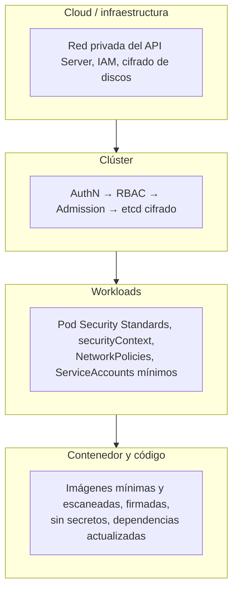

# 09 - Seguridad

> Nivel 5 del [[00 - Kubernetes - Índice#📈 Roadmap|roadmap]]. De la petición al API Server hasta el contenedor. Principio rector: **mínimo privilegio** y **defensa en profundidad**.

## Contenido
- [[#El modelo de capas]]
- [[#Autenticación]]
- [[#Autorización con RBAC]]
- [[#ServiceAccounts]]
- [[#Admission control y políticas]]
- [[#Pod Security Standards]]
- [[#securityContext]]
- [[#Seguridad de imágenes y cadena de suministro]]
- [[#Checklist de seguridad]]
- [[#🧠 Practica]]

---

## El modelo de capas



> [!important] Las preguntas que hace un atacante (y tu revisión de seguridad)
> 1. ¿Puedo llegar al API Server? 2. ¿Con qué identidad y permisos? 3. Si comprometo un Pod, ¿qué token tiene montado y qué puede hacer con él? 4. ¿Puedo escapar al nodo (root, privileged, hostPath)? 5. ¿A qué otros Pods y servicios puedo conectar? 6. ¿Qué secretos puedo leer?

---

## Autenticación

### Concepto
Kubernetes **no tiene base de datos de usuarios**. Quién eres lo determina:
| Tipo | Mecanismo |
|---|---|
| **Humanos** | OIDC (Entra ID, Google, Okta), certificados de cliente (kubeadm, solo para emergencias), plugins del proveedor (`kubelogin` en AKS, `aws eks get-token`) |
| **Procesos dentro del clúster** | **ServiceAccounts** con tokens proyectados (JWT de corta duración) |
| **Workloads hacia la nube** | **Workload Identity**: federación del token de la ServiceAccount con Entra ID / IAM / Google IAM ([[12 - Kubernetes en la nube#Identidades de workload]]) |

> [!warning] Cuentas locales y certificados de admin
> El kubeconfig de admin con certificado (`clusterAdmin`) **no se puede revocar** fácilmente. En AKS, desactiva las cuentas locales (`--disable-local-accounts`) y usa Entra ID + RBAC.

---

## Autorización con RBAC

### Concepto
| Objeto | Ámbito | Qué es |
|---|---|---|
| **Role** | Namespace | Conjunto de permisos (verbos sobre recursos) en un namespace |
| **ClusterRole** | Clúster | Permisos a nivel de clúster, o una "plantilla" reutilizable en varios namespaces |
| **RoleBinding** | Namespace | Asigna un Role **o un ClusterRole** a sujetos **dentro de un namespace** |
| **ClusterRoleBinding** | Clúster | Asigna un ClusterRole en **todo** el clúster |

Sujetos: `User`, `Group` (del proveedor de identidad) y `ServiceAccount`. RBAC es **solo aditivo**: no hay reglas de denegación.

Verbos: `get`, `list`, `watch`, `create`, `update`, `patch`, `delete`, `deletecollection`, y especiales como `impersonate`, `escalate`, `bind`.

### YAML: equipo de desarrollo con acceso de solo lectura en producción y despliegue vía pipeline
```yaml
# Lectura en el namespace shop para el grupo de Entra ID del equipo
apiVersion: rbac.authorization.k8s.io/v1
kind: RoleBinding
metadata: { name: shop-devs-view, namespace: shop }
roleRef: { apiGroup: rbac.authorization.k8s.io, kind: ClusterRole, name: view }   # ClusterRole integrado
subjects:
  - { kind: Group, name: "0f3c1a2b-...-grupo-devs", apiGroup: rbac.authorization.k8s.io }
---
# Permisos justos para el pipeline de despliegue
apiVersion: rbac.authorization.k8s.io/v1
kind: Role
metadata: { name: deployer, namespace: shop }
rules:
  - apiGroups: ["apps"]
    resources: ["deployments"]
    verbs: ["get", "list", "watch", "create", "update", "patch"]
  - apiGroups: [""]
    resources: ["services", "configmaps"]
    verbs: ["get", "list", "create", "update", "patch"]
---
apiVersion: rbac.authorization.k8s.io/v1
kind: RoleBinding
metadata: { name: deployer, namespace: shop }
roleRef: { apiGroup: rbac.authorization.k8s.io, kind: Role, name: deployer }
subjects:
  - { kind: ServiceAccount, name: ci-deployer, namespace: shop }
```

ClusterRoles integrados útiles: `view` (sin Secrets), `edit`, `admin` (namespace), `cluster-admin` (todo).

```bash
kubectl auth can-i create deployments -n shop --as=system:serviceaccount:shop:ci-deployer
kubectl auth can-i --list -n shop --as=jorge@acme.com
kubectl auth whoami                       # quién soy según el API Server (GA 1.28)
```

> [!warning] Permisos peligrosos que parecen inocentes
> | Permiso | Por qué es peligroso |
> |---|---|
> | `create pods` | Puede montar **cualquier Secret** y ServiceAccount del namespace, o crear un Pod privilegiado |
> | `pods/exec` | Shell dentro de cualquier Pod: acceso a sus secretos y su red |
> | `get/list secrets` | `list` devuelve el **contenido** de todos los Secrets |
> | `create rolebindings`, `bind`, `escalate` | Escalada de privilegios |
> | `nodes/proxy`, `impersonate` | Acceso al kubelet / suplantación |
> | `*` en cualquier cosa | Revisa por qué |

---

## ServiceAccounts

### Concepto
La identidad de los **procesos** dentro de un Pod. Cada namespace tiene una SA `default`; cada Pod usa una SA (la `default` si no indicas otra), y el kubelet le monta un **token proyectado** que caduca y se rota.

### Buenas prácticas
```yaml
apiVersion: v1
kind: ServiceAccount
metadata: { name: api, namespace: shop }
automountServiceAccountToken: false       # la mayoría de apps NO necesita hablar con el API Server
---
# En el Pod
spec:
  serviceAccountName: api
  automountServiceAccountToken: false
```
- **Una SA por aplicación**, nunca la `default` con permisos.
- `automountServiceAccountToken: false` salvo que la app use la API de Kubernetes (operadores, herramientas).
- La SA también es la base de **Workload Identity** hacia la nube.

---

## Admission control y políticas

### Concepto
Tras autenticar y autorizar, la petición pasa por los **admission controllers**:
- **Mutating**: modifican el objeto (inyectar sidecars, añadir valores por defecto, LimitRange).
- **Validating**: aceptan o rechazan (Pod Security Admission, ResourceQuota, políticas propias).

Para imponer **reglas propias** ("ninguna imagen `:latest`", "todos los Pods con requests", "solo imágenes de nuestro registro"):

| Herramienta | Lenguaje | Notas |
|---|---|---|
| **ValidatingAdmissionPolicy** | CEL, nativo | **GA desde 1.30**: sin componentes extra; ideal para reglas sencillas |
| **Kyverno** | YAML | Validar, mutar, **generar** recursos y verificar firmas de imágenes |
| **OPA Gatekeeper** | Rego | Muy potente, curva mayor |

```yaml
apiVersion: admissionregistration.k8s.io/v1
kind: ValidatingAdmissionPolicy
metadata: { name: no-latest-tag }
spec:
  failurePolicy: Fail
  matchConstraints:
    resourceRules:
      - apiGroups: ["apps"]
        apiVersions: ["v1"]
        operations: ["CREATE", "UPDATE"]
        resources: ["deployments"]
  validations:
    - expression: "object.spec.template.spec.containers.all(c, !c.image.endsWith(':latest') && c.image.contains(':'))"
      message: "Las imágenes deben llevar una versión explícita (no :latest)"
---
apiVersion: admissionregistration.k8s.io/v1
kind: ValidatingAdmissionPolicyBinding
metadata: { name: no-latest-tag }
spec:
  policyName: no-latest-tag
  validationActions: [Deny]
```

---

## Pod Security Standards

### Concepto
Tres perfiles estándar de seguridad para Pods, aplicados por el admission controller integrado **Pod Security Admission** mediante **labels en el namespace**:

| Perfil | Qué permite | Para |
|---|---|---|
| `privileged` | Todo | Componentes del sistema (CNI, CSI, agentes) |
| `baseline` | Bloquea lo claramente peligroso: `privileged`, `hostNetwork`, `hostPID`, `hostPath`, capacidades extra | Mínimo para cualquier app |
| `restricted` | Además: **no root**, `allowPrivilegeEscalation: false`, `drop: ["ALL"]`, `seccompProfile: RuntimeDefault` | **Objetivo** para apps |

Modos: `enforce` (rechaza), `audit` (registra), `warn` (avisa al usuario).

```yaml
apiVersion: v1
kind: Namespace
metadata:
  name: shop
  labels:
    pod-security.kubernetes.io/enforce: restricted
    pod-security.kubernetes.io/enforce-version: latest
    pod-security.kubernetes.io/warn: restricted
```

> [!info] PodSecurityPolicy (PSP) ya no existe
> Se **eliminó en 1.25**. Cualquier tutorial con `kind: PodSecurityPolicy` está obsoleto: usa Pod Security Admission (+ Kyverno/Gatekeeper/VAP para reglas finas).

---

## securityContext

### YAML: contenedor que cumple `restricted`
```yaml
spec:
  securityContext:                    # nivel Pod
    runAsNonRoot: true
    runAsUser: 1654                   # p. ej. el usuario "app" de las imágenes oficiales de .NET 8+
    runAsGroup: 1654
    fsGroup: 1654                     # propietario de los volúmenes montados
    seccompProfile: { type: RuntimeDefault }
  containers:
    - name: api
      image: ghcr.io/acme/api:1.4.2
      securityContext:                # nivel contenedor
        allowPrivilegeEscalation: false
        readOnlyRootFilesystem: true
        capabilities: { drop: ["ALL"] }
      volumeMounts:
        - { name: tmp, mountPath: /tmp }   # escritura donde la app la necesite
  volumes:
    - name: tmp
      emptyDir: {}
```

| Campo | Mitiga |
|---|---|
| `runAsNonRoot` / `runAsUser` | Que un fallo en la app dé root dentro del contenedor (y facilite el escape) |
| `allowPrivilegeEscalation: false` | Binarios setuid, `sudo` |
| `readOnlyRootFilesystem` | Que el atacante descargue/modifique binarios |
| `capabilities.drop: ALL` | Capacidades del kernel innecesarias (`NET_RAW`, `SYS_ADMIN`...) |
| `seccompProfile: RuntimeDefault` | Llamadas al sistema peligrosas |
| **Nunca** `privileged: true`, `hostPID`, `hostNetwork`, `hostPath` en apps | Escape directo al nodo |

---

## Seguridad de imágenes y cadena de suministro

| Práctica | Herramientas |
|---|---|
| Imágenes mínimas (distroless, chiseled, Alpine) | [[Multi-stage y Distroless]], .NET *chiseled* |
| Escaneo de vulnerabilidades en CI y en el registro | Trivy, Grype, Docker Scout, Microsoft Defender for Containers, Amazon Inspector |
| Versiones fijas o por **digest** (`@sha256:`) | Política de admisión que lo exija |
| Solo registros permitidos | Kyverno/VAP; en AKS, Azure Policy |
| **Firma y verificación** de imágenes | Sigstore **cosign**, Notation (Notary v2); verificación en admisión con Kyverno / Ratify |
| SBOM y procedencia (SLSA) | Syft, `docker buildx --sbom --provenance`, GitHub Artifact Attestations |
| Detección en tiempo de ejecución | **Falco**, Defender for Containers, Tetragon |
| Registro privado con pull por identidad | ACR + identidad del kubelet (`az aks update --attach-acr`), ECR, Artifact Registry |

---

## Checklist de seguridad

- [ ] API Server privado o con IPs autorizadas; nada de kubeconfigs de admin compartidos
- [ ] Autenticación con el proveedor de identidad (Entra ID/OIDC); cuentas locales desactivadas
- [ ] RBAC por grupo, mínimo privilegio; `cluster-admin` solo para *break-glass*; revisión periódica con `kubectl auth can-i --list`
- [ ] Una ServiceAccount por app, sin token montado salvo necesidad
- [ ] Namespaces con Pod Security `restricted` (o `baseline` justificado)
- [ ] `securityContext` restrictivo en todas las apps
- [ ] NetworkPolicies *default deny* + permisos explícitos ([[04 - Networking y tráfico#NetworkPolicy]])
- [ ] Secrets cifrados en reposo con KMS; gestor externo; nada en git ([[05 - Configuración y almacenamiento#Secretos en producción]])
- [ ] Workload Identity para servicios cloud, sin claves
- [ ] Imágenes escaneadas, firmadas, de registros permitidos, sin `latest`
- [ ] Políticas de admisión (VAP/Kyverno) que lo impongan
- [ ] Logs de auditoría del API Server activados y enviados al SIEM
- [ ] Clúster y nodos actualizados (versión soportada, parches de SO)
- [ ] Detección en runtime (Falco/Defender)

---

## 🧠 Practica

> [!question]- Escenario: un atacante explota una RCE en tu API. ¿Qué limita el daño?
> `runAsNonRoot` + sin capacidades + `readOnlyRootFilesystem` (no puede instalar herramientas ni escalar); `automountServiceAccountToken: false` o SA sin permisos (no puede usar el API Server); NetworkPolicy de egress (no puede llegar a otros servicios ni a Internet para exfiltrar); Workload Identity con permisos mínimos (solo el blob que la app usa); detección en runtime (Falco alerta de una shell en el contenedor).

> [!question]- Quiz: ¿RoleBinding puede referenciar un ClusterRole?
> **Sí**, y es un patrón habitual: el ClusterRole define permisos reutilizables (`view`, `edit`) y el RoleBinding los concede **solo en su namespace**.

> [!question]- Entrevista Senior: "¿Cómo asegurarías un clúster de Kubernetes?"
> Por capas: acceso al API Server (privado, OIDC, sin cuentas locales) → RBAC mínimo por grupos y SA → admisión (PSS `restricted` + políticas de imágenes/recursos) → red (NetworkPolicies default deny, mTLS si hace falta) → secretos (KMS, gestor externo, Workload Identity) → cadena de suministro (escaneo, firma, SBOM) → runtime (Falco) → auditoría y actualizaciones. **Evalúan**: pensamiento por capas y priorización. **Evita**: enumerar herramientas sin explicar qué amenaza mitiga cada una.

> [!example] Laboratorio
> [[15 - Laboratorios#Lab 08 - Seguridad RBAC y NetworkPolicies]].

### Relacionado
- [[Secret]] · [[Confianza cero (Zero Trust)]] · [[Microsoft Entra ID]] · [[Azure RBAC]] · [[Docker en producción#Seguridad del servidor]]
- Anterior: [[08 - Escalado]] · Siguiente: [[10 - Observabilidad]]
