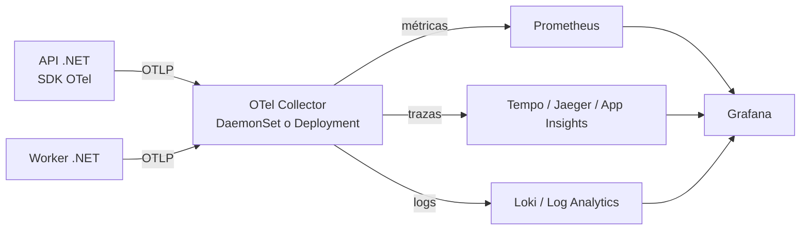

# 10 - Observabilidad

> Nivel 7 del [[00 - Kubernetes - Índice#📈 Roadmap|roadmap]]. Cómo saber **qué pasa**, **por qué** y **dónde**, antes de que lo diga el cliente.

## Contenido
- [[#Las señales]]
- [[#Logs]]
- [[#Métricas con Prometheus y Grafana]]
- [[#Trazas con OpenTelemetry]]
- [[#Eventos de Kubernetes]]
- [[#Dashboards y herramientas]]
- [[#Alerting]]
- [[#Estrategia de observabilidad paso a paso]]
- [[#🧠 Practica]]

---

## Las señales

| Señal | Responde | Ejemplo | Herramientas típicas |
|---|---|---|---|
| **Métricas** | ¿Cuánto? ¿Va bien? (agregado, barato) | p99 de latencia 800 ms, 2 % de errores 5xx | Prometheus, Azure Monitor managed Prometheus, Grafana |
| **Logs** | ¿Qué pasó exactamente? | `OrderService: payment declined for order 4812` | Fluent Bit → Loki / Elasticsearch / Azure Log Analytics |
| **Trazas** | ¿Dónde se fue el tiempo en una petición distribuida? | API 30 ms → Redis 2 ms → SQL 700 ms | OpenTelemetry → Jaeger / Tempo / Application Insights |
| **Eventos de K8s** | ¿Qué hizo el clúster? | `FailedScheduling`, `BackOff`, `OOMKilling` | `kubectl get events`, event exporter |
| **Perfiles** (*profiling*) | ¿Qué código consume CPU/memoria? | Hot path en serialización JSON | Pyroscope, dotnet-trace |

> [!important] Tres niveles a observar
> 1. **Infraestructura**: nodos (CPU, memoria, disco, red), Control Plane, etcd.
> 2. **Kubernetes**: estado de Pods, reinicios, OOMKilled, Pending, réplicas disponibles vs deseadas, HPA, PVCs.
> 3. **Aplicación**: las **4 señales doradas** (latencia, tráfico, errores, saturación) o **RED** (Rate, Errors, Duration) por servicio.

---

## Logs

### ¿Qué ocurre internamente?
1. La app escribe en **STDOUT/STDERR** (nunca a ficheros dentro del contenedor).
2. El runtime guarda la salida en ficheros del nodo (`/var/log/pods/...`), rotados por el kubelet.
3. Un **agente DaemonSet** (Fluent Bit, OpenTelemetry Collector, Azure Monitor Agent) los lee, añade metadatos (namespace, Pod, labels) y los envía a un backend.

```bash
kubectl logs deploy/api -n shop                 # un Pod del Deployment
kubectl logs -l app.kubernetes.io/name=api -n shop --prefix --tail=50
kubectl logs api-7d9f -c api --previous         # el contenedor ANTERIOR (tras un crash)
kubectl logs api-7d9f -f --since=10m
stern api -n shop                               # todos los Pods, en color
```

> [!warning] `kubectl logs` no es un sistema de logs
> Los logs desaparecen al borrarse el Pod o rotarse. En producción necesitas centralización con retención.

> [!tip] Logs estructurados
> JSON con campos fijos (`timestamp`, `level`, `message`, `traceId`, `spanId`, `orderId`) permite filtrar y correlacionar con trazas. En .NET: `AddJsonConsole()` o Serilog con formato compacto. Ver [[13 - Kubernetes para .NET#Logging y observabilidad]].

---

## Métricas con Prometheus y Grafana

### Concepto
**Prometheus** (CNCF graduado) **extrae** (*scrape*) métricas de endpoints `/metrics` cada N segundos, las guarda como series temporales y permite consultarlas con **PromQL**. **Grafana** las visualiza. El paquete habitual es el chart **kube-prometheus-stack** (Prometheus Operator + Grafana + Alertmanager + node-exporter + kube-state-metrics + reglas y dashboards).

| Fuente | Qué expone |
|---|---|
| **cAdvisor** (en el kubelet) | CPU, memoria, red y throttling por contenedor |
| **node-exporter** | Métricas del nodo (SO) |
| **kube-state-metrics** | **Estado de los objetos**: réplicas deseadas/disponibles, reinicios, fase de Pods, condiciones |
| **Tu app** | Métricas de negocio y RED (con OpenTelemetry o prometheus-net) |

### YAML: que Prometheus Operator recoja las métricas de tu API
```yaml
apiVersion: monitoring.coreos.com/v1
kind: ServiceMonitor
metadata:
  name: api
  namespace: shop
  labels: { release: kube-prometheus-stack }    # el selector que usa tu Prometheus
spec:
  selector:
    matchLabels: { app.kubernetes.io/name: api }
  endpoints:
    - port: http
      path: /metrics
      interval: 30s
```

### PromQL imprescindible
```promql
# Tasa de errores 5xx (%) por servicio
sum(rate(http_server_request_duration_seconds_count{http_response_status_code=~"5.."}[5m])) by (service)
/ sum(rate(http_server_request_duration_seconds_count[5m])) by (service) * 100

# Latencia p99
histogram_quantile(0.99, sum(rate(http_server_request_duration_seconds_bucket[5m])) by (le, service))

# Reinicios de contenedores en la última hora
increase(kube_pod_container_status_restarts_total[1h]) > 0

# Uso de memoria frente al límite
container_memory_working_set_bytes{container!=""} / on(namespace,pod,container)
  kube_pod_container_resource_limits{resource="memory"}

# Throttling de CPU (si es alto: límite de CPU demasiado bajo)
rate(container_cpu_cfs_throttled_periods_total[5m]) / rate(container_cpu_cfs_periods_total[5m])

# Deployments con réplicas no disponibles
kube_deployment_status_replicas_unavailable > 0
```

> [!warning] Cardinalidad
> Cada combinación de labels es una serie temporal. Un label con `userId` o `orderId` genera millones de series y tumba Prometheus. Usa labels de baja cardinalidad (servicio, ruta *plantilla* `/orders/{id}`, código de estado).

---

## Trazas con OpenTelemetry

### Concepto
**OpenTelemetry (OTel)** es el estándar CNCF para **instrumentar** aplicaciones y **transportar** trazas, métricas y logs (protocolo **OTLP**), independiente del backend. El **OpenTelemetry Collector** recibe, procesa (filtra, muestrea, enriquece con metadatos de Kubernetes) y exporta.



> [!tip] Propagación de contexto
> El `traceparent` (W3C Trace Context) viaja en cabeceras HTTP y en mensajes (Service Bus, Kafka). Así una traza cruza Ingress → API → cola → worker. Incluye el `traceId` en los logs para saltar de un log a su traza.

---

## Eventos de Kubernetes

```bash
kubectl get events -n shop --sort-by=.lastTimestamp
kubectl get events -A --field-selector type=Warning
kubectl events --for pod/api-7d9f -n shop          # kubectl moderno
```
Los eventos **caducan en ~1 hora**. Para conservarlos: *event exporter* (p. ej. el de Grafana/Kubernetes Event Exporter) hacia el sistema de logs.

---

## Dashboards y herramientas

| Herramienta | Para qué |
|---|---|
| **Grafana** | Dashboards de métricas, logs y trazas |
| **Kubernetes Dashboard** | UI web oficial. Hoy poco usada; nunca expuesta públicamente ni con permisos de admin |
| **Headlamp** | UI moderna (proyecto de SIG UI), extensible |
| **k9s** | Terminal interactiva: la más productiva del día a día |
| **Lens / Freelens** | Escritorio |
| Portales del proveedor | AKS *Container Insights*, EKS/CloudWatch Container Insights, GKE Observability |

---

## Alerting

> [!important] Alerta sobre **síntomas** que sufre el usuario, no sobre causas
> "Error rate > 2 % durante 5 min" o "p99 > 1 s" (síntomas, *SLO burn rate*) despiertan a alguien. "CPU del Pod al 90 %" normalmente no debería: el HPA ya actúa. Las causas van a dashboards y tickets, no al móvil.

### Ejemplo: regla de Prometheus
```yaml
apiVersion: monitoring.coreos.com/v1
kind: PrometheusRule
metadata: { name: api-alerts, namespace: shop, labels: { release: kube-prometheus-stack } }
spec:
  groups:
    - name: api
      rules:
        - alert: ApiHighErrorRate
          expr: |
            sum(rate(http_server_request_duration_seconds_count{service="api",http_response_status_code=~"5.."}[5m]))
            / sum(rate(http_server_request_duration_seconds_count{service="api"}[5m])) > 0.02
          for: 5m
          labels: { severity: page }
          annotations:
            summary: "API con más del 2 % de errores 5xx"
            runbook_url: https://wiki.acme.com/runbooks/api-errors
        - alert: PodCrashLooping
          expr: increase(kube_pod_container_status_restarts_total{namespace="shop"}[15m]) > 3
          labels: { severity: ticket }
```
Alertmanager agrupa, silencia y enruta (Teams, Slack, PagerDuty, Opsgenie). Cada alerta **con runbook**.

---

## Estrategia de observabilidad paso a paso

1. **Define SLOs** por servicio de cara al usuario (p. ej. 99,9 % de peticiones < 300 ms y sin 5xx en 30 días).
2. **Instrumenta con OpenTelemetry** (métricas RED, trazas, logs estructurados con `traceId`).
3. **Recoge** con agentes estándar: Fluent Bit/OTel Collector (logs), Prometheus (métricas), Collector (trazas).
4. **Métricas de plataforma**: kube-state-metrics + node-exporter + cAdvisor; dashboards por namespace/servicio.
5. **Alertas por síntomas** (burn rate de SLO) con runbooks; causas en dashboards.
6. **Correlación**: de alerta → dashboard → traza → logs de esa traza → eventos del Pod.
7. **Coste**: retención por tipo de dato, muestreo de trazas, límites de cardinalidad.
8. **Revisión** tras cada incidente (*postmortem* sin culpables) y ajuste de alertas.

---

## 🧠 Practica

> [!question]- Escenario: los usuarios dicen que "la web va lenta" y todos los Pods están Running
> Ve de síntoma a causa: dashboard de latencia por servicio (¿qué servicio subió el p99?) → traza de una petición lenta (¿en qué *span* se va el tiempo?) → si es SQL, métricas de la BD; si es la propia API, *throttling* de CPU, GC, saturación de hilos, HPA al máximo → eventos y despliegues recientes (¿coincide con un rollout?).

> [!question]- Quiz: ¿qué diferencia hay entre Metrics Server y Prometheus?
> Metrics Server: solo CPU/memoria actuales para `kubectl top` y autoescalado, sin histórico. Prometheus: sistema completo de series temporales, con cualquier métrica, histórico, consultas y alertas.

> [!question]- Entrevista Staff: "¿Cómo diseñarías la observabilidad para 200 microservicios?"
> Estándar único (OpenTelemetry) en una librería base común; Collector como pasarela con muestreo (*tail sampling* de errores y lentas); métricas en Prometheus gestionado/escalable (Mimir/Thanos o el del proveedor); logs con niveles y retención por entorno; SLOs y alertas por *burn rate* por servicio con *owners* claros; dashboards generados por plantilla; control de cardinalidad y coste. **Evalúan**: escalabilidad, coste y operación, no herramientas sueltas.

> [!example] Laboratorio
> [[15 - Laboratorios#Lab 09 - Observabilidad con kube-prometheus-stack]].

### Relacionado
- [[Azure Monitor]] · [[Contenedor#Logs]] (Docker) · [[08 - Escalado]]
- Anterior: [[09 - Seguridad]] · Siguiente: [[11 - Helm, Kustomize y CI-CD]]
