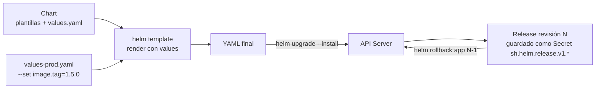
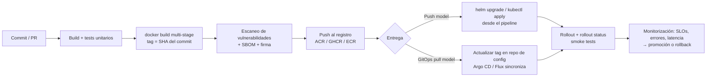

# 11 - Helm, Kustomize y CI-CD

> Nivel 8 del [[00 - Kubernetes - Índice#📈 Roadmap|roadmap]]. Base de Helm en [[Helm]] (chart, values, release, repositorios, `upgrade --install`, rollback, CRDs). Aquí: lo avanzado de Helm, Kustomize y cómo llega el código a producción.

## Contenido
- [[#Helm en profundidad]]
- [[#Templates y valores - ejemplo real]]
- [[#Helm hooks]]
- [[#Dependencias de un chart]]
- [[#Kustomize]]
- [[#El pipeline completo]]
- [[#GitHub Actions]]
- [[#Azure DevOps]]
- [[#GitLab CI-CD]]
- [[#GitOps con Argo CD o Flux]]
- [[#🧠 Practica]]

---

## Helm en profundidad

### Ciclo de vida de un release


### Comandos que usarás a diario
```bash
helm create api                                   # esqueleto
helm lint ./api                                   # validar
helm template api ./api -f values-prod.yaml | kubectl apply --dry-run=server -f -
helm diff upgrade api ./api -f values-prod.yaml   # plugin helm-diff: qué cambiará
helm upgrade --install api ./api -n shop --create-namespace \
  -f values-prod.yaml --set image.tag=1.5.0 \
  --atomic --wait --timeout 5m                    # --atomic: rollback automático si falla
helm history api -n shop
helm rollback api 4 -n shop
helm get values api -n shop                       # valores efectivos del release
helm get manifest api -n shop                     # YAML aplicado

# Charts como artefactos OCI (en ACR, GHCR, ECR...)
helm package ./api --version 1.5.0
helm push api-1.5.0.tgz oci://acmeregistry.azurecr.io/helm
helm install api oci://acmeregistry.azurecr.io/helm/api --version 1.5.0
```

> [!info] Helm 4
> Helm 4 se publicó en **noviembre de 2025** (diez años después del primer Helm). Mantiene el formato de charts (`apiVersion: v2`) y la mayoría de comandos; trae Server-Side Apply y un sistema de plugins renovado. Helm 3 sigue recibiendo parches durante un periodo de transición. Revisa las notas de versión si mantienes plugins o automatizaciones.

---

## Templates y valores - ejemplo real

```yaml
# values.yaml
replicaCount: 3
image:
  repository: acmeregistry.azurecr.io/api
  tag: ""                 # por defecto usa .Chart.AppVersion
resources:
  requests: { cpu: 100m, memory: 256Mi }
  limits: { memory: 512Mi }
autoscaling: { enabled: true, minReplicas: 3, maxReplicas: 20, targetCPU: 60 }
config:
  LOG_LEVEL: Information
ingress: { enabled: true, host: shop.acme.com }
```

```yaml
# templates/deployment.yaml
apiVersion: apps/v1
kind: Deployment
metadata:
  name: {{ include "api.fullname" . }}
  labels: {{- include "api.labels" . | nindent 4 }}
spec:
  {{- if not .Values.autoscaling.enabled }}
  replicas: {{ .Values.replicaCount }}          # con HPA, no se fija replicas
  {{- end }}
  selector:
    matchLabels: {{- include "api.selectorLabels" . | nindent 6 }}
  template:
    metadata:
      labels: {{- include "api.selectorLabels" . | nindent 8 }}
      annotations:
        checksum/config: {{ include (print $.Template.BasePath "/configmap.yaml") . | sha256sum }}
    spec:
      containers:
        - name: api
          image: "{{ .Values.image.repository }}:{{ .Values.image.tag | default .Chart.AppVersion }}"
          resources: {{- toYaml .Values.resources | nindent 12 }}
          envFrom:
            - configMapRef: { name: {{ include "api.fullname" . }} }
```

| Elemento | Para qué |
|---|---|
| `.Values`, `.Release.Name`, `.Chart.AppVersion` | Objetos disponibles en plantillas |
| `_helpers.tpl` + `include` | Funciones reutilizables (nombres, labels) |
| `toYaml` + `nindent` | Insertar bloques YAML correctamente indentados |
| `required "msg" .Values.x` | Fallar si falta un valor obligatorio |
| `values.schema.json` | Validar tipos de los values |
| `{{- ... }}` | Eliminar espacios/saltos de línea |

---

## Helm hooks

### Concepto
Recursos que Helm ejecuta en **momentos concretos** del ciclo de vida: `pre-install`, `post-install`, `pre-upgrade`, `post-upgrade`, `pre-delete`, `pre-rollback`, `test`.

### Caso real: migración de BD antes de actualizar
```yaml
apiVersion: batch/v1
kind: Job
metadata:
  name: {{ include "api.fullname" . }}-migrate
  annotations:
    "helm.sh/hook": pre-install,pre-upgrade
    "helm.sh/hook-weight": "-5"
    "helm.sh/hook-delete-policy": before-hook-creation,hook-succeeded
spec:
  backoffLimit: 1
  template:
    spec:
      restartPolicy: Never
      containers:
        - name: migrate
          image: "{{ .Values.image.repository }}-migrations:{{ .Values.image.tag | default .Chart.AppVersion }}"
```
Si el Job falla, el `upgrade` falla y **el Deployment no se actualiza**.

> [!warning] Con GitOps
> Argo CD traduce los hooks de Helm a sus propios *sync hooks*, con algunas diferencias. Comprueba el comportamiento antes de depender de ellos.

---

## Dependencias de un chart

```yaml
# Chart.yaml
apiVersion: v2
name: shop
version: 2.3.0          # versión del CHART
appVersion: "1.5.0"     # versión de la APP
dependencies:
  - name: redis
    version: "~20.x"     # rango semver
    repository: oci://registry-1.docker.io/bitnamicharts
    condition: redis.enabled
```
```bash
helm dependency update ./shop      # descarga a charts/ y genera Chart.lock
```
Los valores del subchart van bajo su nombre (`redis.auth.enabled: true`).

> [!warning] Cambios en el catálogo de Bitnami
> Desde **agosto/septiembre de 2025**, Bitnami (Broadcom) dejó de publicar gratuitamente la mayoría de sus imágenes versionadas en Docker Hub (las antiguas pasaron al repositorio `bitnamilegacy`, sin actualizaciones). Muchos charts populares dependían de ellas. Antes de usar un subchart, revisa qué imágenes usa y si siguen manteniéndose; considera charts oficiales del proyecto u operadores.

---

## Kustomize

### Concepto
Personaliza YAML **sin plantillas**: una **base** y **overlays** por entorno que aplican parches. Integrado en `kubectl` (`kubectl apply -k`).

```text
deploy/
├── base/
│   ├── kustomization.yaml
│   ├── deployment.yaml
│   └── service.yaml
└── overlays/
    ├── dev/kustomization.yaml
    └── prod/
        ├── kustomization.yaml
        └── replicas-patch.yaml
```
```yaml
# overlays/prod/kustomization.yaml
apiVersion: kustomize.config.k8s.io/v1beta1
kind: Kustomization
namespace: shop
resources: [../../base]
images:
  - name: acmeregistry.azurecr.io/api
    newTag: "1.5.0"
patches:
  - path: replicas-patch.yaml
configMapGenerator:
  - name: api-config
    literals: [LOG_LEVEL=Warning]      # nombre con hash → rolling update automático al cambiar
labels:
  - pairs: { env: prod }
```
```bash
kubectl kustomize overlays/prod       # ver el resultado
kubectl apply -k overlays/prod
```
Helm vs Kustomize: [[18 - Trade-offs#Helm vs Kustomize]]. Se pueden combinar (Kustomize sobre la salida de Helm, o Argo CD con ambos).

---

## El pipeline completo



| Etapa | Buenas prácticas |
|---|---|
| Build | Mismo Dockerfile en local y CI; caché de capas de BuildKit |
| Tag | **Inmutable**: SHA del commit o semver; nunca `latest` |
| Seguridad | Fallar el pipeline con vulnerabilidades críticas; SBOM; firmar con cosign |
| Despliegue | Promover **la misma imagen** (mismo digest) de dev → qa → prod; solo cambia la configuración |
| Credenciales | **OIDC/federación** entre el CI y la nube (sin secretos de larga duración) |
| Verificación | `kubectl rollout status` / `helm --atomic --wait`; smoke tests; rollback automático |
| Entornos | Aprobaciones manuales para producción |

---

## GitHub Actions

```yaml
# .github/workflows/deploy.yml
name: build-and-deploy
on:
  push: { branches: [main] }

permissions:
  id-token: write        # OIDC hacia Azure (sin secretos de cliente)
  contents: read

env:
  IMAGE: acmeregistry.azurecr.io/api

jobs:
  build:
    runs-on: ubuntu-latest
    outputs:
      tag: ${{ steps.meta.outputs.tag }}
    steps:
      - uses: actions/checkout@v4
      - uses: actions/setup-dotnet@v4
        with: { dotnet-version: "10.0.x" }
      - run: dotnet test --configuration Release
      - id: meta
        run: echo "tag=${GITHUB_SHA::12}" >> "$GITHUB_OUTPUT"
      - uses: azure/login@v2
        with:
          client-id: ${{ vars.AZURE_CLIENT_ID }}
          tenant-id: ${{ vars.AZURE_TENANT_ID }}
          subscription-id: ${{ vars.AZURE_SUBSCRIPTION_ID }}
      - run: az acr login --name acmeregistry
      - uses: docker/setup-buildx-action@v3
      - uses: docker/build-push-action@v6
        with:
          context: .
          file: src/Api/Dockerfile
          push: true
          tags: ${{ env.IMAGE }}:${{ steps.meta.outputs.tag }}
          cache-from: type=gha
          cache-to: type=gha,mode=max
      - uses: aquasecurity/trivy-action@0.28.0
        with:
          image-ref: ${{ env.IMAGE }}:${{ steps.meta.outputs.tag }}
          severity: CRITICAL,HIGH
          exit-code: "1"

  deploy-prod:
    needs: build
    runs-on: ubuntu-latest
    environment: production          # aprobación manual configurada en GitHub
    steps:
      - uses: actions/checkout@v4
      - uses: azure/login@v2
        with:
          client-id: ${{ vars.AZURE_CLIENT_ID }}
          tenant-id: ${{ vars.AZURE_TENANT_ID }}
          subscription-id: ${{ vars.AZURE_SUBSCRIPTION_ID }}
      - uses: azure/aks-set-context@v4
        with: { resource-group: rg-shop-prod, cluster-name: aks-shop-prod }
      - uses: azure/setup-helm@v4
      - run: |
          helm upgrade --install api ./deploy/helm/api -n shop \
            -f ./deploy/helm/api/values-prod.yaml \
            --set image.tag=${{ needs.build.outputs.tag }} \
            --atomic --wait --timeout 10m
```
> [!tip] Fija las versiones de las *actions* de terceros por SHA en repositorios sensibles (cadena de suministro).

---

## Azure DevOps

```yaml
# azure-pipelines.yml
trigger: [main]
variables:
  imageRepo: api
  tag: $(Build.SourceVersion)
stages:
  - stage: Build
    jobs:
      - job: build
        pool: { vmImage: ubuntu-latest }
        steps:
          - task: Docker@2
            inputs:
              command: buildAndPush
              containerRegistry: acr-service-connection      # service connection con Workload Identity federation
              repository: $(imageRepo)
              Dockerfile: src/Api/Dockerfile
              tags: $(tag)
  - stage: DeployProd
    dependsOn: Build
    jobs:
      - deployment: deploy
        environment: shop-prod          # aprobaciones y checks del entorno
        pool: { vmImage: ubuntu-latest }
        strategy:
          runOnce:
            deploy:
              steps:
                - checkout: self
                - task: HelmDeploy@1
                  inputs:
                    connectionType: Azure Resource Manager
                    azureSubscriptionEndpoint: arm-shop-prod
                    azureResourceGroup: rg-shop-prod
                    kubernetesCluster: aks-shop-prod
                    namespace: shop
                    command: upgrade
                    chartType: FilePath
                    chartPath: deploy/helm/api
                    releaseName: api
                    overrideValues: image.tag=$(tag)
                    arguments: --install --atomic --wait --timeout 10m0s -f deploy/helm/api/values-prod.yaml
```

---

## GitLab CI-CD

```yaml
# .gitlab-ci.yml
stages: [build, deploy]
variables:
  IMAGE: $CI_REGISTRY_IMAGE/api:$CI_COMMIT_SHORT_SHA

build:
  stage: build
  image: docker:27
  services: [docker:27-dind]
  script:
    - docker login -u "$CI_REGISTRY_USER" -p "$CI_REGISTRY_PASSWORD" "$CI_REGISTRY"
    - docker build -t "$IMAGE" -f src/Api/Dockerfile .
    - docker push "$IMAGE"

deploy_prod:
  stage: deploy
  image: alpine/helm:3.16.2
  environment: { name: production }
  when: manual
  script:
    - helm upgrade --install api ./deploy/helm/api -n shop
        --set image.repository=$CI_REGISTRY_IMAGE/api --set image.tag=$CI_COMMIT_SHORT_SHA
        --atomic --wait
```
GitLab ofrece además el **GitLab Agent for Kubernetes** (modelo pull, sin exponer el API Server al CI).

---

## GitOps con Argo CD o Flux

### Concepto
**Git es la fuente de verdad** del estado del clúster. Un agente **dentro** del clúster (Argo CD o Flux, ambos CNCF graduados) compara git con el clúster y **sincroniza**. El pipeline de CI solo construye la imagen y **actualiza el tag en git** (commit o PR).

| | Push (CI despliega) | Pull (GitOps) |
|---|---|---|
| Credenciales del clúster | En el CI | Solo dentro del clúster |
| *Drift* (cambios manuales) | Pasan desapercibidos | Se detectan y corrigen |
| Auditoría | Logs del pipeline | Historial de git |
| Rollback | Re-ejecutar pipeline | `git revert` |
| Multi-clúster | Complejo | Natural (ApplicationSets) |
| Complejidad | Menor | Un componente más que operar |

```yaml
apiVersion: argoproj.io/v1alpha1
kind: Application
metadata: { name: shop-api, namespace: argocd }
spec:
  project: default
  source:
    repoURL: https://github.com/acme/shop-config
    path: apps/api/overlays/prod
    targetRevision: main
  destination: { server: https://kubernetes.default.svc, namespace: shop }
  syncPolicy:
    automated: { prune: true, selfHeal: true }
    syncOptions: [CreateNamespace=true, ServerSideApply=true]
```

---

## 🧠 Practica

> [!question]- Escenario: `helm upgrade` falló a mitad y el release queda en `pending-upgrade`; los siguientes upgrades fallan
> Otro proceso se interrumpió (timeout del pipeline). `helm history api` → `helm rollback api <última buena>` desbloquea el estado. Prevención: `--atomic`, timeouts coherentes y un único pipeline desplegando cada release (concurrencia controlada).

> [!question]- Quiz: ¿qué diferencia hay entre `version` y `appVersion` en `Chart.yaml`?
> `version` es la versión del **chart** (empaquetado, plantillas); `appVersion` la de la **aplicación** que despliega. Puedes cambiar plantillas sin cambiar de app y viceversa.

> [!question]- Entrevista Senior: "¿Promueves de dev a prod reconstruyendo la imagen?"
> No: **build once, deploy many**. La misma imagen (mismo digest) avanza por entornos; solo cambia la configuración (values/overlays). Reconstruir puede producir binarios distintos y rompe la trazabilidad de lo probado.

> [!example] Laboratorio
> [[15 - Laboratorios#Lab 10 - Tu propio chart de Helm]].

### Relacionado
- [[Helm]] · [[Docker Compose]] · [[Registro de imágenes]] · [[Buildx y multi-arquitectura]]
- Anterior: [[10 - Observabilidad]] · Siguiente: [[12 - Kubernetes en la nube]]
