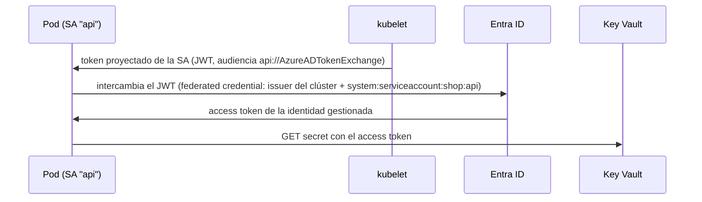

# 12 - Kubernetes en la nube

> Nivel 9 del [[00 - Kubernetes - Índice#📈 Roadmap|roadmap]]. AKS, EKS y GKE: qué gestiona el proveedor, qué te toca a ti y en qué se diferencian. Relacionado con [[04 - Contenedores - ACI, AKS y Container Apps]] y [[16 - Comparación de servicios de contenedores]].

> [!warning] Las ofertas cambian rápido
> Nombres de SKUs, modos y precios de los proveedores evolucionan cada pocos meses. Esta nota recoge el estado a finales de 2026 en términos de **conceptos**; verifica los detalles en la documentación antes de decidir.

## Contenido
- [[#Managed Kubernetes - modelo de responsabilidad]]
- [[#AKS vs EKS vs GKE]]
- [[#Node pools]]
- [[#Networking en la nube]]
- [[#Load balancers e ingress gestionados]]
- [[#Identidades de workload]]
- [[#Registro de contenedores]]
- [[#Storage]]
- [[#Autoscaling en la nube]]
- [[#Ejemplo - crear un AKS de producción]]
- [[#🧠 Practica]]

---

## Managed Kubernetes - modelo de responsabilidad

| Responsabilidad | Autogestionado (kubeadm) | Gestionado (AKS/EKS/GKE estándar) | "Automático" (GKE Autopilot, AKS Automatic, EKS Auto Mode) |
|---|---|---|---|
| Control Plane (API Server, etcd, HA, backups) | Tú | **Proveedor** | Proveedor |
| Actualizar versión de Kubernetes | Tú | Tú lo inicias (o canal automático) | Proveedor (con ventanas) |
| Nodos: SO, parches, imágenes | Tú | Tú (con ayudas: auto-upgrade de imagen) | **Proveedor** |
| Tamaño y tipo de nodos | Tú | Tú (node pools) | Proveedor (eliges/limitas) |
| CNI, CSI, CoreDNS, add-ons | Tú | Proveedor preinstala; tú configuras | Proveedor |
| Workloads, RBAC, NetworkPolicies, seguridad de apps | Tú | **Tú** | **Tú** |

---

## AKS vs EKS vs GKE

| Aspecto | **AKS** (Azure) | **EKS** (AWS) | **GKE** (Google) |
|---|---|---|---|
| Coste del Control Plane | Gratis (tier Free) o de pago por SLA (Standard/Premium) | Tarifa por hora por clúster | Tarifa por clúster (con crédito para uno) |
| Modo "sin gestionar nodos" | **AKS Automatic** | **EKS Auto Mode** / Fargate | **Autopilot** (el más maduro) |
| Identidad humana | **Entra ID** + Azure RBAC o K8s RBAC | IAM → *access entries* | Google IAM + RBAC |
| Identidad de workload | **Microsoft Entra Workload ID** | **EKS Pod Identity** (o IRSA) | **Workload Identity Federation for GKE** |
| CNI | Azure CNI (Overlay recomendado), *Powered by Cilium*; kubenet en retirada | Amazon VPC CNI (IPs de la VPC) | GKE Dataplane V2 (Cilium/eBPF) |
| Ingress / Gateway gestionado | Application Gateway for Containers (Gateway API), App Routing add-on | AWS Load Balancer Controller (ALB/NLB) | GKE Gateway controller, GKE Ingress |
| Autoescalado de nodos | Cluster Autoscaler, **Node Auto Provisioning** (Karpenter) | Cluster Autoscaler, **Karpenter** | Cluster Autoscaler, *node auto-provisioning* |
| Registro | Azure Container Registry | Amazon ECR | Artifact Registry |
| Observabilidad | Container Insights, Managed Prometheus + Managed Grafana | CloudWatch Container Insights, Amazon Managed Prometheus/Grafana | Cloud Monitoring/Logging, Managed Prometheus |
| Políticas | Azure Policy (Gatekeeper) | — (Kyverno/Gatekeeper) | Policy Controller |
| Punto fuerte | Integración con Entra ID, Azure DevOps y ecosistema .NET/Microsoft | Ecosistema AWS, Karpenter, máxima flexibilidad | Kubernetes "de serie" más pulido, Autopilot, actualizaciones |

---

## Node pools

### Concepto
Un **node pool** (AKS/GKE) o **node group** (EKS) es un grupo de nodos con la **misma configuración** (tamaño de VM, SO, zona, taints, labels). Un clúster tiene varios.

| Pool | Configuración típica | Para |
|---|---|---|
| **System** | 3 nodos pequeños/medianos, taint `CriticalAddonsOnly`, multi-zona | CoreDNS, metrics-server, CNI, agentes |
| **User general** | Autoescalado, multi-zona | Apps |
| **Spot** | VMs con descuento (hasta ~90 %), pueden ser **expulsadas**; taint propio | Batch, workers idempotentes, entornos no productivos |
| **GPU / alta memoria** | Taint dedicado | IA, analítica |
| **Windows** | Nodos Windows | Apps .NET Framework legacy |

> [!tip] Actualizaciones
> Actualizar la versión de Kubernetes se hace **por pools**: primero el Control Plane, luego cada pool con *surge* (nodos extra), drenando nodos y respetando **PDBs**. Configura canales de actualización automática y ventanas de mantenimiento.

---

## Networking en la nube

| Modelo | Cómo obtienen IP los Pods | Pros | Contras |
|---|---|---|---|
| **Overlay** (Azure CNI Overlay, Calico/Cilium en overlay) | Rango privado propio, NAT al salir | No consume IPs de la VNet; escala | Los Pods no son directamente enrutables desde la red |
| **IPs de la red** (Azure CNI clásico, AWS VPC CNI) | IP real de la VNet/VPC | Enrutables desde la red corporativa, integración con NSG/SG | **Agota direcciones IP**; planificación de subredes crítica |

Decisiones de red de un clúster de producción:
- API Server **privado** (o con IPs autorizadas).
- Salida (*egress*) controlada: NAT Gateway / firewall con IPs estables (para *allowlists* de terceros).
- Conectividad privada a servicios PaaS (Private Endpoints / PrivateLink).
- CIDRs de Pods y Services que **no se solapen** con la red corporativa.

---

## Load balancers e ingress gestionados

- `Service type: LoadBalancer` → el CCM crea un LB L4 (Azure Load Balancer, NLB, Google Network LB). Anotaciones para **LB interno**, IP reservada, etc.
- Tráfico HTTP(S) → un controlador de Gateway/Ingress, propio (Envoy Gateway, Traefik, Istio) o **gestionado** (Application Gateway for Containers, AWS Load Balancer Controller con ALB, GKE Gateway).
- Delante, opcionalmente, **WAF/CDN** (Azure Front Door, CloudFront, Cloud Armor).

---

## Identidades de workload

### Concepto
Permite que un Pod acceda a servicios cloud (Key Vault, Blob, SQL, S3, Service Bus) **sin secretos**: el token de su **ServiceAccount** (firmado por el emisor OIDC del clúster) se **intercambia** por un token del proveedor de identidad.



### AKS: pasos
```bash
az aks update -g rg-shop -n aks-shop --enable-oidc-issuer --enable-workload-identity
ISSUER=$(az aks show -g rg-shop -n aks-shop --query oidcIssuerProfile.issuerUrl -o tsv)
az identity create -g rg-shop -n id-shop-api
az identity federated-credential create -g rg-shop --identity-name id-shop-api \
  --name shop-api --issuer "$ISSUER" --subject system:serviceaccount:shop:api \
  --audience api://AzureADTokenExchange
# + asignar a id-shop-api el rol mínimo (p. ej. "Key Vault Secrets User" sobre el vault)
```
```yaml
apiVersion: v1
kind: ServiceAccount
metadata:
  name: api
  namespace: shop
  annotations:
    azure.workload.identity/client-id: "<client-id de id-shop-api>"
---
# En el Pod template:
metadata:
  labels:
    azure.workload.identity/use: "true"     # el webhook inyecta variables y el token
spec:
  serviceAccountName: api
```
En .NET basta con `new DefaultAzureCredential()` (o `WorkloadIdentityCredential`).

> [!warning] Obsoleto
> **AAD Pod Identity** (AKS) está obsoleto y fuera de soporte; **IRSA** (EKS) sigue funcionando pero AWS recomienda **EKS Pod Identity** para clústeres nuevos. Evita también montar claves de *service principals* como Secrets.

---

## Registro de contenedores

- Usa el registro del proveedor en la **misma región** (latencia, coste de transferencia) con **pull por identidad**: AKS `az aks update --attach-acr <acr>` (rol `AcrPull` para la identidad del kubelet); EKS con el rol IAM de los nodos; GKE con la SA de los nodos.
- Funciones a activar: escaneo de vulnerabilidades, **replicación geográfica**, retención/limpieza de tags, *private endpoint*, *content trust*/firmas.
- Para clústeres grandes: *artifact streaming* / *image streaming* (arranque más rápido de imágenes grandes) donde esté disponible.

---

## Storage

| Necesidad | Azure | AWS | Google |
|---|---|---|---|
| Disco de bloque (RWO) | Azure Disk CSI (Premium SSD v2, ZRS) | EBS CSI (gp3, io2) | PD CSI (pd-balanced, Hyperdisk) |
| Ficheros compartidos (RWX) | Azure Files CSI (SMB/NFS), Azure NetApp Files | EFS CSI | Filestore CSI |
| Objetos | Blob (CSI con BlobFuse o desde la app) | S3 (Mountpoint CSI o desde la app) | GCS (Cloud Storage FUSE CSI) |
| Secretos montados | Key Vault provider del Secrets Store CSI | AWS Secrets Manager provider | Secret Manager provider |

Detalles de StorageClasses y zonas en [[05 - Configuración y almacenamiento#Elegir el tipo de volumen]].

---

## Autoscaling en la nube

| Capa | AKS | EKS | GKE |
|---|---|---|---|
| Pods | HPA, KEDA (add-on) | HPA, KEDA | HPA, KEDA |
| Requests | VPA (add-on) | VPA | VPA (integrado) |
| Nodos | Cluster Autoscaler por pool, **NAP** | Cluster Autoscaler, **Karpenter**, Auto Mode | Cluster Autoscaler, NAP, **Autopilot** |
| Coste | Spot pools, reservas, *start/stop* de clúster en dev | Spot, Savings Plans | Spot, CUDs |

---

## Ejemplo - crear un AKS de producción

```bash
az group create -n rg-shop-prod -l westeurope

# --tier standard: SLA del Control Plane. Sin --kubernetes-version se usa la versión por defecto
# (consulta las soportadas con: az aks get-versions -l westeurope -o table)
az aks create -g rg-shop-prod -n aks-shop-prod \
  --tier standard \
  --zones 1 2 3 \
  --network-plugin azure --network-plugin-mode overlay --network-dataplane cilium \
  --enable-oidc-issuer --enable-workload-identity \
  --enable-aad --enable-azure-rbac --disable-local-accounts \
  --enable-managed-identity \
  --nodepool-name system --node-count 3 --node-vm-size Standard_D4ds_v5 \
  --nodepool-taints CriticalAddonsOnly=true:NoSchedule \
  --auto-upgrade-channel patch --node-os-upgrade-channel NodeImage \
  --attach-acr acmeregistry \
  --enable-azure-monitor-metrics \
  --generate-ssh-keys

az aks nodepool add -g rg-shop-prod --cluster-name aks-shop-prod -n apps \
  --zones 1 2 3 --node-vm-size Standard_D8ds_v5 \
  --enable-cluster-autoscaler --min-count 3 --max-count 15

az aks get-credentials -g rg-shop-prod -n aks-shop-prod
kubectl get nodes -L topology.kubernetes.io/zone,agentpool
```
> [!tip] En la práctica, este clúster se define como código (**Bicep** o **Terraform**), no con comandos sueltos.

---

## 🧠 Practica

> [!question]- Escenario: en AKS con Azure CNI clásico, los nuevos Pods se quedan en `ContainerCreating` con errores de IP
> La subred se ha **quedado sin direcciones** (cada nodo reserva IPs para sus Pods). Soluciones: ampliar/añadir subred, `maxPods` más bajo, o migrar a **Azure CNI Overlay**. Lección: planificar CIDRs desde el principio.

> [!question]- Entrevista Architect: "¿Kubernetes gestionado o Azure Container Apps para 8 microservicios .NET?"
> Depende: Container Apps (Kubernetes + KEDA + Envoy + Dapr gestionados) da escalado a cero, revisiones y tráfico por pesos sin operar un clúster; ideal si no necesitas control fino, CRDs, operadores ni DaemonSets. AKS si necesitas portabilidad, control de red/seguridad, cargas heterogéneas o una plataforma interna para muchos equipos. Ver [[18 - Trade-offs#Kubernetes vs Serverless vs Azure Container Apps]]. **Evita**: elegir Kubernetes "porque es el estándar".

> [!question]- Quiz: ¿por qué un pool *system* con taint `CriticalAddonsOnly`?
> Para que una app desbocada no deje sin recursos a CoreDNS, metrics-server o el CNI, de los que depende todo el clúster.

### Relacionado
- [[Cloud Controller Manager]] · [[CSI Driver]] · [[Azure Key Vault]] · [[13 - Azure Container Registry]] · [[15 - Azure Container Apps]] · [[Microsoft Entra ID]]
- Anterior: [[11 - Helm, Kustomize y CI-CD]] · Siguiente: [[13 - Kubernetes para .NET]]
