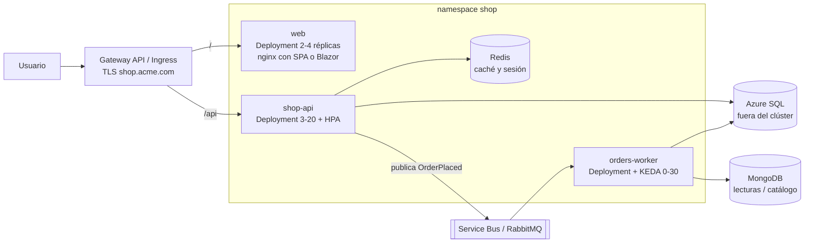

# 13 - Kubernetes para .NET

> Cómo llevar una API ASP.NET Core a Kubernetes **bien hecha**: imagen, configuración, salud, apagado ordenado, logs, dependencias y una arquitectura completa. Requisitos: [[Dockerfile]], [[Multi-stage y Distroless]], [[07 - Salud, fiabilidad y despliegues]].

## Contenido
- [[#Checklist de una app .NET cloud-native]]
- [[#Dockerfile multi-stage para .NET]]
- [[#Configuración en .NET y Kubernetes]]
- [[#Connection strings y secretos]]
- [[#Health checks y probes]]
- [[#Graceful shutdown]]
- [[#Logging y observabilidad]]
- [[#Recursos, GC y rendimiento]]
- [[#Detrás de un Ingress o Gateway]]
- [[#Dependencias - Redis, SQL Server, MongoDB y brokers]]
- [[#Arquitectura completa en Kubernetes]]
- [[#🧠 Practica]]

---

## Checklist de una app .NET cloud-native

- [ ] Imagen multi-stage, usuario no root, imagen base mínima (*chiseled*)
- [ ] Escucha en `8080` (por defecto desde .NET 8) en todas las interfaces
- [ ] Configuración por variables de entorno / ficheros montados; **nada** de `appsettings.Production.json` con secretos en la imagen
- [ ] Endpoints `/health/live` y `/health/ready` separados
- [ ] Gestión de `SIGTERM` con un `ShutdownTimeout` coherente con `terminationGracePeriodSeconds`
- [ ] Logs JSON a consola; OpenTelemetry para métricas y trazas
- [ ] *Data Protection* con claves persistidas y compartidas entre réplicas
- [ ] *Forwarded headers* configurados detrás del proxy
- [ ] Requests/limits medidos; GC adecuado al contenedor
- [ ] Sin estado en memoria entre peticiones (sesión → Redis), o asumido conscientemente
- [ ] Reintentos y *circuit breakers* hacia dependencias (`Microsoft.Extensions.Http.Resilience`)

---

## Dockerfile multi-stage para .NET

```dockerfile
# syntax=docker/dockerfile:1
ARG DOTNET_VERSION=10.0

# ---- build ----
FROM mcr.microsoft.com/dotnet/sdk:${DOTNET_VERSION} AS build
WORKDIR /src
# 1) Solo los ficheros de proyecto → restore cacheado mientras no cambien las dependencias
COPY ["src/Shop.Api/Shop.Api.csproj", "src/Shop.Api/"]
COPY ["src/Shop.Domain/Shop.Domain.csproj", "src/Shop.Domain/"]
COPY ["Directory.Packages.props", "Directory.Build.props", "./"]
RUN dotnet restore "src/Shop.Api/Shop.Api.csproj"
# 2) El código
COPY . .
RUN dotnet publish "src/Shop.Api/Shop.Api.csproj" -c Release -o /app/publish \
    --no-restore /p:UseAppHost=false

# ---- runtime ----
# chiseled: sin shell ni gestor de paquetes, usuario no root ya configurado
FROM mcr.microsoft.com/dotnet/aspnet:${DOTNET_VERSION}-noble-chiseled AS final
WORKDIR /app
COPY --from=build /app/publish .
USER $APP_UID
EXPOSE 8080
ENTRYPOINT ["dotnet", "Shop.Api.dll"]
```

| Decisión | Por qué |
|---|---|
| `sdk` para compilar, `aspnet` para ejecutar | La imagen final no lleva compilador ni código fuente (cientos de MB menos) |
| `COPY *.csproj` + `restore` antes de `COPY . .` | Caché de capas: el restore solo se repite si cambian dependencias ([[Dockerfile#docker build y la caché]]) |
| `-noble-chiseled` | Ubuntu mínimo sin shell: menos CVEs. Variante `-extra` si necesitas ICU/zonas horarias completas |
| `USER $APP_UID` | Usuario `app` (UID **1654**) que traen las imágenes oficiales desde .NET 8 → compatible con Pod Security `restricted` |
| Puerto 8080 | Desde .NET 8 las imágenes escuchan en 8080 (`ASPNETCORE_HTTP_PORTS=8080`): no necesitan privilegios para puertos < 1024 |
| `ENTRYPOINT` en forma *exec* | `dotnet` es PID 1 y recibe `SIGTERM` ([[Dockerfile#ENTRYPOINT vs CMD]]) |

> [!tip] Alternativas
> - **Sin Dockerfile**: `dotnet publish /t:PublishContainer` genera la imagen con el SDK (configurable con `ContainerBaseImage`, `ContainerRepository`...).
> - **Native AOT**: arranque en milisegundos y menos memoria, con imagen `runtime-deps` chiseled; requiere que tus librerías sean compatibles con AOT.
> - Añade un `.dockerignore` (`bin/`, `obj/`, `.git/`, `**/appsettings.Development.json`).

---

## Configuración en .NET y Kubernetes

### Cómo se mapea
El *configuration builder* por defecto lee, en orden (el último gana): `appsettings.json` → `appsettings.{Environment}.json` → user secrets (solo dev) → **variables de entorno** → argumentos. En variables de entorno, `:` se escribe **`__`** (doble guion bajo).

| Clave en `appsettings.json` | Variable de entorno en el Pod |
|---|---|
| `Logging:LogLevel:Default` | `Logging__LogLevel__Default` |
| `ConnectionStrings:Orders` | `ConnectionStrings__Orders` |
| `Shop:Checkout:MaxItems` | `Shop__Checkout__MaxItems` |

### Opción A: variables desde ConfigMap y Secret
```yaml
apiVersion: v1
kind: ConfigMap
metadata: { name: shop-api-config, namespace: shop }
data:
  ASPNETCORE_ENVIRONMENT: Production
  Logging__LogLevel__Default: Information
  Shop__Checkout__MaxItems: "50"
  Redis__Endpoint: redis.shop.svc.cluster.local:6379
```
```yaml
envFrom:
  - configMapRef: { name: shop-api-config }
  - secretRef: { name: shop-api-secrets }
```

### Opción B: fichero montado con recarga en caliente
```yaml
# ConfigMap con un appsettings completo
data:
  appsettings.k8s.json: |
    { "Shop": { "Checkout": { "MaxItems": 50 } }, "FeatureFlags": { "NewCheckout": true } }
---
# En el Pod
volumeMounts: [{ name: appsettings, mountPath: /app/config, readOnly: true }]
volumes: [{ name: appsettings, configMap: { name: shop-api-appsettings } }]
```
```csharp
// Program.cs
builder.Configuration.AddJsonFile("config/appsettings.k8s.json", optional: true, reloadOnChange: true);
// Usa IOptionsMonitor<T> para ver los cambios sin reiniciar
```
> [!warning] `reloadOnChange` y los symlinks
> Kubernetes actualiza los ficheros montados cambiando un *symlink*. El `FileSystemWatcher` a veces no lo detecta; si notas que no recarga, activa `DOTNET_USE_POLLING_FILE_WATCHER=true` o reinicia con el patrón *checksum annotation* ([[05 - Configuración y almacenamiento#Recargar configuración sin downtime]]).

---

## Connection strings y secretos

| Opción | Cómo | Recomendación |
|---|---|---|
| Secret → variable `ConnectionStrings__Orders` | `secretKeyRef` | Válido; el secreto debe venir de un gestor (External Secrets) |
| Secret montado como ficheros + `AddKeyPerFile` | Cada fichero = una clave | Evita variables de entorno (visibles en `/proc`, en *dumps*) |
| **Sin contraseña**: Workload Identity | `Authentication=Active Directory Workload Identity` (Azure SQL), `DefaultAzureCredential` (Service Bus, Blob, Key Vault, Redis con Entra ID) | **La mejor opción en Azure** |

```csharp
// Secretos montados como ficheros desde un Secret o el Secrets Store CSI Driver
builder.Configuration.AddKeyPerFile("/mnt/secrets", optional: true);
// Fichero /mnt/secrets/ConnectionStrings__Orders  →  clave ConnectionStrings:Orders
```
```text
# Azure SQL sin contraseña (Microsoft.Data.SqlClient ≥ 5.2 con Workload Identity en AKS)
Server=tcp:sql-shop.database.windows.net;Database=orders;Authentication=Active Directory Workload Identity;Encrypt=True
```

---

## Health checks y probes

```csharp
using Microsoft.AspNetCore.Diagnostics.HealthChecks;
using Microsoft.Extensions.Diagnostics.HealthChecks;

builder.Services.AddHealthChecks()
    .AddCheck("self", () => HealthCheckResult.Healthy(), tags: ["live"])
    // Paquetes AspNetCore.HealthChecks.* (Xabaril): SqlServer, Redis, MongoDb, AzureServiceBus...
    .AddSqlServer(builder.Configuration.GetConnectionString("Orders")!, tags: ["ready"])
    .AddRedis(builder.Configuration["Redis:Endpoint"]!, tags: ["ready"]);

var app = builder.Build();

app.MapHealthChecks("/health/live", new HealthCheckOptions
{
    Predicate = r => r.Tags.Contains("live")      // ¿el proceso responde? Nada externo.
});
app.MapHealthChecks("/health/ready", new HealthCheckOptions
{
    Predicate = r => r.Tags.Contains("ready")     // ¿puedo atender? (con cuidado: ver abajo)
});
```
```yaml
startupProbe:
  httpGet: { path: /health/live, port: http }
  periodSeconds: 3
  failureThreshold: 20
readinessProbe:
  httpGet: { path: /health/ready, port: http }
  periodSeconds: 5
  timeoutSeconds: 3
livenessProbe:
  httpGet: { path: /health/live, port: http }
  periodSeconds: 10
  timeoutSeconds: 3
```

> [!warning] Dependencias en readiness: decide conscientemente
> Si **todas** las réplicas comprueban SQL en readiness y SQL tiene un corte, el Service se queda sin endpoints (503 inmediatos). A veces es lo que quieres; a menudo es mejor comprobar solo dependencias **sin las que la instancia es inútil** y gestionar fallos transitorios con resiliencia en el código. Nunca dependencias en **liveness**. Ver [[07 - Salud, fiabilidad y despliegues#Liveness vs Readiness vs Startup]].

> [!tip] Cachea los checks costosos
> Un check que abre conexión a SQL cada 5 s × 20 réplicas suma carga. Usa `HealthCheckPublisherOptions`/caché, o checks ligeros (`SELECT 1` con timeout corto).

---

## Graceful shutdown

### ¿Qué ocurre?
Kubernetes envía `SIGTERM` → el host genérico de .NET dispara `ApplicationStopping` → Kestrel deja de aceptar conexiones y espera a las peticiones en curso → los `BackgroundService` reciben la cancelación → el proceso termina. Si no termina en `terminationGracePeriodSeconds` (30 s), `SIGKILL`.

```csharp
builder.Services.Configure<HostOptions>(o =>
{
    o.ShutdownTimeout = TimeSpan.FromSeconds(25);   // < terminationGracePeriodSeconds - preStop
});

public sealed class OrdersWorker(ILogger<OrdersWorker> log) : BackgroundService
{
    protected override async Task ExecuteAsync(CancellationToken stoppingToken)
    {
        while (!stoppingToken.IsCancellationRequested)
        {
            // procesar un mensaje; pasar stoppingToken a las llamadas asíncronas
            await Task.Delay(1000, stoppingToken);
        }
        log.LogInformation("Worker detenido de forma ordenada");
    }
}
```
```yaml
spec:
  terminationGracePeriodSeconds: 40
  containers:
    - name: api
      lifecycle:
        preStop:
          sleep: { seconds: 10 }     # da tiempo a que Ingress/kube-proxy dejen de enviar tráfico
```
> [!info] Presupuesto de tiempo
> `terminationGracePeriodSeconds (40)` ≥ `preStop (10)` + `ShutdownTimeout (25)` + margen. Para workers con mensajes largos, aumenta el periodo o diseña el trabajo para ser reanudable (el mensaje vuelve a la cola si no se completa: idempotencia).

---

## Logging y observabilidad

```csharp
builder.Logging.ClearProviders();
builder.Logging.AddJsonConsole(o =>
{
    o.IncludeScopes = true;
    o.TimestampFormat = "yyyy-MM-ddTHH:mm:ss.fffZ ";
    o.UseUtcTimestamp = true;
});

builder.Services.AddOpenTelemetry()
    .ConfigureResource(r => r.AddService("shop-api"))
    .WithTracing(t => t
        .AddAspNetCoreInstrumentation()
        .AddHttpClientInstrumentation()
        .AddSqlClientInstrumentation())
    .WithMetrics(m => m
        .AddAspNetCoreInstrumentation()      // http.server.request.duration, etc.
        .AddRuntimeInstrumentation()         // GC, thread pool
        .AddPrometheusExporter())            // o .UseOtlpExporter() hacia el Collector
    .UseOtlpExporter();                      // OTEL_EXPORTER_OTLP_ENDPOINT desde el entorno

var app = builder.Build();
app.MapPrometheusScrapingEndpoint();         // /metrics
```
```yaml
env:
  - name: OTEL_EXPORTER_OTLP_ENDPOINT
    value: http://otel-collector.observability:4317
  - name: OTEL_RESOURCE_ATTRIBUTES
    value: deployment.environment=prod,service.namespace=shop
```
> [!tip] .NET Aspire
> En desarrollo, **.NET Aspire** orquesta la app y sus dependencias con un dashboard OpenTelemetry integrado, y tiene publicadores para generar artefactos de despliegue (incluido Kubernetes). Es un buen puente entre el desarrollo local y el clúster, pero revisa siempre el YAML generado.

---

## Recursos, GC y rendimiento

| Tema | Qué saber |
|---|---|
| Memoria | .NET detecta el **límite del cgroup**: el heap del GC se limita por defecto al **75 %** del límite de memoria. Ajustable con `DOTNET_GCHeapHardLimitPercent`. El resto es para código nativo, hilos, buffers |
| Server vs Workstation GC | ASP.NET Core usa **Server GC**; desde .NET 9 con **DATAS** (adaptación dinámica) activado por defecto, que ajusta el número de heaps a la carga y reduce mucho la memoria en contenedores pequeños |
| CPU | El runtime calcula los núcleos disponibles a partir del **límite** de CPU (si lo hay). Un `limits.cpu: 500m` → 1 procesador lógico para el thread pool y el GC. Con límites bajos, *throttling* visible en latencias p99 |
| Arranque | JIT + *ReadyToRun* (`/p:PublishReadyToRun=true`) o Native AOT para arrancar más rápido (mejor escalado con HPA) |
| HPA | Escala por **CPU** o por **RPS/latencia**; no por memoria (el heap no baja al bajar la carga) |

```yaml
resources:
  requests: { cpu: 250m, memory: 256Mi }
  limits: { memory: 512Mi }            # límite de memoria siempre; CPU: ver debate en 06 - Scheduling
```

---

## Detrás de un Ingress o Gateway

> [!warning] Dos fallos clásicos al desplegar varias réplicas de ASP.NET Core
> **1. Data Protection.** Cookies de autenticación, antiforgery y TempData se cifran con claves que, por defecto, se guardan **en el sistema de ficheros del Pod**. Con 3 réplicas, una cookie emitida por un Pod no la puede leer otro → logouts aleatorios y errores 400 de antiforgery. Solución: persistir y compartir las claves.
> ```csharp
> builder.Services.AddDataProtection()
>     .SetApplicationName("shop")
>     .PersistKeysToAzureBlobStorage(new Uri(blobUri), new DefaultAzureCredential())
>     .ProtectKeysWithAzureKeyVault(new Uri(keyUri), new DefaultAzureCredential());
>     // alternativas: PersistKeysToStackExchangeRedis, PersistKeysToDbContext
> ```
> **2. Forwarded headers.** TLS termina en el Ingress/Gateway: la app ve HTTP y la IP del proxy. Redirecciones a `http://`, URLs de OAuth incorrectas, IP de cliente equivocada. Solución:
> ```csharp
> builder.Services.Configure<ForwardedHeadersOptions>(o =>
> {
>     o.ForwardedHeaders = ForwardedHeaders.XForwardedFor | ForwardedHeaders.XForwardedProto;
>     // .NET 10: KnownIPNetworks (en .NET 8/9: KnownNetworks). Vaciar = confiar en cualquier proxy:
    // aceptable si solo el Ingress/Gateway puede llegar al Pod (NetworkPolicy); si no, lista su rango.
    o.KnownIPNetworks.Clear(); o.KnownProxies.Clear();
> });
> app.UseForwardedHeaders();
> ```
> (o `ASPNETCORE_FORWARDEDHEADERS_ENABLED=true`). Y **no** uses `UseHttpsRedirection` dentro del clúster si el TLS termina antes.

---

## Dependencias - Redis, SQL Server, MongoDB y brokers

| Dependencia | En desarrollo / labs (en el clúster) | En producción (recomendado) | Cliente .NET |
|---|---|---|---|
| **Redis** | Deployment/StatefulSet `redis:7` sin persistencia | **Azure Managed Redis** / Azure Cache for Redis, ElastiCache; o un operador | `StackExchange.Redis` (`IConnectionMultiplexer` **singleton**), `AddStackExchangeRedisCache` |
| **SQL Server** | StatefulSet `mcr.microsoft.com/mssql/server:2022-latest` (con licencia Developer) | **Azure SQL** / Managed Instance con Workload Identity | `Microsoft.Data.SqlClient`, EF Core con `EnableRetryOnFailure()` |
| **MongoDB** | StatefulSet `mongo:8` | MongoDB Atlas, **Cosmos DB for MongoDB**, o MongoDB Kubernetes Operator | `MongoDB.Driver` (`MongoClient` singleton) |
| **Mensajería** | RabbitMQ (`rabbitmq:4-management`) | **Azure Service Bus** ([[00 - Indice y ruta de estudio|notas de Service Bus]]), RabbitMQ Cluster Operator, Kafka con **Strimzi** / Event Hubs | `Azure.Messaging.ServiceBus`, `RabbitMQ.Client`, MassTransit, `Confluent.Kafka` |

> [!tip] Resiliencia en el cliente
> En Kubernetes los Pods se mueven y las dependencias tienen cortes breves: reintentos con *backoff* y *jitter*, timeouts y *circuit breaker* (`AddStandardResilienceHandler()` para `HttpClient`, `EnableRetryOnFailure` en EF Core). Ver [[Retry con Backoff Exponencial]] y [[Circuit Breaker]].

---

## Arquitectura completa en Kubernetes

**Frontend → API → Redis → Base de datos → Message broker**



| Componente | Objeto(s) de Kubernetes | Responsable de |
|---|---|---|
| Entrada | `Gateway` + `HTTPRoute` (o `Ingress`), cert-manager | TLS, enrutar `/` y `/api`, (rate limiting según implementación) |
| `web` | Deployment + Service ClusterIP + HPA | Servir el frontend estático |
| `shop-api` | Deployment + Service + HPA + PDB + ConfigMap + Secret/ExternalSecret + ServiceAccount (Workload Identity) + NetworkPolicy | Lógica de negocio síncrona |
| `orders-worker` | Deployment + KEDA `ScaledObject` + PDB | Procesamiento asíncrono de pedidos |
| Redis | Servicio gestionado (o StatefulSet en dev) | Caché, sesiones, *Data Protection* |
| SQL / MongoDB | Servicios gestionados vía Private Endpoint | Persistencia |
| Broker | Azure Service Bus (o RabbitMQ con operador) | Desacoplar, absorber picos |
| Transversal | `default-deny` NetworkPolicies, Pod Security `restricted`, ServiceMonitor, PrometheusRules | Seguridad y observabilidad |

### YAML de la API (todo junto)
```yaml
apiVersion: apps/v1
kind: Deployment
metadata:
  name: shop-api
  namespace: shop
  labels: { app.kubernetes.io/name: shop-api, app.kubernetes.io/part-of: shop }
spec:
  revisionHistoryLimit: 5
  selector: { matchLabels: { app.kubernetes.io/name: shop-api } }
  strategy: { rollingUpdate: { maxSurge: 1, maxUnavailable: 0 } }
  template:
    metadata:
      labels:
        app.kubernetes.io/name: shop-api
        azure.workload.identity/use: "true"
    spec:
      serviceAccountName: shop-api
      terminationGracePeriodSeconds: 40
      securityContext:
        runAsNonRoot: true
        seccompProfile: { type: RuntimeDefault }
      topologySpreadConstraints:
        - maxSkew: 1
          topologyKey: topology.kubernetes.io/zone
          whenUnsatisfiable: ScheduleAnyway
          labelSelector: { matchLabels: { app.kubernetes.io/name: shop-api } }
      containers:
        - name: api
          image: acmeregistry.azurecr.io/shop-api:1.5.0
          ports: [{ name: http, containerPort: 8080 }]
          envFrom:
            - configMapRef: { name: shop-api-config }
          env:
            - name: ConnectionStrings__Orders
              valueFrom: { secretKeyRef: { name: shop-api-secrets, key: orders-db } }
          resources:
            requests: { cpu: 250m, memory: 256Mi }
            limits: { memory: 512Mi }
          startupProbe:   { httpGet: { path: /health/live,  port: http }, periodSeconds: 3, failureThreshold: 20 }
          readinessProbe: { httpGet: { path: /health/ready, port: http }, periodSeconds: 5, timeoutSeconds: 3 }
          livenessProbe:  { httpGet: { path: /health/live,  port: http }, periodSeconds: 10, timeoutSeconds: 3 }
          lifecycle:
            preStop: { sleep: { seconds: 10 } }
          securityContext:
            allowPrivilegeEscalation: false
            readOnlyRootFilesystem: true
            capabilities: { drop: ["ALL"] }
          volumeMounts: [{ name: tmp, mountPath: /tmp }]
      volumes: [{ name: tmp, emptyDir: {} }]
---
apiVersion: v1
kind: Service
metadata: { name: shop-api, namespace: shop, labels: { app.kubernetes.io/name: shop-api } }
spec:
  selector: { app.kubernetes.io/name: shop-api }
  ports: [{ name: http, port: 80, targetPort: http }]
---
apiVersion: autoscaling/v2
kind: HorizontalPodAutoscaler
metadata: { name: shop-api, namespace: shop }
spec:
  scaleTargetRef: { apiVersion: apps/v1, kind: Deployment, name: shop-api }
  minReplicas: 3
  maxReplicas: 20
  metrics: [{ type: Resource, resource: { name: cpu, target: { type: Utilization, averageUtilization: 60 } } }]
---
apiVersion: policy/v1
kind: PodDisruptionBudget
metadata: { name: shop-api, namespace: shop }
spec:
  maxUnavailable: 1
  selector: { matchLabels: { app.kubernetes.io/name: shop-api } }
```

Desarrollo por fases de esta arquitectura en [[20 - Proyecto final]].

---

## 🧠 Practica

> [!question]- Escenario: tras escalar a 3 réplicas, los usuarios se desloguean aleatoriamente
> Claves de **Data Protection** locales a cada Pod. Persistirlas en Blob/Redis/BD y compartir `SetApplicationName`. (Si usas sesión en memoria, mismo problema: llévala a Redis.)

> [!question]- Escenario: la API devuelve redirecciones a `http://` y el login con Entra ID falla con "redirect_uri mismatch"
> TLS termina en el Ingress y la app no procesa `X-Forwarded-Proto`. Configurar `ForwardedHeaders` (o `ASPNETCORE_FORWARDEDHEADERS_ENABLED=true`).

> [!question]- Escenario: OOMKilled con `limits.memory: 256Mi`, aunque el heap "solo" usa 150 MiB
> El límite cubre **todo** el proceso: heap del GC + código nativo + pilas de hilos + buffers de Kestrel + librerías nativas (SqlClient, gRPC). Sube el límite con margen o reduce el heap (`DOTNET_GCHeapHardLimitPercent`), revisa DATAS/Server GC y mide con `dotnet-counters`.

> [!question]- Entrevista: "¿Cómo llevas una API .NET existente a Kubernetes?"
> Imagen multi-stage no root → configuración externalizada (variables/ficheros, secretos desde Key Vault, Workload Identity) → health checks live/ready → shutdown ordenado → logs JSON + OpenTelemetry → estado fuera del proceso (Redis, Data Protection compartido) → manifiestos (Deployment, Service, HPA, PDB, NetworkPolicy) empaquetados con Helm → pipeline con escaneo y despliegue progresivo. **Evalúan**: que conozcas los problemas reales (Data Protection, forwarded headers, SIGTERM), no solo el Dockerfile.

> [!example] Laboratorio
> [[15 - Laboratorios#Lab 11 - API .NET en kind]].

### Relacionado
- [[Task vs ValueTask]] · [[Docker Compose#Dockerizar una aplicación (ejemplo completo)]] · [[14 - Arquitecturas reales]] · [[00 - Indice y ruta de estudio|Azure Service Bus]]
- Anterior: [[12 - Kubernetes en la nube]] · Siguiente: [[14 - Arquitecturas reales]]
