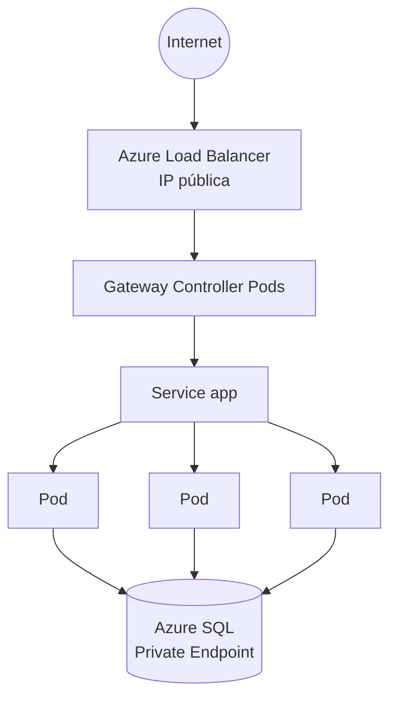
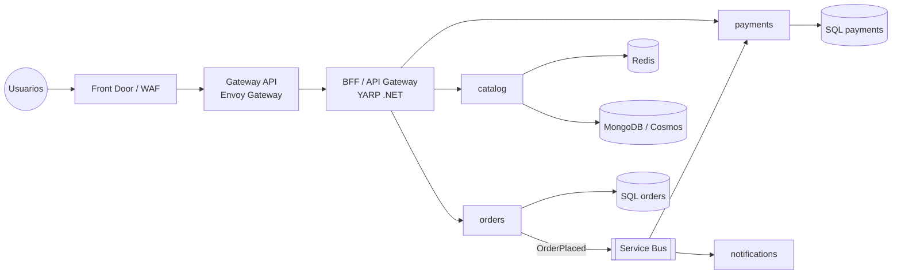
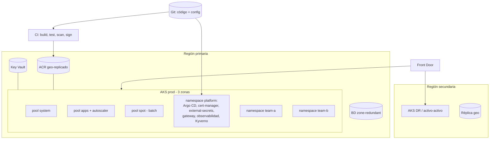

# 14 - Arquitecturas reales

> Tres arquitecturas de referencia, de la más simple a la más completa, con **quién es responsable de cada parte** y las decisiones que hay detrás.

## Contenido
- [[#1 - Arquitectura básica]]
- [[#2 - Microservicios]]
- [[#3 - Plataforma multi-equipo en producción]]
- [[#Responsabilidades por componente]]
- [[#Preguntas de arquitectura]]

---

## 1 - Arquitectura básica

```text
Internet
   │  DNS: app.acme.com → IP pública
   ▼
Load Balancer (L4, del proveedor)          ← creado por un Service type=LoadBalancer
   │
   ▼
Ingress / Gateway Controller (L7)           ← TLS, host y rutas
   │
   ▼
Service (ClusterIP)                         ← IP virtual estable + balanceo a Pods Ready
   │
   ▼
Pods (Deployment, 3 réplicas, HPA)          ← tu aplicación
   │
   ▼
Base de datos (gestionada, fuera del clúster, Private Endpoint)
```



| Decisión | Elección y por qué |
|---|---|
| ¿Un LB por app? | No: un LB para el controlador de entrada; las apps detrás con ClusterIP |
| ¿BD en el clúster? | No: gestionada (backups, HA, parches incluidos) |
| Réplicas | ≥ 3 con topology spread por zonas + PDB |
| TLS | cert-manager + Let's Encrypt o certificado corporativo en Key Vault |

---

## 2 - Microservicios

```text
Internet
   ▼
Ingress / Gateway (TLS, WAF opcional delante)
   ▼
API Gateway / BFF (YARP, Kong, Envoy, APIM)  ← autenticación, agregación, rate limiting, versionado
   ▼
Microservicios (catalog, orders, payments, notifications)  ← un Deployment + Service cada uno
   ▼
Redis / Bases de datos (una por servicio) / Message broker
```



| Pieza | Por qué |
|---|---|
| **Gateway API** (infraestructura) vs **API Gateway** (aplicación) | No son lo mismo: el primero enruta tráfico L7 genérico; el segundo aplica lógica de API (auth, agregación, cuotas). Ver [[API Gateway]] |
| Una BD por servicio | Autonomía y despliegue independiente; consistencia vía eventos ([[Saga Pattern]], [[Transactional Outbox]]) |
| Broker | Desacopla y absorbe picos; los workers escalan con KEDA |
| Service mesh (opcional) | mTLS, reintentos y métricas entre servicios sin código. Solo si compensa su coste operativo |
| Namespaces | Uno por dominio o equipo, con NetworkPolicies entre ellos |

---

## 3 - Plataforma multi-equipo en producción



Características: GitOps, *landing zone* de red con egress controlado, políticas de admisión, observabilidad centralizada, DR en otra región, clústeres separados para no producción. Detalle en [[19 - Kubernetes en producción]].

---

## Responsabilidades por componente

| Componente | Responsable de | No es responsable de |
|---|---|---|
| DNS público | Resolver el dominio a la IP de entrada | Balancear dentro del clúster |
| Load Balancer cloud | Llevar TCP a los nodos/Pods del controlador; health checks L4 | Rutas HTTP, TLS (normalmente) |
| Ingress/Gateway Controller | TLS, host/path, pesos, reescrituras | Lógica de negocio, autenticación de usuarios (salvo plugins) |
| API Gateway / BFF | AuthN/AuthZ de APIs, agregación, cuotas, versionado | Enrutamiento de infraestructura |
| Service | IP/DNS estable y balanceo L4 a Pods **Ready** | Reintentos, L7, TLS |
| Pod / app | Lógica, readiness real, apagado ordenado, resiliencia hacia dependencias | Su propia ubicación o replicación |
| HPA / KEDA | Número de réplicas | Capacidad de nodos |
| Cluster Autoscaler | Número de nodos | Rendimiento de la app |
| Broker | Entrega fiable y *buffering* | Idempotencia del consumidor |
| Base de datos gestionada | HA, backups, parches | Esquema y consultas eficientes |

---

## Preguntas de arquitectura

> [!question]- "¿Pondrías Redis dentro del clúster?"
> Como **caché** prescindible, un Redis en el clúster es aceptable (si se pierde, se recalienta). Como **almacén con datos importantes** (sesiones críticas, colas, rate limiting distribuido), mejor gestionado (Azure Managed Redis) con HA y persistencia. Criterio: ¿qué pasa si pierdo su contenido y quién opera su HA?

> [!question]- "¿Necesito un API Gateway si ya tengo Gateway API?"
> Si solo necesitas enrutar rutas a servicios con TLS: no. Si necesitas autenticación centralizada, agregación de respuestas (BFF), cuotas por cliente, transformación de contratos o un portal de desarrolladores: sí (YARP, Kong, APIM). Algunas implementaciones de Gateway API cubren parte (auth, rate limit) con políticas propias.

> [!question]- "¿Un clúster por entorno o un clúster con namespaces?"
> Producción **separada** siempre (radio de explosión, actualizaciones, permisos). Dev/QA pueden compartir clúster con namespaces + cuotas + políticas para ahorrar. Clúster por equipo solo si hay requisitos de aislamiento o regulatorios: multiplica el coste operativo. Ver [[18 - Trade-offs]].

> [!question]- "¿Cómo diseñarías para millones de requests?"
> Entrada global (Front Door/CDN) con caché de estáticos → varias regiones activas → Gateway escalado horizontalmente → servicios sin estado con HPA por RPS/latencia y *overprovisioning* → caché agresiva (Redis, HTTP) → escrituras asíncronas por broker → BD que escale (particionado, réplicas de lectura, Cosmos DB) → límites y *backpressure* (rate limiting, colas) → pruebas de carga y capacidad planificada → observabilidad por SLO. El cuello de botella casi nunca es Kubernetes: son los datos.

### Relacionado
- [[13 - Kubernetes para .NET#Arquitectura completa en Kubernetes]] · [[🏗️ Diseño de Microservicios]] · [[API Gateway]] · [[Service Discovery]]
- Anterior: [[13 - Kubernetes para .NET]] · Siguiente: [[15 - Laboratorios]]
