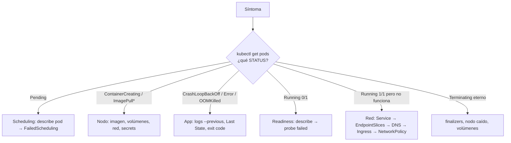

# 16 - Troubleshooting

> Para cada problema: **síntoma → posibles causas → comandos → diagnóstico → solución**. Practica los casos en [[15 - Laboratorios#Lab 05 - Probes, fallos y troubleshooting]].

## Contenido
- [[#Método general]]
- [[#Kit de comandos]]
- [[#Pod en Pending]]
- [[#ContainerCreating que no termina]]
- [[#ImagePullBackOff y ErrImagePull]]
- [[#CrashLoopBackOff]]
- [[#OOMKilled y memory limit exceeded]]
- [[#Readiness probe falla]]
- [[#Liveness probe falla]]
- [[#Service sin tráfico]]
- [[#Pods no reciben tráfico desde fuera]]
- [[#DNS no funciona]]
- [[#Ingress no funciona]]
- [[#PVC Pending]]
- [[#Deployment no actualiza]]
- [[#CPU alta y latencia]]
- [[#Node NotReady]]
- [[#Tabla de códigos de salida]]

---

## Método general



> [!tip] Orden de lectura de `kubectl describe pod`
> 1. **Events** (al final): la causa suele estar ahí. 2. **State / Last State / Reason / Exit Code** de cada contenedor. 3. **Conditions** (`PodScheduled`, `Initialized`, `ContainersReady`, `Ready`). 4. Node, IP, volúmenes, probes configuradas.

---

## Kit de comandos

```bash
kubectl get pods -n <ns> -o wide                      # estado, reinicios, nodo, IP
kubectl describe pod <pod> -n <ns>                    # eventos y estados
kubectl logs <pod> -n <ns> [-c contenedor] [--previous] [-f] [--since=10m]
kubectl exec -it <pod> -n <ns> -- sh                  # entrar (si hay shell)
kubectl debug -it <pod> -n <ns> --image=busybox:1.36 --target=<contenedor>   # contenedor efímero (imágenes sin shell)
kubectl get events -n <ns> --sort-by=.lastTimestamp
kubectl get events -A --field-selector type=Warning
kubectl get nodes -o wide; kubectl describe node <nodo>
kubectl top nodes; kubectl top pods -n <ns> --containers
kubectl get svc,endpointslices -n <ns>
kubectl get ingress,gateway,httproute -n <ns>
kubectl get deploy,rs -n <ns>; kubectl rollout status deploy/<d> -n <ns>
kubectl get pvc,pv -n <ns>
kubectl auth can-i <verbo> <recurso> -n <ns> --as=<usuario>
kubectl run tmp --rm -it --image=busybox:1.36 -- sh  # Pod de pruebas de red/DNS
kubectl port-forward svc/<svc> 8080:80 -n <ns>       # saltarse Ingress/LB para aislar el problema
```

---

## Pod en Pending

**Síntoma:** `STATUS Pending` durante más de unos segundos, sin nodo asignado (`NODE <none>`).

| Causa | Mensaje en Events (`FailedScheduling`) | Solución |
|---|---|---|
| Recursos insuficientes | `0/3 nodes are available: 3 Insufficient cpu/memory` | Ajustar requests; añadir nodos / Cluster Autoscaler; revisar requests inflados |
| Taints sin toleration | `node(s) had untolerated taint {dedicated: gpu}` | Añadir toleration o usar otros nodos |
| nodeSelector/affinity imposible | `node(s) didn't match Pod's node affinity/selector` | Corregir labels de nodos o reglas |
| Anti-affinity `required` | `didn't match pod anti-affinity rules` | `preferred` o topology spread; más nodos |
| PVC sin ligar | `pod has unbound immediate PersistentVolumeClaims` | Ver [[#PVC Pending]] |
| Disco en otra zona | `volume node affinity conflict` | `WaitForFirstConsumer`; nodos en esa zona |
| ResourceQuota | (el Pod **ni se crea**; el error está en el ReplicaSet) `exceeded quota` | `kubectl describe rs`; ajustar cuota/requests |
| Pod de baja prioridad desplazado | `preempted` | PriorityClass, capacidad |

```bash
kubectl describe pod <pod> | sed -n '/Events/,$p'
kubectl describe node <nodo> | grep -A10 "Allocated resources"
kubectl get nodes -o custom-columns=NAME:.metadata.name,TAINTS:.spec.taints
```

---

## ContainerCreating que no termina

**Síntoma:** asignado a un nodo, pero los contenedores no arrancan.

| Causa | Pista en Events | Solución |
|---|---|---|
| Secret/ConfigMap inexistente | `MountVolume.SetUp failed ... configmap "x" not found` / `CreateContainerConfigError` | Crear el objeto o corregir el nombre/clave |
| Volumen que no se puede montar | `FailedAttachVolume`, `Multi-Attach error` | Esperar desacople del nodo anterior; RWX si de verdad hace falta compartir |
| Red del Pod (CNI) | `failed to setup network for sandbox` | Estado del CNI en `kube-system`; IPs agotadas en la subred (Azure CNI clásico, AWS VPC CNI) |
| Imagen muy grande | `Pulling image` mucho rato | Imagen más pequeña; *image streaming*; pre-pull |
| Init container que no termina | `Init:0/1` en STATUS | `kubectl logs <pod> -c <init>` |

---

## ImagePullBackOff y ErrImagePull

**Síntoma:** `ErrImagePull` (fallo inmediato) que pasa a `ImagePullBackOff` (reintentos con espera creciente).

| Causa | Mensaje | Solución |
|---|---|---|
| Nombre o tag inexistente | `manifest unknown` / `not found` | Corregir; verificar con `docker manifest inspect <imagen>` |
| Registro privado sin credenciales | `unauthorized` / `401` / `403` | `imagePullSecrets` o identidad del nodo (`az aks update --attach-acr`) |
| Límite de descargas de Docker Hub | `toomanyrequests` | Autenticar, *mirror*/caché, usar tu propio registro |
| Arquitectura distinta | `no matching manifest for linux/arm64` | Imagen multi-arquitectura ([[Buildx y multi-arquitectura]]) |
| Sin salida a Internet / DNS del nodo | `dial tcp: i/o timeout` | Egress/NAT/firewall; registro privado con Private Endpoint |
| Imagen local en kind/minikube | `not found` | `kind load docker-image` / `minikube image load` + `imagePullPolicy: IfNotPresent` |

```bash
kubectl describe pod <pod> | grep -A5 -i "failed to pull"
kubectl get pod <pod> -o jsonpath='{.spec.containers[*].image}'
kubectl get secret <regcred> -o jsonpath='{.data.\.dockerconfigjson}' | base64 -d
```

---

## CrashLoopBackOff

**Síntoma:** el contenedor arranca, muere, y Kubernetes espera cada vez más antes de reintentar (10 s → 5 min). `RESTARTS` crece.

**Posibles causas:** excepción al arrancar (configuración o secreto que falta, *connection string* errónea, dependencia no disponible y la app no reintenta), comando/entrypoint incorrecto, OOMKilled repetido, liveness probe que mata la app, permisos (no root + escritura en un directorio de solo lectura), puerto ya en uso entre contenedores del Pod.

```bash
kubectl logs <pod> --previous                  # ¡el intento que MURIÓ!
kubectl describe pod <pod>                      # Last State: Terminated, Reason, Exit Code
kubectl get pod <pod> -o jsonpath='{.status.containerStatuses[*].lastState.terminated}'
kubectl debug -it <pod> --copy-to=debug --container=api -- sh   # copia del Pod con shell para investigar
```

**Diagnóstico por código de salida:** ver [[#Tabla de códigos de salida]].

> [!tip] Si los logs están vacíos
> La app muere antes de loguear: prueba el contenedor localmente con las mismas variables (`docker run -e ...`), sobrescribe el comando para que no arranque (`command: ["sleep","3600"]` en una copia con `kubectl debug --copy-to`) y ejecuta la app a mano dentro.

**Solución:** corregir la causa; mientras tanto, si es una versión nueva, `kubectl rollout undo`.

---

## OOMKilled y memory limit exceeded

**Síntoma:** `Last State: Terminated, Reason: OOMKilled, Exit Code: 137`; reinicios.

| Pregunta | Cómo comprobar |
|---|---|
| ¿Superó **su límite** o fue el **nodo** sin memoria? | `OOMKilled` en el contenedor = su límite. `Evicted` / `The node was low on resource: memory` = presión del nodo |
| ¿Fuga o pico legítimo? | Prometheus: `container_memory_working_set_bytes` a lo largo del tiempo (rampa = fuga; dientes de sierra = picos) |
| ¿Límite demasiado ajustado al runtime? | .NET/Java: heap + nativo + hilos. Ver [[13 - Kubernetes para .NET#Recursos, GC y rendimiento]] |

**Solución:** subir el límite con margen basado en datos, corregir la fuga, limitar cachés en memoria, ajustar el GC; para desalojos por nodo, requests realistas y QoS adecuada ([[06 - Scheduling y recursos#QoS classes y desalojos]]).

---

## Readiness probe falla

**Síntoma:** `Running` pero `READY 0/1`; evento `Readiness probe failed: HTTP probe failed with statuscode: 503` (o `connection refused`, `context deadline exceeded`).

| Causa | Solución |
|---|---|
| Ruta o puerto incorrectos (`/healthz` vs `/health/ready`, 80 vs 8080) | Corregir; probar con `kubectl port-forward pod/<pod> 8080:8080` + `curl` |
| La app escucha en `127.0.0.1` | Escuchar en `0.0.0.0` (`ASPNETCORE_URLS=http://+:8080`) |
| Dependencia comprobada en readiness está caída | Decidir si debe afectar a la readiness ([[07 - Salud, fiabilidad y despliegues#Liveness vs Readiness vs Startup]]) |
| `timeoutSeconds: 1` y la app tarda más bajo carga | Aumentar el timeout; abaratar el check |
| Arranque lento | `startupProbe` |

**Impacto:** el Pod no recibe tráfico; si es un rollout, se queda atascado.

---

## Liveness probe falla

**Síntoma:** reinicios con evento `Liveness probe failed ... Container api failed liveness probe, will be restarted`.

| Causa | Solución |
|---|---|
| Sin startupProbe y arranque lento | Añadir `startupProbe` |
| La liveness comprueba dependencias externas | Liveness solo del proceso |
| Timeout corto + pausas de GC / CPU *throttled* | `timeoutSeconds` y `failureThreshold` más tolerantes; revisar límites de CPU |
| Deadlock real o agotamiento del thread pool | La liveness funciona como debe: investigar con *dumps* (`dotnet-dump`) antes de que reinicie |

---

## Service sin tráfico

**Síntoma:** `curl http://api` da `connection refused`, timeout o 503 desde el Ingress.

```bash
kubectl get svc api -n shop -o wide                        # selector y puertos
kubectl get endpointslices -n shop -l kubernetes.io/service-name=api
kubectl get pods -n shop -l <selector-del-svc> --show-labels
kubectl get pod <pod> -o jsonpath='{.spec.containers[*].ports}'
```

| Observación | Causa | Solución |
|---|---|---|
| EndpointSlice **vacía** | Selector ≠ labels de los Pods (typo, namespace distinto) | Corregir labels/selector |
| Endpoints con `ready: false` | Readiness fallando | [[#Readiness probe falla]] |
| Endpoints OK pero `connection refused` | `targetPort` ≠ puerto real de la app; app en `127.0.0.1` | Corregir puerto/bind |
| Endpoints OK pero timeout | NetworkPolicy bloquea; CNI con problemas | Revisar políticas (`kubectl get netpol -n shop`) |
| Funciona por IP de Pod pero no por Service | kube-proxy / eBPF en el nodo | `kubectl logs -n kube-system -l k8s-app=kube-proxy` |

---

## Pods no reciben tráfico desde fuera

Recorre la cadena **de dentro hacia fuera** para aislar la capa:
1. `kubectl port-forward pod/<pod> 8080:8080` → ¿responde la app? (si no: app)
2. `kubectl port-forward svc/<svc> 8080:80` → ¿responde el Service? (si no: [[#Service sin tráfico]])
3. Desde un Pod: `curl http://<svc>.<ns>` → ¿DNS y red interna?
4. ¿El Ingress/Gateway tiene dirección y backends? `kubectl describe ingress` / `kubectl describe httproute` (condiciones `Accepted`, `ResolvedRefs`)
5. Service `LoadBalancer` del controlador: ¿`EXTERNAL-IP`? ¿*health probes* del LB OK? ¿NSG/Security Group abiertos?
6. DNS público: `nslookup shop.acme.com` → ¿apunta a esa IP?
7. TLS: `curl -v https://shop.acme.com` → certificado y SNI correctos.

---

## DNS no funciona

**Síntoma:** `Could not resolve host`, `Name or service not known`, timeouts intermitentes de resolución.

```bash
kubectl get pods -n kube-system -l k8s-app=kube-dns
kubectl logs -n kube-system -l k8s-app=kube-dns
kubectl run dnsutils --rm -it --image=registry.k8s.io/e2e-test-images/agnhost:2.39 -- sh
#   nslookup kubernetes.default
#   nslookup api.shop.svc.cluster.local
#   cat /etc/resolv.conf
```

| Causa | Solución |
|---|---|
| Nombre corto desde otro namespace | Usar `api.<namespace>` |
| CoreDNS caído o saturado | Escalar CoreDNS; NodeLocal DNSCache |
| NetworkPolicy de egress sin regla para el puerto 53 | Permitir DNS a `kube-dns` (UDP y TCP) |
| Resolución externa lenta (`ndots:5`) | FQDN con punto final; `dnsConfig.options ndots` |
| `dnsPolicy` incorrecta (`Default` hereda el DNS del nodo, sin nombres internos) | `ClusterFirst` (por defecto) |

---

## Ingress no funciona

| Síntoma | Causa | Comprobación |
|---|---|---|
| `ADDRESS` vacío | No hay controlador para esa clase | `kubectl get ingressclass`; `ingressClassName` |
| 404 del controlador | Host o ruta no coinciden; `pathType` | `curl -H "Host: shop.acme.com" http://<ip>/api` |
| 502/503 | Service sin endpoints, puerto erróneo | [[#Service sin tráfico]] |
| Certificado incorrecto | Secret TLS inexistente, en otro namespace, o cert-manager sin emitir | `kubectl get certificate,certificaterequest -n shop`; `describe` |
| Funcionaba y ya no | Cambios en anotaciones no soportadas tras migrar de controlador | Logs del controlador |

```bash
kubectl describe ingress shop -n shop
kubectl logs -n <ns-del-controlador> -l <labels-del-controlador> --tail=100
```

---

## PVC Pending

```bash
kubectl describe pvc <pvc> -n <ns>
kubectl get sc
```
| Mensaje | Causa | Solución |
|---|---|---|
| `no persistent volumes available ... and no storage class is set` | Sin StorageClass por defecto ni nombre | Indicar `storageClassName` o marcar una por defecto |
| `waiting for first consumer to be created before binding` | `WaitForFirstConsumer`: **normal** hasta que un Pod lo use | Crear el Pod; si el Pod también está Pending, ver sus eventos |
| `storageclass "x" not found` | Nombre incorrecto | Corregir |
| Errores del *provisioner* | Driver CSI no instalado, permisos/cuotas en la nube | Logs del CSI controller en `kube-system` |
| Modo no soportado (RWX en disco de bloque) | Backend incompatible | Clase de ficheros (Azure Files, EFS) |

---

## Deployment no actualiza

**Síntoma:** aplicas un cambio y los Pods no cambian, o `rollout status` no termina.

| Causa | Comprobación / solución |
|---|---|
| Mismo tag (`latest`, `:1.0` reutilizado): la plantilla no cambió | Tags inmutables (SHA). Último recurso: `kubectl rollout restart` |
| Cambiaste un ConfigMap consumido por variables | No cambia la plantilla → `rollout restart` o *checksum annotation* |
| Rollout atascado: Pods nuevos no Ready | `kubectl get rs`; `describe pod` del RS nuevo; `ProgressDeadlineExceeded` |
| Sin capacidad para `maxSurge` | Pods nuevos en Pending; ajustar `maxSurge`/`maxUnavailable` o capacidad |
| Rollout en pausa | `kubectl rollout resume` |
| GitOps revierte tu cambio manual | Cambia en git |
| Webhook de admisión rechaza el nuevo Pod | Eventos del ReplicaSet (`FailedCreate`) |

---

## CPU alta y latencia

| Observación | Interpretación | Acción |
|---|---|---|
| Uso de CPU = límite + latencia alta | **Throttling** | Subir/quitar `limits.cpu`; `container_cpu_cfs_throttled_periods_total` |
| CPU alta en todas las réplicas, HPA al máximo | Capacidad insuficiente | Subir `maxReplicas`, nodos; optimizar código |
| CPU alta en una sola réplica | Desequilibrio (conexiones persistentes, gRPC) o *hot key* | Balanceo L7, revisar afinidad |
| CPU baja + latencia alta | Esperando I/O: BD, dependencias, thread pool | Trazas; pool de conexiones; `async` correcto ([[Task vs ValueTask]]) |
| CPU alta del nodo pero no de tus Pods | Otros Pods/vecinos, agentes, kernel | `kubectl top pods -A --sort-by=cpu` |

---

## Node NotReady

```bash
kubectl get nodes
kubectl describe node <nodo>        # Conditions: Ready, MemoryPressure, DiskPressure, PIDPressure, NetworkUnavailable
kubectl get pods -A -o wide --field-selector spec.nodeName=<nodo>
# En el nodo (si tienes acceso): systemctl status kubelet; journalctl -u kubelet -n 200; df -h; free -m
```
| Causa | Solución |
|---|---|
| kubelet caído o sin certificado válido | Reiniciar/renovar; en la nube, reimagen del nodo |
| Disco lleno (imágenes, logs) | Limpieza de imágenes, `DiskPressure`; discos más grandes |
| Memoria agotada (procesos fuera de Kubernetes, sin reservas) | `kube-reserved`/`system-reserved`; requests correctos |
| Red del nodo / CNI | Pods del CNI en ese nodo |
| VM detenida o con problemas en el proveedor | Portal/CLI de la nube; en gestionados: reparación automática de nodos |

**Qué hace Kubernetes:** taint `node.kubernetes.io/unreachable` o `not-ready`; tras 300 s desaloja los Pods y sus controladores los recrean en otros nodos.

---

## Tabla de códigos de salida

| Código | Significado habitual |
|---|---|
| `0` | Terminó correctamente (en un Deployment, el proceso **no debería** terminar: revisa tu `CMD`) |
| `1` | Error genérico de la aplicación (excepción no controlada) |
| `125` / `126` / `127` | Fallo del runtime / comando no ejecutable / **comando no encontrado** (`command` mal escrito) |
| `128 + n` | Terminado por la señal `n` |
| `137` (128+9, SIGKILL) | **OOMKilled** o muerto tras agotar `terminationGracePeriodSeconds` |
| `139` (128+11, SIGSEGV) | Fallo de segmentación (código nativo) |
| `143` (128+15, SIGTERM) | Terminado con SIGTERM (parada normal si no lo gestionó) |

### Relacionado
- [[15 - Laboratorios]] · [[17 - Interview mode]] · [[Worker Node]] · [[kubelet]]
