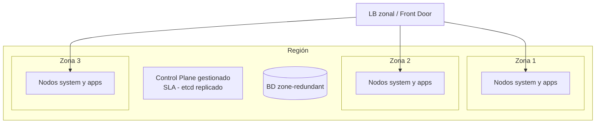

# 19 - Kubernetes en producción

> Nivel 10 del [[00 - Kubernetes - Índice#📈 Roadmap|roadmap]]. Lo que separa un clúster "que funciona" de uno que aguanta fallos, picos, auditorías y actualizaciones.

## Contenido
- [[#Alta disponibilidad]]
- [[#Backup y disaster recovery]]
- [[#Seguridad y gestión de secretos]]
- [[#Monitoring, alerting y logging]]
- [[#Gestión de recursos y capacity planning]]
- [[#Autoscaling en producción]]
- [[#Despliegues sin downtime]]
- [[#Actualizaciones del clúster]]
- [[#Optimización de costes]]
- [[#Production readiness checklist]]

---

## Alta disponibilidad



| Capa | Fallo que cubre | Cómo |
|---|---|---|
| **Contenedor** | Proceso colgado | Liveness + restartPolicy |
| **Pod** | Pod borrado/desalojado | Controladores (Deployment...) |
| **Nodo** | VM caída | ≥ 3 nodos, réplicas en nodos distintos, PDB |
| **Zona** | Caída de un datacenter | Nodos en 3 zonas, **topology spread por zona**, discos/BD zone-redundant, LB zonal |
| **Región** | Caída regional | Segundo clúster en otra región (activo-pasivo o activo-activo), datos geo-replicados, failover por DNS/Front Door |
| **Control Plane** | API Server/etcd | Gestionado con SLA (tier de pago), o 3-5 nodos de control propios |
| **Dependencias** | BD, Redis, broker caídos | Servicios con HA, resiliencia en la app (reintentos, circuit breaker, degradación) |

> [!warning] HA que no lo es
> 3 réplicas en el mismo nodo; PDB inexistente; readiness ausente; una BD single-zone; un único Ingress Controller con 1 réplica; CoreDNS con 1 réplica. Revisa **cada** pieza de la cadena, no solo tu app.

---

## Backup y disaster recovery

### Qué respaldar
| Elemento | Cómo | Nota |
|---|---|---|
| Definición del clúster (infra) | **IaC** (Bicep/Terraform) en git | Recrear el clúster debe ser un comando |
| Objetos de Kubernetes (apps) | **GitOps** (git es el backup) | Lo que no está en git, se pierde |
| etcd (clústeres autogestionados) | `etcdctl snapshot save` periódico, cifrado, fuera del clúster ([[Control Plane]]) | En gestionados lo hace el proveedor |
| Estado no declarativo (CRs creados en runtime, Secrets generados) | **Velero** (backup de objetos + snapshots de volúmenes) | También para migrar entre clústeres |
| Volúmenes persistentes | VolumeSnapshots / Velero / Azure Backup for AKS | Snapshots ≠ backup fuera de región |
| Bases de datos | Backups y PITR del servicio gestionado, réplicas geo | Prueba restauraciones |
| Secretos | Están en Key Vault (con soft-delete y purga protegida) | No dependas del Secret del clúster |
| Imágenes | Registro con geo-replicación | Sin imágenes no hay recuperación |

### Estrategias de DR
| Estrategia | RTO | RPO | Coste |
|---|---|---|---|
| Backup y restauración (recrear clúster + restaurar datos) | Horas | Último backup | Bajo |
| *Pilot light* / *warm standby* (clúster secundario mínimo) | Minutos-1 h | Minutos (replicación) | Medio |
| Activo-activo multi-región | Segundos-minutos | ~0 (según datos) | Alto (+ complejidad de datos) |

```bash
# Velero (ejemplo con Azure como almacenamiento)
velero backup create shop-daily --include-namespaces shop --snapshot-volumes --ttl 720h
velero schedule create shop-nightly --schedule="0 2 * * *" --include-namespaces shop
velero restore create --from-backup shop-daily
```

> [!important] Un DR no probado no existe
> Ensaya la recuperación (*game days*) al menos dos veces al año: recrear el clúster desde IaC, sincronizar GitOps, restaurar datos, cambiar DNS. Mide el RTO real.

---

## Seguridad y gestión de secretos

Resumen operativo (detalle en [[09 - Seguridad]] y [[05 - Configuración y almacenamiento#Secretos en producción]]):
- API Server privado, Entra ID/OIDC, sin cuentas locales; acceso de humanos de solo lectura en producción y cambios vía pipeline/GitOps; *break-glass* auditado.
- Pod Security `restricted`, políticas de admisión (imágenes firmadas, sin `latest`, con requests).
- NetworkPolicies *default deny*; egress controlado por firewall.
- Secretos en Key Vault + External Secrets/CSI; Workload Identity; cifrado de etcd con KMS; rotación.
- Escaneo continuo de imágenes y del clúster (Defender for Containers, Trivy Operator, kube-bench para CIS).
- Logs de auditoría del API Server al SIEM.

---

## Monitoring, alerting y logging

Detalle en [[10 - Observabilidad]]. Mínimos de producción:

| Área | Mínimo |
|---|---|
| Métricas | Prometheus (gestionado o propio) con kube-state-metrics, node-exporter y métricas RED de cada servicio |
| Logs | Centralizados, estructurados, con retención por entorno |
| Trazas | OpenTelemetry con muestreo |
| Alertas | SLO *burn rate* por servicio; plataforma: nodos NotReady, Pods en CrashLoop, PVC > 85 %, certificados a < 15 días de caducar, CoreDNS errores, API Server latencia/errores |
| Runbooks | Uno por alerta |
| Eventos | Exportados (caducan en 1 h) |

---

## Gestión de recursos y capacity planning

1. **Medir** el uso real por servicio (p50/p95 de CPU y memoria) con Prometheus o VPA en `Off`.
2. **Requests** ≈ p95 de uso normal; **límite de memoria** con margen sobre el pico; CPU según política ([[06 - Scheduling y recursos#Requests y limits]]).
3. **Guardarraíles** por namespace: LimitRange (valores por defecto) y ResourceQuota.
4. **Planificar capacidad**: picos esperados (campañas, cierres de mes) → pruebas de carga (k6, Azure Load Testing) → `maxReplicas`, `max-count` de node pools, cuotas de vCPU en la suscripción, IPs en subredes.
5. **Margen**: el clúster debe aguantar perder **una zona** (≈ 33 % de capacidad con 3 zonas) sin saturarse → objetivo de utilización de requests ~60-70 %.
6. **Revisar** trimestralmente: requests vs uso, nodos infrautilizados, crecimiento.

---

## Autoscaling en producción

| Pieza | Configuración de producción |
|---|---|
| HPA | `minReplicas` ≥ 2-3; `behavior` con scale-down conservador; métricas de negocio si la CPU no representa la carga |
| KEDA | Workers de colas; escala a cero en no-producción |
| Cluster Autoscaler / NAP / Karpenter | `max` coherente con cuotas; *expander* adecuado; *overprovisioning* para picos rápidos |
| PDBs | En todas las apps (para que el escalado de nodos no las tumbe) |
| Pruebas | Test de carga que verifique que el escalado llega a tiempo |

---

## Despliegues sin downtime

Mecánica y checklist en [[07 - Salud, fiabilidad y despliegues]]. En producción:

| Estrategia | Usar cuando |
|---|---|
| **Rolling update** (con readiness, preStop, `maxUnavailable: 0`) | Por defecto |
| **Blue/Green** | Cambios arriesgados que necesitan rollback instantáneo y verificación completa antes de cortar; puedes pagar el doble de capacidad un rato |
| **Canary con análisis** (Argo Rollouts, Flagger, Gateway API con pesos) | Servicios críticos con mucho tráfico: limitar el radio de un fallo al 5-10 % |
| **Feature flags** | Separar *deploy* de *release*: desplegar apagado y activar gradualmente |

Siempre: cambios de BD compatibles hacia atrás, métricas observadas durante el despliegue y rollback automatizado.

---

## Actualizaciones del clúster

> [!warning] Kubernetes caduca rápido
> Tres versiones menores al año; cada una con ~14 meses de soporte upstream (los proveedores gestionados publican su propio calendario y venden soporte extendido). Quedarse atrás significa actualizaciones de varios saltos, APIs eliminadas y sin parches de seguridad.

Proceso:
1. Leer las notas de versión: **APIs eliminadas** (usa `kubectl deprecations`/Pluto o el detector del proveedor) y cambios de comportamiento.
2. Actualizar primero **no producción**; ejecutar pruebas.
3. Control Plane → node pools uno a uno (con *surge*, `drain` que respeta PDBs).
4. Actualizar add-ons (CNI, CSI, Ingress/Gateway, cert-manager, operadores) según su matriz de compatibilidad.
5. Canales de actualización automática para parches y ventanas de mantenimiento planificadas.
6. Alternativa para cambios grandes: **blue/green de clústeres** (crear el nuevo, mover tráfico con GitOps + DNS).

---

## Optimización de costes

| Palanca | Ahorro típico | Riesgo |
|---|---|---|
| Ajustar requests a la realidad (VPA en recomendación) | Alto | Bajo si se mide |
| Cluster Autoscaler / Karpenter con consolidación | Alto | Bajo (con PDBs) |
| **Spot** para batch, workers idempotentes y no-producción | Muy alto (hasta ~90 % en esas VMs) | Interrupciones: solo cargas tolerantes |
| Reservas / Savings Plans para la base estable | 30-60 % | Compromiso de 1-3 años |
| Apagar/escalar a cero no-producción fuera de horario | Alto | Ninguno |
| KEDA escala a cero | Medio | Arranque en frío |
| Un LB/Gateway compartido en lugar de uno por servicio | Medio | Ninguno |
| Retención de logs/métricas por nivel y entorno | Medio | Perder datos útiles si se recorta de más |
| *Showback* por equipo (Kubecost/OpenCost, etiquetas) | Indirecto: cambia comportamientos | — |
| Imágenes pequeñas, mismo registro y región | Bajo (red y arranque) | — |

---

## Production readiness checklist

**Aplicación**
- [ ] Imagen multi-stage, no root, escaneada, versión inmutable
- [ ] Requests/limits medidos; HPA; PDB; ≥ 3 réplicas repartidas por zonas
- [ ] Startup/readiness/liveness correctas; cierre ordenado
- [ ] Configuración externa; secretos desde gestor; Workload Identity
- [ ] Logs estructurados, métricas RED, trazas; dashboards y alertas con runbook
- [ ] Resiliencia hacia dependencias; idempotencia en consumidores

**Plataforma**
- [ ] Clúster como código; GitOps; entornos separados
- [ ] Control Plane con SLA; nodos en 3 zonas; pool de sistema separado
- [ ] RBAC con Entra ID; Pod Security; políticas de admisión; NetworkPolicies
- [ ] Ingress/Gateway con ≥ 2 réplicas, TLS automatizado, WAF si es público
- [ ] Observabilidad central; alertas de plataforma; auditoría
- [ ] Backups y DR probados; RTO/RPO definidos
- [ ] Plan de actualizaciones y versiones soportadas
- [ ] Costes visibles por equipo; autoscaling de nodos; spot donde aplique

### Relacionado
- [[18 - Trade-offs]] · [[14 - Arquitecturas reales]] · [[12 - Kubernetes en la nube]] · [[Docker en producción]]
- Anterior: [[18 - Trade-offs]] · Siguiente: [[20 - Proyecto final]]
