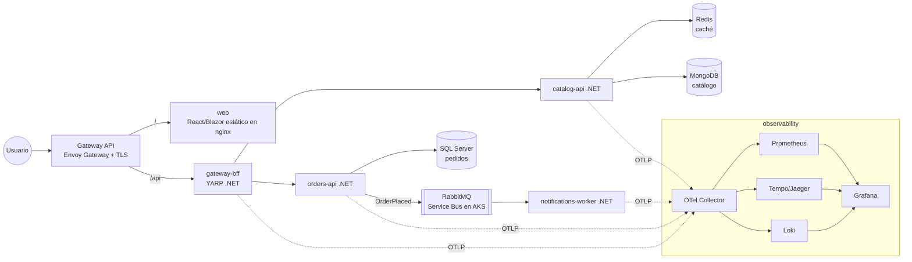

# 20 - Proyecto final

> **ShopK8s**: una tienda con frontend, gateway, microservicios .NET, Redis, SQL Server/MongoDB y mensajería, llevada a Kubernetes por fases. Cada fase termina con algo que funciona y unas preguntas de revisión.

## Contenido
- [[#Arquitectura objetivo]]
- [[#Estructura del repositorio]]
- [[#Fase 0 - Servicios en local con Docker Compose]]
- [[#Fase 1 - Primer despliegue en kind]]
- [[#Fase 2 - Configuración, secretos y persistencia]]
- [[#Fase 3 - Salud, probes y despliegues sin downtime]]
- [[#Fase 4 - Entrada con Gateway API]]
- [[#Fase 5 - Mensajería y workers con KEDA]]
- [[#Fase 6 - Autoescalado y recursos]]
- [[#Fase 7 - Seguridad]]
- [[#Fase 8 - Observabilidad]]
- [[#Fase 9 - Helm y CI-CD]]
- [[#Fase 10 - Producción en AKS]]
- [[#Rúbrica de evaluación]]

---

## Arquitectura objetivo



| Servicio | Tipo | Datos | Escalado |
|---|---|---|---|
| `web` | Deployment | — | HPA CPU |
| `gateway-bff` (YARP) | Deployment | — | HPA CPU/RPS |
| `catalog-api` | Deployment | MongoDB + caché Redis | HPA CPU |
| `orders-api` | Deployment | SQL Server; publica eventos (Outbox) | HPA CPU |
| `notifications-worker` | Deployment | Consume eventos | KEDA por longitud de cola |
| Redis, MongoDB, SQL Server, RabbitMQ | StatefulSets **solo en local**; servicios gestionados en AKS | — | — |

---

## Estructura del repositorio

```text
shopk8s/
├── src/
│   ├── Web/                      Dockerfile
│   ├── Gateway.Bff/              Dockerfile
│   ├── Catalog.Api/              Dockerfile
│   ├── Orders.Api/               Dockerfile
│   ├── Notifications.Worker/     Dockerfile
│   └── BuildingBlocks/           (OpenTelemetry, health checks, resiliencia comunes)
├── deploy/
│   ├── compose/compose.yaml                     Fase 0
│   ├── k8s/                                     Fases 1-8 (YAML plano / Kustomize)
│   │   ├── base/  overlays/{local,prod}/
│   └── helm/shop/                               Fase 9 (chart umbrella con subcharts por servicio)
├── infra/aks/main.bicep                         Fase 10
└── .github/workflows/                           Fase 9
```

---

## Fase 0 - Servicios en local con Docker Compose

**Objetivo:** que todo funcione en tu máquina antes de pensar en Kubernetes.
- [ ] Cinco servicios .NET 10 con endpoints mínimos (`GET /products`, `POST /orders`), Dockerfiles multi-stage no root ([[13 - Kubernetes para .NET#Dockerfile multi-stage para .NET]]).
- [ ] `compose.yaml` con Redis, MongoDB, SQL Server, RabbitMQ ([[Docker Compose]]).
- [ ] Configuración 100 % por variables de entorno; health checks `/health/live` y `/health/ready`.
- [ ] `orders-api` publica `OrderPlaced` en RabbitMQ (MassTransit) con **Outbox** ([[Transactional Outbox]]); `notifications-worker` consume de forma **idempotente** ([[Idempotencia]]).

> [!question]- Revisión
> ¿Qué partes de `compose.yaml` no tienen equivalente directo en Kubernetes? (`depends_on`, `build`, `restart`). ¿Cómo lo resolverás?

---

## Fase 1 - Primer despliegue en kind

**Objetivo:** los servicios corriendo en un clúster de 3 nodos.
- [ ] Clúster kind ([[15 - Laboratorios#Lab 01 - Tu primer clúster con kind]]); `kind load docker-image` para tus imágenes.
- [ ] Namespace `shop`; un Deployment + Service ClusterIP por servicio; labels `app.kubernetes.io/*`.
- [ ] Dependencias como StatefulSets sencillos (o charts) **solo para local**.
- [ ] Probar con `kubectl port-forward` y desde un Pod de pruebas con nombres DNS.

**Entregable:** `kubectl get all -n shop` con todo `Running` y `POST /orders` funcionando de extremo a extremo.

---

## Fase 2 - Configuración, secretos y persistencia

- [ ] ConfigMap por servicio; variables `ConnectionStrings__*` desde Secrets ([[05 - Configuración y almacenamiento]]).
- [ ] PVCs para SQL Server, MongoDB y RabbitMQ (`volumeClaimTemplates`); comprobar que sobreviven a la recreación de Pods.
- [ ] Data Protection de `gateway-bff` persistido en Redis ([[13 - Kubernetes para .NET#Detrás de un Ingress o Gateway]]).
- [ ] Patrón *checksum annotation* o `rollout restart` documentado para cambios de configuración.

> [!question]- Revisión
> Si cambias la contraseña de SQL en el Secret, ¿qué tienes que hacer para que todo siga funcionando? ¿Y en producción con Key Vault?

---

## Fase 3 - Salud, probes y despliegues sin downtime

- [ ] Startup/readiness/liveness en todos los servicios con criterios distintos ([[07 - Salud, fiabilidad y despliegues]]).
- [ ] `ShutdownTimeout`, `preStop`, `terminationGracePeriodSeconds` coherentes.
- [ ] `maxUnavailable: 0`, `minReadySeconds`, PDBs.
- [ ] **Prueba**: genera tráfico continuo (`hey`, `k6`) contra `/api/products` y despliega una versión nueva: **cero errores**.
- [ ] **Prueba**: despliega una imagen rota y recupera con `rollout undo`.

---

## Fase 4 - Entrada con Gateway API

- [ ] Envoy Gateway (o la implementación que elijas); `Gateway` en namespace `infra`; `HTTPRoute`s en `shop` ([[04 - Networking y tráfico#Gateway API en la práctica]]).
- [ ] `/` → `web`, `/api` → `gateway-bff`; TLS con cert-manager (en local, emisor *self-signed*).
- [ ] **Canary**: `catalog-api` v2 con 10 % del tráfico por pesos; luego 100 %.

---

## Fase 5 - Mensajería y workers con KEDA

- [ ] KEDA instalado; `ScaledObject` para `notifications-worker` por longitud de cola de RabbitMQ, `minReplicaCount: 0` ([[08 - Escalado#KEDA]]).
- [ ] **Prueba**: publica 10 000 pedidos; observa el escalado del worker y la vuelta a cero.
- [ ] Mensajes reprocesados sin duplicados (idempotencia) cuando matas Pods del worker en mitad del procesamiento.

---

## Fase 6 - Autoescalado y recursos

- [ ] Metrics Server; requests/limits medidos con `kubectl top` y VPA en `Off` ([[06 - Scheduling y recursos]]).
- [ ] HPA para `catalog-api`, `orders-api`, `gateway-bff` con `behavior` de scale-down conservador.
- [ ] LimitRange y ResourceQuota en `shop`.
- [ ] Topology spread por nodo para las APIs.
- [ ] **Prueba de carga**: el HPA escala y la latencia p95 se mantiene; documenta el punto de saturación.

---

## Fase 7 - Seguridad

- [ ] Una ServiceAccount por servicio, `automountServiceAccountToken: false` ([[09 - Seguridad]]).
- [ ] Namespace `shop` con Pod Security `restricted`; `securityContext` completo; `readOnlyRootFilesystem`.
- [ ] NetworkPolicies *default deny* + reglas mínimas (gateway → bff → apis → datos; worker → broker) con un CNI que las aplique (minikube + Calico/Cilium, o kind sin CNI por defecto + Cilium).
- [ ] RBAC: rol `deployer` para el pipeline y `view` para desarrolladores.
- [ ] Política de admisión (ValidatingAdmissionPolicy o Kyverno): sin `:latest`, requests obligatorios.
- [ ] Escaneo de imágenes con Trivy en el pipeline.

---

## Fase 8 - Observabilidad

- [ ] OpenTelemetry en todos los servicios (BuildingBlocks); Collector → Prometheus/Tempo/Loki → Grafana ([[10 - Observabilidad]]).
- [ ] Traza de extremo a extremo: Gateway → BFF → orders-api → RabbitMQ → worker (propagación de contexto en mensajes).
- [ ] Dashboard RED por servicio + dashboard del clúster.
- [ ] Alertas: tasa de errores > 2 %, p99 > 1 s, CrashLooping, cola con > 1 000 mensajes durante 10 min.
- [ ] **Game day**: mata la BD de pedidos 2 minutos; ¿qué ves en dashboards, trazas y alertas? ¿Cómo se degrada el sistema?

---

## Fase 9 - Helm y CI-CD

- [ ] Chart *umbrella* `shop` con un subchart por servicio (o un chart genérico reutilizable + values por servicio); `values-local.yaml` y `values-prod.yaml` ([[11 - Helm, Kustomize y CI-CD]]).
- [ ] Hook `pre-upgrade` con Job de migraciones de `orders-api`.
- [ ] GitHub Actions: build + test + Trivy + push (tag = SHA) + `helm upgrade --atomic` a un entorno de pruebas.
- [ ] (Opcional) Argo CD con `Application` apuntando a `deploy/helm/shop` y *self-heal*.
- [ ] Rollback demostrado con `helm rollback` (y con `git revert` si usas GitOps).

---

## Fase 10 - Producción en AKS

- [ ] AKS por Bicep/Terraform: 3 zonas, pool system con taint, pool apps con autoscaler, Azure CNI Overlay + Cilium, OIDC + Workload Identity, Entra ID RBAC ([[12 - Kubernetes en la nube]]).
- [ ] Sustituir dependencias por servicios gestionados: **Azure SQL**, **Cosmos DB for MongoDB**, **Azure Managed Redis**, **Azure Service Bus** (MassTransit cambia de transporte con configuración).
- [ ] Secretos en Key Vault con External Secrets; acceso a Service Bus y SQL **sin contraseñas** (Workload Identity).
- [ ] ACR con `--attach-acr`; imágenes firmadas.
- [ ] Gateway gestionado (Application Gateway for Containers) o Envoy Gateway con LB interno + Front Door/WAF.
- [ ] Managed Prometheus + Managed Grafana + Container Insights.
- [ ] Estrategia de despliegue: canary con Argo Rollouts para `orders-api`.
- [ ] DR: documento con RTO/RPO, IaC + GitOps para recrear, geo-replicación de datos; ensayo de recreación del clúster.
- [ ] Coste: presupuesto y alertas; spot para `notifications-worker`.

---

## Rúbrica de evaluación

| Criterio | Básico | Senior |
|---|---|---|
| Despliegue | Todo corre | Sin downtime demostrado bajo carga, rollback probado |
| Configuración | Variables en YAML | Externalizada, secretos desde gestor, sin contraseñas en Azure |
| Fiabilidad | Probes | Probes con criterio, PDB, spread, idempotencia, game day |
| Escalado | HPA | HPA + KEDA + requests medidos + prueba de carga documentada |
| Seguridad | — | Restricted, NetworkPolicies, RBAC mínimo, admisión, escaneo |
| Observabilidad | `kubectl logs` | Trazas end-to-end, dashboards RED, alertas con runbook |
| Entrega | `kubectl apply` manual | Helm/GitOps, pipeline con escaneo, promoción de la misma imagen |
| Documentación | README | ADRs con los trade-offs elegidos ([[18 - Trade-offs]]) |

> [!tip] Escribe ADRs
> Para cada decisión (Gateway API vs Ingress, BD gestionada vs operador, Helm vs Kustomize, GitOps sí/no) escribe un ADR corto: contexto, opciones, decisión, consecuencias. Es exactamente lo que se discute en una entrevista Staff.

### Relacionado
- [[13 - Kubernetes para .NET]] · [[14 - Arquitecturas reales]] · [[🏗️ Diseño de Microservicios]] · [[Saga Pattern]]
- Anterior: [[19 - Kubernetes en producción]] · Siguiente: [[21 - Roadmap y checklist]]
