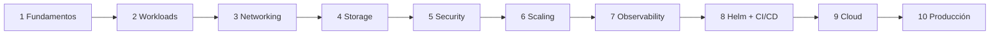

# 21 - Roadmap y checklist

> Diez niveles, de cero a producción. Para cada uno: qué aprender, qué practicar, qué debes poder explicar, qué laboratorio completar y qué preguntas de entrevista responder. Marca las casillas a medida que avances.

## Contenido
- [[#📈 Roadmap]]
- [[#✅ Checklist final de conocimientos]]

---

## 📈 Roadmap

> [!tip] Ritmo orientativo
> 6-10 semanas a 5-8 h/semana: niveles 1-4 en las primeras 3 semanas, 5-8 en las siguientes 3-4, y 9-10 junto con el [[20 - Proyecto final]].

### Nivel 1 - Fundamentos
| | |
|---|---|
| **Aprender** | Qué resuelve Kubernetes; arquitectura (API Server, etcd, scheduler, controllers, kubelet, kube-proxy, runtime, CNI); objetos y API; declarativo vs imperativo; kubeconfig |
| **Practicar** | Crear clúster kind; `get/describe/explain`; generar YAML con `--dry-run`; ver eventos |
| **Explicar** | Qué ocurre al crear un Deployment; qué pasa si cae el API Server o un nodo |
| **Laboratorio** | [[15 - Laboratorios#Lab 01 - Tu primer clúster con kind]] |
| **Entrevista** | Preguntas 1, 6, 7 de [[17 - Interview mode]] |
| **Notas** | [[02 - Fundamentos y arquitectura]] · [[Control Plane]] · [[Worker Node]] · [[kubelet]] · [[Container Runtime]] |

### Nivel 2 - Workloads
| | |
|---|---|
| **Aprender** | Pod (ciclo de vida, init/sidecars, terminación), labels/selectors, namespaces, ReplicaSet, Deployment, StatefulSet, DaemonSet, Job, CronJob; requests/limits; probes; rollouts |
| **Practicar** | Rolling update, rollout fallido y `undo`; Job y CronJob; romper una readiness |
| **Explicar** | Qué workload usar en cada caso; liveness vs readiness vs startup; requests vs limits; QoS |
| **Laboratorio** | [[15 - Laboratorios#Lab 02 - Workloads, rollouts y rollbacks]] · [[15 - Laboratorios#Lab 05 - Probes, fallos y troubleshooting]] |
| **Entrevista** | 2, 8, 11, 12, 13, 15 |
| **Notas** | [[03 - Objetos y workloads]] · [[06 - Scheduling y recursos]] · [[07 - Salud, fiabilidad y despliegues]] · [[Workloads]] |

### Nivel 3 - Networking
| | |
|---|---|
| **Aprender** | Modelo de red; Services (tipos, puertos, EndpointSlices); CoreDNS; flujos de tráfico; Ingress; Gateway API; NetworkPolicies; CNI |
| **Practicar** | Depurar DNS desde un Pod; Ingress por rutas; canary con pesos; *default deny* |
| **Explicar** | Camino de un paquete de Internet a un Pod; Ingress vs Service; por qué ingress-nginx ya no se recomienda |
| **Laboratorio** | [[15 - Laboratorios#Lab 03 - Services, DNS e Ingress]] |
| **Entrevista** | 3, 10, 14 |
| **Notas** | [[04 - Networking y tráfico]] · [[Networking]] |

### Nivel 4 - Storage y configuración
| | |
|---|---|
| **Aprender** | ConfigMap, Secret, variables, volúmenes, PV/PVC/StorageClass/CSI, modos de acceso, aprovisionamiento dinámico, recarga de configuración |
| **Practicar** | StatefulSet con PVC; cambiar configuración sin downtime |
| **Explicar** | ConfigMap vs Secret (y por qué Base64 no protege); qué pasa con los datos al borrar un PVC |
| **Laboratorio** | [[15 - Laboratorios#Lab 04 - Configuración y persistencia con PostgreSQL]] |
| **Entrevista** | 4, 20 |
| **Notas** | [[05 - Configuración y almacenamiento]] · [[ConfigMap]] · [[Secret]] · [[PersistentVolumeClaim]] · [[StorageClass]] |

### Nivel 5 - Security
| | |
|---|---|
| **Aprender** | AuthN/AuthZ, RBAC, ServiceAccounts, admission, Pod Security Standards, securityContext, cadena de suministro |
| **Practicar** | SA con permisos mínimos y `auth can-i`; namespace `restricted`; política de admisión |
| **Explicar** | Cómo asegurarías un clúster por capas; permisos peligrosos |
| **Laboratorio** | [[15 - Laboratorios#Lab 08 - Seguridad RBAC y NetworkPolicies]] |
| **Entrevista** | 5, 18 |
| **Notas** | [[09 - Seguridad]] |

### Nivel 6 - Scaling
| | |
|---|---|
| **Aprender** | Metrics Server, HPA (fórmula y `behavior`), KEDA, VPA, Cluster Autoscaler/Karpenter, scheduling avanzado (affinity, taints, spread) |
| **Practicar** | HPA con carga; dedicar nodos; repartir réplicas |
| **Explicar** | HPA vs VPA vs CA y cómo interactúan; por qué los requests lo condicionan todo |
| **Laboratorio** | [[15 - Laboratorios#Lab 07 - Autoescalado con HPA]] · [[15 - Laboratorios#Lab 06 - Scheduling con taints, affinity y spread]] |
| **Entrevista** | 9, 17, 19 |
| **Notas** | [[08 - Escalado]] · [[06 - Scheduling y recursos]] |

### Nivel 7 - Observability
| | |
|---|---|
| **Aprender** | Logs, métricas, trazas, eventos; Prometheus, Grafana, OpenTelemetry; SLOs y alertas |
| **Practicar** | kube-prometheus-stack; PromQL; alerta de CrashLooping |
| **Explicar** | Estrategia de observabilidad; por qué alertar por síntomas |
| **Laboratorio** | [[15 - Laboratorios#Lab 09 - Observabilidad con kube-prometheus-stack]] |
| **Entrevista** | 19 y la pregunta Staff de observabilidad de [[10 - Observabilidad]] |
| **Notas** | [[10 - Observabilidad]] |

### Nivel 8 - Helm + CI/CD
| | |
|---|---|
| **Aprender** | Charts, templates, values, hooks, dependencias, OCI; Kustomize; pipelines; GitOps |
| **Practicar** | Chart propio con upgrade/rollback; pipeline de GitHub Actions |
| **Explicar** | Helm vs Kustomize; push vs GitOps; *build once, deploy many* |
| **Laboratorio** | [[15 - Laboratorios#Lab 10 - Tu propio chart de Helm]] |
| **Entrevista** | 16, 20 |
| **Notas** | [[11 - Helm, Kustomize y CI-CD]] · [[Helm]] |

### Nivel 9 - Cloud Kubernetes
| | |
|---|---|
| **Aprender** | Modelo de responsabilidad; AKS/EKS/GKE; node pools; CNI en la nube; Workload Identity; registros; storage; autoscaling gestionado |
| **Practicar** | Crear un AKS (o EKS/GKE) con IaC; desplegar con Workload Identity hacia Key Vault |
| **Explicar** | AKS vs EKS vs GKE; Kubernetes vs Container Apps |
| **Laboratorio** | [[15 - Laboratorios#Lab 11 - API .NET en kind]] → misma app en AKS (Fase 10 del proyecto) |
| **Entrevista** | 23, 24 |
| **Notas** | [[12 - Kubernetes en la nube]] · [[13 - Kubernetes para .NET]] |

### Nivel 10 - Producción y arquitectura
| | |
|---|---|
| **Aprender** | HA multi-zona/región, DR y backups, actualizaciones, capacidad, costes, estrategias de despliegue, trade-offs |
| **Practicar** | Proyecto final completo; game day; ADRs |
| **Explicar** | Cómo diseñarías para millones de requests; DR; reducción de costes |
| **Laboratorio** | [[20 - Proyecto final]] |
| **Entrevista** | 21-26 |
| **Notas** | [[19 - Kubernetes en producción]] · [[18 - Trade-offs]] · [[14 - Arquitecturas reales]] |

---

## ✅ Checklist final de conocimientos

### Fundamentos
- [ ] Explico qué problema resuelve Kubernetes y cuándo **no** usarlo
- [ ] Dibujo la arquitectura y explico cada componente y qué pasa si falla
- [ ] Describo paso a paso qué ocurre al crear un Deployment
- [ ] Uso `explain`, `--dry-run`, `diff`, contextos y namespaces con soltura

### Workloads
- [ ] Elijo entre Deployment, StatefulSet, DaemonSet, Job y CronJob con argumentos
- [ ] Explico el ciclo de vida del Pod y la terminación ordenada (SIGTERM, preStop, grace period)
- [ ] Configuro init containers y sidecars nativos
- [ ] Hago rollouts, los diagnostico cuando se atascan y hago rollback

### Networking
- [ ] Explico los tipos de Service y los cuatro puertos
- [ ] Depuro "Service sin tráfico" con EndpointSlices
- [ ] Entiendo CoreDNS, `ndots` y la resolución entre namespaces
- [ ] Configuro Ingress con TLS y Gateway API con pesos
- [ ] Escribo NetworkPolicies *default deny* sin romper el DNS

### Configuración y storage
- [ ] Sé qué opción usar para cada tipo de configuración y secreto
- [ ] Explico por qué Base64 no protege y cómo proteger de verdad
- [ ] Recargo configuración sin downtime
- [ ] Entiendo PV/PVC/StorageClass/CSI, modos de acceso y zonas

### Scheduling y recursos
- [ ] Explico requests vs limits, QoS, OOMKilled vs Evicted, throttling
- [ ] Uso affinity, taints/tolerations y topology spread en el caso adecuado
- [ ] Aplico ResourceQuota y LimitRange

### Fiabilidad
- [ ] Diferencio liveness, readiness y startup y sus antipatrones
- [ ] Diseño despliegues sin downtime (checklist completa)
- [ ] Configuro PDBs que no bloqueen el mantenimiento
- [ ] Explico rolling, blue/green, canary y progressive delivery

### Escalado
- [ ] Configuro HPA (v2, `behavior`) y KEDA
- [ ] Uso VPA para dimensionar y sé por qué no mezclarlo con HPA en la misma métrica
- [ ] Explico la cadena requests → HPA → scheduler → Cluster Autoscaler

### Seguridad
- [ ] Diseño RBAC con mínimo privilegio y reconozco permisos peligrosos
- [ ] Configuro ServiceAccounts, Pod Security `restricted` y securityContext
- [ ] Conozco políticas de admisión (VAP/Kyverno) y seguridad de la cadena de suministro
- [ ] Uso Workload Identity en lugar de secretos

### Observabilidad
- [ ] Monto métricas, logs y trazas con Prometheus/Grafana/OpenTelemetry
- [ ] Escribo PromQL básico (errores, latencia, reinicios, throttling)
- [ ] Diseño alertas por síntomas con runbooks

### Entrega
- [ ] Creo y mantengo charts de Helm (templates, values, hooks, dependencias)
- [ ] Uso Kustomize para variaciones por entorno
- [ ] Construyo un pipeline seguro de build → scan → push → deploy → verify
- [ ] Explico GitOps y cuándo merece la pena

### Cloud, .NET y producción
- [ ] Comparo AKS/EKS/GKE y Kubernetes vs Container Apps
- [ ] Llevo una API .NET a Kubernetes evitando los fallos típicos (Data Protection, forwarded headers, SIGTERM, GC)
- [ ] Diseño HA multi-zona, DR con RTO/RPO, actualizaciones y control de costes
- [ ] Resuelvo los 17 escenarios de [[16 - Troubleshooting]] sin mirar la solución
- [ ] Defiendo cada decisión del [[20 - Proyecto final]] con sus trade-offs

### Relacionado
- [[00 - Kubernetes - Índice]] · [[17 - Interview mode]]
